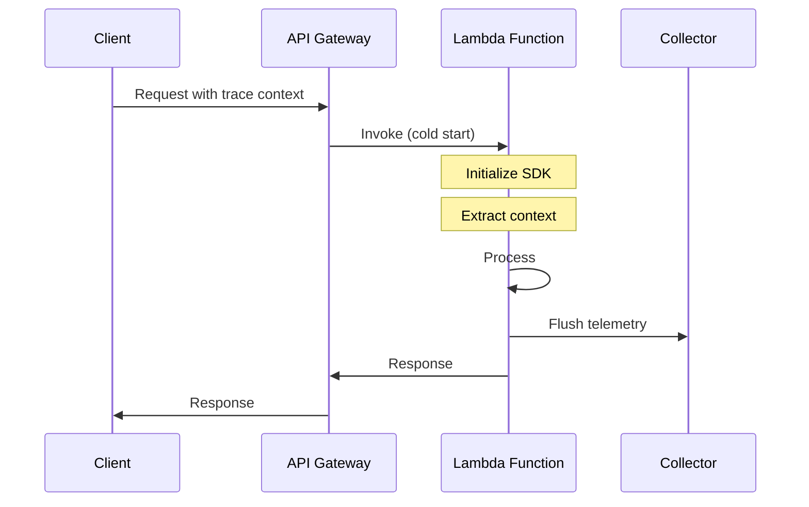

# How to Configure OpenTelemetry for Serverless

Author: [nawazdhandala](https://www.github.com/nawazdhandala)

Tags: OpenTelemetry, Serverless, AWS Lambda, Azure Functions, Cloud Functions, Cold Start, Observability

Description: Learn how to configure OpenTelemetry for serverless functions including AWS Lambda, Azure Functions, and Google Cloud Functions. This guide covers cold start handling, context propagation, and efficient telemetry export.

---

Serverless functions present unique observability challenges. Functions spin up and down rapidly, cold starts affect instrumentation initialization, and there is no persistent process to buffer telemetry. Standard OpenTelemetry configurations designed for long-running services need adaptation.

This guide covers configuring OpenTelemetry for serverless environments.

## Serverless Observability Challenges

| Challenge | Traditional Server | Serverless |
|-----------|-------------------|------------|
| Initialization | Once at startup | Every cold start |
| Export timing | Continuous batching | Must flush before exit |
| Connection pooling | Long-lived connections | Ephemeral connections |
| Trace continuity | In-process context | Cross-invocation propagation |



## AWS Lambda Configuration

### Basic Setup with Lambda Layer

AWS provides an OpenTelemetry Lambda Layer for easy instrumentation:

```yaml
# serverless.yml (Serverless Framework)
service: my-lambda-service

provider:
  name: aws
  runtime: nodejs18.x
  environment:
    AWS_LAMBDA_EXEC_WRAPPER: /opt/otel-handler
    OTEL_SERVICE_NAME: ${self:service}
    OTEL_EXPORTER_OTLP_ENDPOINT: https://collector.example.com:4318
    OTEL_TRACES_EXPORTER: otlp
    OTEL_METRICS_EXPORTER: otlp
    OTEL_PROPAGATORS: tracecontext,baggage

functions:
  processOrder:
    handler: handler.processOrder
    layers:
      - arn:aws:lambda:us-east-1:901920570463:layer:aws-otel-nodejs-amd64-ver-1-18-1:1
```

### Manual Node.js Lambda Instrumentation

For more control, configure OpenTelemetry manually:

```javascript
// tracing.js
const { NodeTracerProvider } = require('@opentelemetry/sdk-trace-node');
const { BatchSpanProcessor } = require('@opentelemetry/sdk-trace-base');
const { OTLPTraceExporter } = require('@opentelemetry/exporter-trace-otlp-http');
const { Resource } = require('@opentelemetry/resources');
const { SemanticResourceAttributes } = require('@opentelemetry/semantic-conventions');
const { AwsLambdaInstrumentation } = require('@opentelemetry/instrumentation-aws-lambda');
const { registerInstrumentations } = require('@opentelemetry/instrumentation');

// Initialize once, reused across invocations
let provider = null;
let isInitialized = false;

function initializeTracing() {
  if (isInitialized) return;

  const resource = new Resource({
    [SemanticResourceAttributes.SERVICE_NAME]: process.env.AWS_LAMBDA_FUNCTION_NAME,
    [SemanticResourceAttributes.SERVICE_VERSION]: process.env.AWS_LAMBDA_FUNCTION_VERSION,
    [SemanticResourceAttributes.CLOUD_PROVIDER]: 'aws',
    [SemanticResourceAttributes.CLOUD_REGION]: process.env.AWS_REGION,
    [SemanticResourceAttributes.FAAS_NAME]: process.env.AWS_LAMBDA_FUNCTION_NAME,
    [SemanticResourceAttributes.FAAS_VERSION]: process.env.AWS_LAMBDA_FUNCTION_VERSION
  });

  provider = new NodeTracerProvider({ resource });

  // Use batch processor with shorter delay for Lambda
  const exporter = new OTLPTraceExporter({
    url: process.env.OTEL_EXPORTER_OTLP_ENDPOINT + '/v1/traces',
    compression: 'gzip'
  });

  provider.addSpanProcessor(new BatchSpanProcessor(exporter, {
    maxQueueSize: 100,
    maxExportBatchSize: 50,
    scheduledDelayMillis: 500  // Shorter delay for Lambda
  }));

  provider.register();

  registerInstrumentations({
    instrumentations: [
      new AwsLambdaInstrumentation({
        disableAwsContextPropagation: false
      })
    ]
  });

  isInitialized = true;
}

async function flushTelemetry() {
  if (provider) {
    await provider.forceFlush();
  }
}

module.exports = { initializeTracing, flushTelemetry };
```

```javascript
// handler.js
const { initializeTracing, flushTelemetry } = require('./tracing');
const { trace, context, propagation } = require('@opentelemetry/api');

// Initialize tracing outside handler for reuse
initializeTracing();

const tracer = trace.getTracer('order-service');

exports.processOrder = async (event, lambdaContext) => {
  // Extract trace context from incoming event
  const parentContext = extractTraceContext(event);

  return context.with(parentContext, async () => {
    const span = tracer.startSpan('process-order', {
      attributes: {
        'faas.trigger': 'http',
        'faas.invocation_id': lambdaContext.awsRequestId,
        'faas.coldstart': !global.warmStart
      }
    });

    global.warmStart = true;  // Mark subsequent invocations as warm

    try {
      // Process the order
      const order = JSON.parse(event.body);
      span.setAttribute('order.id', order.id);

      const result = await processOrderLogic(order);

      span.setStatus({ code: 0 });
      return {
        statusCode: 200,
        body: JSON.stringify(result)
      };
    } catch (error) {
      span.recordException(error);
      span.setStatus({ code: 2, message: error.message });
      throw error;
    } finally {
      span.end();
      // Flush telemetry before Lambda freezes
      await flushTelemetry();
    }
  });
};

function extractTraceContext(event) {
  // Extract from API Gateway headers
  const headers = event.headers || {};
  return propagation.extract(context.active(), headers);
}
```

### Python Lambda Configuration

```python
# tracing.py
import os
from opentelemetry import trace
from opentelemetry.sdk.trace import TracerProvider
from opentelemetry.sdk.trace.export import BatchSpanProcessor
from opentelemetry.exporter.otlp.proto.http.trace_exporter import OTLPSpanExporter
from opentelemetry.sdk.resources import Resource
from opentelemetry.semconv.resource import ResourceAttributes

_provider = None
_initialized = False

def initialize_tracing():
    global _provider, _initialized

    if _initialized:
        return

    resource = Resource.create({
        ResourceAttributes.SERVICE_NAME: os.environ.get("AWS_LAMBDA_FUNCTION_NAME"),
        ResourceAttributes.SERVICE_VERSION: os.environ.get("AWS_LAMBDA_FUNCTION_VERSION"),
        ResourceAttributes.CLOUD_PROVIDER: "aws",
        ResourceAttributes.CLOUD_REGION: os.environ.get("AWS_REGION"),
        ResourceAttributes.FAAS_NAME: os.environ.get("AWS_LAMBDA_FUNCTION_NAME")
    })

    _provider = TracerProvider(resource=resource)

    exporter = OTLPSpanExporter(
        endpoint=os.environ.get("OTEL_EXPORTER_OTLP_ENDPOINT") + "/v1/traces"
    )

    # Shorter delay for Lambda
    _provider.add_span_processor(BatchSpanProcessor(
        exporter,
        max_queue_size=100,
        schedule_delay_millis=500,
        max_export_batch_size=50
    ))

    trace.set_tracer_provider(_provider)
    _initialized = True

def flush_telemetry():
    if _provider:
        _provider.force_flush()
```

```python
# handler.py
import json
from tracing import initialize_tracing, flush_telemetry
from opentelemetry import trace, context, propagation

# Initialize outside handler
initialize_tracing()
tracer = trace.get_tracer("order-service")

# Track cold starts
_warm_start = False

def process_order(event, lambda_context):
    global _warm_start

    # Extract trace context from headers
    headers = event.get("headers", {})
    parent_context = propagation.extract(carrier=headers)

    with trace.use_span(
        tracer.start_span(
            "process-order",
            context=parent_context,
            attributes={
                "faas.trigger": "http",
                "faas.invocation_id": lambda_context.aws_request_id,
                "faas.coldstart": not _warm_start
            }
        )
    ) as span:
        _warm_start = True

        try:
            body = json.loads(event.get("body", "{}"))
            span.set_attribute("order.id", body.get("id"))

            result = process_order_logic(body)

            return {
                "statusCode": 200,
                "body": json.dumps(result)
            }
        except Exception as e:
            span.record_exception(e)
            span.set_status(trace.Status(trace.StatusCode.ERROR, str(e)))
            raise
        finally:
            flush_telemetry()
```

## Azure Functions Configuration

### Node.js Azure Function

```javascript
// tracing.js
const { NodeTracerProvider } = require('@opentelemetry/sdk-trace-node');
const { BatchSpanProcessor } = require('@opentelemetry/sdk-trace-base');
const { OTLPTraceExporter } = require('@opentelemetry/exporter-trace-otlp-http');
const { Resource } = require('@opentelemetry/resources');

let provider = null;

function initializeTracing() {
  if (provider) return;

  const resource = new Resource({
    'service.name': process.env.WEBSITE_SITE_NAME || 'azure-function',
    'cloud.provider': 'azure',
    'cloud.region': process.env.REGION_NAME,
    'faas.name': process.env.WEBSITE_SITE_NAME
  });

  provider = new NodeTracerProvider({ resource });

  const exporter = new OTLPTraceExporter({
    url: process.env.OTEL_EXPORTER_OTLP_ENDPOINT + '/v1/traces'
  });

  provider.addSpanProcessor(new BatchSpanProcessor(exporter, {
    scheduledDelayMillis: 500
  }));

  provider.register();
}

module.exports = { initializeTracing, provider };
```

```javascript
// HttpTrigger/index.js
const { initializeTracing, provider } = require('../tracing');
const { trace, context, propagation } = require('@opentelemetry/api');

initializeTracing();
const tracer = trace.getTracer('azure-function');

module.exports = async function (azureContext, req) {
  // Extract context from headers
  const parentContext = propagation.extract(context.active(), req.headers);

  return context.with(parentContext, async () => {
    const span = tracer.startSpan('http-trigger', {
      attributes: {
        'faas.trigger': 'http',
        'faas.invocation_id': azureContext.invocationId,
        'http.method': req.method,
        'http.url': req.url
      }
    });

    try {
      const result = await processRequest(req);

      azureContext.res = {
        status: 200,
        body: result
      };
    } catch (error) {
      span.recordException(error);
      span.setStatus({ code: 2 });

      azureContext.res = {
        status: 500,
        body: 'Internal error'
      };
    } finally {
      span.end();
      await provider.forceFlush();
    }
  });
};
```

## Google Cloud Functions

### Python Cloud Function

```python
# main.py
import os
import functions_framework
from opentelemetry import trace, context, propagation
from opentelemetry.sdk.trace import TracerProvider
from opentelemetry.sdk.trace.export import BatchSpanProcessor
from opentelemetry.exporter.otlp.proto.http.trace_exporter import OTLPSpanExporter
from opentelemetry.sdk.resources import Resource

# Initialize globally
resource = Resource.create({
    "service.name": os.environ.get("K_SERVICE", "cloud-function"),
    "cloud.provider": "gcp",
    "cloud.region": os.environ.get("FUNCTION_REGION"),
    "faas.name": os.environ.get("K_SERVICE")
})

provider = TracerProvider(resource=resource)
exporter = OTLPSpanExporter(
    endpoint=os.environ.get("OTEL_EXPORTER_OTLP_ENDPOINT") + "/v1/traces"
)
provider.add_span_processor(BatchSpanProcessor(exporter, schedule_delay_millis=500))
trace.set_tracer_provider(provider)

tracer = trace.get_tracer("cloud-function")

@functions_framework.http
def process_request(request):
    # Extract trace context
    parent_context = propagation.extract(carrier=dict(request.headers))

    with trace.use_span(
        tracer.start_span(
            "process-request",
            context=parent_context,
            attributes={
                "faas.trigger": "http",
                "http.method": request.method,
                "http.url": request.url
            }
        )
    ) as span:
        try:
            result = handle_request(request)
            return result, 200
        except Exception as e:
            span.record_exception(e)
            span.set_status(trace.Status(trace.StatusCode.ERROR))
            return "Error", 500
        finally:
            provider.force_flush()
```

## Extension-Based Export

For better performance, use a collector extension that handles export asynchronously:

```yaml
# AWS Lambda extension approach
# deploy collector as a Lambda layer
provider:
  environment:
    OTEL_EXPORTER_OTLP_ENDPOINT: http://localhost:4318

functions:
  myFunction:
    layers:
      - arn:aws:lambda:us-east-1:901920570463:layer:aws-otel-collector-amd64-ver-0-90-1:1
```

```yaml
# collector-config.yaml for extension
receivers:
  otlp:
    protocols:
      http:
        endpoint: 0.0.0.0:4318

processors:
  batch:
    send_batch_size: 50
    timeout: 1s

exporters:
  otlphttp:
    endpoint: "https://oneuptime.com/otlp"
    headers:
      "x-oneuptime-token": "${ONEUPTIME_TOKEN}"

service:
  pipelines:
    traces:
      receivers: [otlp]
      processors: [batch]
      exporters: [otlphttp]
```

## Cold Start Optimization

Minimize cold start impact:

```javascript
// optimized-init.js

// Lazy initialization - only init when first span is created
let tracer = null;

function getTracer() {
  if (!tracer) {
    initializeTracing();
    tracer = trace.getTracer('my-function');
  }
  return tracer;
}

// Pre-warm connections during init phase
const http = require('http');
const keepAliveAgent = new http.Agent({ keepAlive: true });

// Use environment variable to skip tracing in dev
const TRACING_ENABLED = process.env.OTEL_ENABLED !== 'false';

exports.handler = async (event, context) => {
  if (!TRACING_ENABLED) {
    return handleRequest(event);
  }

  const tracer = getTracer();
  // ... rest of instrumented code
};
```

## Summary

Configuring OpenTelemetry for serverless requires attention to initialization timing and flush behavior. Key points:

1. **Initialize outside the handler**: Reuse SDK initialization across warm invocations
2. **Flush before exit**: Always call `forceFlush()` before the function completes
3. **Use shorter batch delays**: Configure `scheduledDelayMillis` to 500ms or less
4. **Track cold starts**: Add `faas.coldstart` attribute to identify initialization overhead
5. **Use extensions when available**: Lambda extensions handle export asynchronously
6. **Extract context from triggers**: Propagate trace context from API Gateway, SQS, etc.

With these configurations, you maintain trace continuity across serverless invocations while minimizing performance impact.
