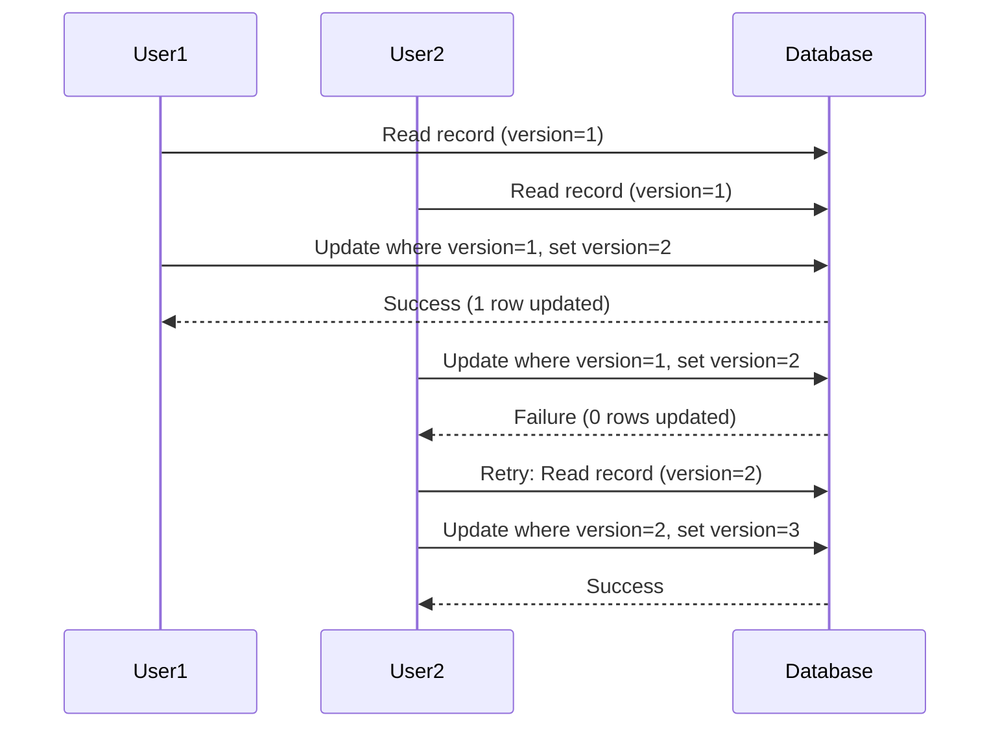

# How to Implement Optimistic Locking with Prisma in Node.js

Author: [nawazdhandala](https://www.github.com/nawazdhandala)

Tags: Node.js, Prisma, TypeScript, Database, Concurrency, Optimistic Locking

Description: Learn how to implement optimistic locking with Prisma in Node.js to handle concurrent updates safely. This guide covers version-based locking, conflict detection, and retry strategies.

---

When multiple users or processes try to update the same database record simultaneously, you can end up with lost updates or inconsistent data. Optimistic locking solves this by detecting conflicts at write time rather than holding locks during the entire transaction. In this guide, we will implement optimistic locking with Prisma in a Node.js application.

## Understanding Optimistic Locking

Optimistic locking assumes that conflicts are rare. Instead of locking records when reading them, you track a version number and verify it has not changed when writing. If another process modified the record, you detect the conflict and can retry or notify the user.



## Setting Up the Prisma Schema

First, add a version field to your models that need optimistic locking.

```prisma
// prisma/schema.prisma

generator client {
  provider = "prisma-client-js"
}

datasource db {
  provider = "postgresql"
  url      = env("DATABASE_URL")
}

model Product {
  id          String   @id @default(uuid())
  name        String
  description String?
  price       Decimal  @db.Decimal(10, 2)
  stock       Int      @default(0)
  version     Int      @default(1)  // Version field for optimistic locking
  createdAt   DateTime @default(now())
  updatedAt   DateTime @updatedAt

  @@index([version])
}

model Order {
  id         String      @id @default(uuid())
  customerId String
  status     OrderStatus @default(PENDING)
  total      Decimal     @db.Decimal(10, 2)
  version    Int         @default(1)
  createdAt  DateTime    @default(now())
  updatedAt  DateTime    @updatedAt
  items      OrderItem[]

  @@index([customerId])
}

model OrderItem {
  id        String  @id @default(uuid())
  orderId   String
  productId String
  quantity  Int
  price     Decimal @db.Decimal(10, 2)
  order     Order   @relation(fields: [orderId], references: [id])

  @@index([orderId])
}

enum OrderStatus {
  PENDING
  CONFIRMED
  SHIPPED
  DELIVERED
  CANCELLED
}
```

Run the migration to apply the schema changes:

```bash
npx prisma migrate dev --name add_version_fields
```

## Creating the Optimistic Lock Service

Now let us build a reusable service for optimistic locking operations.

```typescript
// src/services/OptimisticLockService.ts

import { PrismaClient, Prisma } from '@prisma/client';

// Custom error for optimistic locking conflicts
export class OptimisticLockError extends Error {
  constructor(
    public readonly modelName: string,
    public readonly recordId: string,
    public readonly expectedVersion: number,
    public readonly actualVersion?: number
  ) {
    super(
      `Optimistic lock conflict on ${modelName} with id ${recordId}. ` +
      `Expected version ${expectedVersion}, but record was modified.`
    );
    this.name = 'OptimisticLockError';
  }
}

// Options for update operations
interface UpdateWithLockOptions<T> {
  maxRetries?: number;
  retryDelay?: number;
  onConflict?: (error: OptimisticLockError, attempt: number) => Promise<boolean>;
}

export class OptimisticLockService {
  constructor(private prisma: PrismaClient) {}

  // Update a record with optimistic locking
  async updateWithLock<T extends { id: string; version: number }>(
    modelName: string,
    id: string,
    currentVersion: number,
    updateData: Partial<Omit<T, 'id' | 'version'>>,
    options: UpdateWithLockOptions<T> = {}
  ): Promise<T> {
    const { maxRetries = 3, retryDelay = 100, onConflict } = options;
    let lastError: OptimisticLockError | null = null;

    for (let attempt = 1; attempt <= maxRetries; attempt++) {
      try {
        // Use raw query for atomic update with version check
        const result = await this.executeOptimisticUpdate<T>(
          modelName,
          id,
          currentVersion,
          updateData
        );

        return result;
      } catch (error) {
        if (error instanceof OptimisticLockError) {
          lastError = error;

          // Check if we should retry
          if (attempt < maxRetries) {
            const shouldRetry = onConflict
              ? await onConflict(error, attempt)
              : true;

            if (shouldRetry) {
              // Wait before retrying
              await this.delay(retryDelay * attempt);

              // Fetch the latest version for the next attempt
              const latest = await this.getLatestVersion<T>(modelName, id);
              if (latest) {
                currentVersion = latest.version;
              }
              continue;
            }
          }
        }
        throw error;
      }
    }

    throw lastError || new Error('Update failed after max retries');
  }

  // Execute the optimistic update
  private async executeOptimisticUpdate<T extends { id: string; version: number }>(
    modelName: string,
    id: string,
    currentVersion: number,
    updateData: Partial<Omit<T, 'id' | 'version'>>
  ): Promise<T> {
    // Build the update fields dynamically
    const setFields = Object.entries(updateData)
      .map(([key]) => `"${key}" = $${Object.keys(updateData).indexOf(key) + 4}`)
      .join(', ');

    const values = [
      id,
      currentVersion,
      currentVersion + 1,
      ...Object.values(updateData),
    ];

    // Execute update with version check
    const query = `
      UPDATE "${modelName}"
      SET ${setFields}, "version" = $3, "updatedAt" = NOW()
      WHERE "id" = $1 AND "version" = $2
      RETURNING *
    `;

    const result = await this.prisma.$queryRawUnsafe<T[]>(query, ...values);

    if (result.length === 0) {
      // No rows updated means version mismatch
      const current = await this.getLatestVersion<T>(modelName, id);
      throw new OptimisticLockError(
        modelName,
        id,
        currentVersion,
        current?.version
      );
    }

    return result[0];
  }

  // Get the latest version of a record
  private async getLatestVersion<T extends { id: string; version: number }>(
    modelName: string,
    id: string
  ): Promise<T | null> {
    const result = await this.prisma.$queryRawUnsafe<T[]>(
      `SELECT * FROM "${modelName}" WHERE "id" = $1`,
      id
    );
    return result[0] || null;
  }

  private delay(ms: number): Promise<void> {
    return new Promise((resolve) => setTimeout(resolve, ms));
  }
}
```

## Building a Type-Safe Repository

Let us create a repository that uses our optimistic locking service with proper typing.

```typescript
// src/repositories/ProductRepository.ts

import { PrismaClient, Product, Prisma } from '@prisma/client';
import { OptimisticLockService, OptimisticLockError } from '../services/OptimisticLockService';

// Input type for product updates
interface ProductUpdateInput {
  name?: string;
  description?: string | null;
  price?: Prisma.Decimal | number;
  stock?: number;
}

// Result type that includes the version
interface ProductWithVersion extends Product {
  version: number;
}

export class ProductRepository {
  private lockService: OptimisticLockService;

  constructor(private prisma: PrismaClient) {
    this.lockService = new OptimisticLockService(prisma);
  }

  // Find a product by ID
  async findById(id: string): Promise<ProductWithVersion | null> {
    return this.prisma.product.findUnique({
      where: { id },
    });
  }

  // Update product with optimistic locking
  async update(
    id: string,
    version: number,
    data: ProductUpdateInput
  ): Promise<ProductWithVersion> {
    // Use Prisma's built-in update with version check
    const result = await this.prisma.product.updateMany({
      where: {
        id,
        version, // Only update if version matches
      },
      data: {
        ...data,
        version: { increment: 1 }, // Increment version
      },
    });

    if (result.count === 0) {
      // Check if record exists
      const current = await this.findById(id);
      if (!current) {
        throw new Error(`Product with id ${id} not found`);
      }
      throw new OptimisticLockError('Product', id, version, current.version);
    }

    // Fetch and return the updated record
    const updated = await this.findById(id);
    if (!updated) {
      throw new Error(`Product with id ${id} not found after update`);
    }
    return updated;
  }

  // Update stock with automatic retry
  async updateStock(
    id: string,
    quantityChange: number,
    maxRetries: number = 3
  ): Promise<ProductWithVersion> {
    let attempt = 0;

    while (attempt < maxRetries) {
      attempt++;

      // Get current product
      const product = await this.findById(id);
      if (!product) {
        throw new Error(`Product with id ${id} not found`);
      }

      // Calculate new stock
      const newStock = product.stock + quantityChange;
      if (newStock < 0) {
        throw new Error(`Insufficient stock. Current: ${product.stock}, Requested: ${-quantityChange}`);
      }

      try {
        // Try to update with current version
        return await this.update(id, product.version, { stock: newStock });
      } catch (error) {
        if (error instanceof OptimisticLockError && attempt < maxRetries) {
          // Log the retry and continue
          console.log(`Stock update conflict for product ${id}, retrying (${attempt}/${maxRetries})`);
          continue;
        }
        throw error;
      }
    }

    throw new Error(`Failed to update stock after ${maxRetries} attempts`);
  }
}
```

## Implementing Order Processing with Optimistic Locking

Here is a practical example that shows optimistic locking in an order processing workflow.

```typescript
// src/services/OrderService.ts

import { PrismaClient, Order, OrderStatus, Prisma } from '@prisma/client';
import { ProductRepository } from '../repositories/ProductRepository';
import { OptimisticLockError } from '../services/OptimisticLockService';

interface CreateOrderInput {
  customerId: string;
  items: Array<{
    productId: string;
    quantity: number;
  }>;
}

interface OrderUpdateInput {
  status?: OrderStatus;
}

export class OrderService {
  private productRepo: ProductRepository;

  constructor(private prisma: PrismaClient) {
    this.productRepo = new ProductRepository(prisma);
  }

  // Create an order with stock reservation
  async createOrder(input: CreateOrderInput): Promise<Order> {
    return this.prisma.$transaction(async (tx) => {
      let total = new Prisma.Decimal(0);
      const orderItems: Array<{
        productId: string;
        quantity: number;
        price: Prisma.Decimal;
      }> = [];

      // Reserve stock for each item
      for (const item of input.items) {
        // Reduce stock with optimistic locking
        const product = await this.productRepo.updateStock(
          item.productId,
          -item.quantity
        );

        const itemTotal = product.price.mul(item.quantity);
        total = total.add(itemTotal);

        orderItems.push({
          productId: item.productId,
          quantity: item.quantity,
          price: product.price,
        });
      }

      // Create the order
      const order = await tx.order.create({
        data: {
          customerId: input.customerId,
          total,
          items: {
            create: orderItems,
          },
        },
        include: {
          items: true,
        },
      });

      return order;
    });
  }

  // Update order status with optimistic locking
  async updateStatus(
    orderId: string,
    version: number,
    newStatus: OrderStatus
  ): Promise<Order> {
    // Validate status transition
    const order = await this.prisma.order.findUnique({
      where: { id: orderId },
    });

    if (!order) {
      throw new Error(`Order ${orderId} not found`);
    }

    if (!this.isValidTransition(order.status, newStatus)) {
      throw new Error(
        `Invalid status transition from ${order.status} to ${newStatus}`
      );
    }

    // Update with version check
    const result = await this.prisma.order.updateMany({
      where: {
        id: orderId,
        version,
      },
      data: {
        status: newStatus,
        version: { increment: 1 },
      },
    });

    if (result.count === 0) {
      const current = await this.prisma.order.findUnique({
        where: { id: orderId },
      });
      throw new OptimisticLockError(
        'Order',
        orderId,
        version,
        current?.version
      );
    }

    return this.prisma.order.findUniqueOrThrow({
      where: { id: orderId },
      include: { items: true },
    });
  }

  // Cancel order and restore stock
  async cancelOrder(orderId: string, version: number): Promise<Order> {
    return this.prisma.$transaction(async (tx) => {
      // Update order status with version check
      const result = await tx.order.updateMany({
        where: {
          id: orderId,
          version,
          status: { in: ['PENDING', 'CONFIRMED'] },
        },
        data: {
          status: 'CANCELLED',
          version: { increment: 1 },
        },
      });

      if (result.count === 0) {
        const current = await tx.order.findUnique({
          where: { id: orderId },
        });

        if (!current) {
          throw new Error(`Order ${orderId} not found`);
        }

        if (current.version !== version) {
          throw new OptimisticLockError('Order', orderId, version, current.version);
        }

        throw new Error(`Order cannot be cancelled in status ${current.status}`);
      }

      // Get order items to restore stock
      const items = await tx.orderItem.findMany({
        where: { orderId },
      });

      // Restore stock for each item
      for (const item of items) {
        await this.productRepo.updateStock(item.productId, item.quantity);
      }

      return tx.order.findUniqueOrThrow({
        where: { id: orderId },
        include: { items: true },
      });
    });
  }

  // Check if status transition is valid
  private isValidTransition(from: OrderStatus, to: OrderStatus): boolean {
    const transitions: Record<OrderStatus, OrderStatus[]> = {
      PENDING: ['CONFIRMED', 'CANCELLED'],
      CONFIRMED: ['SHIPPED', 'CANCELLED'],
      SHIPPED: ['DELIVERED'],
      DELIVERED: [],
      CANCELLED: [],
    };

    return transitions[from].includes(to);
  }
}
```

## Handling Conflicts in the API Layer

Here is how to handle optimistic locking errors in an Express API.

```typescript
// src/api/routes/orders.ts

import { Router, Request, Response, NextFunction } from 'express';
import { OrderService } from '../../services/OrderService';
import { OptimisticLockError } from '../../services/OptimisticLockService';
import { PrismaClient } from '@prisma/client';

const router = Router();
const prisma = new PrismaClient();
const orderService = new OrderService(prisma);

// Error handler middleware for optimistic lock errors
function handleOptimisticLockError(
  error: Error,
  req: Request,
  res: Response,
  next: NextFunction
) {
  if (error instanceof OptimisticLockError) {
    return res.status(409).json({
      error: 'Conflict',
      message: 'The resource was modified by another request. Please refresh and try again.',
      details: {
        resource: error.modelName,
        id: error.recordId,
        expectedVersion: error.expectedVersion,
        currentVersion: error.actualVersion,
      },
    });
  }
  next(error);
}

// Update order status
router.patch('/:id/status', async (req: Request, res: Response, next: NextFunction) => {
  try {
    const { id } = req.params;
    const { status, version } = req.body;

    if (typeof version !== 'number') {
      return res.status(400).json({
        error: 'Bad Request',
        message: 'Version number is required for updates',
      });
    }

    const order = await orderService.updateStatus(id, version, status);

    res.json({
      data: order,
      meta: {
        version: order.version, // Return new version to client
      },
    });
  } catch (error) {
    next(error);
  }
});

// Cancel order
router.post('/:id/cancel', async (req: Request, res: Response, next: NextFunction) => {
  try {
    const { id } = req.params;
    const { version } = req.body;

    if (typeof version !== 'number') {
      return res.status(400).json({
        error: 'Bad Request',
        message: 'Version number is required for cancellation',
      });
    }

    const order = await orderService.cancelOrder(id, version);

    res.json({
      data: order,
      message: 'Order cancelled successfully',
    });
  } catch (error) {
    next(error);
  }
});

router.use(handleOptimisticLockError);

export default router;
```

## Frontend Integration

The frontend needs to track versions and handle conflicts gracefully.

```typescript
// Frontend example (React)

interface Order {
  id: string;
  status: string;
  version: number;
}

async function updateOrderStatus(order: Order, newStatus: string): Promise<Order> {
  const response = await fetch(`/api/orders/${order.id}/status`, {
    method: 'PATCH',
    headers: { 'Content-Type': 'application/json' },
    body: JSON.stringify({
      status: newStatus,
      version: order.version, // Send current version
    }),
  });

  if (response.status === 409) {
    // Conflict detected
    const conflict = await response.json();

    // Option 1: Auto-refresh and show updated data
    const refreshed = await fetchOrder(order.id);
    throw new ConflictError(
      'This order was updated by someone else. Please review the changes.',
      refreshed
    );

    // Option 2: Let user decide
    // showConflictDialog(conflict.details);
  }

  if (!response.ok) {
    throw new Error('Failed to update order');
  }

  const result = await response.json();
  return result.data; // Contains updated version
}
```

## Summary

Optimistic locking with Prisma provides a scalable way to handle concurrent updates without the performance overhead of pessimistic locking.

| Aspect | Implementation |
|--------|----------------|
| Version tracking | Integer field incremented on each update |
| Conflict detection | WHERE clause includes version check |
| Error handling | Custom OptimisticLockError with details |
| Retry strategy | Configurable with exponential backoff |
| API response | Return new version for client tracking |

Key takeaways:

1. Add a version field to models that need concurrency control
2. Always include the version in your WHERE clause when updating
3. Increment the version atomically with the update
4. Handle OptimisticLockError at the API layer with 409 Conflict
5. Return the new version to clients so they can track it
6. Implement retry logic for transient conflicts in background jobs

This approach works well for most applications where conflicts are infrequent and users can retry their operations.
