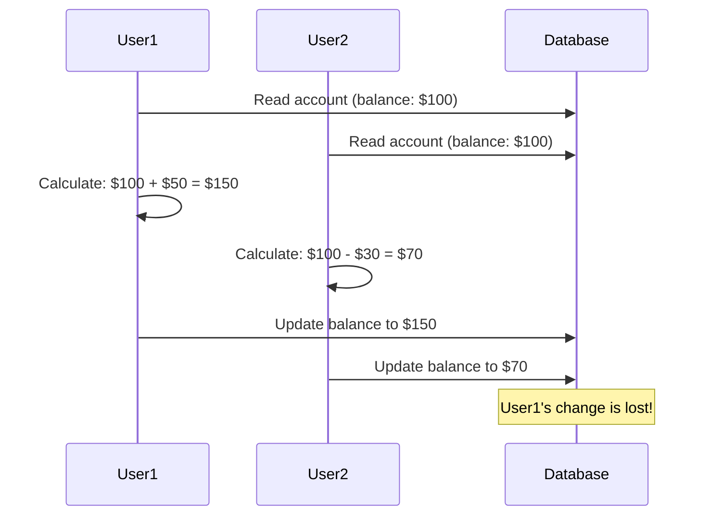

# How to Implement Optimistic Locking in SQLAlchemy

Author: [nawazdhandala](https://www.github.com/nawazdhandala)

Tags: Python, SQLAlchemy, Database, Concurrency, Optimistic Locking, PostgreSQL, ORM

Description: Learn how to implement optimistic locking in SQLAlchemy to handle concurrent updates safely. This guide covers version columns, conflict detection, and retry strategies for building robust database applications.

---

> When multiple users or processes try to update the same database record simultaneously, you have a concurrency problem. Without proper handling, one update can silently overwrite another, leading to lost data. Optimistic locking is a pattern that detects these conflicts and lets you handle them gracefully.

The term "optimistic" comes from the assumption that conflicts are rare. Instead of locking records before reading them, you let updates proceed and check for conflicts at commit time. This approach scales better than pessimistic locking because you are not holding database locks while users fill out forms or while background jobs process data.

---

## Understanding the Problem

Consider this scenario without any locking:



User1's deposit of $50 is completely lost because User2's update overwrote it. This is called a "lost update" problem.

---

## Version Column Approach

The most common optimistic locking implementation uses a version column. Every update increments the version and checks that the version has not changed since the record was read.

```python
# models.py
# SQLAlchemy models with optimistic locking support
from sqlalchemy import Column, Integer, String, Numeric, DateTime, event
from sqlalchemy.orm import declarative_base, validates
from sqlalchemy.exc import StaleDataError
from datetime import datetime

Base = declarative_base()

class VersionedMixin:
    """
    Mixin that adds optimistic locking support to any model.
    Uses a version column that auto-increments on update.
    """

    # Version column - incremented on every update
    version = Column(Integer, nullable=False, default=1)

    # Track when record was last modified
    updated_at = Column(
        DateTime,
        nullable=False,
        default=datetime.utcnow,
        onupdate=datetime.utcnow
    )

    @staticmethod
    def _increment_version(mapper, connection, target):
        """Event listener to increment version on update"""
        target.version += 1

    @classmethod
    def __declare_last__(cls):
        """Register event listener after class is fully configured"""
        event.listen(cls, 'before_update', cls._increment_version)


class Account(VersionedMixin, Base):
    """Account model with optimistic locking"""
    __tablename__ = 'accounts'

    # Configure SQLAlchemy to use version column for optimistic locking
    __mapper_args__ = {
        'version_id_col': version  # This tells SQLAlchemy to use this column
    }

    id = Column(Integer, primary_key=True)
    name = Column(String(100), nullable=False)
    balance = Column(Numeric(10, 2), nullable=False, default=0)

    def deposit(self, amount: float):
        """Add money to account"""
        if amount <= 0:
            raise ValueError("Deposit amount must be positive")
        self.balance += amount

    def withdraw(self, amount: float):
        """Remove money from account"""
        if amount <= 0:
            raise ValueError("Withdrawal amount must be positive")
        if self.balance < amount:
            raise ValueError("Insufficient funds")
        self.balance -= amount

    def __repr__(self):
        return f"<Account(id={self.id}, name='{self.name}', balance={self.balance}, v{self.version})>"


class Product(VersionedMixin, Base):
    """Product model with optimistic locking for inventory"""
    __tablename__ = 'products'

    __mapper_args__ = {
        'version_id_col': version
    }

    id = Column(Integer, primary_key=True)
    sku = Column(String(50), unique=True, nullable=False)
    name = Column(String(200), nullable=False)
    stock = Column(Integer, nullable=False, default=0)
    price = Column(Numeric(10, 2), nullable=False)

    def reserve_stock(self, quantity: int):
        """Reserve stock for an order"""
        if quantity <= 0:
            raise ValueError("Quantity must be positive")
        if self.stock < quantity:
            raise ValueError(f"Insufficient stock. Available: {self.stock}")
        self.stock -= quantity

    def add_stock(self, quantity: int):
        """Add stock from inventory receipt"""
        if quantity <= 0:
            raise ValueError("Quantity must be positive")
        self.stock += quantity
```

---

## Handling Stale Data Errors

When SQLAlchemy detects a version mismatch, it raises `StaleDataError`. You need to catch this and handle it appropriately.

```python
# repository.py
# Repository pattern with optimistic locking error handling
from sqlalchemy.orm import Session
from sqlalchemy.exc import StaleDataError
from typing import Optional, TypeVar, Generic, Callable
from contextlib import contextmanager
import time
import logging

logger = logging.getLogger(__name__)

T = TypeVar('T')

class OptimisticLockError(Exception):
    """Raised when a concurrent modification is detected"""

    def __init__(self, entity_type: str, entity_id: int, message: str = None):
        self.entity_type = entity_type
        self.entity_id = entity_id
        self.message = message or f"{entity_type} with id {entity_id} was modified by another transaction"
        super().__init__(self.message)


class AccountRepository:
    """Repository for Account operations with optimistic locking"""

    def __init__(self, session: Session):
        self.session = session

    def get_by_id(self, account_id: int) -> Optional[Account]:
        """Get account by ID"""
        return self.session.query(Account).filter(Account.id == account_id).first()

    def update_balance(
        self,
        account_id: int,
        operation: Callable[[Account], None]
    ) -> Account:
        """
        Update account balance with optimistic locking.

        Args:
            account_id: ID of the account to update
            operation: Function that modifies the account

        Raises:
            OptimisticLockError: If concurrent modification detected
        """
        account = self.get_by_id(account_id)
        if not account:
            raise ValueError(f"Account {account_id} not found")

        # Store version for error reporting
        original_version = account.version

        try:
            # Apply the operation
            operation(account)

            # Commit will fail if version changed
            self.session.commit()

            logger.info(
                f"Account {account_id} updated: v{original_version} -> v{account.version}"
            )
            return account

        except StaleDataError:
            # Rollback the failed transaction
            self.session.rollback()

            # Refresh to see current state
            self.session.refresh(account)

            logger.warning(
                f"Optimistic lock conflict on Account {account_id}: "
                f"expected v{original_version}, found v{account.version}"
            )

            raise OptimisticLockError("Account", account_id)

    def deposit(self, account_id: int, amount: float) -> Account:
        """Deposit money with optimistic locking"""
        return self.update_balance(
            account_id,
            lambda acc: acc.deposit(amount)
        )

    def withdraw(self, account_id: int, amount: float) -> Account:
        """Withdraw money with optimistic locking"""
        return self.update_balance(
            account_id,
            lambda acc: acc.withdraw(amount)
        )

    def transfer(
        self,
        from_account_id: int,
        to_account_id: int,
        amount: float
    ) -> tuple[Account, Account]:
        """
        Transfer money between accounts.
        Both accounts are updated in a single transaction.
        """
        from_account = self.get_by_id(from_account_id)
        to_account = self.get_by_id(to_account_id)

        if not from_account:
            raise ValueError(f"Source account {from_account_id} not found")
        if not to_account:
            raise ValueError(f"Destination account {to_account_id} not found")

        try:
            # Perform transfer
            from_account.withdraw(amount)
            to_account.deposit(amount)

            self.session.commit()

            return from_account, to_account

        except StaleDataError:
            self.session.rollback()
            raise OptimisticLockError(
                "Account",
                from_account_id,  # We don't know which one failed
                "One of the accounts was modified during transfer"
            )
```

---

## Retry Strategy

For operations where conflicts are expected, implement automatic retry with exponential backoff.

```python
# retry.py
# Retry logic for handling optimistic locking conflicts
from typing import TypeVar, Callable, Optional
from functools import wraps
import time
import random
import logging

logger = logging.getLogger(__name__)

T = TypeVar('T')

class RetryConfig:
    """Configuration for retry behavior"""

    def __init__(
        self,
        max_retries: int = 3,
        base_delay: float = 0.1,  # 100ms
        max_delay: float = 2.0,   # 2 seconds
        exponential_base: float = 2,
        jitter: bool = True  # Add randomness to prevent thundering herd
    ):
        self.max_retries = max_retries
        self.base_delay = base_delay
        self.max_delay = max_delay
        self.exponential_base = exponential_base
        self.jitter = jitter

    def get_delay(self, attempt: int) -> float:
        """Calculate delay for a given retry attempt"""
        delay = self.base_delay * (self.exponential_base ** attempt)
        delay = min(delay, self.max_delay)

        if self.jitter:
            # Add up to 25% jitter
            delay = delay * (0.75 + random.random() * 0.5)

        return delay


def with_optimistic_retry(
    config: RetryConfig = None,
    on_conflict: Callable[[Exception, int], None] = None
):
    """
    Decorator that retries a function on OptimisticLockError.

    Args:
        config: Retry configuration
        on_conflict: Optional callback when conflict occurs
    """
    if config is None:
        config = RetryConfig()

    def decorator(func: Callable[..., T]) -> Callable[..., T]:
        @wraps(func)
        def wrapper(*args, **kwargs) -> T:
            last_error = None

            for attempt in range(config.max_retries + 1):
                try:
                    return func(*args, **kwargs)

                except OptimisticLockError as e:
                    last_error = e

                    if attempt < config.max_retries:
                        delay = config.get_delay(attempt)

                        logger.info(
                            f"Optimistic lock conflict (attempt {attempt + 1}), "
                            f"retrying in {delay:.2f}s"
                        )

                        if on_conflict:
                            on_conflict(e, attempt)

                        time.sleep(delay)
                    else:
                        logger.warning(
                            f"Optimistic lock conflict persists after "
                            f"{config.max_retries} retries"
                        )

            raise last_error

        return wrapper
    return decorator


# Async version for async applications
import asyncio

def with_optimistic_retry_async(
    config: RetryConfig = None,
    on_conflict: Callable[[Exception, int], None] = None
):
    """Async version of retry decorator"""
    if config is None:
        config = RetryConfig()

    def decorator(func: Callable[..., T]) -> Callable[..., T]:
        @wraps(func)
        async def wrapper(*args, **kwargs) -> T:
            last_error = None

            for attempt in range(config.max_retries + 1):
                try:
                    return await func(*args, **kwargs)

                except OptimisticLockError as e:
                    last_error = e

                    if attempt < config.max_retries:
                        delay = config.get_delay(attempt)

                        logger.info(
                            f"Optimistic lock conflict (attempt {attempt + 1}), "
                            f"retrying in {delay:.2f}s"
                        )

                        if on_conflict:
                            on_conflict(e, attempt)

                        await asyncio.sleep(delay)

            raise last_error

        return wrapper
    return decorator


# Usage example
class AccountService:
    """Service layer with automatic retry on conflicts"""

    def __init__(self, session_factory):
        self.session_factory = session_factory

    @with_optimistic_retry(RetryConfig(max_retries=3))
    def deposit(self, account_id: int, amount: float) -> Account:
        """Deposit with automatic retry on conflict"""
        with self.session_factory() as session:
            repo = AccountRepository(session)
            return repo.deposit(account_id, amount)

    @with_optimistic_retry(
        RetryConfig(max_retries=5, base_delay=0.2),
        on_conflict=lambda e, a: logger.warning(f"Transfer conflict: {e}")
    )
    def transfer(
        self,
        from_id: int,
        to_id: int,
        amount: float
    ) -> tuple[Account, Account]:
        """Transfer with more retries due to higher conflict probability"""
        with self.session_factory() as session:
            repo = AccountRepository(session)
            return repo.transfer(from_id, to_id, amount)
```

---

## Manual Version Checking

Sometimes you need more control over version handling. Here is a pattern for manual version management.

```python
# manual_versioning.py
# Manual version checking for complex scenarios
from sqlalchemy import update, and_
from sqlalchemy.orm import Session
from typing import Optional, Dict, Any

class ManualVersionRepository:
    """
    Repository with manual version checking.
    Useful when you need to update multiple fields atomically
    or when working with raw SQL updates.
    """

    def __init__(self, session: Session):
        self.session = session

    def update_with_version_check(
        self,
        account_id: int,
        expected_version: int,
        updates: Dict[str, Any]
    ) -> bool:
        """
        Update account only if version matches.
        Returns True if update succeeded, False if version mismatch.
        """
        # Build update statement with version check
        stmt = (
            update(Account)
            .where(
                and_(
                    Account.id == account_id,
                    Account.version == expected_version  # Version check
                )
            )
            .values(
                **updates,
                version=expected_version + 1  # Increment version
            )
        )

        result = self.session.execute(stmt)
        self.session.commit()

        # Check if any rows were updated
        rows_updated = result.rowcount

        if rows_updated == 0:
            # Either account doesn't exist or version mismatch
            account = self.session.query(Account).filter(
                Account.id == account_id
            ).first()

            if account is None:
                raise ValueError(f"Account {account_id} not found")

            # Version mismatch
            return False

        return True

    def optimistic_update(
        self,
        account_id: int,
        update_fn: Callable[[Account], Dict[str, Any]],
        max_retries: int = 3
    ) -> Account:
        """
        Read-modify-write with optimistic locking.

        Args:
            account_id: Account to update
            update_fn: Function that takes account and returns dict of updates
            max_retries: Maximum retry attempts

        Returns:
            Updated account
        """
        for attempt in range(max_retries + 1):
            # Read current state
            account = self.session.query(Account).filter(
                Account.id == account_id
            ).first()

            if not account:
                raise ValueError(f"Account {account_id} not found")

            # Calculate updates
            updates = update_fn(account)

            # Try to apply with version check
            success = self.update_with_version_check(
                account_id,
                account.version,
                updates
            )

            if success:
                # Refresh to get updated values
                self.session.refresh(account)
                return account

            if attempt < max_retries:
                # Expire cached data and retry
                self.session.expire(account)
                time.sleep(0.1 * (2 ** attempt))

        raise OptimisticLockError(
            "Account",
            account_id,
            f"Failed to update after {max_retries} retries"
        )


# Example usage for complex updates
def calculate_interest(account: Account) -> Dict[str, Any]:
    """Calculate and apply interest"""
    interest_rate = 0.05  # 5% annual
    interest = float(account.balance) * interest_rate / 12

    return {
        'balance': account.balance + interest,
        'last_interest_date': datetime.utcnow()
    }

# Apply interest with optimistic locking
repo = ManualVersionRepository(session)
updated = repo.optimistic_update(
    account_id=123,
    update_fn=calculate_interest
)
```

---

## Timestamp-Based Versioning

An alternative to integer versions is using timestamps. This approach provides additional information about when changes occurred.

```python
# timestamp_versioning.py
# Timestamp-based optimistic locking
from sqlalchemy import Column, DateTime, Integer, String, Numeric
from sqlalchemy.orm import declarative_base
from datetime import datetime
from typing import Optional

Base = declarative_base()

class TimestampVersionedMixin:
    """
    Mixin using timestamps for optimistic locking.
    Provides more information than integer versions.
    """

    # Use updated_at as version column
    updated_at = Column(
        DateTime,
        nullable=False,
        default=datetime.utcnow
    )

    # Also track creation time
    created_at = Column(
        DateTime,
        nullable=False,
        default=datetime.utcnow
    )


class Document(TimestampVersionedMixin, Base):
    """Document with timestamp-based versioning"""
    __tablename__ = 'documents'

    __mapper_args__ = {
        'version_id_col': updated_at,
        'version_id_generator': lambda v: datetime.utcnow()
    }

    id = Column(Integer, primary_key=True)
    title = Column(String(200), nullable=False)
    content = Column(String, nullable=False)
    author_id = Column(Integer, nullable=False)

    def update_content(self, new_content: str):
        """Update document content"""
        self.content = new_content
        # updated_at is automatically set by SQLAlchemy


class DocumentRepository:
    """Repository with timestamp-based locking"""

    def __init__(self, session: Session):
        self.session = session

    def update_if_unchanged(
        self,
        document_id: int,
        expected_updated_at: datetime,
        new_content: str
    ) -> tuple[bool, Document]:
        """
        Update document only if it hasn't changed.

        Returns:
            Tuple of (success, document)
            If success is False, document contains current state
        """
        document = self.session.query(Document).filter(
            Document.id == document_id
        ).first()

        if not document:
            raise ValueError(f"Document {document_id} not found")

        # Check if document was modified since we read it
        if document.updated_at != expected_updated_at:
            return (False, document)

        try:
            document.update_content(new_content)
            self.session.commit()
            return (True, document)

        except StaleDataError:
            self.session.rollback()
            self.session.refresh(document)
            return (False, document)
```

---

## Testing Optimistic Locking

Proper tests for concurrency are essential. Here is how to test optimistic locking behavior.

```python
# test_optimistic_locking.py
# Tests for optimistic locking behavior
import pytest
from sqlalchemy import create_engine
from sqlalchemy.orm import sessionmaker
import threading
import time

@pytest.fixture
def engine():
    """Create test database"""
    engine = create_engine('sqlite:///:memory:')
    Base.metadata.create_all(engine)
    return engine

@pytest.fixture
def session_factory(engine):
    """Create session factory"""
    return sessionmaker(bind=engine)

def test_concurrent_updates_detected(session_factory):
    """Test that concurrent updates are detected"""
    # Create account
    with session_factory() as session:
        account = Account(name="Test", balance=100)
        session.add(account)
        session.commit()
        account_id = account.id

    # Simulate concurrent access
    results = {'session1': None, 'session2': None}
    errors = {'session1': None, 'session2': None}

    def update_session1():
        """First session updates slowly"""
        try:
            with session_factory() as session:
                account = session.query(Account).get(account_id)
                time.sleep(0.2)  # Simulate slow processing
                account.deposit(50)
                session.commit()
                results['session1'] = account.balance
        except Exception as e:
            errors['session1'] = e

    def update_session2():
        """Second session updates quickly"""
        try:
            time.sleep(0.1)  # Start slightly after session1
            with session_factory() as session:
                account = session.query(Account).get(account_id)
                account.withdraw(30)
                session.commit()
                results['session2'] = account.balance
        except Exception as e:
            errors['session2'] = e

    # Run concurrently
    t1 = threading.Thread(target=update_session1)
    t2 = threading.Thread(target=update_session2)

    t1.start()
    t2.start()

    t1.join()
    t2.join()

    # One should succeed, one should fail with StaleDataError
    # (Which one depends on timing)
    assert (errors['session1'] is not None) or (errors['session2'] is not None)

def test_retry_succeeds_after_conflict(session_factory):
    """Test that retry mechanism handles conflicts"""
    # Create account
    with session_factory() as session:
        account = Account(name="Test", balance=100)
        session.add(account)
        session.commit()
        account_id = account.id

    service = AccountService(session_factory)

    # Multiple concurrent deposits should all eventually succeed
    results = []
    errors = []

    def deposit():
        try:
            result = service.deposit(account_id, 10)
            results.append(result.balance)
        except Exception as e:
            errors.append(e)

    threads = [threading.Thread(target=deposit) for _ in range(5)]

    for t in threads:
        t.start()
    for t in threads:
        t.join()

    # All should succeed with retries
    assert len(errors) == 0
    assert len(results) == 5

    # Final balance should be 100 + (5 * 10) = 150
    with session_factory() as session:
        account = session.query(Account).get(account_id)
        assert account.balance == 150
```

---

## Best Practices

1. **Use version columns for all mutable entities** - It is cheap insurance against lost updates
2. **Handle StaleDataError explicitly** - Never let it bubble up as a 500 error
3. **Implement retry with backoff** - Most conflicts resolve on the second try
4. **Add jitter to retries** - Prevents multiple retries from colliding again
5. **Log conflicts** - High conflict rates indicate a design problem
6. **Consider the user experience** - Show a meaningful error, not "try again later"

---

## Conclusion

Optimistic locking is essential for any application with concurrent updates. SQLAlchemy's built-in support with `version_id_col` makes implementation straightforward, but you need proper error handling and retry logic to make it production-ready.

The pattern is simple: read with version, update with version check, retry on conflict. The art is in choosing the right retry strategy and providing a good user experience when conflicts occur.

---

*Want to monitor database conflicts in your application? [OneUptime](https://oneuptime.com) provides custom metrics tracking for optimistic locking conflict rates and retry statistics.*

**Related Reading:**
- [How to Prevent Duplicate Requests in Python](https://oneuptime.com/blog/post/2026-01-25-prevent-duplicate-requests-python/view)
- [When Performance Matters, Skip the ORM](https://oneuptime.com/blog/post/2025-11-13-when-performance-matters-skip-the-orm/view)
