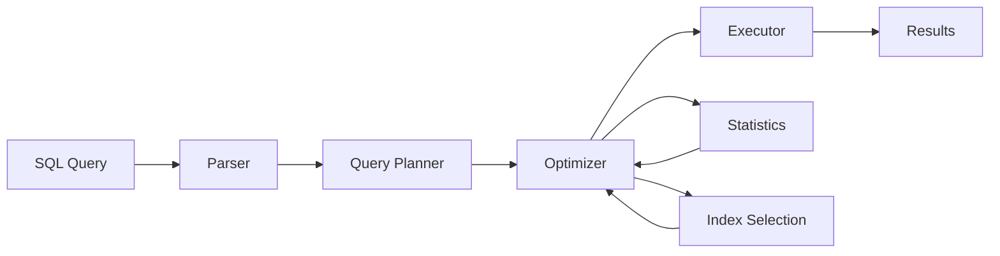

# How to Optimize Database Queries

Author: [nawazdhandala](https://www.github.com/nawazdhandala)

Tags: Database, SQL, Performance, PostgreSQL, MySQL, Query Optimization, Indexing, Backend

Description: Learn practical techniques for optimizing database queries. This guide covers query analysis, indexing strategies, query rewriting, and monitoring with real-world examples for PostgreSQL and MySQL.

---

> Slow database queries are the most common cause of application performance problems. A single poorly written query can bring down an entire system. This guide shows you how to identify, analyze, and fix slow queries using proven techniques that work in production.

Database optimization is not about premature tuning. It is about understanding query execution, measuring actual performance, and making targeted improvements where they matter.

---

## Understanding Query Execution

Before optimizing, understand how your database executes queries:



The query planner decides the execution strategy based on:
- Table statistics (row counts, data distribution)
- Available indexes
- Join algorithms
- Memory constraints

---

## Step 1: Find Slow Queries

### PostgreSQL: Enable Query Logging

```sql
-- Enable slow query logging in postgresql.conf
-- Or set at runtime for your session

-- Log queries taking more than 100ms
ALTER SYSTEM SET log_min_duration_statement = '100ms';

-- For detailed analysis, log all queries temporarily
SET log_statement = 'all';
SET log_duration = on;

-- Check pg_stat_statements for query performance
CREATE EXTENSION IF NOT EXISTS pg_stat_statements;

-- Find slowest queries by total time
SELECT
    substring(query, 1, 100) as query_preview,
    calls,
    round(total_exec_time::numeric, 2) as total_ms,
    round(mean_exec_time::numeric, 2) as avg_ms,
    round((100 * total_exec_time / sum(total_exec_time) OVER ())::numeric, 2) as percent_total
FROM pg_stat_statements
ORDER BY total_exec_time DESC
LIMIT 20;
```

### MySQL: Enable Slow Query Log

```sql
-- Enable slow query log
SET GLOBAL slow_query_log = 'ON';
SET GLOBAL long_query_time = 0.1;  -- 100ms threshold
SET GLOBAL log_queries_not_using_indexes = 'ON';

-- Find slow queries from performance_schema
SELECT
    DIGEST_TEXT as query,
    COUNT_STAR as executions,
    ROUND(SUM_TIMER_WAIT/1000000000000, 2) as total_seconds,
    ROUND(AVG_TIMER_WAIT/1000000000, 2) as avg_ms
FROM performance_schema.events_statements_summary_by_digest
ORDER BY SUM_TIMER_WAIT DESC
LIMIT 20;
```

---

## Step 2: Analyze Query Execution Plans

### PostgreSQL EXPLAIN ANALYZE

```sql
-- Always use ANALYZE to see actual execution times
EXPLAIN (ANALYZE, BUFFERS, FORMAT TEXT)
SELECT u.name, COUNT(o.id) as order_count
FROM users u
LEFT JOIN orders o ON o.user_id = u.id
WHERE u.created_at > '2025-01-01'
GROUP BY u.id, u.name
ORDER BY order_count DESC
LIMIT 10;

-- Example output interpretation:
/*
Sort  (cost=1234.56..1234.78 rows=10 width=40) (actual time=45.123..45.125 rows=10 loops=1)
  Sort Key: (count(o.id)) DESC
  Sort Method: top-N heapsort  Memory: 25kB
  ->  HashAggregate  (cost=1200.00..1210.00 rows=1000 width=40) (actual time=44.500..44.800 rows=500 loops=1)
        Group Key: u.id
        Buffers: shared hit=150 read=50
        ->  Hash Left Join  (cost=100.00..1000.00 rows=5000 width=36) (actual time=10.000..35.000 rows=5000 loops=1)
              Hash Cond: (o.user_id = u.id)
              ->  Seq Scan on orders o  (cost=0.00..500.00 rows=10000 width=8) (actual time=0.010..15.000 rows=10000 loops=1)
              ->  Hash  (cost=80.00..80.00 rows=1000 width=36) (actual time=5.000..5.000 rows=1000 loops=1)
                    Buckets: 1024  Batches: 1  Memory Usage: 64kB
                    ->  Index Scan using idx_users_created_at on users u  (cost=0.00..80.00 rows=1000 width=36)
                          Index Cond: (created_at > '2025-01-01'::date)
*/

-- Key things to look for:
-- 1. Seq Scan on large tables (might need index)
-- 2. High "actual rows" vs "rows" estimates (stale statistics)
-- 3. Nested Loop with many rows (consider hash join)
-- 4. Buffers read >> hit (I/O bound, need more memory or better indexes)
```

### MySQL EXPLAIN

```sql
-- Use EXPLAIN ANALYZE in MySQL 8.0.18+
EXPLAIN ANALYZE
SELECT u.name, COUNT(o.id) as order_count
FROM users u
LEFT JOIN orders o ON o.user_id = u.id
WHERE u.created_at > '2025-01-01'
GROUP BY u.id, u.name
ORDER BY order_count DESC
LIMIT 10;

-- Check for these issues:
-- type: ALL (full table scan - usually bad)
-- type: index (full index scan - might be ok)
-- type: range, ref, eq_ref (good - using index)
-- Extra: Using filesort (might need index for ORDER BY)
-- Extra: Using temporary (might need optimization)
```

---

## Step 3: Indexing Strategies

### Creating Effective Indexes

```sql
-- PostgreSQL indexing examples

-- Basic B-tree index for equality and range queries
CREATE INDEX idx_orders_user_id ON orders(user_id);

-- Composite index for queries filtering on multiple columns
-- Column order matters: most selective first, or match query pattern
CREATE INDEX idx_orders_user_status_date ON orders(user_id, status, created_at);

-- Partial index for queries on subset of data (very efficient)
CREATE INDEX idx_orders_pending ON orders(user_id, created_at)
WHERE status = 'pending';

-- Covering index to avoid table lookups (index-only scan)
CREATE INDEX idx_orders_covering ON orders(user_id, status, created_at)
INCLUDE (total_amount);

-- Index for LIKE queries with prefix matching
CREATE INDEX idx_users_email_pattern ON users(email varchar_pattern_ops);

-- GIN index for array or JSONB containment queries
CREATE INDEX idx_products_tags ON products USING GIN(tags);

-- Expression index for computed values
CREATE INDEX idx_users_email_lower ON users(LOWER(email));
```

### When NOT to Add Indexes

```sql
-- Don't over-index! Each index has costs:
-- 1. Storage space
-- 2. Write performance (INSERT/UPDATE/DELETE)
-- 3. Maintenance overhead

-- Check index usage before adding more
SELECT
    schemaname,
    relname as table_name,
    indexrelname as index_name,
    idx_scan as times_used,
    idx_tup_read as tuples_read,
    idx_tup_fetch as tuples_fetched
FROM pg_stat_user_indexes
WHERE idx_scan = 0  -- Unused indexes
ORDER BY pg_relation_size(indexrelid) DESC;

-- Remove unused indexes
DROP INDEX CONCURRENTLY idx_unused_index;
```

---

## Step 4: Query Rewriting Techniques

### Avoid SELECT *

```sql
-- Bad: fetches all columns, prevents covering index
SELECT * FROM orders WHERE user_id = 123;

-- Good: fetch only needed columns
SELECT id, status, total_amount, created_at
FROM orders
WHERE user_id = 123;
```

### Optimize JOINs

```sql
-- Bad: implicit join with WHERE (older syntax, harder to read)
SELECT u.name, o.total
FROM users u, orders o
WHERE u.id = o.user_id AND u.status = 'active';

-- Good: explicit JOIN syntax
SELECT u.name, o.total
FROM users u
INNER JOIN orders o ON o.user_id = u.id
WHERE u.status = 'active';

-- Better: filter early to reduce join size
SELECT u.name, o.total
FROM (
    SELECT id, name
    FROM users
    WHERE status = 'active'
) u
INNER JOIN orders o ON o.user_id = u.id;
```

### Use EXISTS Instead of IN for Subqueries

```sql
-- Slower: IN with subquery (executes subquery fully)
SELECT * FROM orders
WHERE user_id IN (
    SELECT id FROM users WHERE country = 'US'
);

-- Faster: EXISTS (stops at first match)
SELECT * FROM orders o
WHERE EXISTS (
    SELECT 1 FROM users u
    WHERE u.id = o.user_id AND u.country = 'US'
);
```

### Pagination Done Right

```sql
-- Bad: OFFSET is slow for large offsets (scans and discards rows)
SELECT * FROM products
ORDER BY created_at DESC
LIMIT 20 OFFSET 10000;

-- Good: Keyset/cursor pagination (consistent performance)
SELECT * FROM products
WHERE created_at < '2025-01-15 10:30:00'
ORDER BY created_at DESC
LIMIT 20;

-- For unique ordering, use composite key
SELECT * FROM products
WHERE (created_at, id) < ('2025-01-15 10:30:00', 12345)
ORDER BY created_at DESC, id DESC
LIMIT 20;
```

### Batch Operations

```python
# batch_queries.py
# Bad: N+1 queries
def get_users_with_orders_bad(user_ids):
    users = []
    for user_id in user_ids:  # 1 query per user!
        user = db.query("SELECT * FROM users WHERE id = %s", (user_id,))
        orders = db.query("SELECT * FROM orders WHERE user_id = %s", (user_id,))
        user['orders'] = orders
        users.append(user)
    return users

# Good: Batch queries
def get_users_with_orders_good(user_ids):
    # Single query for all users
    users = db.query(
        "SELECT * FROM users WHERE id = ANY(%s)",
        (user_ids,)
    )

    # Single query for all orders
    orders = db.query(
        "SELECT * FROM orders WHERE user_id = ANY(%s)",
        (user_ids,)
    )

    # Group orders by user in memory
    orders_by_user = {}
    for order in orders:
        orders_by_user.setdefault(order['user_id'], []).append(order)

    # Combine
    for user in users:
        user['orders'] = orders_by_user.get(user['id'], [])

    return users
```

---

## Step 5: Statistics and Maintenance

### Keep Statistics Fresh

```sql
-- PostgreSQL: Update statistics after bulk changes
ANALYZE orders;

-- Update specific columns
ANALYZE orders(user_id, status, created_at);

-- Set statistics target for better estimates on skewed columns
ALTER TABLE orders ALTER COLUMN status SET STATISTICS 1000;
ANALYZE orders;

-- Check if statistics are stale
SELECT
    relname,
    last_vacuum,
    last_autovacuum,
    last_analyze,
    last_autoanalyze,
    n_live_tup,
    n_dead_tup
FROM pg_stat_user_tables
WHERE n_dead_tup > n_live_tup * 0.1;  -- >10% dead tuples
```

### Prevent Table Bloat

```sql
-- PostgreSQL: Check table and index bloat
SELECT
    tablename,
    pg_size_pretty(pg_total_relation_size(schemaname || '.' || tablename)) as total_size,
    pg_size_pretty(pg_relation_size(schemaname || '.' || tablename)) as table_size,
    pg_size_pretty(pg_indexes_size(schemaname || '.' || tablename)) as index_size
FROM pg_tables
WHERE schemaname = 'public'
ORDER BY pg_total_relation_size(schemaname || '.' || tablename) DESC;

-- Rebuild bloated indexes
REINDEX INDEX CONCURRENTLY idx_orders_user_id;

-- Reclaim space from bloated tables
VACUUM FULL orders;  -- Locks table, use during maintenance window
```

---

## Step 6: Connection and Query Patterns

### Use Prepared Statements

```python
# prepared_statements.py
import psycopg2

# Without prepared statements: query is parsed every time
def get_user_bad(conn, user_id):
    with conn.cursor() as cur:
        cur.execute("SELECT * FROM users WHERE id = %s", (user_id,))
        return cur.fetchone()

# With prepared statements: parse once, execute many times
class UserRepository:
    def __init__(self, conn):
        self.conn = conn
        self._prepare_statements()

    def _prepare_statements(self):
        with self.conn.cursor() as cur:
            cur.execute("""
                PREPARE get_user(integer) AS
                SELECT id, name, email, created_at
                FROM users
                WHERE id = $1
            """)
            cur.execute("""
                PREPARE get_user_orders(integer) AS
                SELECT id, status, total_amount, created_at
                FROM orders
                WHERE user_id = $1
                ORDER BY created_at DESC
                LIMIT 10
            """)

    def get_user(self, user_id: int):
        with self.conn.cursor() as cur:
            cur.execute("EXECUTE get_user(%s)", (user_id,))
            return cur.fetchone()

    def get_user_orders(self, user_id: int):
        with self.conn.cursor() as cur:
            cur.execute("EXECUTE get_user_orders(%s)", (user_id,))
            return cur.fetchall()
```

---

## Optimization Checklist

| Issue | Solution |
|-------|----------|
| Full table scan | Add appropriate index |
| Slow ORDER BY | Index on sort columns |
| Slow GROUP BY | Index on group columns |
| High buffer reads | More shared_buffers or better indexes |
| Hash join on small table | Ensure statistics are current |
| Nested loop with many rows | Consider hash/merge join |
| Large OFFSET | Use keyset pagination |
| SELECT * | Select only needed columns |
| N+1 queries | Batch or JOIN queries |

---

## Monitoring Query Performance

```python
# query_monitor.py
import time
import logging
from contextlib import contextmanager

logger = logging.getLogger(__name__)

@contextmanager
def query_timer(query_name: str, threshold_ms: float = 100):
    """Log slow queries"""
    start = time.perf_counter()
    try:
        yield
    finally:
        duration_ms = (time.perf_counter() - start) * 1000
        if duration_ms > threshold_ms:
            logger.warning(
                f"Slow query: {query_name} took {duration_ms:.2f}ms "
                f"(threshold: {threshold_ms}ms)"
            )
        else:
            logger.debug(f"Query {query_name}: {duration_ms:.2f}ms")

# Usage
with query_timer("get_user_orders"):
    orders = db.query("SELECT * FROM orders WHERE user_id = %s", (user_id,))
```

---

## Conclusion

Database query optimization follows a clear process:

1. **Measure first**: Find actual slow queries, do not guess
2. **Analyze execution plans**: Understand what the database is doing
3. **Add targeted indexes**: Based on actual query patterns
4. **Rewrite inefficient queries**: Batch operations, avoid N+1
5. **Maintain database health**: Fresh statistics, prevent bloat
6. **Monitor continuously**: Track query performance over time

The biggest gains usually come from proper indexing and eliminating N+1 query patterns. Start there before exploring more advanced optimizations.

---

*Need to monitor your database performance? [OneUptime](https://oneuptime.com) provides database monitoring with query performance tracking, slow query alerts, and connection pool metrics.*
