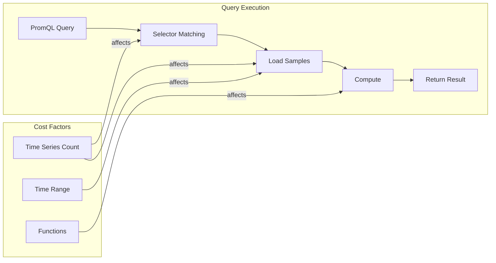

# How to Optimize PromQL Queries

Author: [nawazdhandala](https://www.github.com/nawazdhandala)

Tags: Prometheus, PromQL, Query Optimization, Performance, Recording Rules, Cardinality, Observability, Grafana

Description: Learn how to write efficient PromQL queries that scale. This guide covers query optimization techniques, recording rules, common anti-patterns to avoid, and practical tips for improving dashboard performance.

---

## Why Query Optimization Matters

PromQL queries that work fine in development can bring Prometheus to its knees in production. As your metric volume grows, poorly written queries consume excessive memory and CPU, leading to slow dashboards, missed alerts, and frustrated users.

Understanding how Prometheus executes queries helps you write efficient PromQL that scales with your infrastructure.

## How Prometheus Executes Queries

When you run a PromQL query, Prometheus:

1. Identifies all time series matching the selectors
2. Loads samples from the TSDB into memory
3. Applies functions and aggregations
4. Returns the result

The cost of a query depends primarily on:
- Number of time series touched
- Time range of data loaded
- Complexity of computations



## Using Selectors Efficiently

### Be Specific with Label Matchers

More specific selectors reduce the number of series Prometheus must process:

```promql
# Bad: Matches all http_requests_total metrics
rate(http_requests_total[5m])

# Better: Filter by job and status early
rate(http_requests_total{job="api-gateway", status=~"2.."}[5m])

# Best: Use equality matchers instead of regex when possible
rate(http_requests_total{job="api-gateway", status="200"}[5m])
```

### Avoid Expensive Regex Patterns

Regex matchers (=~ and !~) are slower than equality matchers:

```promql
# Slow: Regex matching against all values
http_requests_total{method=~".*"}

# Fast: Equality match
http_requests_total{method="GET"}

# Acceptable: Limited regex for known patterns
http_requests_total{method=~"GET|POST|PUT"}

# Slow: Negative regex
http_requests_total{method!~"OPTIONS"}

# Faster: Explicit positive match
http_requests_total{method=~"GET|POST|PUT|DELETE|PATCH"}
```

## Optimizing Aggregations

### Aggregate Before Functions

Apply aggregations early to reduce the number of series processed:

```promql
# Inefficient: rate() on many series, then sum
sum(rate(http_requests_total[5m]))

# More efficient: Use recording rules to pre-aggregate
# See recording rules section below
```

### Use the Right Aggregation Level

Choose aggregation labels based on what you actually need:

```promql
# Over-aggregated: loses useful information
sum(rate(http_requests_total[5m]))

# Under-aggregated: too many series
sum by (instance, method, path, status_code) (
  rate(http_requests_total[5m])
)

# Right balance: aggregate by meaningful dimensions
sum by (service, status_code) (
  rate(http_requests_total[5m])
)
```

### Leverage without Clause

Use `without` instead of `by` when dropping fewer labels:

```promql
# When you want to keep most labels, use without
sum without (instance, pod) (
  rate(http_requests_total[5m])
)

# Equivalent but more verbose
sum by (job, method, status, path, namespace) (
  rate(http_requests_total[5m])
)
```

## Recording Rules for Heavy Queries

Pre-compute expensive queries with recording rules:

```yaml
# recording_rules.yml
groups:
  - name: http_recording_rules
    interval: 15s
    rules:
      # Pre-compute request rates by service
      - record: job:http_requests:rate5m
        expr: |
          sum by (job, status_code) (
            rate(http_requests_total[5m])
          )

      # Pre-compute error rates
      - record: job:http_errors:rate5m
        expr: |
          sum by (job) (
            rate(http_requests_total{status_code=~"5.."}[5m])
          )

      # Pre-compute latency percentiles
      - record: job:http_duration:p99
        expr: |
          histogram_quantile(0.99,
            sum by (job, le) (
              rate(http_request_duration_seconds_bucket[5m])
            )
          )

      - record: job:http_duration:p95
        expr: |
          histogram_quantile(0.95,
            sum by (job, le) (
              rate(http_request_duration_seconds_bucket[5m])
            )
          )

      - record: job:http_duration:p50
        expr: |
          histogram_quantile(0.50,
            sum by (job, le) (
              rate(http_request_duration_seconds_bucket[5m])
            )
          )
```

Then use the pre-computed metrics:

```promql
# Instead of computing on every query
histogram_quantile(0.99,
  sum by (job, le) (
    rate(http_request_duration_seconds_bucket[5m])
  )
)

# Use the recording rule output
job:http_duration:p99
```

## Histogram Query Optimization

Histograms are expensive because they contain many bucket series:

```promql
# Expensive: histogram_quantile over all buckets
histogram_quantile(0.99,
  rate(http_request_duration_seconds_bucket[5m])
)

# Better: Aggregate buckets first
histogram_quantile(0.99,
  sum by (le) (
    rate(http_request_duration_seconds_bucket[5m])
  )
)

# Best: Use recording rules for dashboard queries
# (see recording rules section)
```

### Reduce Histogram Buckets

Configure your histograms with fewer buckets that match your SLO thresholds:

```go
// Instead of default buckets
httpDuration := prometheus.NewHistogramVec(
    prometheus.HistogramOpts{
        Name: "http_request_duration_seconds",
        // Default: {.005, .01, .025, .05, .1, .25, .5, 1, 2.5, 5, 10}
        // Custom buckets aligned to SLOs
        Buckets: []float64{0.01, 0.05, 0.1, 0.3, 0.5, 1.0, 2.0},
    },
    []string{"method", "path", "status"},
)
```

## Time Range Optimization

Shorter time ranges load fewer samples:

```promql
# Expensive: 1 hour of data
rate(http_requests_total[1h])

# Cheaper: 5 minutes of data
rate(http_requests_total[5m])
```

For dashboards, match the rate interval to the scrape interval:

```promql
# If scrape_interval is 15s, use at least 4x for rate()
rate(http_requests_total[1m])  # Good: 60s / 15s = 4 samples

# Too short: may have no samples between two data points
rate(http_requests_total[15s])  # Bad: only 1 sample
```

## Avoiding Common Anti-Patterns

### Anti-Pattern 1: Unbounded Label Values

```promql
# Dangerous: user_id can have millions of values
sum by (user_id) (http_requests_total)

# Better: aggregate without high-cardinality labels
sum by (endpoint) (http_requests_total)
```

### Anti-Pattern 2: Using rate() on Gauges

```promql
# Wrong: rate() is for counters
rate(memory_usage_bytes[5m])

# Correct: use appropriate functions for gauges
avg_over_time(memory_usage_bytes[5m])
max_over_time(memory_usage_bytes[5m])
```

### Anti-Pattern 3: Nested Subqueries

```promql
# Expensive: subquery within subquery
max_over_time(
  rate(http_requests_total[5m])[1h:1m]
)[1d:5m]

# Better: use recording rules for intermediate results
max_over_time(job:http_requests:rate5m[1d])
```

### Anti-Pattern 4: Using count() Instead of Aggregation

```promql
# Inefficient for counting series
count(up{job="api"})

# Use group() for presence checks
group(up{job="api"})

# Or count with proper aggregation
count by (job) (up)
```

## Grafana Dashboard Optimization

### Use $__rate_interval

Let Grafana calculate the optimal rate interval:

```promql
# Hard-coded interval may not match panel resolution
rate(http_requests_total[$__interval])

# Better: Grafana calculates optimal interval
rate(http_requests_total[$__rate_interval])
```

### Limit Legend Series

Reduce the number of series displayed:

```promql
# Too many series in legend
sum by (instance, path, method, status) (
  rate(http_requests_total[5m])
)

# Manageable legend
topk(10, sum by (path) (
  rate(http_requests_total[5m])
))
```

### Use Instant Queries for Stat Panels

```promql
# For single-stat panels, use instant queries (not range)
sum(rate(http_requests_total[5m]))
```

## Query Analysis Tools

### Check Query Performance

Use the Prometheus expression browser to analyze queries:

```bash
# Check query duration via API
curl -g 'http://prometheus:9090/api/v1/query?query=sum(rate(http_requests_total[5m]))' \
  | jq '.data.result | length'

# Get query stats (Prometheus 2.25+)
curl -g 'http://prometheus:9090/api/v1/query?query=sum(rate(http_requests_total[5m]))&stats=true' \
  | jq '.data.stats'
```

### Monitor Prometheus Query Performance

```yaml
# recording_rules.yml - Monitor expensive queries
groups:
  - name: prometheus_query_monitoring
    rules:
      # Track slow queries
      - alert: SlowPrometheusQueries
        expr: |
          prometheus_engine_query_duration_seconds{quantile="0.99"} > 10
        for: 15m
        labels:
          severity: warning
        annotations:
          summary: "Prometheus queries are slow"

      # Track query samples loaded
      - alert: HighQuerySampleLoad
        expr: |
          rate(prometheus_engine_query_samples_total[5m]) > 1000000
        for: 15m
        labels:
          severity: warning
        annotations:
          summary: "Prometheus loading too many samples"
```

## Performance Comparison Examples

Here are before and after optimizations with approximate cost reductions:

```promql
# Example 1: Request rate
# Before: Touches all series, then aggregates
sum(rate(http_requests_total[5m]))
# Cost: O(n) where n = total series

# After: Filter early
sum(rate(http_requests_total{job="api"}[5m]))
# Cost: O(m) where m = series for job="api"

# Example 2: Error rate percentage
# Before: Two expensive queries
sum(rate(http_requests_total{status=~"5.."}[5m])) /
sum(rate(http_requests_total[5m]))

# After: Single query with conditional
sum(rate(http_requests_total{status=~"5.."}[5m])) /
sum(rate(http_requests_total[5m]))
# Or use recording rules for both numerator and denominator

# Example 3: Percentile calculation
# Before: Full histogram computation
histogram_quantile(0.99, rate(http_duration_bucket[5m]))

# After: Aggregate first
histogram_quantile(0.99,
  sum by (le) (rate(http_duration_bucket{job="api"}[5m]))
)
```

## Best Practices Summary

1. **Filter early**: Use specific label matchers to reduce series count
2. **Prefer equality**: Use = over =~ when possible
3. **Aggregate appropriately**: Balance between detail and performance
4. **Use recording rules**: Pre-compute expensive queries
5. **Match intervals to scrape**: Use appropriate rate() intervals
6. **Limit histogram buckets**: Fewer buckets mean faster queries
7. **Monitor query performance**: Track slow queries and optimize them

## Conclusion

PromQL optimization is about reducing the work Prometheus must do: fewer series, shorter time ranges, and simpler computations. Start by profiling your slowest queries, then apply recording rules and selector optimizations. As your monitoring scales, these techniques become essential for maintaining responsive dashboards and reliable alerting.
