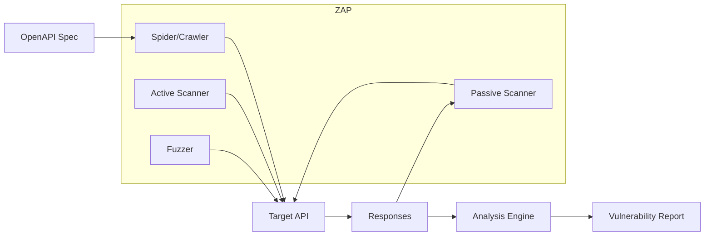

# How to Implement API Security Testing with OWASP ZAP

Author: [nawazdhandala](https://www.github.com/nawazdhandala)

Tags: Security, OWASP ZAP, API Security, DAST, Penetration Testing, DevSecOps, Application Security

Description: Learn how to use OWASP ZAP to perform dynamic security testing on your APIs, identifying vulnerabilities like injection attacks, broken authentication, and data exposure.

---

Static analysis catches bugs in code, but many vulnerabilities only appear at runtime. OWASP ZAP (Zed Attack Proxy) performs Dynamic Application Security Testing (DAST), sending actual requests to your running API and analyzing responses for security issues. This guide covers ZAP setup, API scanning techniques, CI/CD integration, and interpreting results.

## What ZAP Tests

ZAP identifies vulnerabilities from the OWASP Top 10 and beyond:

- **Injection**: SQL, NoSQL, OS command, LDAP injection
- **Broken Authentication**: Weak session management, credential exposure
- **Sensitive Data Exposure**: Unencrypted data, verbose error messages
- **Security Misconfiguration**: Missing headers, default credentials
- **Cross-Site Scripting (XSS)**: Reflected, stored, and DOM-based
- **Broken Access Control**: IDOR, privilege escalation
- **Insecure Deserialization**: Unsafe object handling

## Architecture Overview



## Installing ZAP

### Desktop Application

Download from https://www.zaproxy.org/download/ for Windows, macOS, or Linux.

### Docker (Headless)

```bash
# Pull the stable image
docker pull zaproxy/zap-stable

# Run ZAP in daemon mode
docker run -u zap -p 8080:8080 -d zaproxy/zap-stable zap.sh -daemon \
  -host 0.0.0.0 -port 8080 \
  -config api.disablekey=true \
  -config api.addrs.addr.name=.* \
  -config api.addrs.addr.regex=true
```

### CLI Tool

```bash
# Install ZAP CLI
pip install zapcli

# Or use the ZAP command line directly
docker run --rm -v $(pwd):/zap/wrk zaproxy/zap-stable zap-cli --help
```

## Scanning an API with OpenAPI Specification

The most effective way to scan APIs is by importing an OpenAPI (Swagger) spec:

```bash
# Start ZAP daemon
docker run -u zap -p 8080:8080 -d --name zap zaproxy/zap-stable \
  zap.sh -daemon -host 0.0.0.0 -port 8080 -config api.disablekey=true

# Import OpenAPI spec and scan
docker exec zap zap-cli openapi import-url https://api.example.com/openapi.json

# Or import from file
docker cp openapi.yaml zap:/zap/openapi.yaml
docker exec zap zap-cli openapi import-file /zap/openapi.yaml -t https://api.example.com

# Run active scan
docker exec zap zap-cli active-scan -r https://api.example.com

# Generate report
docker exec zap zap-cli report -o /zap/wrk/report.html -f html
```

## API Scan Script

ZAP provides ready-to-use scripts for API scanning:

```bash
# Full API scan using OpenAPI spec
docker run --rm -v $(pwd):/zap/wrk:rw \
  -t zaproxy/zap-stable zap-api-scan.py \
  -t https://api.example.com/openapi.json \
  -f openapi \
  -r api-scan-report.html \
  -w api-scan-report.md

# Options:
# -t: Target URL or file path
# -f: Format (openapi, soap, graphql)
# -r: HTML report output
# -w: Markdown report output
# -J: JSON report output
# -x: XML report output
```

## Baseline Scan (Passive Only)

For quick checks without active attacks:

```bash
docker run --rm -v $(pwd):/zap/wrk:rw \
  -t zaproxy/zap-stable zap-baseline.py \
  -t https://api.example.com \
  -r baseline-report.html
```

## Custom Scan with Authentication

Many APIs require authentication. Configure ZAP to handle it:

### Bearer Token Authentication

```python
# auth-scan.py
import requests
from zapv2 import ZAPv2

# Get authentication token
auth_response = requests.post(
    'https://api.example.com/auth/login',
    json={'username': 'testuser', 'password': 'testpass'}
)
token = auth_response.json()['access_token']

# Configure ZAP
zap = ZAPv2(apikey=None, proxies={'http': 'http://localhost:8080'})

# Add authentication header to all requests
zap.replacer.add_rule(
    description='Add Auth Header',
    enabled=True,
    matchtype='REQ_HEADER',
    matchregex=False,
    matchstring='Authorization',
    replacement=f'Bearer {token}',
    initiators=''
)

# Import OpenAPI and scan
zap.openapi.import_url('https://api.example.com/openapi.json')

# Start active scan
scan_id = zap.ascan.scan(url='https://api.example.com')

# Wait for scan to complete
while int(zap.ascan.status(scan_id)) < 100:
    print(f'Scan progress: {zap.ascan.status(scan_id)}%')
    time.sleep(5)

# Generate report
report = zap.core.htmlreport()
with open('report.html', 'w') as f:
    f.write(report)
```

### Session-Based Authentication

```bash
# Create a context file for authentication
cat > context.yaml << 'EOF'
env:
  contexts:
    - name: "api-context"
      urls:
        - "https://api.example.com.*"
      authentication:
        method: "json"
        parameters:
          loginPageUrl: "https://api.example.com/auth/login"
          loginRequestData: '{"username":"","password":""}'
        verification:
          method: "response"
          loggedInRegex: "access_token"
      users:
        - name: "testuser"
          credentials:
            username: "testuser"
            password: "testpass"
EOF

# Run scan with context
docker run --rm -v $(pwd):/zap/wrk:rw \
  -t zaproxy/zap-stable zap-api-scan.py \
  -t https://api.example.com/openapi.json \
  -f openapi \
  -n context.yaml \
  -U testuser \
  -r report.html
```

## CI/CD Integration

### GitHub Actions

```yaml
# .github/workflows/zap-scan.yml
name: API Security Scan

on:
  push:
    branches: [main]
  pull_request:
    branches: [main]

jobs:
  zap-scan:
    runs-on: ubuntu-latest
    services:
      api:
        image: myapi:latest
        ports:
          - 3000:3000
    steps:
      - name: Checkout code
        uses: actions/checkout@v4

      - name: Wait for API to be ready
        run: |
          timeout 60 bash -c 'until curl -s http://localhost:3000/health; do sleep 2; done'

      - name: ZAP API Scan
        uses: zaproxy/action-api-scan@v0.5.0
        with:
          target: 'http://localhost:3000/openapi.json'
          format: openapi
          rules_file_name: 'zap-rules.tsv'
          fail_action: true
          cmd_options: '-I'

      - name: Upload ZAP Report
        if: always()
        uses: actions/upload-artifact@v3
        with:
          name: zap-report
          path: report_html.html
```

Create a rules file to customize severity thresholds:

```
# zap-rules.tsv
# Rule ID    Action (IGNORE, WARN, FAIL)
10021       WARN    # X-Content-Type-Options Header Missing
10038       FAIL    # Content Security Policy Header Not Set
40012       FAIL    # Cross Site Scripting (Reflected)
40014       FAIL    # Cross Site Scripting (Persistent)
90019       FAIL    # Server Side Include
90020       FAIL    # Remote OS Command Injection
```

### GitLab CI

```yaml
# .gitlab-ci.yml
stages:
  - build
  - security

zap-scan:
  stage: security
  image: zaproxy/zap-stable
  script:
    - zap-api-scan.py -t $API_URL/openapi.json -f openapi -r report.html -J report.json
  artifacts:
    paths:
      - report.html
      - report.json
    when: always
  allow_failure: false
```

## Interpreting Results

ZAP categorizes findings by risk level:

- **High**: Immediate action required (injection, auth bypass)
- **Medium**: Should be fixed before production
- **Low**: Best practice improvements
- **Informational**: Observations that may or may not be issues

Example finding:

```json
{
  "alert": "SQL Injection",
  "risk": "High",
  "confidence": "Medium",
  "url": "https://api.example.com/users?id=1",
  "param": "id",
  "attack": "1' OR '1'='1",
  "evidence": "You have an error in your SQL syntax",
  "solution": "Use parameterized queries or prepared statements.",
  "reference": "https://owasp.org/www-community/attacks/SQL_Injection"
}
```

## Handling False Positives

Create a false positive configuration:

```yaml
# false-positives.yaml
- alert: "X-Content-Type-Options Header Missing"
  url: "https://api.example.com/health"
  reason: "Health endpoint does not return sensitive data"

- alert: "Content Security Policy (CSP) Header Not Set"
  url: "https://api.example.com/api/.*"
  reason: "API endpoints return JSON, CSP is for HTML pages"
```

Apply during scan:

```bash
docker run --rm -v $(pwd):/zap/wrk:rw \
  -t zaproxy/zap-stable zap-api-scan.py \
  -t https://api.example.com/openapi.json \
  -f openapi \
  -c false-positives.yaml \
  -r report.html
```

## Scanning GraphQL APIs

```bash
# Import GraphQL schema
docker exec zap zap-cli graphql import-url https://api.example.com/graphql

# Or with introspection
docker run --rm -v $(pwd):/zap/wrk:rw \
  -t zaproxy/zap-stable zap-api-scan.py \
  -t https://api.example.com/graphql \
  -f graphql \
  -r report.html
```

## Best Practices

1. **Test in staging**: Never run active scans against production
2. **Use realistic test data**: Better coverage with realistic payloads
3. **Combine with other tools**: ZAP for DAST, SonarQube for SAST, Snyk for SCA
4. **Review before blocking**: Some findings need manual verification
5. **Scan regularly**: New vulnerabilities appear in dependencies and frameworks

---

DAST with ZAP reveals vulnerabilities that static analysis misses. The tool is free, actively maintained, and integrates well with CI/CD pipelines. Start with baseline scans to understand your current security posture, then add active scanning as your team learns to interpret and act on findings.
