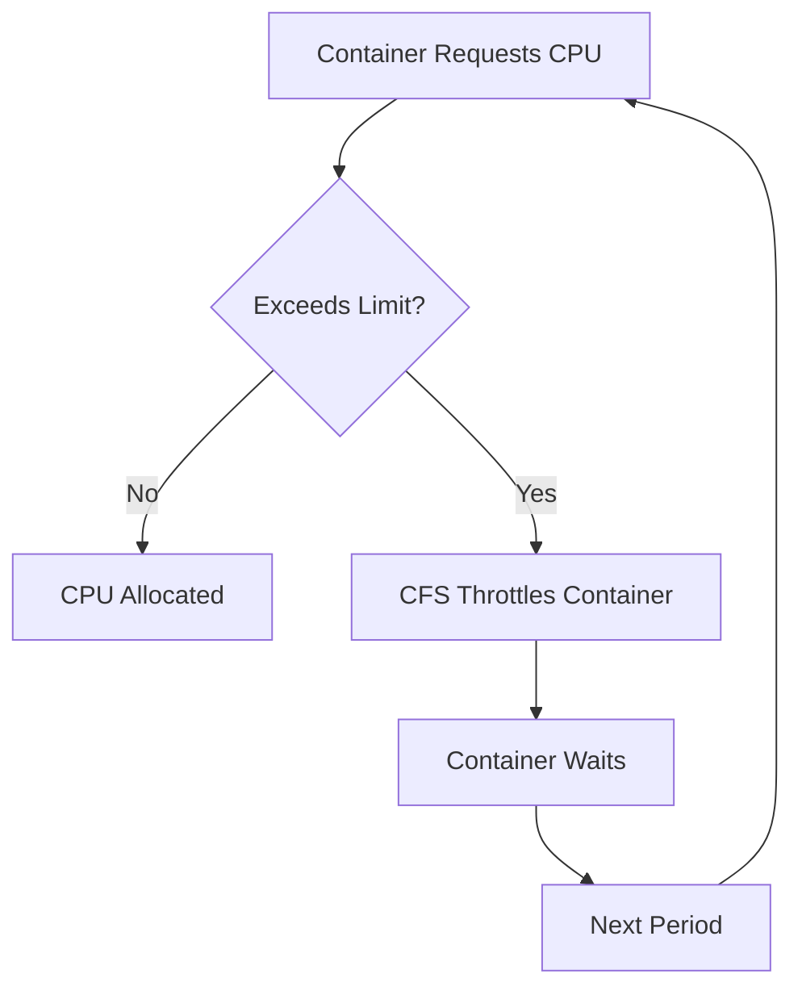

# How to Configure Pod CPU Throttling Alerts

Author: [nawazdhandala](https://www.github.com/nawazdhandala)

Tags: Kubernetes, CPU Throttling, Monitoring, Prometheus, Alerts, Performance

Description: Learn how to detect and alert on CPU throttling in Kubernetes pods. This guide covers understanding throttling metrics, configuring Prometheus alerts, and optimizing CPU limits to prevent performance degradation.

---

CPU throttling silently degrades your application performance. A container hitting its CPU limit gets throttled by the kernel, causing latency spikes and timeouts. The tricky part is that your pod looks healthy while users experience slowness. Here is how to detect and alert on throttling before it impacts your users.

## Understanding CPU Throttling

When a container exceeds its CPU limit, Linux CFS (Completely Fair Scheduler) throttles it:



Throttling happens in 100ms periods. If your container uses its quota early, it sits idle until the next period.

## Key Metrics

### container_cpu_cfs_throttled_seconds_total

Total time the container was throttled:

```promql
# Total throttled time
container_cpu_cfs_throttled_seconds_total{container!="", container!="POD"}
```

### container_cpu_cfs_periods_total

Total number of CFS periods:

```promql
# Total periods
container_cpu_cfs_periods_total{container!="", container!="POD"}
```

### container_cpu_cfs_throttled_periods_total

Number of periods where throttling occurred:

```promql
# Throttled periods
container_cpu_cfs_throttled_periods_total{container!="", container!="POD"}
```

## Calculating Throttling Percentage

The key metric is what percentage of periods experienced throttling:

```promql
# Throttling percentage over 5 minutes
100 * (
  rate(container_cpu_cfs_throttled_periods_total{container!="", container!="POD"}[5m])
  /
  rate(container_cpu_cfs_periods_total{container!="", container!="POD"}[5m])
)
```

## Prometheus Alert Rules

### Basic Throttling Alert

```yaml
# prometheus-rules.yaml
apiVersion: monitoring.coreos.com/v1
kind: PrometheusRule
metadata:
  name: cpu-throttling-alerts
  namespace: monitoring
spec:
  groups:
    - name: cpu-throttling
      rules:
        - alert: PodCPUThrottlingHigh
          expr: |
            100 * (
              sum by (namespace, pod, container) (
                rate(container_cpu_cfs_throttled_periods_total{container!="", container!="POD"}[5m])
              )
              /
              sum by (namespace, pod, container) (
                rate(container_cpu_cfs_periods_total{container!="", container!="POD"}[5m])
              )
            ) > 25
          for: 15m
          labels:
            severity: warning
          annotations:
            summary: "High CPU throttling detected"
            description: "Container {{ $labels.container }} in pod {{ $labels.namespace }}/{{ $labels.pod }} is being throttled {{ printf \"%.1f\" $value }}% of the time."
```

### Tiered Throttling Alerts

```yaml
apiVersion: monitoring.coreos.com/v1
kind: PrometheusRule
metadata:
  name: cpu-throttling-tiered
  namespace: monitoring
spec:
  groups:
    - name: cpu-throttling-tiered
      rules:
        # Warning: 25% throttling
        - alert: PodCPUThrottlingWarning
          expr: |
            100 * (
              sum by (namespace, pod, container) (
                rate(container_cpu_cfs_throttled_periods_total{container!=""}[5m])
              )
              /
              sum by (namespace, pod, container) (
                rate(container_cpu_cfs_periods_total{container!=""}[5m])
              )
            ) > 25
          for: 15m
          labels:
            severity: warning
          annotations:
            summary: "Moderate CPU throttling"
            description: "{{ $labels.container }} in {{ $labels.namespace }}/{{ $labels.pod }} throttled {{ printf \"%.1f\" $value }}%"

        # Critical: 50% throttling
        - alert: PodCPUThrottlingCritical
          expr: |
            100 * (
              sum by (namespace, pod, container) (
                rate(container_cpu_cfs_throttled_periods_total{container!=""}[5m])
              )
              /
              sum by (namespace, pod, container) (
                rate(container_cpu_cfs_periods_total{container!=""}[5m])
              )
            ) > 50
          for: 5m
          labels:
            severity: critical
          annotations:
            summary: "Severe CPU throttling"
            description: "{{ $labels.container }} in {{ $labels.namespace }}/{{ $labels.pod }} throttled {{ printf \"%.1f\" $value }}%"
```

### Production-Specific Alert

Only alert on production namespaces:

```yaml
- alert: ProductionPodCPUThrottling
  expr: |
    100 * (
      sum by (namespace, pod, container) (
        rate(container_cpu_cfs_throttled_periods_total{
          container!="",
          namespace=~"production|prod-.*"
        }[5m])
      )
      /
      sum by (namespace, pod, container) (
        rate(container_cpu_cfs_periods_total{
          container!="",
          namespace=~"production|prod-.*"
        }[5m])
      )
    ) > 20
  for: 10m
  labels:
    severity: critical
    team: platform
  annotations:
    summary: "Production pod CPU throttling"
    description: "{{ $labels.pod }} is experiencing {{ printf \"%.1f\" $value }}% CPU throttling"
    runbook_url: "https://wiki.example.com/runbooks/cpu-throttling"
```

## Grafana Dashboard

### Throttling Overview Panel

```json
{
  "title": "CPU Throttling by Pod",
  "type": "timeseries",
  "targets": [
    {
      "expr": "100 * sum by (namespace, pod) (rate(container_cpu_cfs_throttled_periods_total{container!=\"\"}[5m])) / sum by (namespace, pod) (rate(container_cpu_cfs_periods_total{container!=\"\"}[5m]))",
      "legendFormat": "{{ namespace }}/{{ pod }}"
    }
  ],
  "fieldConfig": {
    "defaults": {
      "unit": "percent",
      "thresholds": {
        "mode": "absolute",
        "steps": [
          { "value": 0, "color": "green" },
          { "value": 25, "color": "yellow" },
          { "value": 50, "color": "red" }
        ]
      }
    }
  }
}
```

### Throttled Time Panel

```json
{
  "title": "Time Spent Throttled",
  "type": "timeseries",
  "targets": [
    {
      "expr": "rate(container_cpu_cfs_throttled_seconds_total{container!=\"\"}[5m])",
      "legendFormat": "{{ namespace }}/{{ pod }}/{{ container }}"
    }
  ],
  "fieldConfig": {
    "defaults": {
      "unit": "s"
    }
  }
}
```

## Investigating Throttling

### Find Throttled Pods

```bash
# Query Prometheus for current throttling
kubectl exec -n monitoring prometheus-0 -- promtool query instant \
  http://localhost:9090 \
  '100 * sum by (namespace, pod) (rate(container_cpu_cfs_throttled_periods_total[5m])) / sum by (namespace, pod) (rate(container_cpu_cfs_periods_total[5m])) > 10'
```

### Check Current CPU Usage vs Limits

```bash
# Get CPU limits and current usage
kubectl top pods -n production

# Compare to limits
kubectl get pods -n production -o custom-columns=\
NAME:.metadata.name,\
CPU_REQUEST:.spec.containers[0].resources.requests.cpu,\
CPU_LIMIT:.spec.containers[0].resources.limits.cpu
```

### View cgroup Stats Directly

```bash
# SSH to node and check cgroup stats
cat /sys/fs/cgroup/cpu/kubepods/burstable/pod<pod-uid>/<container-id>/cpu.stat

# Look for:
# nr_periods: Total CFS periods
# nr_throttled: Number of throttled periods
# throttled_time: Total throttled time in nanoseconds
```

## Fixing CPU Throttling

### Option 1: Increase CPU Limits

```yaml
# Before
resources:
  requests:
    cpu: "100m"
  limits:
    cpu: "200m"

# After
resources:
  requests:
    cpu: "100m"
  limits:
    cpu: "500m"  # Increased limit
```

### Option 2: Remove CPU Limits

Some teams remove CPU limits entirely, using only requests:

```yaml
resources:
  requests:
    cpu: "100m"
  # No limits - pod can burst to use available CPU
```

Pros:
- No throttling
- Better utilization of idle CPU

Cons:
- One pod can starve others
- Less predictable performance

### Option 3: Increase Replicas

Spread the load across more pods:

```bash
kubectl scale deployment myapp -n production --replicas=5
```

### Option 4: Optimize Application Code

Profile your application to find CPU hotspots:

```bash
# For Node.js
node --prof app.js

# For Python
python -m cProfile -o profile.stats app.py

# For Go
go tool pprof http://localhost:6060/debug/pprof/profile
```

## Best Practices

### Set Limits Based on Actual Usage

```bash
# Monitor actual CPU usage for a week
kubectl top pods -n production -l app=myapp

# Or query Prometheus
max_over_time(
  rate(container_cpu_usage_seconds_total{
    namespace="production",
    pod=~"myapp.*"
  }[5m])
[7d])
```

Set limits to 2-3x the observed peak.

### Use VPA for Recommendations

```yaml
apiVersion: autoscaling.k8s.io/v1
kind: VerticalPodAutoscaler
metadata:
  name: myapp-vpa
spec:
  targetRef:
    apiVersion: "apps/v1"
    kind: Deployment
    name: myapp
  updatePolicy:
    updateMode: "Off"  # Just recommend, don't apply
```

Check recommendations:

```bash
kubectl describe vpa myapp-vpa
```

### Monitor Request to Limit Ratio

```promql
# Pods where limit is less than 2x request (risk of throttling)
kube_pod_container_resource_limits{resource="cpu"}
  /
kube_pod_container_resource_requests{resource="cpu"}
  < 2
```

### Alert on Sustained High CPU

```yaml
- alert: PodCPUNearLimit
  expr: |
    (
      sum by (namespace, pod, container) (
        rate(container_cpu_usage_seconds_total{container!=""}[5m])
      )
      /
      sum by (namespace, pod, container) (
        kube_pod_container_resource_limits{resource="cpu"}
      )
    ) > 0.9
  for: 15m
  labels:
    severity: warning
  annotations:
    summary: "Pod CPU usage near limit"
    description: "{{ $labels.pod }} is using {{ printf \"%.0f\" $value }}% of its CPU limit"
```

## Runbook Template

When a throttling alert fires:

1. **Identify the pod**: Check which container is throttled
2. **Check current usage**: `kubectl top pod <name>`
3. **Review limits**: `kubectl describe pod <name>`
4. **Check if usage is expected**: Compare to historical baseline
5. **Temporary fix**: Increase limits or scale up
6. **Permanent fix**: Profile and optimize, or adjust limits based on data

```bash
#!/bin/bash
# throttling-debug.sh

POD=$1
NAMESPACE=${2:-default}

echo "=== Pod Resource Configuration ==="
kubectl get pod $POD -n $NAMESPACE -o jsonpath='{range .spec.containers[*]}{.name}: requests={.resources.requests.cpu}, limits={.resources.limits.cpu}{"\n"}{end}'

echo -e "\n=== Current CPU Usage ==="
kubectl top pod $POD -n $NAMESPACE --containers

echo -e "\n=== Recent Events ==="
kubectl get events -n $NAMESPACE --field-selector involvedObject.name=$POD --sort-by='.lastTimestamp' | tail -5
```

---

CPU throttling is often invisible until users complain about latency. Set up alerts before that happens. Monitor throttling percentage, investigate when it exceeds 25%, and either increase limits or optimize your code. Your users will notice the difference even if the metrics look subtle.
