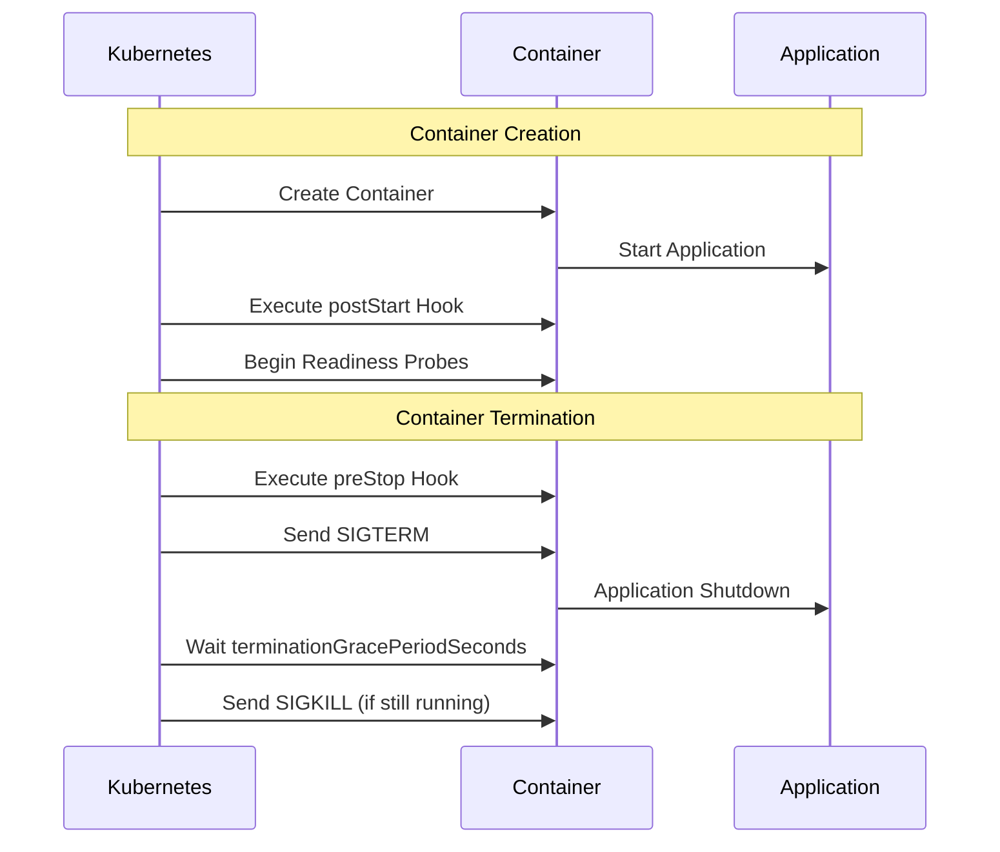

# How to Configure Pod Lifecycle Hooks (preStop, postStart)

Author: [nawazdhandala](https://www.github.com/nawazdhandala)

Tags: Kubernetes, Pod Lifecycle, DevOps, Containers, Graceful Shutdown

Description: Learn how to use Kubernetes lifecycle hooks including preStop and postStart to handle container startup and shutdown gracefully, ensuring zero-downtime deployments and proper resource cleanup.

---

Kubernetes lifecycle hooks give you control over what happens when containers start and stop. The `postStart` hook runs immediately after a container is created, while the `preStop` hook runs before a container terminates. Proper use of these hooks enables graceful shutdowns, connection draining, and initialization tasks that make your applications production-ready.

## Understanding the Pod Lifecycle

When Kubernetes creates or terminates a Pod, several events occur in sequence:



The hooks run in-band with the container lifecycle, meaning:
- `postStart` runs alongside (not after) the container entrypoint
- `preStop` must complete before SIGTERM is sent
- Both hooks block progress until they finish or timeout

## Configuring postStart Hooks

The `postStart` hook is useful for initialization tasks that should not block the main application startup:

```yaml
# deployment-with-poststart.yaml
apiVersion: apps/v1
kind: Deployment
metadata:
  name: web-app
  namespace: production
spec:
  replicas: 3
  selector:
    matchLabels:
      app: web-app
  template:
    metadata:
      labels:
        app: web-app
    spec:
      containers:
        - name: web
          image: myapp/web:2.3.0
          ports:
            - containerPort: 8080
          lifecycle:
            postStart:
              exec:
                command:
                  - /bin/sh
                  - -c
                  # Wait for the application to be ready before registering
                  # with the service discovery system
                  - |
                    until curl -s http://localhost:8080/health; do
                      sleep 1
                    done
                    curl -X POST http://consul:8500/v1/agent/service/register \
                      -d '{"name": "web-app", "port": 8080}'
```

You can also use HTTP hooks for simpler scenarios:

```yaml
# http-poststart-example.yaml
apiVersion: v1
kind: Pod
metadata:
  name: http-hook-demo
spec:
  containers:
    - name: app
      image: myapp:1.0.0
      lifecycle:
        postStart:
          httpGet:
            path: /initialize
            port: 8080
            httpHeaders:
              - name: X-Init-Token
                value: "startup-12345"
```

## Configuring preStop Hooks

The `preStop` hook is critical for graceful shutdowns. It gives your application time to:
- Finish processing in-flight requests
- Deregister from load balancers and service discovery
- Close database connections cleanly
- Flush logs and metrics

```yaml
# deployment-with-prestop.yaml
apiVersion: apps/v1
kind: Deployment
metadata:
  name: api-server
  namespace: production
spec:
  replicas: 5
  selector:
    matchLabels:
      app: api-server
  template:
    metadata:
      labels:
        app: api-server
    spec:
      # Total time allowed for graceful shutdown
      terminationGracePeriodSeconds: 60

      containers:
        - name: api
          image: myapi/server:3.1.0
          ports:
            - containerPort: 8080
          lifecycle:
            preStop:
              exec:
                command:
                  - /bin/sh
                  - -c
                  # Deregister from service discovery and wait for connections to drain
                  - |
                    # Tell the load balancer to stop sending new requests
                    curl -X PUT http://consul:8500/v1/agent/service/deregister/api-server

                    # Wait for existing connections to complete
                    # This gives in-flight requests time to finish
                    sleep 15

                    # Signal the application to start graceful shutdown
                    kill -SIGTERM 1
```

## Connection Draining Pattern

For applications behind a Kubernetes Service, you need to coordinate with the endpoints controller:

```yaml
# nginx-graceful-shutdown.yaml
apiVersion: apps/v1
kind: Deployment
metadata:
  name: nginx-proxy
  namespace: ingress
spec:
  replicas: 3
  selector:
    matchLabels:
      app: nginx-proxy
  template:
    metadata:
      labels:
        app: nginx-proxy
    spec:
      terminationGracePeriodSeconds: 30

      containers:
        - name: nginx
          image: nginx:1.24
          ports:
            - containerPort: 80
          lifecycle:
            preStop:
              exec:
                command:
                  - /bin/sh
                  - -c
                  # nginx -s quit initiates graceful shutdown
                  # It stops accepting new connections but processes existing ones
                  - |
                    # Wait for Kubernetes to update endpoints
                    # This delay allows the Service to remove this Pod from rotation
                    sleep 5

                    # Start nginx graceful shutdown
                    nginx -s quit

                    # Wait for workers to finish
                    while pgrep -x nginx > /dev/null; do
                      sleep 1
                    done
          volumeMounts:
            - name: config
              mountPath: /etc/nginx/nginx.conf
              subPath: nginx.conf
      volumes:
        - name: config
          configMap:
            name: nginx-config
```

## Handling Long-Running Requests

When your application processes long-running requests, configure appropriate timeouts:

```yaml
# batch-processor.yaml
apiVersion: apps/v1
kind: Deployment
metadata:
  name: batch-processor
spec:
  replicas: 2
  selector:
    matchLabels:
      app: batch-processor
  template:
    metadata:
      labels:
        app: batch-processor
    spec:
      # Allow up to 5 minutes for batch jobs to complete
      terminationGracePeriodSeconds: 300

      containers:
        - name: processor
          image: batch/processor:1.5.0
          lifecycle:
            preStop:
              exec:
                command:
                  - /bin/sh
                  - -c
                  # Mark the processor as draining and wait for current job
                  - |
                    # Create a marker file that the app checks
                    touch /tmp/shutdown-requested

                    # Wait for the current batch job to complete
                    # The app should check /tmp/shutdown-requested and not start new jobs
                    while [ -f /tmp/job-in-progress ]; do
                      echo "Waiting for batch job to complete..."
                      sleep 5
                    done

                    echo "Batch job completed, shutting down"
```

## Multiple Containers with Hooks

When a Pod has multiple containers, each can have its own lifecycle hooks:

```yaml
# multi-container-hooks.yaml
apiVersion: v1
kind: Pod
metadata:
  name: multi-container-app
spec:
  terminationGracePeriodSeconds: 45

  containers:
    # Main application container
    - name: app
      image: myapp:2.0.0
      lifecycle:
        preStop:
          exec:
            command: ["/app/graceful-shutdown.sh"]

    # Sidecar for logging
    - name: log-forwarder
      image: fluent/fluent-bit:2.1
      lifecycle:
        preStop:
          exec:
            command:
              - /bin/sh
              - -c
              # Flush remaining logs before shutdown
              - |
                # Signal fluent-bit to flush buffers
                kill -SIGUSR1 1
                sleep 10

    # Sidecar for metrics
    - name: metrics-exporter
      image: prom/pushgateway:1.6
      lifecycle:
        preStop:
          exec:
            command:
              - /bin/sh
              - -c
              # Push final metrics before shutdown
              - |
                curl -X POST http://prometheus:9091/api/v1/admin/wipe
                sleep 2
```

## Debugging Lifecycle Hooks

When hooks fail, containers may not start or stop properly. Debug with these techniques:

```bash
# Check events for hook failures
kubectl describe pod api-server-xyz -n production | grep -A10 Events

# View logs during startup (postStart issues)
kubectl logs api-server-xyz -n production --previous

# Test hook commands interactively
kubectl exec -it api-server-xyz -n production -- /bin/sh -c "your-hook-command"

# Monitor termination in real-time
kubectl get pods -n production -w
```

Common issues and solutions:

```yaml
# Problem: Hook timeout causes container kill
# Solution: Increase terminationGracePeriodSeconds
spec:
  terminationGracePeriodSeconds: 120  # Increase from default 30

# Problem: postStart blocks container startup
# Solution: Run initialization asynchronously
lifecycle:
  postStart:
    exec:
      command:
        - /bin/sh
        - -c
        # Run initialization in background so it does not block
        - nohup /init-script.sh &

# Problem: preStop hook not running
# Solution: Ensure the command exists and is executable
lifecycle:
  preStop:
    exec:
      command:
        - /bin/sh
        - -c
        # Use shell to handle missing commands gracefully
        - |
          if command -v custom-shutdown; then
            custom-shutdown
          else
            sleep 10
          fi
```

## Best Practices

1. **Keep hooks fast**: Hooks should complete quickly. Offload long operations to the application.

2. **Handle hook failures**: A failed postStart hook prevents the container from running. Make hooks resilient.

3. **Coordinate with probes**: The preStop hook runs before probes fail. Use the sleep delay to allow endpoint removal.

4. **Test termination**: Regularly test `kubectl delete pod` to verify graceful shutdown works.

5. **Log hook execution**: Add logging to hooks for debugging failed deployments.

```yaml
# Example with logging
lifecycle:
  preStop:
    exec:
      command:
        - /bin/sh
        - -c
        - |
          echo "$(date): preStop hook started" >> /var/log/lifecycle.log
          /app/shutdown.sh
          echo "$(date): preStop hook completed" >> /var/log/lifecycle.log
```

---

Lifecycle hooks are essential for production Kubernetes deployments. The `preStop` hook ensures graceful shutdowns that prevent dropped connections and lost work. The `postStart` hook handles initialization that should run after the container starts. Combined with appropriate `terminationGracePeriodSeconds` values, these hooks make your applications resilient during deployments, scaling events, and node maintenance.
