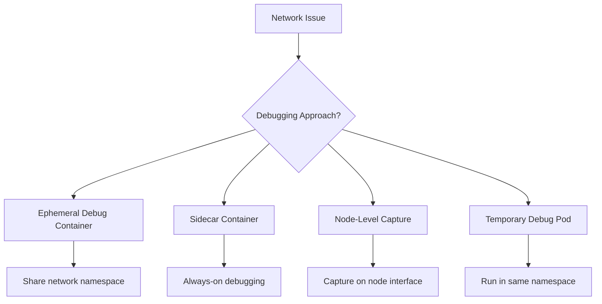

# How to Configure Pod Network Debugging with tcpdump

Author: [nawazdhandala](https://www.github.com/nawazdhandala)

Tags: Kubernetes, Networking, tcpdump, Debugging, Troubleshooting

Description: Learn how to capture and analyze network traffic in Kubernetes pods using tcpdump, including ephemeral debug containers, sidecar approaches, and interpreting packet captures for troubleshooting.

---

Network issues in Kubernetes can be notoriously difficult to debug. Connections timeout, packets disappear, and services fail to communicate for unclear reasons. tcpdump is a powerful tool for capturing and analyzing network traffic at the packet level. This guide shows you how to use tcpdump effectively within Kubernetes pods.

## The Challenge of Network Debugging in Kubernetes

Standard Kubernetes pods do not include tcpdump or similar debugging tools. You have several options:



## Method 1: Ephemeral Debug Containers

Kubernetes 1.25+ supports ephemeral containers for debugging running pods:

```bash
# Add a debug container to a running pod
# This container shares the network namespace of the target container
kubectl debug -it my-app-xyz -n production \
  --image=nicolaka/netshoot \
  --target=my-app \
  -- tcpdump -i any -n port 8080

# The --target flag ensures network namespace sharing
# -i any captures on all interfaces
# -n skips DNS lookups for faster output
# port 8080 filters for specific traffic
```

The netshoot image includes tcpdump, curl, dig, and many other networking tools.

## Method 2: Debug Pod with Host Network

For capturing traffic on the node level:

```yaml
# debug-pod.yaml
apiVersion: v1
kind: Pod
metadata:
  name: network-debug
  namespace: production
spec:
  # Use host network to see all node traffic
  hostNetwork: true
  # Schedule on a specific node
  nodeName: worker-1

  containers:
    - name: debug
      image: nicolaka/netshoot
      command: ["sleep", "3600"]
      securityContext:
        capabilities:
          add:
            - NET_ADMIN
            - NET_RAW
```

```bash
# Create the debug pod
kubectl apply -f debug-pod.yaml

# Exec into it and run tcpdump
kubectl exec -it network-debug -n production -- tcpdump -i eth0 -n host 10.244.1.5

# Filter for specific pod IP
# Find pod IP first
kubectl get pod my-app-xyz -n production -o jsonpath='{.status.podIP}'
```

## Method 3: Sidecar Debug Container

For persistent debugging capability, add a sidecar to your deployment:

```yaml
# deployment-with-debug-sidecar.yaml
apiVersion: apps/v1
kind: Deployment
metadata:
  name: my-app
  namespace: production
spec:
  replicas: 2
  selector:
    matchLabels:
      app: my-app
  template:
    metadata:
      labels:
        app: my-app
    spec:
      containers:
        # Main application container
        - name: app
          image: myapp:1.5.0
          ports:
            - containerPort: 8080

        # Debug sidecar - shares network namespace
        - name: debug
          image: nicolaka/netshoot
          command: ["sleep", "infinity"]
          securityContext:
            capabilities:
              add:
                - NET_ADMIN
                - NET_RAW
          # Minimal resources for debug container
          resources:
            requests:
              cpu: "10m"
              memory: "32Mi"
            limits:
              cpu: "100m"
              memory: "128Mi"
```

Access the debug sidecar:

```bash
# Exec into the debug container
kubectl exec -it my-app-xyz -n production -c debug -- /bin/bash

# Now run tcpdump
tcpdump -i any -n port 8080
```

## Basic tcpdump Commands

Common tcpdump patterns for Kubernetes debugging:

```bash
# Capture all traffic on all interfaces
tcpdump -i any -n

# Capture traffic for a specific port
tcpdump -i any -n port 8080

# Capture traffic for a specific host
tcpdump -i any -n host 10.244.1.5

# Capture only TCP traffic
tcpdump -i any -n tcp

# Capture HTTP traffic (port 80 or 8080)
tcpdump -i any -n 'port 80 or port 8080'

# Capture DNS queries
tcpdump -i any -n port 53

# Show packet contents in ASCII
tcpdump -i any -n -A port 8080

# Show packet contents in hex and ASCII
tcpdump -i any -n -X port 8080

# Capture to a file for later analysis
tcpdump -i any -n -w /tmp/capture.pcap port 8080

# Read from a capture file
tcpdump -r /tmp/capture.pcap

# Limit capture to N packets
tcpdump -i any -n -c 100 port 8080

# Capture with timestamps
tcpdump -i any -n -tttt port 8080
```

## Debugging Common Network Issues

### Service Connection Timeouts

When a pod cannot reach a service:

```bash
# Check if DNS resolution works
kubectl exec -it my-app-xyz -n production -c debug -- nslookup database-svc

# Capture DNS traffic
kubectl exec -it my-app-xyz -n production -c debug -- \
  tcpdump -i any -n port 53

# Capture traffic to the service
kubectl exec -it my-app-xyz -n production -c debug -- \
  tcpdump -i any -n host database-svc.production.svc.cluster.local
```

### Connection Reset Issues

When connections are being reset:

```bash
# Look for RST packets
kubectl exec -it my-app-xyz -n production -c debug -- \
  tcpdump -i any -n 'tcp[tcpflags] & (tcp-rst) != 0'

# Capture full handshake attempts
kubectl exec -it my-app-xyz -n production -c debug -- \
  tcpdump -i any -n 'tcp[tcpflags] & (tcp-syn|tcp-fin|tcp-rst) != 0' port 8080
```

### Ingress Traffic Issues

Debug traffic coming through the Ingress:

```bash
# On the ingress controller pod
kubectl exec -it ingress-nginx-controller-xyz -n ingress-nginx -- \
  tcpdump -i any -n port 80 or port 443

# Filter for specific host header (HTTP)
kubectl exec -it ingress-nginx-controller-xyz -n ingress-nginx -- \
  tcpdump -i any -n -A port 80 | grep -i "Host:"
```

### Pod-to-Pod Communication

Debug traffic between pods:

```bash
# Get pod IPs
SRC_IP=$(kubectl get pod source-pod -n production -o jsonpath='{.status.podIP}')
DST_IP=$(kubectl get pod dest-pod -n production -o jsonpath='{.status.podIP}')

# Capture traffic between the pods
kubectl exec -it source-pod -n production -c debug -- \
  tcpdump -i any -n host $DST_IP
```

## Analyzing Captures with Wireshark

For complex analysis, export captures and use Wireshark:

```bash
# Capture to a file inside the pod
kubectl exec -it my-app-xyz -n production -c debug -- \
  tcpdump -i any -n -w /tmp/capture.pcap -c 1000 port 8080

# Copy the capture file locally
kubectl cp production/my-app-xyz:/tmp/capture.pcap ./capture.pcap -c debug

# Open in Wireshark
wireshark ./capture.pcap
```

## Capturing Encrypted Traffic

For HTTPS traffic, you cannot see the payload but can still analyze connection patterns:

```bash
# See TLS handshake
kubectl exec -it my-app-xyz -n production -c debug -- \
  tcpdump -i any -n port 443

# Filter for TLS client hello
kubectl exec -it my-app-xyz -n production -c debug -- \
  tcpdump -i any -n 'tcp port 443 and (tcp[((tcp[12] & 0xf0) >> 2)] = 0x16)'
```

To inspect decrypted traffic, you need to capture at the application level or use a service mesh with debug capabilities.

## Network Policy Debugging

When network policies might be blocking traffic:

```bash
# Capture all traffic and look for what is missing
kubectl exec -it my-app-xyz -n production -c debug -- \
  tcpdump -i any -n

# Check if SYN packets are being sent
kubectl exec -it my-app-xyz -n production -c debug -- \
  tcpdump -i any -n 'tcp[tcpflags] & tcp-syn != 0' host $TARGET_IP

# If you see SYN but no SYN-ACK, traffic might be blocked
```

## Automated Capture Script

Create a script for quick network debugging:

```bash
#!/bin/bash
# network-debug.sh
# Usage: ./network-debug.sh <pod-name> <namespace> <filter>

POD=$1
NS=${2:-default}
FILTER=${3:-"port 8080"}
DURATION=${4:-60}

echo "Starting network capture on $POD in $NS"
echo "Filter: $FILTER"
echo "Duration: ${DURATION}s"

# Add ephemeral debug container and capture
kubectl debug -it $POD -n $NS \
  --image=nicolaka/netshoot \
  --target=$(kubectl get pod $POD -n $NS -o jsonpath='{.spec.containers[0].name}') \
  -- timeout $DURATION tcpdump -i any -n $FILTER

echo "Capture complete"
```

## Best Practices

1. **Use filters**: Always filter captures to avoid overwhelming output and performance impact.

2. **Limit capture duration**: Use `-c` for packet count or timeout to avoid filling disk.

3. **Capture on both ends**: When debugging connection issues, capture on both source and destination.

4. **Remove debug containers**: Clean up debug pods and sidecars after troubleshooting.

5. **Document findings**: Save captures and notes for future reference.

```bash
# Clean up debug pods
kubectl delete pod network-debug -n production

# Remove sidecar by editing deployment
kubectl edit deployment my-app -n production
```

---

Network debugging in Kubernetes requires getting tcpdump into the right network namespace. Ephemeral debug containers are the cleanest approach for one-time debugging, while sidecars work well for persistent debugging capability. With packet captures, you can see exactly what is happening on the wire, making it much easier to diagnose connection timeouts, reset errors, and routing issues.
