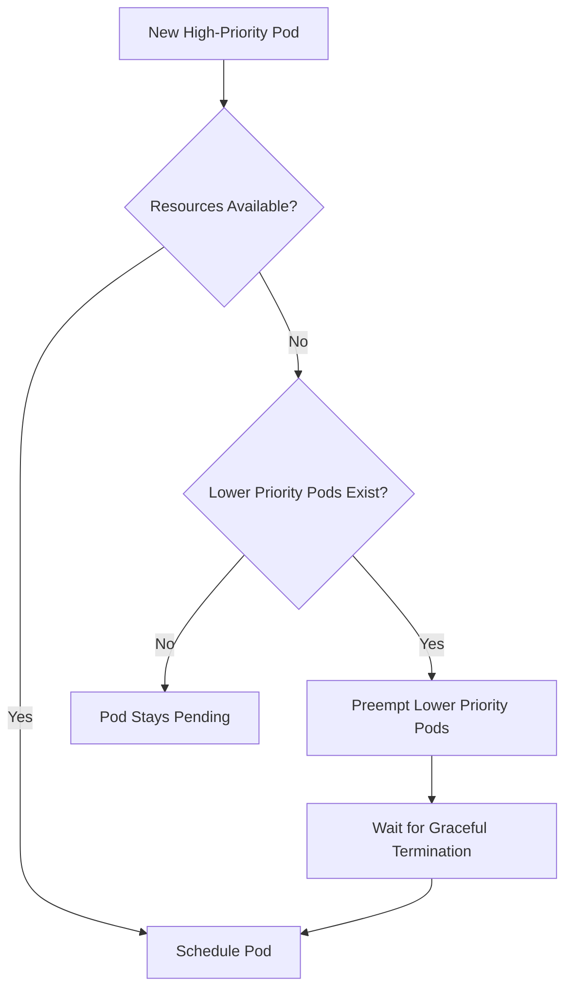

# How to Configure Pod Priority and Preemption in Kubernetes

Author: [nawazdhandala](https://www.github.com/nawazdhandala)

Tags: Kubernetes, Pod Priority, Preemption, Scheduling, Resource Management, DevOps

Description: Learn how to configure pod priority and preemption in Kubernetes to ensure critical workloads get scheduled first. This guide covers PriorityClasses, preemption behavior, and best practices for production clusters.

---

When your cluster runs low on resources, which pods should be evicted to make room for new ones? Pod priority and preemption give you control over this decision. Critical workloads can preempt less important ones, ensuring your production services always have the resources they need.

## How Priority and Preemption Work

When a high-priority pod cannot be scheduled due to insufficient resources, Kubernetes can evict (preempt) lower-priority pods to make room.



## Creating PriorityClasses

PriorityClasses define priority levels for pods. Higher values mean higher priority.

### System Priority Classes

Kubernetes includes built-in priority classes:

```bash
kubectl get priorityclasses

# Output:
# NAME                      VALUE        GLOBAL-DEFAULT
# system-cluster-critical   2000000000   false
# system-node-critical      2000001000   false
```

These are reserved for system components. Do not use them for application workloads.

### Creating Custom PriorityClasses

Define priority classes for your workloads:

```yaml
# priority-classes.yaml

# Critical production workloads
apiVersion: scheduling.k8s.io/v1
kind: PriorityClass
metadata:
  name: production-critical
value: 1000000
globalDefault: false
preemptionPolicy: PreemptLowerPriority
description: "Critical production workloads that must always run"
---
# Standard production workloads
apiVersion: scheduling.k8s.io/v1
kind: PriorityClass
metadata:
  name: production-standard
value: 100000
globalDefault: false
preemptionPolicy: PreemptLowerPriority
description: "Standard production workloads"
---
# Background and batch jobs
apiVersion: scheduling.k8s.io/v1
kind: PriorityClass
metadata:
  name: batch-processing
value: 10000
globalDefault: false
preemptionPolicy: PreemptLowerPriority
description: "Batch jobs and background processing"
---
# Development and testing
apiVersion: scheduling.k8s.io/v1
kind: PriorityClass
metadata:
  name: development
value: 1000
globalDefault: false
preemptionPolicy: Never  # Never preempt other pods
description: "Development and testing workloads"
---
# Default for pods without explicit priority
apiVersion: scheduling.k8s.io/v1
kind: PriorityClass
metadata:
  name: default-priority
value: 5000
globalDefault: true  # Applied to pods without priorityClassName
preemptionPolicy: PreemptLowerPriority
description: "Default priority for unspecified workloads"
```

Apply the priority classes:

```bash
kubectl apply -f priority-classes.yaml

# Verify
kubectl get priorityclasses
```

## Using PriorityClasses in Pods

Assign priority to your workloads using `priorityClassName`:

### Critical API Service

```yaml
apiVersion: apps/v1
kind: Deployment
metadata:
  name: api-gateway
  namespace: production
spec:
  replicas: 3
  selector:
    matchLabels:
      app: api-gateway
  template:
    metadata:
      labels:
        app: api-gateway
    spec:
      priorityClassName: production-critical
      containers:
        - name: api-gateway
          image: api-gateway:1.0.0
          ports:
            - containerPort: 8080
          resources:
            requests:
              memory: "512Mi"
              cpu: "250m"
            limits:
              memory: "1Gi"
              cpu: "500m"
```

### Batch Processing Job

```yaml
apiVersion: batch/v1
kind: Job
metadata:
  name: data-export
  namespace: batch
spec:
  template:
    spec:
      priorityClassName: batch-processing
      restartPolicy: OnFailure
      containers:
        - name: exporter
          image: data-exporter:1.0.0
          resources:
            requests:
              memory: "2Gi"
              cpu: "1000m"
```

### Development Workload

```yaml
apiVersion: apps/v1
kind: Deployment
metadata:
  name: dev-environment
  namespace: development
spec:
  replicas: 1
  selector:
    matchLabels:
      app: dev-environment
  template:
    metadata:
      labels:
        app: dev-environment
    spec:
      priorityClassName: development
      containers:
        - name: dev
          image: dev-environment:latest
          resources:
            requests:
              memory: "4Gi"
              cpu: "2000m"
```

## Preemption Policies

Control whether pods can preempt others.

### PreemptLowerPriority (Default)

The pod can preempt lower-priority pods when resources are scarce:

```yaml
apiVersion: scheduling.k8s.io/v1
kind: PriorityClass
metadata:
  name: can-preempt
value: 100000
preemptionPolicy: PreemptLowerPriority
```

### Never

The pod will never preempt others. It waits in the queue:

```yaml
apiVersion: scheduling.k8s.io/v1
kind: PriorityClass
metadata:
  name: no-preemption
value: 100000
preemptionPolicy: Never
```

Use `Never` for workloads that should not disrupt others, even if they have high priority.

## Real-World Priority Hierarchy

Here is a practical priority structure:

```yaml
# Complete priority hierarchy
---
# Tier 1: Revenue-critical (value: 1000000)
apiVersion: scheduling.k8s.io/v1
kind: PriorityClass
metadata:
  name: tier1-revenue-critical
value: 1000000
preemptionPolicy: PreemptLowerPriority
description: "Payment processing, checkout, core APIs"
---
# Tier 2: User-facing (value: 500000)
apiVersion: scheduling.k8s.io/v1
kind: PriorityClass
metadata:
  name: tier2-user-facing
value: 500000
preemptionPolicy: PreemptLowerPriority
description: "User-facing services, web frontends"
---
# Tier 3: Internal services (value: 100000)
apiVersion: scheduling.k8s.io/v1
kind: PriorityClass
metadata:
  name: tier3-internal
value: 100000
preemptionPolicy: PreemptLowerPriority
description: "Internal APIs, admin dashboards"
---
# Tier 4: Background processing (value: 10000)
apiVersion: scheduling.k8s.io/v1
kind: PriorityClass
metadata:
  name: tier4-background
value: 10000
preemptionPolicy: PreemptLowerPriority
description: "Async workers, report generation"
---
# Tier 5: Best effort (value: 1000)
apiVersion: scheduling.k8s.io/v1
kind: PriorityClass
metadata:
  name: tier5-best-effort
value: 1000
preemptionPolicy: Never
description: "Can be evicted anytime, dev/test workloads"
```

## Protecting Pods from Preemption

Use PodDisruptionBudgets to limit how many pods can be preempted at once:

```yaml
apiVersion: policy/v1
kind: PodDisruptionBudget
metadata:
  name: api-gateway-pdb
  namespace: production
spec:
  minAvailable: 2  # At least 2 pods must remain
  selector:
    matchLabels:
      app: api-gateway
```

This does not prevent preemption entirely but ensures gradual eviction.

## Monitoring Preemption Events

Watch for preemption in cluster events:

```bash
# Watch preemption events
kubectl get events --field-selector reason=Preempted -A

# Check why a pod was preempted
kubectl describe pod <pod-name> -n <namespace>

# Look for events like:
# "Preempted by <namespace>/<pod-name> on node <node>"
```

Create alerts for unexpected preemptions:

```yaml
# Prometheus alert rule
groups:
  - name: preemption-alerts
    rules:
      - alert: HighPriorityPodPreempted
        expr: |
          increase(kube_pod_status_reason{reason="Preempted"}[5m]) > 0
        for: 1m
        labels:
          severity: warning
        annotations:
          summary: "Pod was preempted"
          description: "Pod {{ $labels.pod }} was preempted in namespace {{ $labels.namespace }}"
```

## Testing Priority and Preemption

### Test Setup

Create a scenario where preemption occurs:

```bash
# 1. Fill the cluster with low-priority pods
cat <<EOF | kubectl apply -f -
apiVersion: apps/v1
kind: Deployment
metadata:
  name: low-priority-filler
  namespace: default
spec:
  replicas: 10
  selector:
    matchLabels:
      app: filler
  template:
    metadata:
      labels:
        app: filler
    spec:
      priorityClassName: tier5-best-effort
      containers:
        - name: pause
          image: registry.k8s.io/pause:3.9
          resources:
            requests:
              memory: "512Mi"
              cpu: "250m"
EOF

# 2. Wait for all pods to be running
kubectl wait --for=condition=Available deployment/low-priority-filler

# 3. Deploy a high-priority pod that needs resources
cat <<EOF | kubectl apply -f -
apiVersion: v1
kind: Pod
metadata:
  name: high-priority-test
  namespace: default
spec:
  priorityClassName: tier1-revenue-critical
  containers:
    - name: nginx
      image: nginx
      resources:
        requests:
          memory: "1Gi"
          cpu: "500m"
EOF

# 4. Watch preemption happen
kubectl get events -w --field-selector reason=Preempted
kubectl get pods -w
```

### Verify Preemption Behavior

```bash
# Check which pods were preempted
kubectl get pods -o wide

# View pod priority
kubectl get pods -o custom-columns=\
NAME:.metadata.name,\
PRIORITY:.spec.priority,\
PRIORITY_CLASS:.spec.priorityClassName,\
STATUS:.status.phase
```

## Best Practices

### Priority Value Guidelines

```
2000000000 - system-node-critical (reserved)
2000000000 - system-cluster-critical (reserved)
1000000    - Revenue-critical production
500000     - User-facing production
100000     - Internal services
10000      - Background processing
5000       - Default (globalDefault: true)
1000       - Development/Testing
```

### Do Not Over-Prioritize

If everything is critical, nothing is critical:

```bash
# Check priority distribution
kubectl get pods -A -o custom-columns=\
NAMESPACE:.metadata.namespace,\
NAME:.metadata.name,\
PRIORITY:.spec.priority | sort -k3 -n -r | head -20
```

### Combine with Resource Quotas

Limit how many high-priority pods each namespace can run:

```yaml
apiVersion: v1
kind: ResourceQuota
metadata:
  name: priority-quota
  namespace: development
spec:
  hard:
    pods: "10"
  scopeSelector:
    matchExpressions:
      - operator: In
        scopeName: PriorityClass
        values:
          - production-critical
          - production-standard
```

### Document Priority Decisions

Keep a record of why each workload has its priority:

```yaml
apiVersion: apps/v1
kind: Deployment
metadata:
  name: payment-processor
  annotations:
    priority-reason: "Revenue-critical: Handles all payment transactions"
    priority-approved-by: "platform-team"
    priority-review-date: "2026-01-25"
```

---

Pod priority and preemption ensure your most important workloads always have resources. Define clear priority tiers, use preemption policies wisely, and monitor for unexpected evictions. When the cluster gets busy, your critical services will thank you.
