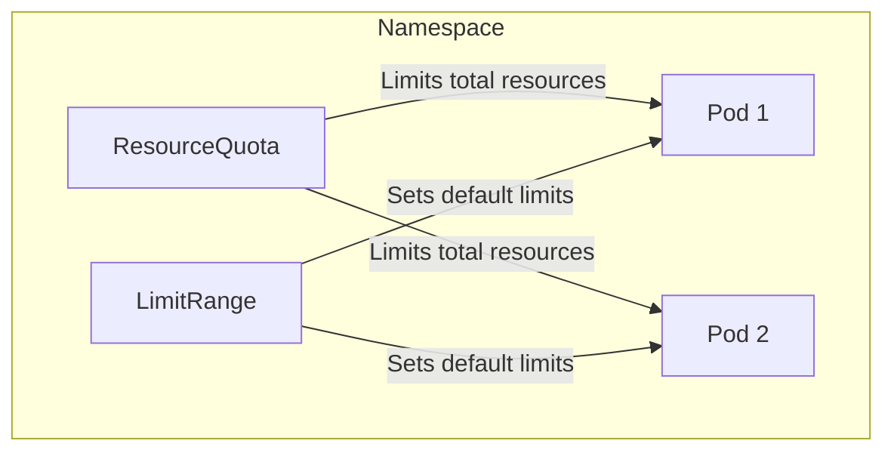

# How to Configure Pod Resource Quotas

Author: [nawazdhandala](https://www.github.com/nawazdhandala)

Tags: Kubernetes, Resource Quotas, Capacity Planning, DevOps, Multi-tenancy

Description: Learn how to configure Kubernetes ResourceQuotas and LimitRanges to control resource consumption, enforce fair usage across namespaces, and prevent resource exhaustion in multi-tenant clusters.

---

Resource quotas in Kubernetes let you limit the total amount of compute resources and object counts within a namespace. Combined with LimitRanges, they form a complete system for preventing resource exhaustion and ensuring fair allocation in multi-tenant environments.

## Understanding Resource Management

Kubernetes provides three mechanisms for resource control:



- **Resource requests**: Guaranteed minimum resources for a container
- **Resource limits**: Maximum resources a container can use
- **ResourceQuota**: Namespace-wide totals for resources and objects
- **LimitRange**: Default and min/max limits for individual pods/containers

## Creating a ResourceQuota

Define quotas for compute resources and object counts:

```yaml
# resource-quota.yaml
apiVersion: v1
kind: ResourceQuota
metadata:
  name: team-quota
  namespace: team-alpha
spec:
  hard:
    # Compute resources
    requests.cpu: "20"           # Total CPU requests across all pods
    requests.memory: "40Gi"      # Total memory requests
    limits.cpu: "40"             # Total CPU limits
    limits.memory: "80Gi"        # Total memory limits

    # Storage resources
    requests.storage: "500Gi"    # Total PVC storage requests
    persistentvolumeclaims: "20" # Maximum number of PVCs

    # Object counts
    pods: "50"                   # Maximum number of pods
    services: "20"               # Maximum number of services
    secrets: "100"               # Maximum number of secrets
    configmaps: "100"            # Maximum number of ConfigMaps
    replicationcontrollers: "10"
    services.loadbalancers: "2"  # Limit expensive load balancer services
    services.nodeports: "5"      # Limit NodePort services
```

Apply the quota:

```bash
# Create the namespace if it does not exist
kubectl create namespace team-alpha

# Apply the ResourceQuota
kubectl apply -f resource-quota.yaml

# Verify the quota
kubectl describe resourcequota team-quota -n team-alpha
```

## Configuring LimitRange

LimitRange sets default limits and constraints for individual containers:

```yaml
# limit-range.yaml
apiVersion: v1
kind: LimitRange
metadata:
  name: default-limits
  namespace: team-alpha
spec:
  limits:
    # Container-level defaults and limits
    - type: Container
      # Default limits applied if not specified
      default:
        cpu: "500m"
        memory: "512Mi"
      # Default requests applied if not specified
      defaultRequest:
        cpu: "100m"
        memory: "128Mi"
      # Maximum allowed limits
      max:
        cpu: "4"
        memory: "8Gi"
      # Minimum required requests
      min:
        cpu: "50m"
        memory: "64Mi"
      # Maximum ratio of limit to request
      maxLimitRequestRatio:
        cpu: "10"          # Limit can be at most 10x the request
        memory: "4"        # Limit can be at most 4x the request

    # Pod-level limits (sum of all containers)
    - type: Pod
      max:
        cpu: "8"
        memory: "16Gi"
      min:
        cpu: "100m"
        memory: "128Mi"

    # PVC storage limits
    - type: PersistentVolumeClaim
      max:
        storage: "100Gi"
      min:
        storage: "1Gi"
```

Apply the LimitRange:

```bash
kubectl apply -f limit-range.yaml

# Verify the limits
kubectl describe limitrange default-limits -n team-alpha
```

## How Quotas Affect Deployments

When a ResourceQuota is active, pods must specify resource requests and limits:

```yaml
# deployment-with-resources.yaml
apiVersion: apps/v1
kind: Deployment
metadata:
  name: api-server
  namespace: team-alpha
spec:
  replicas: 3
  selector:
    matchLabels:
      app: api-server
  template:
    metadata:
      labels:
        app: api-server
    spec:
      containers:
        - name: api
          image: myapi:1.5.0
          # Must specify resources when ResourceQuota exists
          resources:
            requests:
              cpu: "200m"
              memory: "256Mi"
            limits:
              cpu: "1"
              memory: "1Gi"
```

Without resource specifications, the LimitRange defaults apply. Without either, pods are rejected when a compute quota exists.

## Scoped Resource Quotas

Apply quotas only to specific types of pods:

```yaml
# scoped-quota.yaml
apiVersion: v1
kind: ResourceQuota
metadata:
  name: high-priority-quota
  namespace: team-alpha
spec:
  hard:
    cpu: "10"
    memory: "20Gi"
  # Only applies to pods with PriorityClass "high"
  scopeSelector:
    matchExpressions:
      - scopeName: PriorityClass
        operator: In
        values:
          - high
---
apiVersion: v1
kind: ResourceQuota
metadata:
  name: best-effort-quota
  namespace: team-alpha
spec:
  hard:
    pods: "10"
  # Only applies to BestEffort QoS pods (no resource limits)
  scopes:
    - BestEffort
---
apiVersion: v1
kind: ResourceQuota
metadata:
  name: terminating-quota
  namespace: team-alpha
spec:
  hard:
    pods: "5"
  # Only applies to pods that are terminating
  scopes:
    - Terminating
```

## Monitoring Quota Usage

Track how much of your quota is being used:

```bash
# View quota usage
kubectl describe resourcequota team-quota -n team-alpha

# Output shows used vs hard limits:
# Name:                   team-quota
# Namespace:              team-alpha
# Resource                Used   Hard
# --------                ----   ----
# limits.cpu              12     40
# limits.memory           24Gi   80Gi
# pods                    15     50
# requests.cpu            4      20
# requests.memory         8Gi    40Gi
```

Create a script to monitor quota usage across namespaces:

```bash
#!/bin/bash
# quota-report.sh
# Generate a quota usage report for all namespaces

echo "Namespace Quota Usage Report"
echo "============================"

for ns in $(kubectl get namespaces -o jsonpath='{.items[*].metadata.name}'); do
    quota=$(kubectl get resourcequota -n $ns -o jsonpath='{.items[*].metadata.name}' 2>/dev/null)
    if [ -n "$quota" ]; then
        echo ""
        echo "Namespace: $ns"
        kubectl describe resourcequota -n $ns | grep -A 100 "Resource"
    fi
done
```

## Quota for Different Environments

Set different quotas for different environments:

```yaml
# production-quota.yaml
apiVersion: v1
kind: ResourceQuota
metadata:
  name: production-quota
  namespace: production
spec:
  hard:
    # Higher limits for production
    requests.cpu: "100"
    requests.memory: "200Gi"
    limits.cpu: "200"
    limits.memory: "400Gi"
    pods: "200"
    persistentvolumeclaims: "100"
---
# staging-quota.yaml
apiVersion: v1
kind: ResourceQuota
metadata:
  name: staging-quota
  namespace: staging
spec:
  hard:
    # Lower limits for staging
    requests.cpu: "20"
    requests.memory: "40Gi"
    limits.cpu: "40"
    limits.memory: "80Gi"
    pods: "50"
    persistentvolumeclaims: "20"
---
# development-quota.yaml
apiVersion: v1
kind: ResourceQuota
metadata:
  name: development-quota
  namespace: development
spec:
  hard:
    # Minimal limits for development
    requests.cpu: "10"
    requests.memory: "20Gi"
    limits.cpu: "20"
    limits.memory: "40Gi"
    pods: "30"
    persistentvolumeclaims: "10"
    # Prevent expensive resources in dev
    services.loadbalancers: "0"
```

## Handling Quota Exceeded Errors

When quotas are exceeded, Kubernetes rejects new pods:

```bash
# Check events for quota errors
kubectl get events -n team-alpha | grep -i quota

# Common error:
# Error creating: pods "api-server-xyz" is forbidden: exceeded quota: team-quota,
# requested: requests.cpu=200m, used: requests.cpu=19900m, limited: requests.cpu=20
```

Solutions:
1. Reduce resource requests in existing deployments
2. Scale down replicas
3. Request a quota increase
4. Move workloads to a different namespace

## Cross-Namespace Quota Management

For cluster administrators managing multiple teams:

```yaml
# cluster-resource-quota.yaml (OpenShift style, not native K8s)
# For native K8s, create ResourceQuotas in each namespace
apiVersion: v1
kind: List
items:
  - apiVersion: v1
    kind: Namespace
    metadata:
      name: team-alpha
      labels:
        team: alpha
  - apiVersion: v1
    kind: ResourceQuota
    metadata:
      name: standard-quota
      namespace: team-alpha
    spec:
      hard:
        requests.cpu: "20"
        requests.memory: "40Gi"
        limits.cpu: "40"
        limits.memory: "80Gi"
```

## Best Practices

1. **Always set LimitRange with ResourceQuota**: Ensures pods have default limits even if developers forget.

2. **Start conservative, adjust as needed**: Begin with lower quotas and increase based on actual usage.

3. **Monitor quota usage regularly**: Set up alerts when usage exceeds 80% of quota.

4. **Use scoped quotas for priority classes**: Allow more resources for critical workloads.

5. **Document quota allocations**: Maintain a record of why each team has specific quotas.

```yaml
# Example: Annotate quotas with justification
apiVersion: v1
kind: ResourceQuota
metadata:
  name: team-quota
  namespace: team-alpha
  annotations:
    description: "Quota for Team Alpha based on Q1 2026 capacity planning"
    approved-by: "platform-team"
    approved-date: "2026-01-15"
spec:
  hard:
    requests.cpu: "20"
    requests.memory: "40Gi"
```

---

Resource quotas are essential for running multi-tenant Kubernetes clusters. They prevent any single team or application from consuming all cluster resources, ensure fair allocation, and provide predictable capacity for planning. Combine ResourceQuotas with LimitRanges for complete control over resource consumption at both the namespace and container level.
