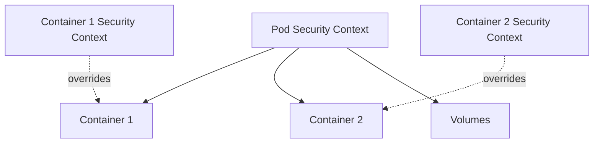

# How to Configure Pod Security Context

Author: [nawazdhandala](https://www.github.com/nawazdhandala)

Tags: Kubernetes, Security, Pod Security, DevOps, Hardening

Description: Learn how to configure Pod and container security contexts in Kubernetes to run workloads with least privilege, including user/group settings, capability dropping, and read-only filesystems.

---

Security contexts define privilege and access control settings for Pods and containers. By configuring them properly, you enforce the principle of least privilege, reducing the attack surface if a container is compromised. This guide covers both Pod-level and container-level security settings.

## Understanding Security Context Scope

Security contexts can be set at two levels:

- **Pod-level**: Applies to all containers in the Pod and also affects volumes
- **Container-level**: Applies to a specific container and overrides Pod-level settings



## Basic Security Context Configuration

Start with a minimal security context that most applications can use:

```yaml
# secure-deployment.yaml
apiVersion: apps/v1
kind: Deployment
metadata:
  name: secure-app
  namespace: production
spec:
  replicas: 3
  selector:
    matchLabels:
      app: secure-app
  template:
    metadata:
      labels:
        app: secure-app
    spec:
      # Pod-level security context
      securityContext:
        # Run all containers as this non-root user
        runAsUser: 1000
        # Run all containers as this group
        runAsGroup: 1000
        # All processes also get this supplementary group
        fsGroup: 1000
        # Ensure containers cannot run as root
        runAsNonRoot: true

      containers:
        - name: app
          image: myapp:2.0.0
          ports:
            - containerPort: 8080

          # Container-level security context
          securityContext:
            # Prevent privilege escalation
            allowPrivilegeEscalation: false
            # Make root filesystem read-only
            readOnlyRootFilesystem: true
            # Drop all capabilities
            capabilities:
              drop:
                - ALL

          # Provide writable directories where needed
          volumeMounts:
            - name: tmp
              mountPath: /tmp
            - name: cache
              mountPath: /app/cache

      volumes:
        # EmptyDir volumes for writable paths
        - name: tmp
          emptyDir: {}
        - name: cache
          emptyDir: {}
```

## Running as Non-Root User

Running containers as non-root is one of the most important security measures:

```yaml
# non-root-example.yaml
apiVersion: v1
kind: Pod
metadata:
  name: non-root-app
spec:
  securityContext:
    # Specify numeric user ID (not username)
    runAsUser: 10001
    runAsGroup: 10001
    # This enforces the non-root requirement
    # Container will fail to start if image tries to run as root
    runAsNonRoot: true

  containers:
    - name: app
      # Image must support running as non-root
      image: myapp:2.0.0
      securityContext:
        # Double-check at container level
        runAsNonRoot: true
```

If your image requires running as a specific user, ensure the user exists in the image:

```dockerfile
# Dockerfile example for non-root image
FROM node:20-slim

# Create non-root user
RUN groupadd -r appgroup && useradd -r -g appgroup appuser

# Set ownership of app directory
WORKDIR /app
COPY --chown=appuser:appgroup . .

# Switch to non-root user
USER appuser

CMD ["node", "server.js"]
```

## Managing Linux Capabilities

Capabilities provide fine-grained control over privileged operations. Always drop all capabilities and add back only what you need:

```yaml
# capabilities-example.yaml
apiVersion: v1
kind: Pod
metadata:
  name: network-app
spec:
  containers:
    - name: app
      image: network-tool:1.0.0
      securityContext:
        capabilities:
          # Start by dropping all capabilities
          drop:
            - ALL
          # Add back only the minimum required
          add:
            # Needed for binding to ports below 1024
            - NET_BIND_SERVICE
```

Common capabilities and when you might need them:

| Capability | Purpose | When Needed |
|------------|---------|-------------|
| NET_BIND_SERVICE | Bind to ports < 1024 | Web servers on port 80/443 |
| NET_RAW | Use raw sockets | Network diagnostic tools |
| SYS_PTRACE | Trace processes | Debuggers, profilers |
| SYS_ADMIN | Various admin operations | Rarely needed, avoid if possible |

## Read-Only Root Filesystem

A read-only root filesystem prevents attackers from modifying binaries or installing malware:

```yaml
# readonly-filesystem.yaml
apiVersion: apps/v1
kind: Deployment
metadata:
  name: readonly-app
spec:
  replicas: 2
  selector:
    matchLabels:
      app: readonly-app
  template:
    metadata:
      labels:
        app: readonly-app
    spec:
      containers:
        - name: app
          image: myapp:2.0.0
          securityContext:
            readOnlyRootFilesystem: true

          volumeMounts:
            # Application needs to write temporary files
            - name: tmp
              mountPath: /tmp

            # Application needs to write logs
            - name: logs
              mountPath: /var/log/app

            # Application writes runtime data
            - name: run
              mountPath: /var/run

      volumes:
        # Use emptyDir for ephemeral writable directories
        - name: tmp
          emptyDir:
            medium: Memory  # Store in memory for better performance and security
            sizeLimit: 100Mi

        - name: logs
          emptyDir: {}

        - name: run
          emptyDir: {}
```

## Filesystem Group Settings

The `fsGroup` setting ensures that volumes are owned by a specific group:

```yaml
# fsgroup-example.yaml
apiVersion: v1
kind: Pod
metadata:
  name: volume-app
spec:
  securityContext:
    runAsUser: 1000
    runAsGroup: 1000
    # fsGroup changes ownership of mounted volumes
    fsGroup: 2000
    # Control how fsGroup applies to volumes
    fsGroupChangePolicy: OnRootMismatch

  containers:
    - name: app
      image: myapp:2.0.0
      volumeMounts:
        - name: data
          mountPath: /data

  volumes:
    - name: data
      persistentVolumeClaim:
        claimName: app-data
```

The `fsGroupChangePolicy` options:
- `Always`: Recursively change permissions on every mount (default)
- `OnRootMismatch`: Only change if root directory ownership differs from expected

## Seccomp Profiles

Seccomp restricts which system calls a container can make:

```yaml
# seccomp-example.yaml
apiVersion: v1
kind: Pod
metadata:
  name: seccomp-app
spec:
  securityContext:
    # Use the runtime default seccomp profile
    seccompProfile:
      type: RuntimeDefault

  containers:
    - name: app
      image: myapp:2.0.0
      securityContext:
        # Can also set at container level
        seccompProfile:
          type: RuntimeDefault
```

Seccomp profile types:
- `RuntimeDefault`: Uses the container runtime's default profile
- `Unconfined`: No seccomp filtering (less secure)
- `Localhost`: Custom profile from node filesystem

## Privileged Containers (Avoid When Possible)

Privileged containers have full host access. Only use them when absolutely necessary:

```yaml
# privileged-example.yaml
# WARNING: Only use for system-level tools that require host access
apiVersion: v1
kind: Pod
metadata:
  name: node-exporter
spec:
  containers:
    - name: node-exporter
      image: prom/node-exporter:1.6.0
      securityContext:
        # Full access to host - use with extreme caution
        privileged: true
      volumeMounts:
        - name: host-root
          mountPath: /host
          readOnly: true

  volumes:
    - name: host-root
      hostPath:
        path: /
```

## Putting It All Together

Here is a complete example with all security best practices:

```yaml
# complete-secure-deployment.yaml
apiVersion: apps/v1
kind: Deployment
metadata:
  name: production-app
  namespace: production
spec:
  replicas: 3
  selector:
    matchLabels:
      app: production-app
  template:
    metadata:
      labels:
        app: production-app
    spec:
      # Pod-level security settings
      securityContext:
        runAsUser: 10001
        runAsGroup: 10001
        fsGroup: 10001
        runAsNonRoot: true
        seccompProfile:
          type: RuntimeDefault

      # Use non-root service account
      serviceAccountName: app-sa
      automountServiceAccountToken: false

      containers:
        - name: app
          image: myapp:2.0.0
          ports:
            - containerPort: 8080
              name: http

          securityContext:
            allowPrivilegeEscalation: false
            readOnlyRootFilesystem: true
            capabilities:
              drop:
                - ALL

          resources:
            requests:
              memory: "128Mi"
              cpu: "100m"
            limits:
              memory: "256Mi"
              cpu: "500m"

          volumeMounts:
            - name: tmp
              mountPath: /tmp

          livenessProbe:
            httpGet:
              path: /health
              port: 8080
            initialDelaySeconds: 10
            periodSeconds: 10

          readinessProbe:
            httpGet:
              path: /ready
              port: 8080
            initialDelaySeconds: 5
            periodSeconds: 5

      volumes:
        - name: tmp
          emptyDir:
            medium: Memory
            sizeLimit: 50Mi
```

## Verifying Security Settings

Check the effective security context of running containers:

```bash
# View security context of a pod
kubectl get pod production-app-xyz -n production -o jsonpath='{.spec.securityContext}'

# Check container security context
kubectl get pod production-app-xyz -n production \
  -o jsonpath='{.spec.containers[0].securityContext}'

# Verify the user ID inside the container
kubectl exec production-app-xyz -n production -- id

# Check capabilities of running process
kubectl exec production-app-xyz -n production -- cat /proc/1/status | grep Cap
```

---

Configuring security contexts is essential for running secure workloads in Kubernetes. Start with a restrictive baseline that drops all capabilities, runs as non-root, and uses a read-only filesystem. Add permissions only when necessary and document why each addition is required. Combined with Pod Security Standards or admission controllers, security contexts form the foundation of defense in depth for your cluster.
