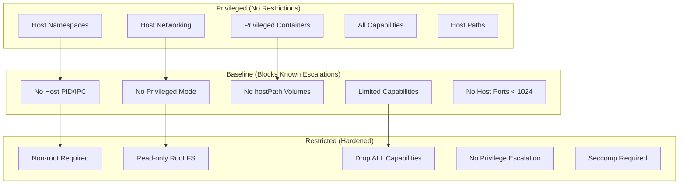

# How to Implement Pod Security Standards

Author: [nawazdhandala](https://www.github.com/nawazdhandala)

Tags: Kubernetes, Security, Pod Security Standards, PSA, PSP Migration, Hardening

Description: Learn how to implement Pod Security Standards in Kubernetes to enforce security baselines across your cluster. This guide covers all three security levels with practical examples and migration strategies.

---

> Pod Security Standards (PSS) define three progressively restrictive security profiles for Kubernetes pods. Replacing the deprecated PodSecurityPolicy, PSS provides a simpler and more standardized approach to cluster security.

With PodSecurityPolicy deprecated since Kubernetes 1.21 and removed in 1.25, Pod Security Standards have become the recommended way to enforce security baselines. Understanding and implementing these standards correctly is essential for any production Kubernetes deployment.

---

## Understanding Pod Security Standards

Pod Security Standards define three distinct profiles:

**Privileged**: Unrestricted policy, allowing all pod configurations. Used for system-level workloads that require full access.

**Baseline**: Minimally restrictive policy that prevents known privilege escalations. Suitable for most workloads with minor adjustments.

**Restricted**: Heavily restricted policy following pod hardening best practices. The target for security-conscious applications.

Each profile can be enforced in three modes:

- **enforce**: Violations prevent pod creation
- **audit**: Violations logged but allowed
- **warn**: Violations trigger user warnings but are allowed

---

## Prerequisites

Before implementing Pod Security Standards:

- Kubernetes 1.23+ (PSA built-in) or 1.22 with feature gate enabled
- kubectl with cluster admin access
- Understanding of your workload security requirements
- Audit of existing pod configurations

---

## Enabling Pod Security Admission

Pod Security Admission (PSA) is enabled by default in Kubernetes 1.23+. Verify it is active:

```bash
# Check if the admission controller is enabled
kubectl api-resources | grep pods

# Verify PSA webhook is registered
kubectl get validatingwebhookconfigurations | grep pod-security
```

For clusters running 1.22, enable the feature gate:

```yaml
# kube-apiserver configuration
apiVersion: kubeadm.k8s.io/v1beta3
kind: ClusterConfiguration
apiServer:
  extraArgs:
    # Enable Pod Security Admission feature gate
    feature-gates: "PodSecurity=true"
```

---

## Applying Pod Security Standards to Namespaces

Security standards are applied at the namespace level using labels. Start with a new namespace:

```yaml
# secure-namespace.yaml
apiVersion: v1
kind: Namespace
metadata:
  name: production
  labels:
    # Enforce the restricted profile - violations block pod creation
    pod-security.kubernetes.io/enforce: restricted
    pod-security.kubernetes.io/enforce-version: latest

    # Audit at restricted level - log violations
    pod-security.kubernetes.io/audit: restricted
    pod-security.kubernetes.io/audit-version: latest

    # Warn users about baseline violations too
    pod-security.kubernetes.io/warn: restricted
    pod-security.kubernetes.io/warn-version: latest
```

Apply the namespace:

```bash
# Create the namespace with security labels
kubectl apply -f secure-namespace.yaml

# Verify labels are applied
kubectl get namespace production --show-labels
```

---

## Understanding Each Security Profile

### Privileged Profile

The privileged profile allows all pod configurations. Use only for trusted system workloads:

```yaml
# privileged-pod.yaml
# This pod would be allowed under privileged profile
apiVersion: v1
kind: Pod
metadata:
  name: privileged-workload
  namespace: kube-system
spec:
  containers:
  - name: system-tool
    image: alpine:3.18
    securityContext:
      # Full privileges - only in privileged profile
      privileged: true
      runAsUser: 0
    volumeMounts:
    - name: host-root
      mountPath: /host
  volumes:
  - name: host-root
    hostPath:
      path: /
      type: Directory
```

### Baseline Profile

The baseline profile blocks known privilege escalations while remaining compatible with most workloads:

```yaml
# baseline-pod.yaml
# This pod is compatible with baseline profile
apiVersion: v1
kind: Pod
metadata:
  name: baseline-workload
  namespace: staging
spec:
  containers:
  - name: app
    image: nginx:1.25
    # No privileged mode
    securityContext:
      # Baseline allows running as root if needed
      runAsUser: 0
      # Cannot escalate privileges beyond container
      allowPrivilegeEscalation: false
    ports:
    - containerPort: 80
    # Standard volume mounts are allowed
    volumeMounts:
    - name: config
      mountPath: /etc/nginx/conf.d
  volumes:
  - name: config
    configMap:
      name: nginx-config
```

### Restricted Profile

The restricted profile enforces pod hardening best practices:

```yaml
# restricted-pod.yaml
# This pod is compatible with restricted profile
apiVersion: v1
kind: Pod
metadata:
  name: restricted-workload
  namespace: production
spec:
  # Must run as non-root
  securityContext:
    runAsNonRoot: true
    # Specify a non-root user
    runAsUser: 1000
    runAsGroup: 1000
    fsGroup: 1000
    # Use seccomp profile
    seccompProfile:
      type: RuntimeDefault

  containers:
  - name: app
    image: myapp:1.0
    securityContext:
      # Cannot run as root
      runAsNonRoot: true
      runAsUser: 1000
      # Must drop all capabilities
      capabilities:
        drop:
        - ALL
      # Cannot gain new privileges
      allowPrivilegeEscalation: false
      # Read-only root filesystem
      readOnlyRootFilesystem: true

    # Writable directories must use emptyDir
    volumeMounts:
    - name: tmp
      mountPath: /tmp
    - name: cache
      mountPath: /var/cache

    resources:
      requests:
        memory: "64Mi"
        cpu: "100m"
      limits:
        memory: "128Mi"
        cpu: "200m"

  volumes:
  - name: tmp
    emptyDir: {}
  - name: cache
    emptyDir: {}
```

---

## Migration Strategy from PodSecurityPolicy

If you are migrating from PodSecurityPolicy, follow this phased approach:

### Phase 1: Audit Current State

First, assess your existing pods against security standards:

```bash
#!/bin/bash
# audit-pods.sh
# Check all pods against security standards

echo "=== Auditing Pods Against Security Standards ==="

for ns in $(kubectl get namespaces -o jsonpath='{.items[*].metadata.name}'); do
    echo ""
    echo "Namespace: $ns"
    echo "---"

    # Dry-run with restricted profile
    kubectl label --dry-run=server --overwrite namespace $ns \
        pod-security.kubernetes.io/enforce=restricted 2>&1 | \
        grep -E "(Warning|Error)" || echo "All pods compliant with restricted"
done
```

### Phase 2: Apply Audit and Warn Labels

Enable monitoring without enforcement:

```yaml
# phase2-labels.yaml
# Apply to each namespace for monitoring
apiVersion: v1
kind: Namespace
metadata:
  name: my-namespace
  labels:
    # Keep current behavior
    pod-security.kubernetes.io/enforce: privileged

    # But audit against target profile
    pod-security.kubernetes.io/audit: restricted
    pod-security.kubernetes.io/audit-version: v1.28

    # Warn developers about violations
    pod-security.kubernetes.io/warn: restricted
    pod-security.kubernetes.io/warn-version: v1.28
```

### Phase 3: Review Audit Logs

Check the audit logs for violations:

```bash
# Query audit logs for PSA violations
kubectl logs -n kube-system -l component=kube-apiserver | \
    grep "pod-security.kubernetes.io" | \
    jq -r '.objectRef.name + " - " + .annotations["pod-security.kubernetes.io/audit-violations"]'
```

### Phase 4: Remediate and Enforce

After fixing violations, progressively tighten enforcement:

```bash
# Move to baseline enforcement
kubectl label namespace my-namespace \
    pod-security.kubernetes.io/enforce=baseline \
    --overwrite

# After validation, move to restricted
kubectl label namespace my-namespace \
    pod-security.kubernetes.io/enforce=restricted \
    --overwrite
```

---

## Handling Exemptions

Some workloads legitimately need elevated permissions. Handle exemptions through the API server configuration:

```yaml
# psa-config.yaml
# Pod Security Admission configuration
apiVersion: apiserver.config.k8s.io/v1
kind: AdmissionConfiguration
plugins:
- name: PodSecurity
  configuration:
    apiVersion: pod-security.admission.config.k8s.io/v1
    kind: PodSecurityConfiguration
    defaults:
      enforce: baseline
      enforce-version: latest
      audit: restricted
      audit-version: latest
      warn: restricted
      warn-version: latest
    exemptions:
      # Exempt certain usernames (service accounts)
      usernames:
      - system:serviceaccount:kube-system:daemon-set-controller

      # Exempt specific namespaces
      namespaces:
      - kube-system
      - cert-manager
      - monitoring

      # Exempt workloads by runtime class
      runtimeClasses:
      - gvisor
```

---

## Security Profile Comparison

The following diagram shows what each profile restricts:



---

## Common Violations and Fixes

### Running as Root

```yaml
# Violation: Running as root
spec:
  containers:
  - name: app
    image: myapp:1.0
    # Fix: Add security context
    securityContext:
      runAsNonRoot: true
      runAsUser: 1000
```

### Missing Seccomp Profile

```yaml
# Violation: No seccomp profile
spec:
  containers:
  - name: app
    image: myapp:1.0
    # Fix: Add seccomp at pod or container level
    securityContext:
      seccompProfile:
        type: RuntimeDefault
```

### Capability Requirements

```yaml
# Violation: Not dropping capabilities
spec:
  containers:
  - name: app
    image: myapp:1.0
    securityContext:
      capabilities:
        # Fix: Drop all, add only what is needed
        drop:
        - ALL
        add:
        - NET_BIND_SERVICE  # Only if truly needed
```

---

## Automating Compliance Checks

Create a CI/CD validation step using kubectl:

```bash
#!/bin/bash
# validate-manifests.sh
# Validates Kubernetes manifests against restricted profile

MANIFEST_DIR="${1:-.}"

echo "Validating manifests against restricted profile..."

# Create a test namespace with restricted enforcement
kubectl create namespace pss-validation --dry-run=client -o yaml | \
    kubectl label --local -f - \
    pod-security.kubernetes.io/enforce=restricted -o yaml | \
    kubectl apply -f -

# Track failures
FAILURES=0

for file in $(find "$MANIFEST_DIR" -name "*.yaml" -o -name "*.yml"); do
    echo "Checking: $file"

    # Attempt dry-run in restricted namespace
    OUTPUT=$(kubectl apply -f "$file" -n pss-validation --dry-run=server 2>&1)

    if echo "$OUTPUT" | grep -q "forbidden"; then
        echo "FAIL: $file"
        echo "$OUTPUT" | grep "forbidden"
        FAILURES=$((FAILURES + 1))
    else
        echo "PASS: $file"
    fi
done

# Cleanup
kubectl delete namespace pss-validation --ignore-not-found

exit $FAILURES
```

---

## Conclusion

Pod Security Standards provide a straightforward and effective approach to Kubernetes security. By applying appropriate profiles to namespaces and following a structured migration path, you can significantly improve your cluster's security posture.

Start with audit and warn modes to understand your current state, then progressively move to enforcement. Remember that the restricted profile represents best practices, but baseline provides meaningful security improvements for workloads that cannot yet meet restricted requirements.

---

*Monitor your Kubernetes security posture alongside application performance with [OneUptime](https://oneuptime.com). Get alerts when pods fail security policy enforcement and track compliance across your clusters.*
