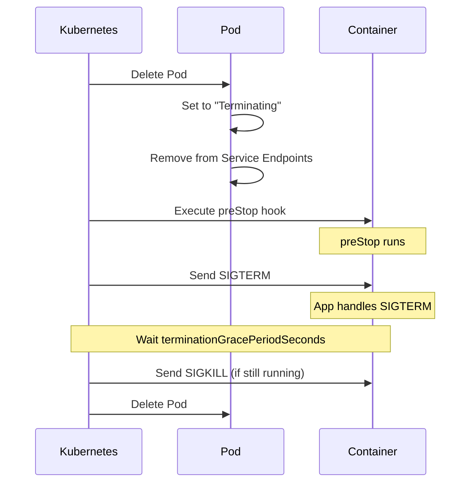
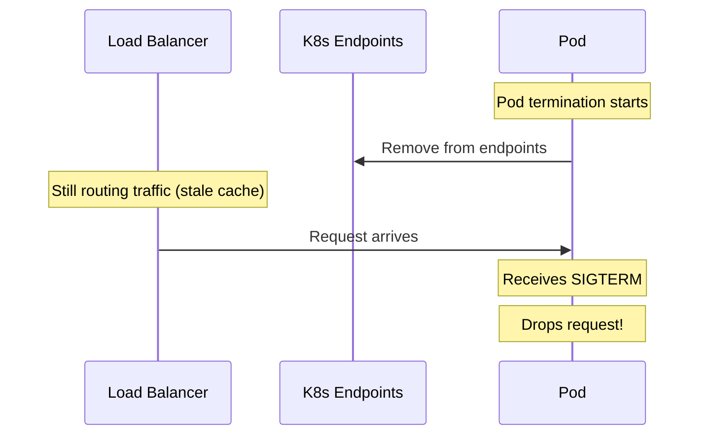

# How to Configure Pod Termination Grace Period

Author: [nawazdhandala](https://www.github.com/nawazdhandala)

Tags: Kubernetes, Pod Lifecycle, Graceful Shutdown, DevOps, Reliability

Description: Learn how to configure pod termination grace periods in Kubernetes for graceful shutdowns. This guide covers setting appropriate timeouts, handling SIGTERM signals, and implementing preStop hooks for zero-downtime deployments.

---

When Kubernetes terminates a pod, it sends SIGTERM and waits for the container to shut down gracefully. The termination grace period controls how long it waits before sending SIGKILL. Get this wrong and your application loses in-flight requests, corrupts data, or takes too long to deploy.

## Pod Termination Sequence



## Default Behavior

The default termination grace period is 30 seconds:

```yaml
apiVersion: v1
kind: Pod
metadata:
  name: myapp
spec:
  terminationGracePeriodSeconds: 30  # Default
  containers:
    - name: myapp
      image: myapp:1.0.0
```

## Setting Custom Grace Period

### Increase for Long-Running Tasks

For applications that need more time to shut down gracefully:

```yaml
apiVersion: apps/v1
kind: Deployment
metadata:
  name: batch-processor
spec:
  replicas: 3
  selector:
    matchLabels:
      app: batch-processor
  template:
    metadata:
      labels:
        app: batch-processor
    spec:
      terminationGracePeriodSeconds: 300  # 5 minutes
      containers:
        - name: processor
          image: batch-processor:1.0.0
```

Use cases for longer grace periods:
- Processing batch jobs
- Draining database connections
- Completing file uploads
- Gracefully closing WebSocket connections

### Decrease for Fast Shutdown

For stateless applications that can terminate quickly:

```yaml
apiVersion: apps/v1
kind: Deployment
metadata:
  name: stateless-api
spec:
  template:
    spec:
      terminationGracePeriodSeconds: 10  # Faster termination
      containers:
        - name: api
          image: api:1.0.0
```

## Handling SIGTERM in Your Application

Your application must handle SIGTERM to shut down gracefully.

### Node.js Example

```javascript
const http = require('http');

const server = http.createServer((req, res) => {
    res.end('Hello World');
});

// Track active connections
let connections = new Set();

server.on('connection', (conn) => {
    connections.add(conn);
    conn.on('close', () => connections.delete(conn));
});

// Graceful shutdown handler
function shutdown(signal) {
    console.log(`Received ${signal}, starting graceful shutdown`);

    // Stop accepting new connections
    server.close(() => {
        console.log('HTTP server closed');
        process.exit(0);
    });

    // Close existing connections after they complete
    for (const conn of connections) {
        conn.end();
    }

    // Force close after timeout
    setTimeout(() => {
        console.log('Forcing shutdown');
        process.exit(1);
    }, 25000);  // 25s, less than Kubernetes grace period
}

process.on('SIGTERM', () => shutdown('SIGTERM'));
process.on('SIGINT', () => shutdown('SIGINT'));

server.listen(8080, () => {
    console.log('Server listening on port 8080');
});
```

### Python Example

```python
import signal
import sys
import time
from http.server import HTTPServer, BaseHTTPRequestHandler

class MyHandler(BaseHTTPRequestHandler):
    def do_GET(self):
        self.send_response(200)
        self.end_headers()
        self.wfile.write(b'Hello World')

# Global flag for shutdown
shutdown_flag = False

def shutdown_handler(signum, frame):
    global shutdown_flag
    print(f"Received signal {signum}, starting graceful shutdown")
    shutdown_flag = True

# Register signal handlers
signal.signal(signal.SIGTERM, shutdown_handler)
signal.signal(signal.SIGINT, shutdown_handler)

server = HTTPServer(('', 8080), MyHandler)
server.timeout = 1  # Short timeout to check shutdown flag

print("Server starting on port 8080")

while not shutdown_flag:
    server.handle_request()

print("Server shutting down")
server.server_close()
```

### Go Example

```go
package main

import (
    "context"
    "fmt"
    "net/http"
    "os"
    "os/signal"
    "syscall"
    "time"
)

func main() {
    server := &http.Server{
        Addr: ":8080",
        Handler: http.HandlerFunc(func(w http.ResponseWriter, r *http.Request) {
            fmt.Fprintln(w, "Hello World")
        }),
    }

    // Channel to listen for signals
    stop := make(chan os.Signal, 1)
    signal.Notify(stop, syscall.SIGTERM, syscall.SIGINT)

    // Start server in goroutine
    go func() {
        fmt.Println("Server starting on port 8080")
        if err := server.ListenAndServe(); err != http.ErrServerClosed {
            fmt.Printf("Server error: %v\n", err)
        }
    }()

    // Wait for signal
    <-stop
    fmt.Println("Received shutdown signal")

    // Create context with timeout
    ctx, cancel := context.WithTimeout(context.Background(), 25*time.Second)
    defer cancel()

    // Graceful shutdown
    if err := server.Shutdown(ctx); err != nil {
        fmt.Printf("Shutdown error: %v\n", err)
    }
    fmt.Println("Server stopped")
}
```

## Using preStop Hooks

preStop hooks run before SIGTERM is sent, giving you time to prepare.

### Sleep to Allow Endpoint Removal

Endpoints are removed asynchronously. A small delay prevents traffic to terminating pods:

```yaml
apiVersion: apps/v1
kind: Deployment
metadata:
  name: api-server
spec:
  template:
    spec:
      terminationGracePeriodSeconds: 45
      containers:
        - name: api
          image: api:1.0.0
          lifecycle:
            preStop:
              exec:
                command:
                  - sh
                  - -c
                  - sleep 10  # Wait for endpoint removal
```

### Drain Connections

```yaml
lifecycle:
  preStop:
    exec:
      command:
        - sh
        - -c
        - |
          # Signal app to stop accepting new connections
          curl -X POST http://localhost:8080/admin/drain
          # Wait for existing connections to complete
          sleep 15
```

### Custom Shutdown Script

```yaml
lifecycle:
  preStop:
    exec:
      command:
        - /app/scripts/shutdown.sh
```

shutdown.sh:

```bash
#!/bin/bash
echo "Starting graceful shutdown"

# Deregister from service discovery
curl -X DELETE http://consul:8500/v1/agent/service/deregister/myapp

# Wait for deregistration to propagate
sleep 5

# Signal application to drain
kill -USR1 $(cat /app/app.pid)

# Wait for drain
sleep 20

echo "Shutdown preparation complete"
```

## Coordinating with Load Balancers

### The Traffic Problem



### The Solution: Delay + preStop

```yaml
spec:
  terminationGracePeriodSeconds: 60
  containers:
    - name: api
      lifecycle:
        preStop:
          exec:
            command:
              - sh
              - -c
              - |
                # Wait for load balancer to update
                sleep 15
                # Now safe to start shutdown
```

## Best Practices

### Match Grace Period to App Needs

| Application Type | Recommended Grace Period |
|-----------------|-------------------------|
| Stateless API | 15-30 seconds |
| WebSocket server | 30-60 seconds |
| Queue consumer | 60-300 seconds |
| Database | 120-300 seconds |
| Batch processor | 300-600 seconds |

### Always Handle SIGTERM

Never rely on SIGKILL for normal shutdown:

```yaml
# Bad: No SIGTERM handling, waits full grace period
terminationGracePeriodSeconds: 30
# Pod takes 30s to terminate every time

# Good: Handle SIGTERM, shutdown quickly
terminationGracePeriodSeconds: 30
# Pod terminates in seconds when idle
```

### Use preStop for Connection Draining

```yaml
lifecycle:
  preStop:
    exec:
      command: ['sh', '-c', 'sleep 10']
```

### Set Grace Period Longer Than preStop + Shutdown Time

```yaml
# preStop: 15s
# App shutdown: 20s
# Buffer: 10s
terminationGracePeriodSeconds: 45
```

## Debugging Termination Issues

### Check Termination Events

```bash
kubectl get events --field-selector reason=Killing -n production
```

### View Pod Termination

```bash
# Watch pod status during termination
kubectl get pod myapp-pod -n production -w

# Check pod phase
kubectl get pod myapp-pod -n production -o jsonpath='{.status.phase}'
```

### Force Delete Stuck Pods

```bash
# Only use when pod is truly stuck
kubectl delete pod myapp-pod -n production --grace-period=0 --force
```

### Check Container Exit Code

```bash
kubectl get pod myapp-pod -n production -o jsonpath='{.status.containerStatuses[0].lastState.terminated}'

# Exit codes:
# 0 - Normal exit (SIGTERM handled)
# 137 - SIGKILL (128 + 9)
# 143 - SIGTERM (128 + 15) - if not caught
```

## Testing Graceful Shutdown

### Simulate Termination

```bash
# Send SIGTERM to container process
kubectl exec myapp-pod -n production -- kill -SIGTERM 1

# Watch logs
kubectl logs myapp-pod -n production -f
```

### Load Test During Rolling Update

```bash
# Start load test
hey -z 2m -c 50 http://myapp.example.com/api

# Trigger rolling update in another terminal
kubectl rollout restart deployment/myapp -n production

# Check for errors in load test output
```

---

The termination grace period is your safety net for graceful shutdowns. Set it long enough for your app to finish in-flight work, use preStop hooks for connection draining, and always handle SIGTERM in your code. Your users will thank you during deployments.
