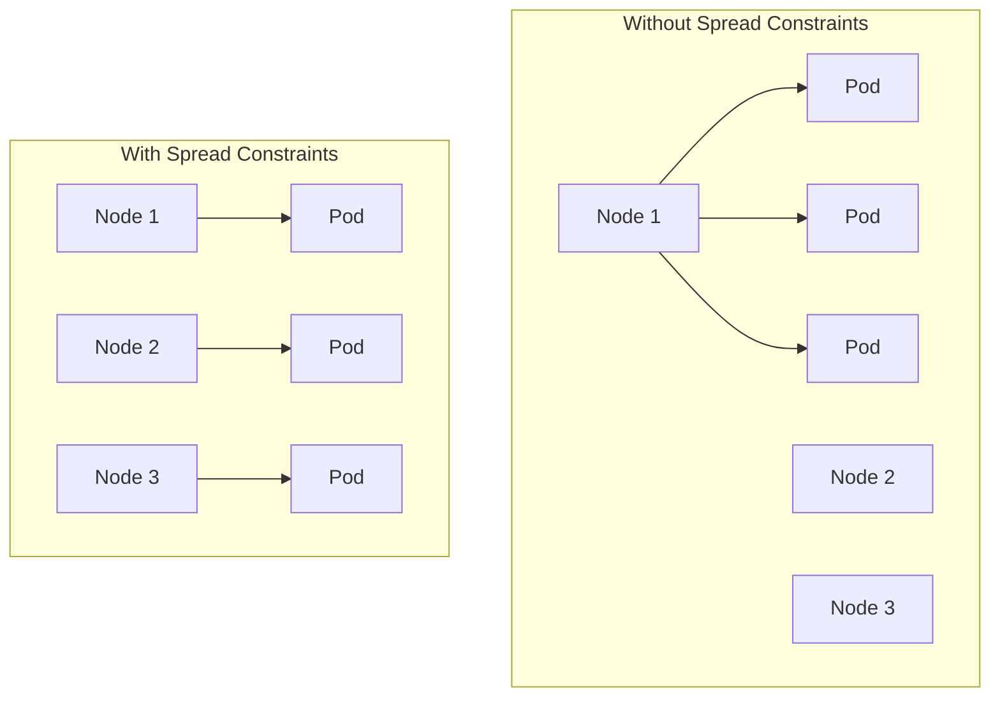
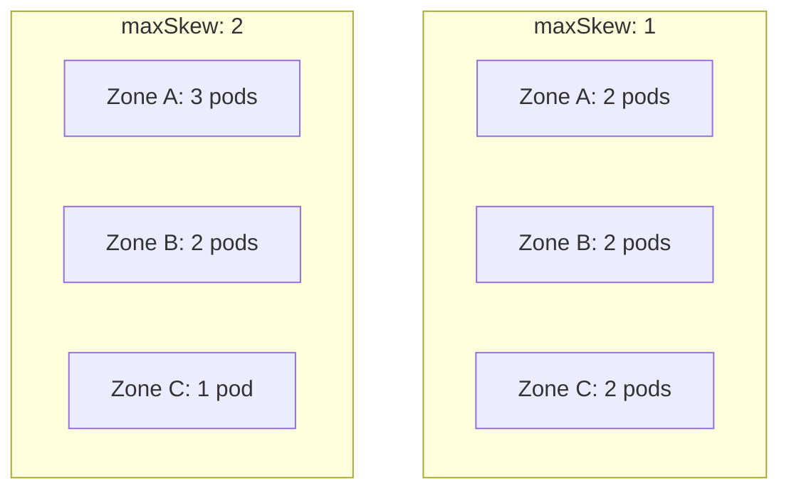

# How to Configure Pod Topology Spread Constraints

Author: [nawazdhandala](https://www.github.com/nawazdhandala)

Tags: Kubernetes, Scheduling, High Availability, Topology, DevOps, Pod Distribution

Description: Learn how to configure pod topology spread constraints in Kubernetes to distribute workloads evenly across zones, nodes, and regions. This guide covers configuration options, real-world examples, and best practices for high availability.

---

Running all your pods on the same node or availability zone is a recipe for downtime. Pod topology spread constraints tell Kubernetes how to distribute pods across your cluster topology, ensuring high availability even when infrastructure fails.

## Why Topology Spread Matters

Without spread constraints, the scheduler might place all replicas on the same node:



If Node 1 fails in the "Bad" scenario, all pods go down. With spread constraints, you lose only one pod.

## Basic Topology Spread Configuration

A topology spread constraint has these components:

```yaml
spec:
  topologySpreadConstraints:
    - maxSkew: 1
      topologyKey: topology.kubernetes.io/zone
      whenUnsatisfiable: DoNotSchedule
      labelSelector:
        matchLabels:
          app: myapp
```

**maxSkew**: Maximum difference in pod count between topology domains. A value of 1 means domains can differ by at most 1 pod.

**topologyKey**: The node label that defines topology domains. Common keys:
- `topology.kubernetes.io/zone` - Availability zones
- `topology.kubernetes.io/region` - Regions
- `kubernetes.io/hostname` - Individual nodes

**whenUnsatisfiable**: What to do when constraints cannot be met:
- `DoNotSchedule` - Do not schedule the pod (hard requirement)
- `ScheduleAnyway` - Schedule anyway, but prefer satisfying the constraint

## Spreading Across Availability Zones

Distribute pods evenly across zones:

```yaml
apiVersion: apps/v1
kind: Deployment
metadata:
  name: api-server
  namespace: production
spec:
  replicas: 6
  selector:
    matchLabels:
      app: api-server
  template:
    metadata:
      labels:
        app: api-server
    spec:
      topologySpreadConstraints:
        - maxSkew: 1
          topologyKey: topology.kubernetes.io/zone
          whenUnsatisfiable: DoNotSchedule
          labelSelector:
            matchLabels:
              app: api-server
      containers:
        - name: api
          image: api-server:1.0.0
          ports:
            - containerPort: 8080
```

With 6 replicas and 3 zones, this places 2 pods per zone.

## Spreading Across Nodes

Prevent multiple pods on the same node:

```yaml
apiVersion: apps/v1
kind: Deployment
metadata:
  name: redis-cache
  namespace: production
spec:
  replicas: 3
  selector:
    matchLabels:
      app: redis-cache
  template:
    metadata:
      labels:
        app: redis-cache
    spec:
      topologySpreadConstraints:
        - maxSkew: 1
          topologyKey: kubernetes.io/hostname
          whenUnsatisfiable: DoNotSchedule
          labelSelector:
            matchLabels:
              app: redis-cache
      containers:
        - name: redis
          image: redis:7-alpine
          ports:
            - containerPort: 6379
```

## Multiple Spread Constraints

Combine zone and node spreading:

```yaml
apiVersion: apps/v1
kind: Deployment
metadata:
  name: critical-service
  namespace: production
spec:
  replicas: 9
  selector:
    matchLabels:
      app: critical-service
  template:
    metadata:
      labels:
        app: critical-service
    spec:
      topologySpreadConstraints:
        # Spread across zones first
        - maxSkew: 1
          topologyKey: topology.kubernetes.io/zone
          whenUnsatisfiable: DoNotSchedule
          labelSelector:
            matchLabels:
              app: critical-service
        # Then spread across nodes within each zone
        - maxSkew: 1
          topologyKey: kubernetes.io/hostname
          whenUnsatisfiable: ScheduleAnyway
          labelSelector:
            matchLabels:
              app: critical-service
      containers:
        - name: app
          image: critical-service:1.0.0
```

With 9 replicas, 3 zones, and 3 nodes per zone, this creates:
- 3 pods per zone
- 1 pod per node

## Understanding maxSkew



- **maxSkew: 1** - Strict even distribution
- **maxSkew: 2** - Allow some imbalance for scheduling flexibility

## Matching Specific Pods

Use labelSelector to target specific pods:

```yaml
spec:
  topologySpreadConstraints:
    - maxSkew: 1
      topologyKey: topology.kubernetes.io/zone
      whenUnsatisfiable: DoNotSchedule
      labelSelector:
        matchLabels:
          app: myapp
          tier: frontend  # Only spread frontend pods
```

Or use matchExpressions for more complex matching:

```yaml
spec:
  topologySpreadConstraints:
    - maxSkew: 1
      topologyKey: topology.kubernetes.io/zone
      whenUnsatisfiable: DoNotSchedule
      labelSelector:
        matchExpressions:
          - key: app
            operator: In
            values:
              - myapp
          - key: environment
            operator: NotIn
            values:
              - development
```

## Soft vs Hard Constraints

### Hard Constraint (DoNotSchedule)

Pod will not schedule if constraint cannot be satisfied:

```yaml
topologySpreadConstraints:
  - maxSkew: 1
    topologyKey: topology.kubernetes.io/zone
    whenUnsatisfiable: DoNotSchedule  # Hard constraint
```

Use when: High availability is critical and you would rather have fewer pods than poorly distributed ones.

### Soft Constraint (ScheduleAnyway)

Pod will schedule, but scheduler tries to satisfy constraint:

```yaml
topologySpreadConstraints:
  - maxSkew: 1
    topologyKey: topology.kubernetes.io/zone
    whenUnsatisfiable: ScheduleAnyway  # Soft constraint
```

Use when: You want best-effort distribution without blocking pod startup.

## Node Affinity and Spread Constraints

Combine with node affinity to spread across specific node groups:

```yaml
apiVersion: apps/v1
kind: Deployment
metadata:
  name: gpu-workload
spec:
  replicas: 4
  selector:
    matchLabels:
      app: gpu-workload
  template:
    metadata:
      labels:
        app: gpu-workload
    spec:
      affinity:
        nodeAffinity:
          requiredDuringSchedulingIgnoredDuringExecution:
            nodeSelectorTerms:
              - matchExpressions:
                  - key: node-type
                    operator: In
                    values:
                      - gpu
      topologySpreadConstraints:
        - maxSkew: 1
          topologyKey: kubernetes.io/hostname
          whenUnsatisfiable: DoNotSchedule
          labelSelector:
            matchLabels:
              app: gpu-workload
      containers:
        - name: ml-trainer
          image: ml-trainer:1.0.0
          resources:
            limits:
              nvidia.com/gpu: 1
```

## MinDomains (Kubernetes 1.25+)

Specify minimum number of domains to spread across:

```yaml
topologySpreadConstraints:
  - maxSkew: 1
    topologyKey: topology.kubernetes.io/zone
    whenUnsatisfiable: DoNotSchedule
    minDomains: 3  # Require at least 3 zones
    labelSelector:
      matchLabels:
        app: myapp
```

If fewer than 3 zones are available, pods will not schedule.

## NodeTaintsPolicy (Kubernetes 1.26+)

Control how taints affect topology calculations:

```yaml
topologySpreadConstraints:
  - maxSkew: 1
    topologyKey: topology.kubernetes.io/zone
    whenUnsatisfiable: DoNotSchedule
    nodeTaintsPolicy: Honor  # Consider taints when counting domains
    labelSelector:
      matchLabels:
        app: myapp
```

Options:
- **Honor** - Exclude tainted nodes from domain count
- **Ignore** - Include tainted nodes in domain count

## Real-World Examples

### Web Application with Zone Redundancy

```yaml
apiVersion: apps/v1
kind: Deployment
metadata:
  name: web-frontend
spec:
  replicas: 6
  selector:
    matchLabels:
      app: web-frontend
  template:
    metadata:
      labels:
        app: web-frontend
    spec:
      topologySpreadConstraints:
        - maxSkew: 1
          topologyKey: topology.kubernetes.io/zone
          whenUnsatisfiable: DoNotSchedule
          labelSelector:
            matchLabels:
              app: web-frontend
        - maxSkew: 2
          topologyKey: kubernetes.io/hostname
          whenUnsatisfiable: ScheduleAnyway
          labelSelector:
            matchLabels:
              app: web-frontend
      containers:
        - name: nginx
          image: web-frontend:1.0.0
```

### Database with Anti-Affinity

For databases, use spread constraints with pod anti-affinity:

```yaml
apiVersion: apps/v1
kind: StatefulSet
metadata:
  name: postgres
spec:
  replicas: 3
  serviceName: postgres
  selector:
    matchLabels:
      app: postgres
  template:
    metadata:
      labels:
        app: postgres
    spec:
      affinity:
        podAntiAffinity:
          requiredDuringSchedulingIgnoredDuringExecution:
            - labelSelector:
                matchLabels:
                  app: postgres
              topologyKey: kubernetes.io/hostname
      topologySpreadConstraints:
        - maxSkew: 1
          topologyKey: topology.kubernetes.io/zone
          whenUnsatisfiable: DoNotSchedule
          labelSelector:
            matchLabels:
              app: postgres
      containers:
        - name: postgres
          image: postgres:15
```

## Debugging Spread Issues

### Check Node Topology Labels

```bash
# View zone labels on nodes
kubectl get nodes -L topology.kubernetes.io/zone

# View all topology labels
kubectl get nodes -o custom-columns=NAME:.metadata.name,ZONE:.metadata.labels.topology\\.kubernetes\\.io/zone,REGION:.metadata.labels.topology\\.kubernetes\\.io/region
```

### Check Pod Distribution

```bash
# See where pods are running
kubectl get pods -l app=myapp -o wide

# Count pods per zone
kubectl get pods -l app=myapp -o custom-columns=NAME:.metadata.name,NODE:.spec.nodeName | \
  while read name node; do
    zone=$(kubectl get node $node -o jsonpath='{.metadata.labels.topology\.kubernetes\.io/zone}' 2>/dev/null)
    echo "$name $zone"
  done | sort -k2 | uniq -c -f1
```

### Scheduling Failures

```bash
# Check events for scheduling issues
kubectl get events --field-selector reason=FailedScheduling

# Example output:
# "0/6 nodes are available: 2 node(s) didn't match pod topology spread constraints"
```

## Best Practices

1. **Start with ScheduleAnyway** during initial rollout, then switch to DoNotSchedule
2. **Use maxSkew: 1** for critical services, **maxSkew: 2** for less critical ones
3. **Combine with PodDisruptionBudgets** for complete HA strategy
4. **Monitor pod distribution** as part of your observability
5. **Test with `kubectl --dry-run`** before applying

```yaml
# PDB to complement spread constraints
apiVersion: policy/v1
kind: PodDisruptionBudget
metadata:
  name: api-server-pdb
spec:
  minAvailable: 2
  selector:
    matchLabels:
      app: api-server
```

---

Topology spread constraints are essential for high availability. They ensure your workloads survive zone outages and node failures. Combine them with PodDisruptionBudgets and proper resource management for a truly resilient Kubernetes deployment.
