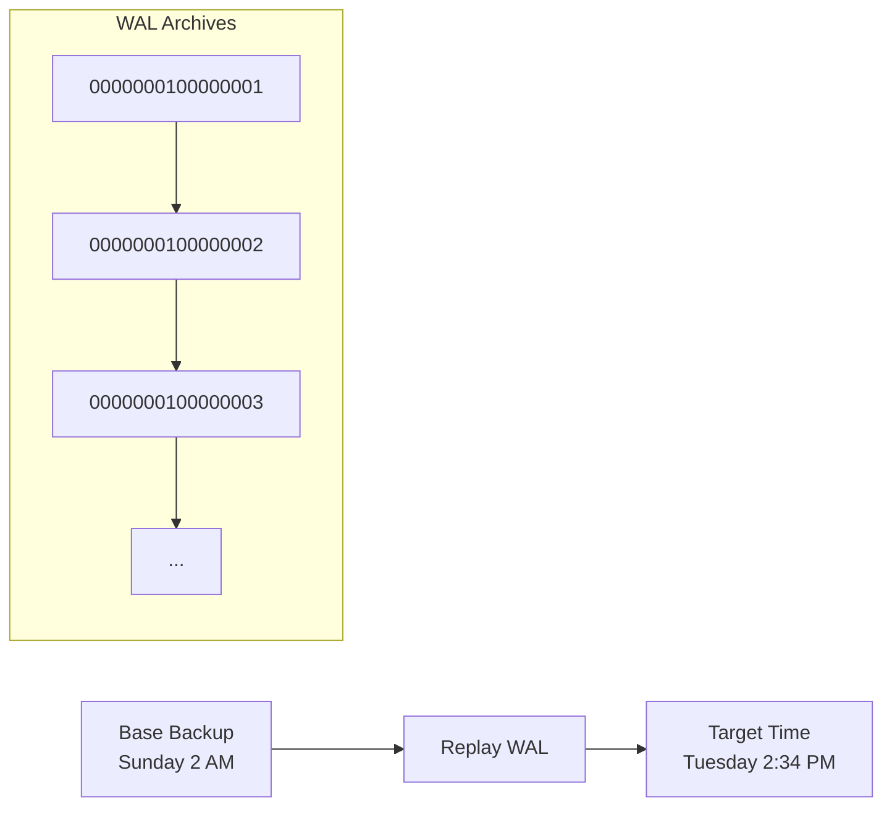

# How to Recover Data with Point-in-Time Recovery in PostgreSQL

Author: [nawazdhandala](https://www.github.com/nawazdhandala)

Tags: PostgreSQL, Backup, Recovery, Disaster Recovery, Database Administration

Description: Learn how to configure and perform Point-in-Time Recovery (PITR) in PostgreSQL to recover your database to any specific moment, protecting against accidental data loss and corruption.

---

Point-in-Time Recovery (PITR) lets you restore your PostgreSQL database to any moment in time. Accidentally dropped a table at 2:35 PM? Restore to 2:34 PM. This capability is essential for any production database because regular backups alone cannot protect against data loss that happens between backup windows.

## How PITR Works

PostgreSQL continuously writes all changes to the Write-Ahead Log (WAL). PITR combines:

1. **Base backup**: A full snapshot of the database at a specific time
2. **WAL archives**: Continuous stream of all changes since the base backup

To recover, PostgreSQL restores the base backup and then replays WAL records up to your target recovery point.



## Step 1: Configure WAL Archiving

First, enable continuous WAL archiving on your production server.

### Edit postgresql.conf

```sql
-- Enable WAL archiving
ALTER SYSTEM SET wal_level = 'replica';
ALTER SYSTEM SET archive_mode = on;
ALTER SYSTEM SET archive_command = 'cp %p /var/lib/postgresql/wal_archive/%f';

-- Optional: Compress archives to save space
-- ALTER SYSTEM SET archive_command = 'gzip < %p > /var/lib/postgresql/wal_archive/%f.gz';

-- Restart required for wal_level and archive_mode
```

For production, use a remote archive destination:

```sql
-- Archive to S3 using aws cli
ALTER SYSTEM SET archive_command = 'aws s3 cp %p s3://my-bucket/wal-archive/%f';

-- Or use rsync to a backup server
ALTER SYSTEM SET archive_command = 'rsync -a %p backup-server:/wal_archive/%f';
```

Restart PostgreSQL:

```bash
sudo systemctl restart postgresql
```

### Verify Archiving is Working

```sql
-- Check archive status
SELECT * FROM pg_stat_archiver;

-- Force a WAL switch to test archiving
SELECT pg_switch_wal();

-- Check the archive directory
ls -la /var/lib/postgresql/wal_archive/
```

## Step 2: Take a Base Backup

The base backup is a consistent snapshot of your entire PostgreSQL data directory.

### Using pg_basebackup

```bash
# Create a base backup to local directory
pg_basebackup -D /var/lib/postgresql/backups/base_2026-01-25 \
    -Ft \            # tar format
    -z \             # gzip compression
    -P \             # show progress
    -X stream \      # include WAL during backup
    -c fast          # fast checkpoint

# For remote backup server
pg_basebackup -h prod-db.example.com -D /backups/base_2026-01-25 \
    -Ft -z -P -X stream -c fast
```

### Backup to S3

```bash
# Stream backup directly to S3
pg_basebackup -D - -Ft | aws s3 cp - s3://my-bucket/backups/base_2026-01-25.tar
```

### Schedule Regular Base Backups

Create a cron job for daily base backups:

```bash
# /etc/cron.d/pg_backup
0 2 * * * postgres pg_basebackup -D /backups/base_$(date +\%Y-\%m-\%d) -Ft -z -X stream -c fast 2>> /var/log/pg_backup.log
```

## Step 3: Perform Point-in-Time Recovery

When disaster strikes, here is how to recover.

### Scenario: Accidental Table Drop

Someone ran `DROP TABLE customers` at 2026-01-25 14:35:00. You need to recover to 14:34:00.

### Recovery Process

```bash
# Stop PostgreSQL
sudo systemctl stop postgresql

# Move the corrupted data directory
sudo mv /var/lib/postgresql/16/main /var/lib/postgresql/16/main.corrupted

# Restore the base backup
sudo mkdir /var/lib/postgresql/16/main
sudo tar -xzf /backups/base_2026-01-25.tar.gz -C /var/lib/postgresql/16/main
sudo chown -R postgres:postgres /var/lib/postgresql/16/main
```

### Configure Recovery Settings

Create recovery signal file and configure recovery target:

```bash
# PostgreSQL 12+ uses postgresql.auto.conf and signal files
sudo touch /var/lib/postgresql/16/main/recovery.signal
```

Add recovery settings to `postgresql.auto.conf`:

```sql
-- Specify recovery target time
restore_command = 'cp /var/lib/postgresql/wal_archive/%f %p'
recovery_target_time = '2026-01-25 14:34:00'
recovery_target_action = 'promote'

-- Alternative targets:
-- recovery_target_xid = '12345'        # Recover to specific transaction
-- recovery_target_lsn = '0/15D68C50'   # Recover to specific WAL position
-- recovery_target_name = 'before_migration'  # Recover to named restore point
```

Or add directly:

```bash
cat >> /var/lib/postgresql/16/main/postgresql.auto.conf << EOF
restore_command = 'cp /var/lib/postgresql/wal_archive/%f %p'
recovery_target_time = '2026-01-25 14:34:00'
recovery_target_action = 'promote'
EOF
```

### Start Recovery

```bash
# Start PostgreSQL - it will enter recovery mode
sudo systemctl start postgresql

# Monitor recovery progress
sudo tail -f /var/log/postgresql/postgresql-16-main.log
```

The log will show messages like:
```
LOG: starting point-in-time recovery to 2026-01-25 14:34:00
LOG: restored log file "000000010000000100000023" from archive
LOG: redo starts at 0/15000028
...
LOG: recovery stopping before commit of transaction 12346, time 2026-01-25 14:35:00
LOG: redo done at 0/15D68C28
LOG: selected new timeline ID: 2
LOG: database system is ready to accept connections
```

### Verify Recovery

```sql
-- Check if the table exists
SELECT count(*) FROM customers;

-- Verify the latest data is from before the incident
SELECT max(updated_at) FROM customers;
```

## Creating Named Restore Points

For major changes, create named restore points:

```sql
-- Before a risky migration
SELECT pg_create_restore_point('before_migration_2026_01_25');

-- Run your migration
ALTER TABLE customers ADD COLUMN new_field VARCHAR(100);

-- If something goes wrong, recover to:
-- recovery_target_name = 'before_migration_2026_01_25'
```

## Recovery Best Practices

### Test Recovery Regularly

Set up a monthly recovery drill:

```bash
#!/bin/bash
# recovery_test.sh - Test PITR on a standby server

# Restore to a test server
pg_basebackup -h prod-db -D /tmp/recovery_test

# Configure recovery
cat > /tmp/recovery_test/recovery.signal << EOF
EOF

cat >> /tmp/recovery_test/postgresql.auto.conf << EOF
restore_command = 'aws s3 cp s3://my-bucket/wal-archive/%f %p'
recovery_target_time = '$(date -d "1 hour ago" +"%Y-%m-%d %H:%M:%S")'
recovery_target_action = 'promote'
port = 5433
EOF

# Start recovery
pg_ctl -D /tmp/recovery_test start

# Verify data
psql -p 5433 -c "SELECT count(*) FROM critical_table"

# Cleanup
pg_ctl -D /tmp/recovery_test stop
rm -rf /tmp/recovery_test
```

### Monitor WAL Archiving

Alert if archiving falls behind:

```sql
-- Check for archive lag
SELECT
    now() - pg_last_wal_receive_lsn() AS archive_lag,
    last_archived_wal,
    last_failed_wal,
    last_failed_time
FROM pg_stat_archiver;
```

Set up an alert if `last_failed_wal` is not null or if archive lag exceeds your threshold.

### Retention Policy

Keep base backups and WAL archives according to your recovery requirements:

```bash
# Remove base backups older than 7 days
find /backups -name "base_*" -mtime +7 -delete

# Remove WAL archives older than the oldest base backup
# (Be careful - you need WAL files back to your oldest base backup)
oldest_backup=$(ls -t /backups/base_* | tail -1)
# Only remove WAL files older than the oldest backup
```

## Recovering Individual Tables

PITR recovers the entire database. To recover just one table:

```bash
# Recover to a separate instance on a different port
pg_basebackup -D /tmp/recovery -Fp -P

# Configure recovery
cat > /tmp/recovery/recovery.signal << EOF
EOF

cat >> /tmp/recovery/postgresql.auto.conf << EOF
restore_command = 'cp /var/lib/postgresql/wal_archive/%f %p'
recovery_target_time = '2026-01-25 14:34:00'
recovery_target_action = 'promote'
port = 5433
EOF

# Start the recovery instance
pg_ctl -D /tmp/recovery start

# Export just the table you need
pg_dump -p 5433 -t customers > /tmp/customers_recovered.sql

# Import into production
psql -d mydb -f /tmp/customers_recovered.sql

# Clean up
pg_ctl -D /tmp/recovery stop
rm -rf /tmp/recovery
```

## Common Issues and Solutions

### WAL Files Missing

```
FATAL: could not open file "/var/lib/postgresql/wal_archive/000000010000000100000025": No such file or directory
```

Solutions:
- Check your `archive_command` is working
- Verify WAL files exist in the archive directory
- Ensure you have all WAL files from the base backup time to recovery target

### Recovery Target Not Found

```
FATAL: recovery ended before configured recovery target was reached
```

The target time is beyond the available WAL. Either:
- Your WAL archiving stopped before the target time
- The target time is in the future relative to available WAL
- The base backup is newer than the target time (cannot go backward)

### Timeline Issues

After recovery, PostgreSQL creates a new timeline. If you need to recover again:

```sql
-- Check current timeline
SELECT timeline_id FROM pg_control_checkpoint();

-- You may need to specify the timeline in restore_command
-- restore_command = 'cp /archive/%f %p || cp /archive/%f.partial %p'
```

## Summary

Point-in-Time Recovery requires proactive configuration:

1. **Enable WAL archiving** before you need it
2. **Take regular base backups** (daily is typical)
3. **Store archives remotely** (S3, backup server)
4. **Test recovery monthly** to ensure it works
5. **Monitor archive status** and alert on failures

PITR is your safety net against human error and corruption. The time to set it up is now, not after you have lost data.
