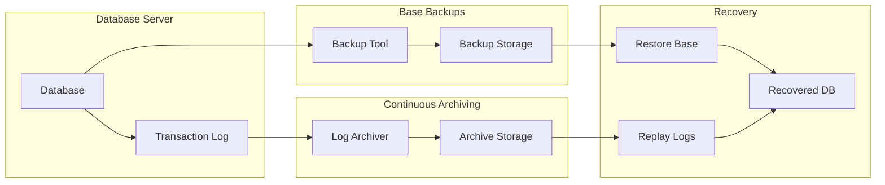

# How to Implement Point-in-Time Recovery

Author: [nawazdhandala](https://www.github.com/nawazdhandala)

Tags: Database, Backup, Recovery, PostgreSQL, MySQL, DevOps

Description: Learn how to implement point-in-time recovery (PITR) for databases, enabling restoration to any specific moment in time using continuous archiving and transaction logs.

---

Point-in-time recovery (PITR) lets you restore a database to any specific moment, not just to when a backup was taken. This capability is essential for recovering from accidental data deletions, application bugs that corrupt data, or any situation where you need to undo changes made after a certain timestamp.

This guide covers PITR implementation for PostgreSQL and MySQL, including the underlying concepts and practical configurations.

## Why Point-in-Time Recovery?

Traditional backups have a fundamental limitation: you can only restore to the exact moment the backup was created. If a backup runs at 2 AM and someone accidentally deletes a table at 3 PM, you lose 13 hours of data.

PITR solves this by combining:
1. **Base backups:** Full database snapshots taken periodically
2. **Continuous archiving:** Transaction logs (WAL in PostgreSQL, binlogs in MySQL) stored between backups

With both pieces, you can replay transactions up to any point in time.

## PITR Architecture



## PostgreSQL PITR Setup

PostgreSQL uses Write-Ahead Logging (WAL) for transaction durability. Archiving these WAL files enables PITR.

### Configure WAL Archiving

Edit `postgresql.conf`:

```ini
# postgresql.conf

# Enable WAL archiving
archive_mode = on
archive_command = 'cp %p /var/lib/postgresql/wal_archive/%f'

# Alternative: Archive to S3
# archive_command = 'aws s3 cp %p s3://pg-wal-archive/%f'

# Keep more WAL segments for longer recovery windows
wal_level = replica
max_wal_senders = 3
wal_keep_size = 1GB
```

Restart PostgreSQL to apply changes:

```bash
sudo systemctl restart postgresql
```

### Create a Base Backup

Use `pg_basebackup` to create a consistent backup:

```bash
# Create base backup
pg_basebackup -h localhost -U postgres \
    -D /var/lib/postgresql/backups/base_$(date +%Y%m%d_%H%M%S) \
    -Ft -z -Xs -P

# Options explained:
# -D: Destination directory
# -Ft: Tar format
# -z: Compress with gzip
# -Xs: Stream WAL during backup
# -P: Show progress

# For remote backup to S3
pg_basebackup -h db.example.com -U replication \
    -D - -Ft | gzip | aws s3 cp - s3://pg-backups/base_$(date +%Y%m%d).tar.gz
```

### Automate Base Backups

Create a cron job for regular base backups:

```bash
#!/bin/bash
# /usr/local/bin/pg-base-backup.sh

set -euo pipefail

BACKUP_DIR="/var/lib/postgresql/backups"
BACKUP_NAME="base_$(date +%Y%m%d_%H%M%S)"
RETENTION_DAYS=7

# Create backup
pg_basebackup -h localhost -U postgres \
    -D "${BACKUP_DIR}/${BACKUP_NAME}" \
    -Ft -z -Xs

# Create label file with timestamp
echo "Backup created: $(date)" > "${BACKUP_DIR}/${BACKUP_NAME}/backup_label"

# Remove old backups
find "$BACKUP_DIR" -maxdepth 1 -type d -name "base_*" -mtime +$RETENTION_DAYS -exec rm -rf {} \;

echo "Base backup completed: ${BACKUP_NAME}"
```

Add to crontab:

```bash
# Daily base backup at 2 AM
0 2 * * * /usr/local/bin/pg-base-backup.sh >> /var/log/pg-backup.log 2>&1
```

### Perform Point-in-Time Recovery

When disaster strikes, restore to a specific point:

```bash
#!/bin/bash
# pg-pitr-restore.sh

# Configuration
BASE_BACKUP="/var/lib/postgresql/backups/base_20260125_020000"
WAL_ARCHIVE="/var/lib/postgresql/wal_archive"
DATA_DIR="/var/lib/postgresql/15/main"
RECOVERY_TARGET="2026-01-25 15:30:00"

# Stop PostgreSQL
sudo systemctl stop postgresql

# Clear existing data directory
sudo rm -rf "$DATA_DIR"/*

# Restore base backup
sudo tar -xzf "${BASE_BACKUP}/base.tar.gz" -C "$DATA_DIR"

# Create recovery configuration
cat > "${DATA_DIR}/postgresql.auto.conf" <<EOF
restore_command = 'cp ${WAL_ARCHIVE}/%f %p'
recovery_target_time = '${RECOVERY_TARGET}'
recovery_target_action = 'promote'
EOF

# Create recovery signal file
touch "${DATA_DIR}/recovery.signal"

# Set correct ownership
sudo chown -R postgres:postgres "$DATA_DIR"

# Start PostgreSQL
sudo systemctl start postgresql

# Monitor recovery progress
tail -f /var/log/postgresql/postgresql-15-main.log
```

### Recovery Target Options

PostgreSQL supports multiple recovery targets:

```ini
# Recover to specific timestamp
recovery_target_time = '2026-01-25 15:30:00+00'

# Recover to specific transaction ID
recovery_target_xid = '12345678'

# Recover to named restore point
recovery_target_name = 'before_migration'

# Recover to specific LSN
recovery_target_lsn = '0/1A2B3C4D'

# What to do after reaching target
recovery_target_action = 'pause'   # Pause for inspection
recovery_target_action = 'promote' # Make database writable
recovery_target_action = 'shutdown' # Stop after recovery
```

Create named restore points before risky operations:

```sql
-- Before a migration
SELECT pg_create_restore_point('before_user_migration');

-- Run migration
ALTER TABLE users ADD COLUMN preferences jsonb;

-- If something goes wrong, recover to 'before_user_migration'
```

## MySQL PITR Setup

MySQL uses binary logs (binlogs) for replication and recovery.

### Enable Binary Logging

Edit `my.cnf`:

```ini
# /etc/mysql/my.cnf

[mysqld]
# Enable binary logging
log_bin = /var/log/mysql/mysql-bin
binlog_format = ROW
binlog_row_image = FULL
expire_logs_days = 7
max_binlog_size = 100M

# For GTID-based recovery (recommended)
gtid_mode = ON
enforce_gtid_consistency = ON
```

Restart MySQL:

```bash
sudo systemctl restart mysql
```

### Create a Base Backup

Use mysqldump or MySQL Enterprise Backup:

```bash
# Full backup with mysqldump
mysqldump -u root -p --all-databases \
    --single-transaction \
    --flush-logs \
    --master-data=2 \
    --routines \
    --triggers \
    > backup_$(date +%Y%m%d_%H%M%S).sql

# The --master-data=2 flag records the binary log position as a comment:
# -- CHANGE MASTER TO MASTER_LOG_FILE='mysql-bin.000042', MASTER_LOG_POS=154;
```

For larger databases, use `xtrabackup`:

```bash
# Full backup with Percona XtraBackup
xtrabackup --backup \
    --user=root \
    --password=secret \
    --target-dir=/backups/base_$(date +%Y%m%d)

# Prepare the backup
xtrabackup --prepare --target-dir=/backups/base_20260125
```

### Perform Point-in-Time Recovery

Restore the base backup and replay binlogs:

```bash
#!/bin/bash
# mysql-pitr-restore.sh

BASE_BACKUP="/backups/backup_20260125_020000.sql"
BINLOG_DIR="/var/log/mysql"
RECOVERY_TIME="2026-01-25 15:30:00"

# Stop MySQL
sudo systemctl stop mysql

# Restore base backup
mysql -u root -p < "$BASE_BACKUP"

# Find the binlog position from the backup
# grep "CHANGE MASTER" $BASE_BACKUP
# -- CHANGE MASTER TO MASTER_LOG_FILE='mysql-bin.000042', MASTER_LOG_POS=154;

START_LOG="mysql-bin.000042"
START_POS="154"

# Find all binlogs from start position to recovery time
mysqlbinlog --start-position=$START_POS \
    --stop-datetime="$RECOVERY_TIME" \
    "${BINLOG_DIR}/${START_LOG}" \
    "${BINLOG_DIR}/mysql-bin.000043" \
    "${BINLOG_DIR}/mysql-bin.000044" \
    | mysql -u root -p

echo "Recovery completed to $RECOVERY_TIME"
```

### Extract Specific Transactions

Sometimes you need to undo a single transaction:

```bash
# Find the problematic transaction
mysqlbinlog --base64-output=decode-rows -v \
    /var/log/mysql/mysql-bin.000044 \
    | grep -A 20 "DELETE FROM users"

# Extract all transactions except the problematic one
mysqlbinlog --start-datetime="2026-01-25 15:00:00" \
    --stop-datetime="2026-01-25 16:00:00" \
    --exclude-gtids="3E11FA47-71CA-11E1-9E33-C80AA9429562:23" \
    /var/log/mysql/mysql-bin.000044 \
    | mysql -u root -p
```

## Cloud Database PITR

Managed databases often include PITR as a built-in feature.

### AWS RDS

```bash
# Restore RDS instance to point in time
aws rds restore-db-instance-to-point-in-time \
    --source-db-instance-identifier production-db \
    --target-db-instance-identifier production-db-restored \
    --restore-time "2026-01-25T15:30:00Z" \
    --db-instance-class db.r5.large

# Check restore progress
aws rds describe-db-instances \
    --db-instance-identifier production-db-restored \
    --query 'DBInstances[0].DBInstanceStatus'
```

### Google Cloud SQL

```bash
# Restore Cloud SQL to point in time
gcloud sql instances clone production-db production-db-restored \
    --point-in-time "2026-01-25T15:30:00Z"
```

### Azure SQL

```bash
# Restore Azure SQL to point in time
az sql db restore \
    --dest-name production-db-restored \
    --name production-db \
    --resource-group mygroup \
    --server myserver \
    --time "2026-01-25T15:30:00Z"
```

## Testing PITR

Regular testing ensures your PITR setup actually works:

```bash
#!/bin/bash
# test-pitr.sh

set -euo pipefail

TEST_DB="pitr_test_$(date +%s)"

# Create test database with sample data
psql -U postgres -c "CREATE DATABASE $TEST_DB;"
psql -U postgres -d "$TEST_DB" -c "CREATE TABLE test_data (id serial, value text, created_at timestamp default now());"
psql -U postgres -d "$TEST_DB" -c "INSERT INTO test_data (value) VALUES ('before_checkpoint');"

# Record checkpoint time
sleep 2
CHECKPOINT_TIME=$(date -u +"%Y-%m-%d %H:%M:%S")
echo "Checkpoint time: $CHECKPOINT_TIME"

# Create restore point
psql -U postgres -c "SELECT pg_create_restore_point('test_checkpoint');"

# Add more data after checkpoint
sleep 2
psql -U postgres -d "$TEST_DB" -c "INSERT INTO test_data (value) VALUES ('after_checkpoint');"

# Force WAL switch to ensure archiving
psql -U postgres -c "SELECT pg_switch_wal();"

# Verify current state
echo "Current state:"
psql -U postgres -d "$TEST_DB" -c "SELECT * FROM test_data;"

# Count rows (should be 2)
COUNT=$(psql -U postgres -d "$TEST_DB" -t -c "SELECT COUNT(*) FROM test_data;")
echo "Row count before PITR: $COUNT"

# Perform PITR test (in practice, use separate instance)
# This is simplified for demonstration
echo "Recovery target: $CHECKPOINT_TIME"
echo "Expected: only 'before_checkpoint' row should exist after recovery"

# Cleanup
psql -U postgres -c "DROP DATABASE $TEST_DB;"

echo "PITR test completed"
```

## Best Practices

1. **Test recovery regularly.** Monthly PITR drills ensure your configuration works and your team knows the procedure.

2. **Monitor WAL/binlog archiving.** Alert if archiving falls behind or stops. Missing logs mean gaps in your recovery window.

3. **Store archives separately from data.** WAL archives should be on different storage than the database to survive disk failures.

4. **Document recovery procedures.** Write runbooks with exact commands. Under pressure is not the time to figure out syntax.

5. **Set realistic retention.** Balance storage costs against recovery needs. Most organizations need 7-30 days of PITR capability.

6. **Use PITR with regular backups.** PITR complements but does not replace regular full backups. Both are needed for comprehensive data protection.

## Wrapping Up

Point-in-time recovery transforms database backups from crude snapshots into precise recovery tools. The setup requires ongoing attention to WAL or binlog archiving, but the ability to recover to any moment makes it worthwhile. Start with daily base backups and continuous log archiving, test recovery monthly, and document your procedures. When that accidental DELETE happens, you will be ready to undo it.
