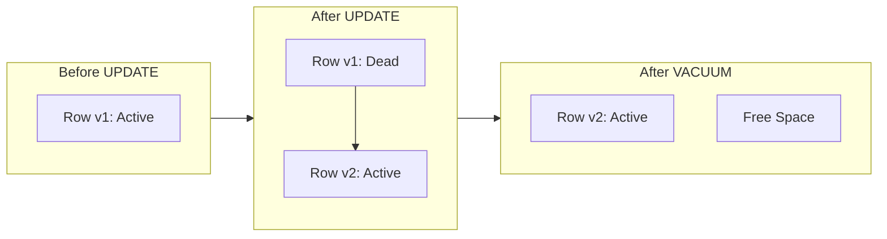

# How to Prevent Table Bloat with Autovacuum Tuning in PostgreSQL

Author: [nawazdhandala](https://www.github.com/nawazdhandala)

Tags: PostgreSQL, Database, Performance, Autovacuum, Table Bloat, Tuning

Description: Learn how to prevent table bloat in PostgreSQL by tuning autovacuum settings. This guide covers monitoring bloat, configuring autovacuum workers, and implementing per-table tuning strategies for optimal database performance.

---

Table bloat is one of the most common performance killers in PostgreSQL. When tables grow larger than they should due to dead tuples accumulating, queries slow down, indexes become inefficient, and disk usage balloons. The good news is that PostgreSQL's autovacuum process handles this automatically. The bad news is that default settings often fall short for busy production databases.

## Understanding Table Bloat

PostgreSQL uses Multi-Version Concurrency Control (MVCC) to handle concurrent transactions. When you update or delete a row, PostgreSQL does not immediately remove the old version. Instead, it marks the old tuple as "dead" and creates a new version. This approach allows other transactions to see consistent snapshots of data.



Dead tuples consume disk space and slow down sequential scans because PostgreSQL must read through them even though they are not visible to any transaction.

## Measuring Table Bloat

Before tuning autovacuum, you need to understand the current state of your tables.

### Check Dead Tuple Count

```sql
-- View dead tuples per table
SELECT
    schemaname,
    relname AS table_name,
    n_live_tup AS live_tuples,
    n_dead_tup AS dead_tuples,
    ROUND(100.0 * n_dead_tup / NULLIF(n_live_tup + n_dead_tup, 0), 2) AS dead_ratio_pct,
    last_vacuum,
    last_autovacuum
FROM pg_stat_user_tables
WHERE n_dead_tup > 0
ORDER BY n_dead_tup DESC
LIMIT 20;
```

### Estimate Bloat Using pgstattuple Extension

```sql
-- Enable the extension first
CREATE EXTENSION IF NOT EXISTS pgstattuple;

-- Check bloat for a specific table
SELECT
    table_len AS total_bytes,
    tuple_len AS data_bytes,
    dead_tuple_len AS dead_bytes,
    ROUND(100.0 * dead_tuple_len / NULLIF(table_len, 0), 2) AS dead_pct,
    free_space AS free_bytes,
    ROUND(100.0 * free_space / NULLIF(table_len, 0), 2) AS free_pct
FROM pgstattuple('orders');
```

### Monitor Autovacuum Activity

```sql
-- Check currently running autovacuum processes
SELECT
    pid,
    datname,
    relid::regclass AS table_name,
    phase,
    heap_blks_total,
    heap_blks_scanned,
    ROUND(100.0 * heap_blks_scanned / NULLIF(heap_blks_total, 0), 2) AS progress_pct
FROM pg_stat_progress_vacuum;
```

## Default Autovacuum Settings and Their Problems

PostgreSQL ships with conservative autovacuum defaults that work for small databases but struggle with high-traffic systems.

```sql
-- View current autovacuum settings
SHOW autovacuum;
SHOW autovacuum_vacuum_threshold;
SHOW autovacuum_vacuum_scale_factor;
SHOW autovacuum_naptime;
SHOW autovacuum_max_workers;
```

The default formula for triggering vacuum is:

```
vacuum_threshold = autovacuum_vacuum_threshold + (autovacuum_vacuum_scale_factor * number_of_tuples)
```

With defaults of threshold=50 and scale_factor=0.2, a table with 1 million rows needs 200,050 dead tuples before autovacuum kicks in. That is 20% of your table becoming dead before cleanup starts.

## Global Autovacuum Tuning

Edit your `postgresql.conf` or use `ALTER SYSTEM` for cluster-wide settings.

### Increase Worker Count

```sql
-- Allow more concurrent autovacuum workers
-- Default is 3, increase for busy databases
ALTER SYSTEM SET autovacuum_max_workers = 6;

-- Reduce naptime between autovacuum runs
-- Default is 1 minute
ALTER SYSTEM SET autovacuum_naptime = '30s';
```

### Lower Thresholds for Earlier Cleanup

```sql
-- Trigger vacuum earlier (default scale_factor is 0.2)
-- 0.05 means vacuum when 5% of rows are dead
ALTER SYSTEM SET autovacuum_vacuum_scale_factor = 0.05;

-- For analyze, also lower the threshold
ALTER SYSTEM SET autovacuum_analyze_scale_factor = 0.02;

-- Reload configuration
SELECT pg_reload_conf();
```

### Tune Cost-Based Delay

Autovacuum uses cost-based delays to prevent overwhelming your I/O system.

```sql
-- Allow autovacuum to work faster before pausing
-- Default is 200, increase for faster cleanup
ALTER SYSTEM SET autovacuum_vacuum_cost_limit = 1000;

-- Reduce pause time between vacuum batches
-- Default is 2ms
ALTER SYSTEM SET autovacuum_vacuum_cost_delay = '1ms';
```

## Per-Table Autovacuum Tuning

High-traffic tables often need custom settings. This is where real optimization happens.

### Configure Hot Tables

```sql
-- For tables with frequent updates, use aggressive settings
ALTER TABLE orders SET (
    autovacuum_vacuum_scale_factor = 0.01,    -- Vacuum at 1% dead tuples
    autovacuum_vacuum_threshold = 100,         -- Minimum 100 dead tuples
    autovacuum_analyze_scale_factor = 0.005,   -- Analyze more frequently
    autovacuum_vacuum_cost_delay = 0           -- No delay for critical tables
);

-- Verify the settings
SELECT relname, reloptions
FROM pg_class
WHERE relname = 'orders';
```

### Configure Append-Only Tables

Tables that rarely update but grow large need different settings.

```sql
-- For log or event tables with mostly inserts
ALTER TABLE event_log SET (
    autovacuum_vacuum_scale_factor = 0.2,      -- Standard threshold is fine
    autovacuum_analyze_scale_factor = 0.01,    -- But analyze frequently for planner
    autovacuum_enabled = true
);
```

### Configure Reference Tables

Small lookup tables that rarely change can have relaxed settings.

```sql
-- Static reference data
ALTER TABLE country_codes SET (
    autovacuum_vacuum_scale_factor = 0.5,
    autovacuum_analyze_scale_factor = 0.5
);
```

## Handling Transaction ID Wraparound

PostgreSQL uses 32-bit transaction IDs that wrap around after approximately 2 billion transactions. Autovacuum must "freeze" old tuples to prevent data loss.

```sql
-- Check tables approaching wraparound
SELECT
    c.relname AS table_name,
    age(c.relfrozenxid) AS xid_age,
    pg_size_pretty(pg_total_relation_size(c.oid)) AS total_size
FROM pg_class c
JOIN pg_namespace n ON c.relnamespace = n.oid
WHERE c.relkind = 'r'
AND n.nspname NOT IN ('pg_catalog', 'information_schema')
ORDER BY age(c.relfrozenxid) DESC
LIMIT 10;
```

### Tune Freeze Settings

```sql
-- Lower the age at which autovacuum aggressively freezes tuples
-- Default is 200 million
ALTER SYSTEM SET autovacuum_freeze_max_age = 100000000;

-- Set vacuum_freeze_min_age to balance between
-- too-frequent freezing and wraparound risk
ALTER SYSTEM SET vacuum_freeze_min_age = 10000000;
```

## Monitoring Script for Production

Create a monitoring query to run regularly.

```sql
-- Comprehensive autovacuum health check
WITH bloat_info AS (
    SELECT
        schemaname || '.' || relname AS table_name,
        n_live_tup,
        n_dead_tup,
        COALESCE(ROUND(100.0 * n_dead_tup / NULLIF(n_live_tup, 0), 2), 0) AS dead_pct,
        last_autovacuum,
        last_autoanalyze,
        age(relfrozenxid) AS xid_age
    FROM pg_stat_user_tables s
    JOIN pg_class c ON c.relname = s.relname
)
SELECT
    table_name,
    n_live_tup AS live_rows,
    n_dead_tup AS dead_rows,
    dead_pct,
    COALESCE(last_autovacuum::text, 'never') AS last_vacuum,
    xid_age,
    CASE
        WHEN dead_pct > 20 THEN 'CRITICAL: High bloat'
        WHEN dead_pct > 10 THEN 'WARNING: Moderate bloat'
        WHEN xid_age > 150000000 THEN 'WARNING: XID aging'
        ELSE 'OK'
    END AS status
FROM bloat_info
WHERE n_dead_tup > 1000 OR xid_age > 100000000
ORDER BY n_dead_tup DESC;
```

## Manual Vacuum for Emergency Situations

Sometimes autovacuum cannot keep up. Run manual vacuum during low-traffic periods.

```sql
-- Standard vacuum reclaims space for reuse but does not return to OS
VACUUM VERBOSE orders;

-- Analyze updates statistics after major changes
VACUUM ANALYZE orders;

-- VACUUM FULL rewrites the table and returns space to OS
-- Warning: This locks the table exclusively
VACUUM FULL orders;
```

## Best Practices Summary

1. **Monitor first**: Do not tune blindly. Measure bloat and autovacuum activity before changing settings.

2. **Start conservative**: Increase `autovacuum_max_workers` and reduce `autovacuum_naptime` before aggressive threshold changes.

3. **Tune per table**: Your hottest tables need custom settings. A 1% scale factor for a billion-row table is very different from a million-row table.

4. **Watch XID age**: Transaction ID wraparound causes database shutdown. Keep `relfrozenxid` age well below `autovacuum_freeze_max_age`.

5. **Test changes**: Apply tuning in staging first. Aggressive autovacuum can compete with production workloads for I/O.

---

Table bloat is not a matter of if but when. Properly tuned autovacuum keeps your PostgreSQL database healthy, queries fast, and disk usage predictable. Start by measuring your current state, then tune globally and per-table based on actual workload patterns.
