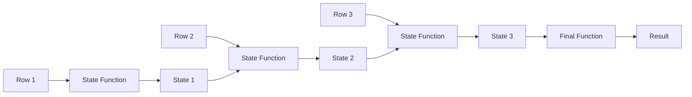

# How to Build Custom Aggregate Functions in PostgreSQL

Author: [nawazdhandala](https://www.github.com/nawazdhandala)

Tags: PostgreSQL, Database, SQL, Aggregate Functions, PL/pgSQL, Analytics

Description: Learn how to create custom aggregate functions in PostgreSQL for specialized analytics. This guide covers state transition functions, final functions, moving aggregates, and practical examples like weighted averages and percentiles.

---

PostgreSQL ships with standard aggregates like `SUM`, `AVG`, `COUNT`, and `MAX`. But real-world analytics often require specialized calculations that these built-in functions cannot handle. Custom aggregate functions let you compute things like weighted averages, geometric means, custom percentiles, or domain-specific metrics in a single SQL query.

## How Aggregates Work

An aggregate function processes multiple rows and returns a single result. Internally, PostgreSQL maintains a state value that gets updated for each row, then optionally transforms this state into the final result.



## Basic Aggregate: Concatenate Strings

Let's start simple. Create an aggregate that joins strings with a delimiter.

```sql
-- State transition function: appends each value to the state
CREATE OR REPLACE FUNCTION concat_agg_sfunc(state TEXT, value TEXT, delimiter TEXT)
RETURNS TEXT AS $$
BEGIN
    IF state IS NULL OR state = '' THEN
        RETURN value;
    ELSE
        RETURN state || delimiter || value;
    END IF;
END;
$$ LANGUAGE plpgsql;

-- Create the aggregate
CREATE AGGREGATE concat_with_delimiter(TEXT, TEXT) (
    SFUNC = concat_agg_sfunc,       -- State transition function
    STYPE = TEXT,                    -- State data type
    INITCOND = ''                    -- Initial state value
);

-- Usage example
SELECT concat_with_delimiter(name, ', ')
FROM products
WHERE category = 'electronics';
-- Result: 'Laptop, Phone, Tablet, Monitor'
```

## Weighted Average Aggregate

A weighted average is a common need that standard `AVG` cannot handle. Each value contributes to the average proportionally to its weight.

```sql
-- State type to track sum of weighted values and sum of weights
CREATE TYPE weighted_avg_state AS (
    weighted_sum NUMERIC,
    weight_sum NUMERIC
);

-- State transition function
CREATE OR REPLACE FUNCTION weighted_avg_sfunc(
    state weighted_avg_state,
    value NUMERIC,
    weight NUMERIC
)
RETURNS weighted_avg_state AS $$
BEGIN
    -- Handle NULL values
    IF value IS NULL OR weight IS NULL THEN
        RETURN state;
    END IF;

    -- Update state with this row's contribution
    RETURN (
        COALESCE(state.weighted_sum, 0) + (value * weight),
        COALESCE(state.weight_sum, 0) + weight
    )::weighted_avg_state;
END;
$$ LANGUAGE plpgsql;

-- Final function to compute the average
CREATE OR REPLACE FUNCTION weighted_avg_ffunc(state weighted_avg_state)
RETURNS NUMERIC AS $$
BEGIN
    -- Avoid division by zero
    IF state.weight_sum IS NULL OR state.weight_sum = 0 THEN
        RETURN NULL;
    END IF;

    RETURN state.weighted_sum / state.weight_sum;
END;
$$ LANGUAGE plpgsql;

-- Create the aggregate
CREATE AGGREGATE weighted_avg(NUMERIC, NUMERIC) (
    SFUNC = weighted_avg_sfunc,
    STYPE = weighted_avg_state,
    FINALFUNC = weighted_avg_ffunc,
    INITCOND = '(0, 0)'
);
```

### Using Weighted Average

```sql
-- Sample data: product ratings with number of reviews as weight
CREATE TABLE product_ratings (
    product_id INT,
    rating NUMERIC,
    review_count INT
);

INSERT INTO product_ratings VALUES
    (1, 4.5, 1000),
    (2, 4.8, 50),
    (3, 4.2, 500),
    (4, 3.9, 2000);

-- Compare standard average vs weighted average
SELECT
    AVG(rating) AS simple_average,
    weighted_avg(rating, review_count) AS weighted_average
FROM product_ratings;

-- simple_average: 4.35
-- weighted_average: 4.12 (products with more reviews have more influence)
```

## Geometric Mean Aggregate

The geometric mean is useful for growth rates and ratios. It multiplies all values and takes the nth root.

```sql
-- State tracks product of values and count
CREATE TYPE geom_mean_state AS (
    log_sum NUMERIC,   -- Sum of logarithms (to avoid overflow)
    count INT
);

-- State function using logarithms to handle large products
CREATE OR REPLACE FUNCTION geom_mean_sfunc(state geom_mean_state, value NUMERIC)
RETURNS geom_mean_state AS $$
BEGIN
    -- Skip NULL or non-positive values
    IF value IS NULL OR value <= 0 THEN
        RETURN state;
    END IF;

    RETURN (
        COALESCE(state.log_sum, 0) + ln(value),
        COALESCE(state.count, 0) + 1
    )::geom_mean_state;
END;
$$ LANGUAGE plpgsql;

-- Final function: exp(sum of logs / count)
CREATE OR REPLACE FUNCTION geom_mean_ffunc(state geom_mean_state)
RETURNS NUMERIC AS $$
BEGIN
    IF state.count IS NULL OR state.count = 0 THEN
        RETURN NULL;
    END IF;

    RETURN exp(state.log_sum / state.count);
END;
$$ LANGUAGE plpgsql;

CREATE AGGREGATE geom_mean(NUMERIC) (
    SFUNC = geom_mean_sfunc,
    STYPE = geom_mean_state,
    FINALFUNC = geom_mean_ffunc,
    INITCOND = '(0, 0)'
);

-- Usage: calculate average growth rate
SELECT geom_mean(growth_rate) AS avg_growth
FROM quarterly_growth;
```

## Median Aggregate with Sorted State

Computing the median requires access to all values, sorted.

```sql
-- State function collects values into an array
CREATE OR REPLACE FUNCTION median_sfunc(state NUMERIC[], value NUMERIC)
RETURNS NUMERIC[] AS $$
BEGIN
    IF value IS NULL THEN
        RETURN state;
    END IF;
    RETURN array_append(state, value);
END;
$$ LANGUAGE plpgsql;

-- Final function sorts and finds middle value
CREATE OR REPLACE FUNCTION median_ffunc(state NUMERIC[])
RETURNS NUMERIC AS $$
DECLARE
    sorted NUMERIC[];
    len INT;
BEGIN
    IF state IS NULL OR array_length(state, 1) IS NULL THEN
        RETURN NULL;
    END IF;

    -- Sort the array
    SELECT array_agg(v ORDER BY v) INTO sorted
    FROM unnest(state) AS v;

    len := array_length(sorted, 1);

    -- Return middle value(s)
    IF len % 2 = 1 THEN
        -- Odd count: return middle element
        RETURN sorted[(len + 1) / 2];
    ELSE
        -- Even count: return average of two middle elements
        RETURN (sorted[len / 2] + sorted[len / 2 + 1]) / 2.0;
    END IF;
END;
$$ LANGUAGE plpgsql;

CREATE AGGREGATE median(NUMERIC) (
    SFUNC = median_sfunc,
    STYPE = NUMERIC[],
    FINALFUNC = median_ffunc,
    INITCOND = '{}'
);

-- Usage
SELECT
    department,
    AVG(salary) AS mean_salary,
    median(salary) AS median_salary
FROM employees
GROUP BY department;
```

## Mode Aggregate (Most Frequent Value)

Find the most common value in a set.

```sql
-- State function builds a frequency map using JSONB
CREATE OR REPLACE FUNCTION mode_sfunc(state JSONB, value TEXT)
RETURNS JSONB AS $$
BEGIN
    IF value IS NULL THEN
        RETURN state;
    END IF;

    -- Increment count for this value
    IF state ? value THEN
        RETURN jsonb_set(state, ARRAY[value], to_jsonb((state->>value)::INT + 1));
    ELSE
        RETURN state || jsonb_build_object(value, 1);
    END IF;
END;
$$ LANGUAGE plpgsql;

-- Final function finds key with highest count
CREATE OR REPLACE FUNCTION mode_ffunc(state JSONB)
RETURNS TEXT AS $$
DECLARE
    result TEXT;
    max_count INT := 0;
    key TEXT;
    count INT;
BEGIN
    FOR key, count IN SELECT * FROM jsonb_each_text(state)
    LOOP
        IF count::INT > max_count THEN
            max_count := count::INT;
            result := key;
        END IF;
    END LOOP;

    RETURN result;
END;
$$ LANGUAGE plpgsql;

CREATE AGGREGATE mode(TEXT) (
    SFUNC = mode_sfunc,
    STYPE = JSONB,
    FINALFUNC = mode_ffunc,
    INITCOND = '{}'
);

-- Usage
SELECT mode(status) AS most_common_status
FROM orders
WHERE created_at > NOW() - INTERVAL '30 days';
```

## Combine Function for Parallel Aggregation

For large datasets, PostgreSQL can run aggregates in parallel. Add a combine function to merge partial results.

```sql
-- Combine function for weighted average
CREATE OR REPLACE FUNCTION weighted_avg_combine(
    state1 weighted_avg_state,
    state2 weighted_avg_state
)
RETURNS weighted_avg_state AS $$
BEGIN
    RETURN (
        COALESCE(state1.weighted_sum, 0) + COALESCE(state2.weighted_sum, 0),
        COALESCE(state1.weight_sum, 0) + COALESCE(state2.weight_sum, 0)
    )::weighted_avg_state;
END;
$$ LANGUAGE plpgsql;

-- Recreate aggregate with parallel support
DROP AGGREGATE IF EXISTS weighted_avg(NUMERIC, NUMERIC);

CREATE AGGREGATE weighted_avg(NUMERIC, NUMERIC) (
    SFUNC = weighted_avg_sfunc,
    STYPE = weighted_avg_state,
    FINALFUNC = weighted_avg_ffunc,
    COMBINEFUNC = weighted_avg_combine,    -- Enables parallel execution
    INITCOND = '(0, 0)',
    PARALLEL = SAFE
);
```

## Moving (Window) Aggregate

For window functions, you can add inverse state functions to efficiently remove rows from the state.

```sql
-- Inverse function for sum-based aggregates
CREATE OR REPLACE FUNCTION weighted_avg_inv_sfunc(
    state weighted_avg_state,
    value NUMERIC,
    weight NUMERIC
)
RETURNS weighted_avg_state AS $$
BEGIN
    IF value IS NULL OR weight IS NULL THEN
        RETURN state;
    END IF;

    RETURN (
        state.weighted_sum - (value * weight),
        state.weight_sum - weight
    )::weighted_avg_state;
END;
$$ LANGUAGE plpgsql;

-- Recreate with moving aggregate support
DROP AGGREGATE IF EXISTS weighted_avg(NUMERIC, NUMERIC);

CREATE AGGREGATE weighted_avg(NUMERIC, NUMERIC) (
    SFUNC = weighted_avg_sfunc,
    STYPE = weighted_avg_state,
    FINALFUNC = weighted_avg_ffunc,
    COMBINEFUNC = weighted_avg_combine,
    MSFUNC = weighted_avg_sfunc,           -- Moving state function
    MINVFUNC = weighted_avg_inv_sfunc,     -- Moving inverse function
    MSTYPE = weighted_avg_state,
    MINITCOND = '(0, 0)',
    INITCOND = '(0, 0)',
    PARALLEL = SAFE
);

-- Now works efficiently with window frames
SELECT
    date,
    value,
    weighted_avg(value, weight) OVER (
        ORDER BY date
        ROWS BETWEEN 6 PRECEDING AND CURRENT ROW
    ) AS rolling_weighted_avg
FROM daily_metrics;
```

## Testing Custom Aggregates

Always test with edge cases.

```sql
-- Test with NULL values
SELECT weighted_avg(value, weight)
FROM (VALUES (1.0, 10), (NULL, 5), (2.0, NULL), (3.0, 20)) AS t(value, weight);

-- Test with empty set
SELECT weighted_avg(value, weight)
FROM (SELECT 1 WHERE false) AS t(value, weight);

-- Test with single row
SELECT weighted_avg(value, weight)
FROM (VALUES (5.0, 100)) AS t(value, weight);

-- Test with GROUP BY
SELECT category, weighted_avg(price, quantity)
FROM products
GROUP BY category;
```

---

Custom aggregate functions unlock powerful analytics capabilities directly in your SQL queries. Start with simple aggregates to understand the pattern, then build more complex ones as needed. The combination of state functions, final functions, and parallel support gives you the flexibility to implement virtually any aggregation logic while benefiting from PostgreSQL's query optimizer.
