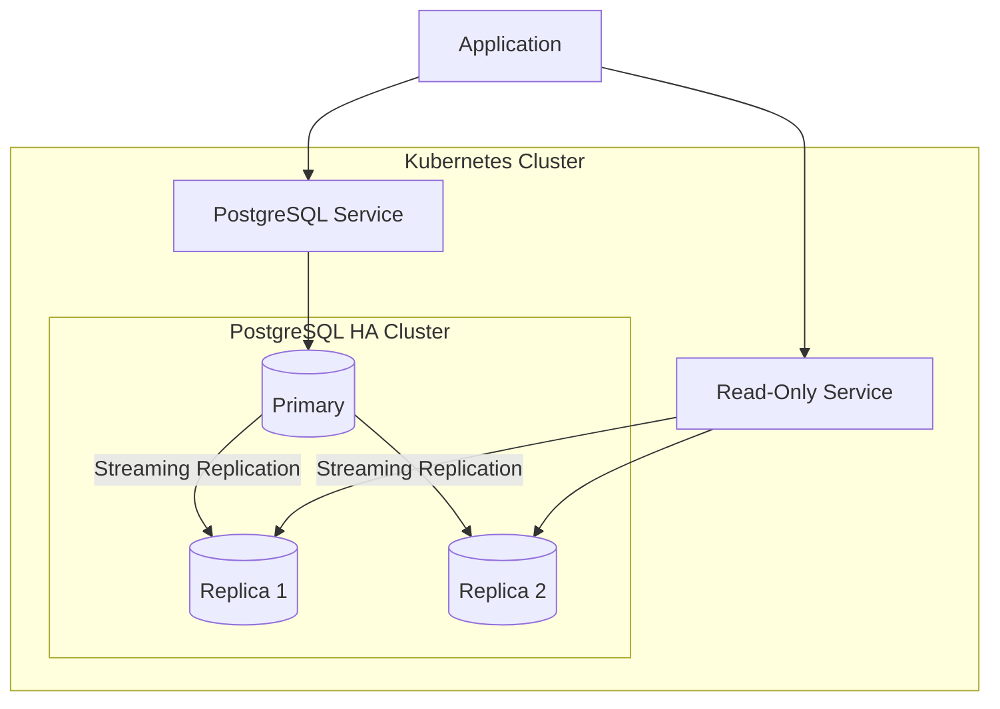

# How to Deploy PostgreSQL HA Clusters on Kubernetes

Author: [nawazdhandala](https://www.github.com/nawazdhandala)

Tags: PostgreSQL, Kubernetes, High Availability, Database, DevOps, CloudNativePG

Description: A practical guide to deploying highly available PostgreSQL clusters on Kubernetes using operators like CloudNativePG, with automatic failover, backup strategies, and monitoring.

---

Running a single PostgreSQL instance works fine until it doesn't. When that single pod crashes at 3 AM, you'll wish you had set up high availability from the start. This guide walks through deploying production-ready PostgreSQL HA clusters on Kubernetes.

## Why PostgreSQL on Kubernetes?

Kubernetes provides the building blocks for database high availability: automated scheduling, health checks, persistent storage, and self-healing. Combined with a PostgreSQL operator, you get automatic failover, rolling updates, and backup management without manual intervention.



## Choosing a PostgreSQL Operator

Several operators manage PostgreSQL on Kubernetes. Here are the main options:

**CloudNativePG** - CNCF sandbox project, active development, declarative configuration
**Zalando Postgres Operator** - Production-tested at Zalando, supports Patroni
**CrunchyData PGO** - Enterprise features, good documentation
**Percona Operator** - Includes monitoring stack

This guide uses CloudNativePG because of its simplicity and active community.

## Installing CloudNativePG

First, install the operator using kubectl:

```bash
# Install the operator
kubectl apply -f \
  https://raw.githubusercontent.com/cloudnative-pg/cloudnative-pg/release-1.22/releases/cnpg-1.22.0.yaml

# Verify the operator is running
kubectl get deployment -n cnpg-system cnpg-controller-manager
```

Or use Helm for more configuration options:

```bash
# Add the Helm repository
helm repo add cnpg https://cloudnative-pg.github.io/charts
helm repo update

# Install with custom values
helm install cnpg cnpg/cloudnative-pg \
  --namespace cnpg-system \
  --create-namespace \
  --set monitoring.podMonitorEnabled=true
```

## Creating Your First HA Cluster

Define a PostgreSQL cluster with three instances:

```yaml
# postgres-cluster.yaml
apiVersion: postgresql.cnpg.io/v1
kind: Cluster
metadata:
  name: postgres-prod
  namespace: database
spec:
  instances: 3

  # PostgreSQL version and configuration
  imageName: ghcr.io/cloudnative-pg/postgresql:16.1

  postgresql:
    parameters:
      # Memory settings (adjust based on your resources)
      shared_buffers: "256MB"
      effective_cache_size: "768MB"
      work_mem: "16MB"
      maintenance_work_mem: "128MB"

      # WAL settings for replication
      wal_buffers: "16MB"
      max_wal_size: "1GB"
      min_wal_size: "80MB"

      # Connection settings
      max_connections: "200"

  # Resource allocation
  resources:
    requests:
      memory: "1Gi"
      cpu: "500m"
    limits:
      memory: "2Gi"
      cpu: "2"

  # Storage configuration
  storage:
    size: 50Gi
    storageClass: fast-ssd

  # Enable monitoring
  monitoring:
    enablePodMonitor: true

  # Bootstrap from scratch or restore from backup
  bootstrap:
    initdb:
      database: appdb
      owner: appuser
      secret:
        name: postgres-credentials
```

Create the credentials secret:

```bash
# Generate a secure password
kubectl create namespace database

kubectl create secret generic postgres-credentials \
  --namespace database \
  --from-literal=username=appuser \
  --from-literal=password=$(openssl rand -base64 24)
```

Apply the cluster definition:

```bash
kubectl apply -f postgres-cluster.yaml

# Watch the cluster come up
kubectl get cluster -n database -w

# Check pod status
kubectl get pods -n database -l cnpg.io/cluster=postgres-prod
```

## Understanding the Cluster Architecture

CloudNativePG creates a primary-replica setup with automatic leader election:

```bash
# Check which pod is the primary
kubectl get pods -n database -l cnpg.io/cluster=postgres-prod \
  -o jsonpath='{range .items[*]}{.metadata.name}{"\t"}{.metadata.labels.role}{"\n"}{end}'
```

The operator creates several services:

```bash
# List services
kubectl get svc -n database -l cnpg.io/cluster=postgres-prod
```

- `postgres-prod-rw` - Points to primary, use for writes
- `postgres-prod-ro` - Load balances across replicas, use for reads
- `postgres-prod-r` - Points to any instance, use for read-only transactions

## Configuring Automatic Backups

CloudNativePG supports backups to S3-compatible storage:

```yaml
# postgres-cluster-with-backup.yaml
apiVersion: postgresql.cnpg.io/v1
kind: Cluster
metadata:
  name: postgres-prod
  namespace: database
spec:
  instances: 3
  imageName: ghcr.io/cloudnative-pg/postgresql:16.1

  storage:
    size: 50Gi
    storageClass: fast-ssd

  # Backup configuration
  backup:
    barmanObjectStore:
      destinationPath: s3://my-bucket/postgres-backups
      s3Credentials:
        accessKeyId:
          name: backup-credentials
          key: ACCESS_KEY_ID
        secretAccessKey:
          name: backup-credentials
          key: SECRET_ACCESS_KEY
      wal:
        compression: gzip
        maxParallel: 4
    retentionPolicy: "30d"
```

Create scheduled backups:

```yaml
# scheduled-backup.yaml
apiVersion: postgresql.cnpg.io/v1
kind: ScheduledBackup
metadata:
  name: postgres-prod-backup
  namespace: database
spec:
  schedule: "0 0 * * *"  # Daily at midnight
  backupOwnerReference: self
  cluster:
    name: postgres-prod
```

## Testing Failover

Simulate a primary failure to verify automatic failover:

```bash
# Identify the current primary
PRIMARY=$(kubectl get pods -n database \
  -l cnpg.io/cluster=postgres-prod,role=primary \
  -o jsonpath='{.items[0].metadata.name}')

echo "Current primary: $PRIMARY"

# Delete the primary pod
kubectl delete pod -n database $PRIMARY

# Watch the failover happen
kubectl get pods -n database -l cnpg.io/cluster=postgres-prod -w
```

A replica will be promoted to primary within seconds. The old primary pod will rejoin as a replica after recreation.

## Connection Pooling with PgBouncer

For high-connection workloads, enable the built-in PgBouncer:

```yaml
apiVersion: postgresql.cnpg.io/v1
kind: Cluster
metadata:
  name: postgres-prod
  namespace: database
spec:
  instances: 3
  imageName: ghcr.io/cloudnative-pg/postgresql:16.1

  storage:
    size: 50Gi

  # Enable PgBouncer
  managed:
    services:
      additional:
        - selectorType: rw
          serviceTemplate:
            metadata:
              name: postgres-prod-pooler
            spec:
              type: ClusterIP

  # PgBouncer pooler configuration
---
apiVersion: postgresql.cnpg.io/v1
kind: Pooler
metadata:
  name: postgres-prod-pooler
  namespace: database
spec:
  cluster:
    name: postgres-prod
  instances: 2
  type: rw
  pgbouncer:
    poolMode: transaction
    parameters:
      max_client_conn: "1000"
      default_pool_size: "25"
```

## Monitoring with Prometheus

CloudNativePG exports metrics in Prometheus format. Create a PodMonitor:

```yaml
# pod-monitor.yaml
apiVersion: monitoring.coreos.com/v1
kind: PodMonitor
metadata:
  name: postgres-prod
  namespace: database
spec:
  selector:
    matchLabels:
      cnpg.io/cluster: postgres-prod
  podMetricsEndpoints:
    - port: metrics
```

Key metrics to watch:

- `cnpg_pg_replication_lag` - Replica lag in seconds
- `cnpg_pg_database_size_bytes` - Database size
- `cnpg_pg_stat_activity_count` - Active connections
- `cnpg_backends_total` - Total backend processes

## Production Checklist

Before going to production, verify these items:

**Resource Planning**
- Set appropriate CPU and memory limits
- Size storage for growth (include WAL files)
- Use SSDs for production workloads

**High Availability**
- Deploy at least 3 instances
- Spread pods across availability zones using pod anti-affinity
- Test failover scenarios regularly

**Backup and Recovery**
- Configure off-site backups (S3, GCS, Azure Blob)
- Test restore procedures monthly
- Set appropriate retention policies

**Security**
- Use TLS for client connections
- Rotate credentials regularly
- Restrict network access with NetworkPolicies

**Monitoring**
- Set up alerts for replication lag
- Monitor disk space and connection counts
- Track query performance with pg_stat_statements

## Upgrading PostgreSQL

To upgrade the PostgreSQL version:

```yaml
apiVersion: postgresql.cnpg.io/v1
kind: Cluster
metadata:
  name: postgres-prod
  namespace: database
spec:
  # Change the image version
  imageName: ghcr.io/cloudnative-pg/postgresql:16.2

  # The operator handles rolling updates
  primaryUpdateStrategy: unsupervised
```

The operator performs a rolling update, upgrading replicas first, then promoting one replica before upgrading the old primary.

---

PostgreSQL on Kubernetes requires more setup than a managed service, but you gain control over configuration, costs, and data location. With the right operator, you get enterprise-grade high availability without the enterprise price tag. Start with a small cluster, test your failover procedures, and scale up as your application grows.
