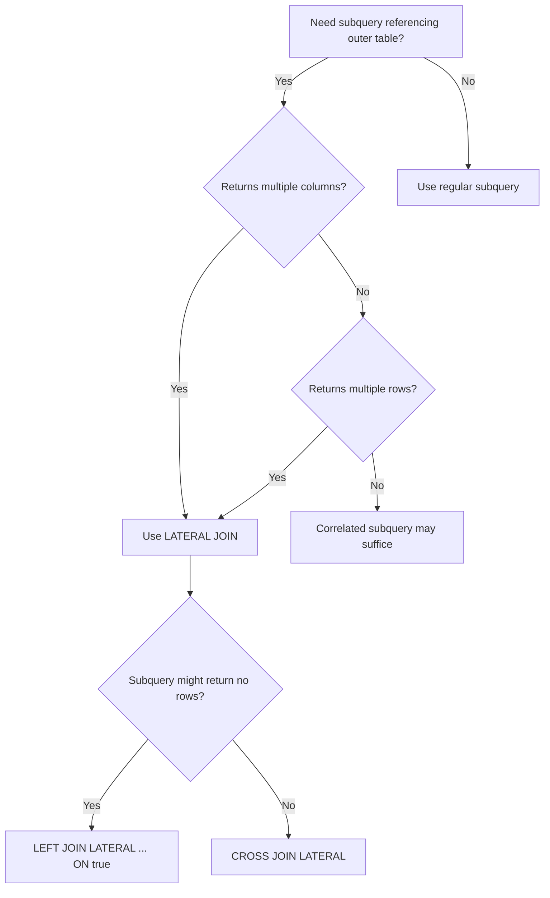

# How to Use LATERAL JOIN vs Subquery in PostgreSQL

Author: [nawazdhandala](https://www.github.com/nawazdhandala)

Tags: PostgreSQL, SQL, LATERAL JOIN, Subqueries, Query Optimization, Performance

Description: Understand when to use LATERAL JOIN versus traditional subqueries in PostgreSQL. Learn the syntax, performance implications, and practical use cases for each approach.

---

LATERAL JOIN is one of PostgreSQL's most powerful but underused features. It allows subqueries in the FROM clause to reference columns from preceding tables, enabling query patterns that are impossible or awkward with regular subqueries. This guide explains when and how to use LATERAL joins effectively.

## Understanding the LATERAL Keyword

In standard SQL, a subquery in the FROM clause cannot reference other tables in the same FROM clause. LATERAL removes this restriction.

```sql
-- Standard subquery (cannot reference 'users' table)
SELECT u.name, sub.order_count
FROM users u,
    (SELECT COUNT(*) as order_count
     FROM orders
     WHERE user_id = u.id) sub;  -- ERROR: u.id not visible here

-- LATERAL subquery (can reference 'users' table)
SELECT u.name, sub.order_count
FROM users u,
LATERAL (
    SELECT COUNT(*) as order_count
    FROM orders
    WHERE user_id = u.id
) sub;  -- Works: LATERAL allows reference to u.id
```

## Basic LATERAL JOIN Syntax

The LATERAL keyword enables the subquery to access columns from tables appearing earlier in the FROM clause.

```sql
-- Create sample tables
CREATE TABLE departments (
    id SERIAL PRIMARY KEY,
    name VARCHAR(100)
);

CREATE TABLE employees (
    id SERIAL PRIMARY KEY,
    department_id INTEGER REFERENCES departments(id),
    name VARCHAR(100),
    salary DECIMAL(10,2),
    hire_date DATE
);

-- Get the top 3 highest paid employees per department
SELECT d.name AS department, e.name AS employee, e.salary
FROM departments d
CROSS JOIN LATERAL (
    SELECT name, salary
    FROM employees
    WHERE department_id = d.id
    ORDER BY salary DESC
    LIMIT 3
) e;
```

This query would be complex or impossible without LATERAL. Traditional approaches would require window functions or multiple queries.

## LATERAL vs Correlated Subquery

A correlated subquery in the SELECT clause runs once per row. LATERAL provides similar functionality but in the FROM clause, with more flexibility.

```sql
-- Correlated subquery approach (limited to one column/row)
SELECT
    d.name,
    (SELECT MAX(salary) FROM employees WHERE department_id = d.id) AS max_salary
FROM departments d;

-- LATERAL approach (can return multiple columns and rows)
SELECT d.name, stats.max_salary, stats.min_salary, stats.avg_salary
FROM departments d
CROSS JOIN LATERAL (
    SELECT
        MAX(salary) AS max_salary,
        MIN(salary) AS min_salary,
        AVG(salary) AS avg_salary
    FROM employees
    WHERE department_id = d.id
) stats;
```

## CROSS JOIN LATERAL vs LEFT JOIN LATERAL

Use `CROSS JOIN LATERAL` when the subquery always returns rows. Use `LEFT JOIN LATERAL` when the subquery might return no rows.

```sql
-- CROSS JOIN LATERAL: departments with no employees are excluded
SELECT d.name, e.name AS top_earner
FROM departments d
CROSS JOIN LATERAL (
    SELECT name FROM employees
    WHERE department_id = d.id
    ORDER BY salary DESC LIMIT 1
) e;

-- LEFT JOIN LATERAL: includes departments even with no employees
SELECT d.name, e.name AS top_earner
FROM departments d
LEFT JOIN LATERAL (
    SELECT name FROM employees
    WHERE department_id = d.id
    ORDER BY salary DESC LIMIT 1
) e ON true;  -- ON true is required for LEFT JOIN LATERAL
```

## Practical Use Case: Top N Per Group

Finding the top N items per group is a classic LATERAL use case.

```sql
-- Create an orders table
CREATE TABLE orders (
    id SERIAL PRIMARY KEY,
    customer_id INTEGER,
    order_date DATE,
    total_amount DECIMAL(10,2)
);

-- Get the 5 most recent orders per customer
SELECT c.id AS customer_id, c.name, recent.order_date, recent.total_amount
FROM customers c
CROSS JOIN LATERAL (
    SELECT order_date, total_amount
    FROM orders
    WHERE customer_id = c.id
    ORDER BY order_date DESC
    LIMIT 5
) recent;

-- Compare with window function approach
WITH ranked_orders AS (
    SELECT
        customer_id,
        order_date,
        total_amount,
        ROW_NUMBER() OVER (PARTITION BY customer_id ORDER BY order_date DESC) AS rn
    FROM orders
)
SELECT c.id, c.name, r.order_date, r.total_amount
FROM customers c
JOIN ranked_orders r ON r.customer_id = c.id AND r.rn <= 5;
```

Both approaches work, but LATERAL can be more efficient when each group has many rows and you only need a few.

## LATERAL with Set-Returning Functions

LATERAL is implicit when using set-returning functions like `unnest()` or `generate_series()`.

```sql
-- Expand array into rows (LATERAL is implicit)
SELECT p.name, tag
FROM products p, unnest(p.tags) AS tag;

-- Explicit LATERAL (same result)
SELECT p.name, tag
FROM products p
CROSS JOIN LATERAL unnest(p.tags) AS tag;

-- Generate date range for each subscription
SELECT s.user_id, dates.d AS subscription_day
FROM subscriptions s
CROSS JOIN LATERAL generate_series(s.start_date, s.end_date, '1 day') AS dates(d);
```

## Performance Comparison

LATERAL executes the subquery for each row from the left table. Understanding this is crucial for performance.

```sql
-- Check query execution plan
EXPLAIN ANALYZE
SELECT d.name, e.name, e.salary
FROM departments d
CROSS JOIN LATERAL (
    SELECT name, salary FROM employees
    WHERE department_id = d.id
    ORDER BY salary DESC LIMIT 3
) e;

-- Ensure supporting indexes exist
CREATE INDEX idx_employees_dept_salary
ON employees (department_id, salary DESC);
```

The execution plan shows a nested loop where the lateral subquery runs for each department. With proper indexes, this is efficient.

## LATERAL for Running Calculations

LATERAL enables calculations that depend on previous rows without window functions.

```sql
-- Calculate running total with LATERAL
SELECT
    o.id,
    o.order_date,
    o.amount,
    running.total
FROM orders o
CROSS JOIN LATERAL (
    SELECT SUM(amount) AS total
    FROM orders
    WHERE order_date <= o.order_date
) running
ORDER BY o.order_date;

-- Window function alternative (usually more efficient)
SELECT
    id,
    order_date,
    amount,
    SUM(amount) OVER (ORDER BY order_date) AS total
FROM orders
ORDER BY order_date;
```

For running totals, window functions are typically better. LATERAL shines in more complex scenarios.

## Complex Aggregations with LATERAL

When you need multiple different aggregations that cannot share a window frame, LATERAL helps.

```sql
-- Get various statistics for each product
SELECT
    p.name,
    stats.recent_orders,
    stats.recent_revenue,
    lifetime.total_orders,
    lifetime.total_revenue
FROM products p
CROSS JOIN LATERAL (
    -- Last 30 days statistics
    SELECT
        COUNT(*) AS recent_orders,
        COALESCE(SUM(quantity * unit_price), 0) AS recent_revenue
    FROM order_items oi
    JOIN orders o ON o.id = oi.order_id
    WHERE oi.product_id = p.id
        AND o.order_date > CURRENT_DATE - 30
) stats
CROSS JOIN LATERAL (
    -- Lifetime statistics
    SELECT
        COUNT(*) AS total_orders,
        COALESCE(SUM(quantity * unit_price), 0) AS total_revenue
    FROM order_items oi
    WHERE oi.product_id = p.id
) lifetime;
```

## LATERAL with JSON Operations

LATERAL combines well with PostgreSQL's JSON functions.

```sql
-- Table with JSON array column
CREATE TABLE api_responses (
    id SERIAL PRIMARY KEY,
    endpoint VARCHAR(100),
    response_data JSONB
);

-- Extract nested JSON array elements
SELECT
    r.endpoint,
    item->>'name' AS item_name,
    (item->>'price')::DECIMAL AS item_price
FROM api_responses r
CROSS JOIN LATERAL jsonb_array_elements(r.response_data->'items') AS item
WHERE (item->>'price')::DECIMAL > 100;
```

## When to Choose LATERAL

Use LATERAL when you need:

1. Top N per group queries
2. Subqueries that must reference outer table columns
3. Multiple aggregations with different groupings
4. Expansion of array or JSON data with filtering

```sql
-- Example: Find the first order after each customer's registration
SELECT c.id, c.name, c.registered_at, first_order.order_date
FROM customers c
LEFT JOIN LATERAL (
    SELECT order_date
    FROM orders
    WHERE customer_id = c.id
        AND order_date > c.registered_at
    ORDER BY order_date
    LIMIT 1
) first_order ON true;
```

## Query Pattern Summary



LATERAL JOIN bridges the gap between correlated subqueries and regular joins. It provides flexibility for complex queries while maintaining readable SQL. Master this feature, and many previously difficult query patterns become straightforward.
