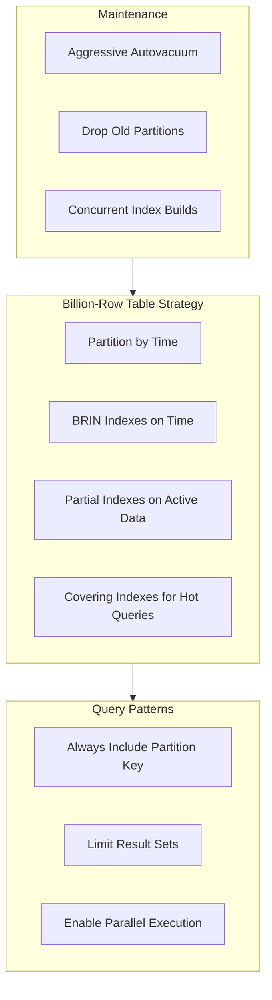

# How to Optimize PostgreSQL for Billion-Row Tables

Author: [nawazdhandala](https://www.github.com/nawazdhandala)

Tags: PostgreSQL, Database, Performance, Partitioning, Optimization, Big Data

Description: Learn how to handle billion-row tables in PostgreSQL with partitioning, proper indexing, query optimization, and maintenance strategies. This guide covers practical techniques for managing massive datasets efficiently.

---

A billion rows sounds intimidating, but PostgreSQL handles it well with the right approach. The key is not to treat a billion-row table like a small table. You need partitioning, targeted indexing, careful query patterns, and aggressive maintenance. Here is how to make it work.

## The Problem with Big Tables

When tables grow beyond hundreds of millions of rows, problems compound:

- Index maintenance becomes slow (hours for a single CREATE INDEX)
- VACUUM struggles to keep up with dead tuples
- Query plans may choose sequential scans over index scans
- Backup and restore times become prohibitive
- Single-row lookups remain fast, but range queries suffer

## Table Partitioning

Partitioning splits a logical table into smaller physical tables. Queries automatically target only relevant partitions.

### Range Partitioning by Date

Most billion-row tables have a time dimension. Partition by it.

```sql
-- Create partitioned table
CREATE TABLE events (
    id BIGSERIAL,
    event_time TIMESTAMPTZ NOT NULL,
    user_id BIGINT NOT NULL,
    event_type TEXT NOT NULL,
    payload JSONB,
    PRIMARY KEY (id, event_time)
) PARTITION BY RANGE (event_time);

-- Create monthly partitions
CREATE TABLE events_2026_01 PARTITION OF events
    FOR VALUES FROM ('2026-01-01') TO ('2026-02-01');

CREATE TABLE events_2026_02 PARTITION OF events
    FOR VALUES FROM ('2026-02-01') TO ('2026-03-01');

-- Continue for each month...
```

### Automate Partition Creation

```sql
-- Function to create partitions automatically
CREATE OR REPLACE FUNCTION create_monthly_partition(
    table_name TEXT,
    partition_date DATE
)
RETURNS VOID AS $$
DECLARE
    partition_name TEXT;
    start_date DATE;
    end_date DATE;
BEGIN
    start_date := date_trunc('month', partition_date);
    end_date := start_date + INTERVAL '1 month';
    partition_name := table_name || '_' || to_char(start_date, 'YYYY_MM');

    EXECUTE format(
        'CREATE TABLE IF NOT EXISTS %I PARTITION OF %I
         FOR VALUES FROM (%L) TO (%L)',
        partition_name, table_name, start_date, end_date
    );

    RAISE NOTICE 'Created partition: %', partition_name;
END;
$$ LANGUAGE plpgsql;

-- Create partitions for next 12 months
DO $$
BEGIN
    FOR i IN 0..11 LOOP
        PERFORM create_monthly_partition(
            'events',
            CURRENT_DATE + (i || ' months')::INTERVAL
        );
    END LOOP;
END $$;
```

### Partition Pruning

PostgreSQL automatically skips irrelevant partitions when the query includes the partition key.

```sql
-- This query only scans January 2026 partition
EXPLAIN ANALYZE
SELECT * FROM events
WHERE event_time >= '2026-01-01'
  AND event_time < '2026-01-15';
```

Output shows partition pruning:

```
Append  (cost=0.00..1234.56 rows=10000 width=100)
  ->  Seq Scan on events_2026_01  (cost=0.00..1234.56 rows=10000 width=100)
        Filter: ((event_time >= '2026-01-01') AND (event_time < '2026-01-15'))
```

## Indexing Strategies

### Partial Indexes

Index only the data you query frequently.

```sql
-- Index only active users (skip historical/deleted)
CREATE INDEX idx_events_active_users ON events (user_id, event_time)
    WHERE event_time > '2025-01-01';

-- Index only specific event types
CREATE INDEX idx_events_purchases ON events (user_id, event_time)
    WHERE event_type = 'purchase';
```

### BRIN Indexes for Time-Series Data

Block Range INdexes are tiny and perfect for naturally ordered data.

```sql
-- BRIN index on time column (very small, very fast for range queries)
CREATE INDEX idx_events_time_brin ON events USING brin (event_time);

-- Compare sizes
SELECT
    indexrelid::regclass AS index_name,
    pg_size_pretty(pg_relation_size(indexrelid)) AS size
FROM pg_stat_user_indexes
WHERE relname = 'events';

-- BRIN: 100 KB
-- B-tree on same column: 10 GB
```

### Covering Indexes

Include columns in the index to enable index-only scans.

```sql
-- Include payload in index to avoid heap access
CREATE INDEX idx_events_covering ON events (user_id, event_time)
    INCLUDE (event_type, payload);

-- Now this query uses index-only scan
SELECT user_id, event_time, event_type, payload
FROM events
WHERE user_id = 12345 AND event_time > '2026-01-01';
```

### Concurrent Index Creation

Never lock a billion-row table for index creation.

```sql
-- Create index without blocking writes
CREATE INDEX CONCURRENTLY idx_events_user ON events (user_id);

-- This takes hours but does not block production
```

## Query Optimization

### Use the Partition Key

Always include the partition key in WHERE clauses.

```sql
-- Bad: scans all partitions
SELECT COUNT(*) FROM events WHERE user_id = 12345;

-- Good: scans only relevant partitions
SELECT COUNT(*) FROM events
WHERE user_id = 12345
  AND event_time > '2026-01-01';
```

### Limit Result Sets

```sql
-- Bad: returns millions of rows
SELECT * FROM events WHERE event_type = 'pageview';

-- Good: paginate results
SELECT * FROM events
WHERE event_type = 'pageview'
  AND event_time > '2026-01-20'
ORDER BY event_time DESC
LIMIT 1000;
```

### Use Approximate Counts

```sql
-- Bad: exact count takes minutes
SELECT COUNT(*) FROM events;

-- Good: approximate count from statistics (instant)
SELECT reltuples::bigint AS approximate_count
FROM pg_class
WHERE relname = 'events';

-- Or use HyperLogLog extension for cardinality
CREATE EXTENSION IF NOT EXISTS hll;
```

### Parallel Query Execution

```sql
-- Enable parallel queries
SET max_parallel_workers_per_gather = 4;

-- Queries will use multiple workers
EXPLAIN ANALYZE
SELECT event_type, COUNT(*)
FROM events
WHERE event_time > '2026-01-01'
GROUP BY event_type;
```

## Maintenance at Scale

### Aggressive Autovacuum

```sql
-- Per-table autovacuum tuning for high-churn tables
ALTER TABLE events SET (
    autovacuum_vacuum_scale_factor = 0.01,  -- Vacuum at 1% dead tuples
    autovacuum_analyze_scale_factor = 0.005,
    autovacuum_vacuum_cost_delay = 0         -- No throttling
);
```

### Partition-Level Maintenance

```sql
-- VACUUM individual partitions during off-peak
VACUUM ANALYZE events_2026_01;

-- REINDEX individual partitions
REINDEX TABLE CONCURRENTLY events_2026_01;
```

### Drop Old Partitions

```sql
-- Archiving pattern: detach and drop old partitions
-- First, detach (fast, does not delete data)
ALTER TABLE events DETACH PARTITION events_2024_01;

-- Archive to cold storage
COPY events_2024_01 TO '/archive/events_2024_01.csv' WITH CSV HEADER;

-- Then drop
DROP TABLE events_2024_01;
```

## Memory and Configuration

### Increase Work Memory

```sql
-- For analytical queries on big tables
SET work_mem = '256MB';

-- Or per-session for reporting
ALTER ROLE analyst SET work_mem = '512MB';
```

### Tune Parallelism

```ini
# postgresql.conf
max_parallel_workers = 8
max_parallel_workers_per_gather = 4
parallel_tuple_cost = 0.01
parallel_setup_cost = 100
min_parallel_table_scan_size = 8MB
```

### Effective Cache Size

```ini
# Tell planner about available memory (OS cache + shared_buffers)
effective_cache_size = 48GB  # For 64GB RAM server
```

## Monitoring Performance

```sql
-- Find slow queries on big tables
SELECT
    substring(query, 1, 100) AS query,
    calls,
    total_exec_time / 1000 AS total_seconds,
    mean_exec_time AS avg_ms,
    rows / NULLIF(calls, 0) AS avg_rows
FROM pg_stat_statements
WHERE query ILIKE '%events%'
ORDER BY total_exec_time DESC
LIMIT 20;

-- Check partition sizes
SELECT
    inhrelid::regclass AS partition,
    pg_size_pretty(pg_relation_size(inhrelid)) AS size,
    (SELECT reltuples FROM pg_class WHERE oid = inhrelid)::bigint AS estimated_rows
FROM pg_inherits
WHERE inhparent = 'events'::regclass
ORDER BY pg_relation_size(inhrelid) DESC;

-- Index usage on partitions
SELECT
    schemaname,
    relname,
    indexrelname,
    idx_scan,
    idx_tup_read
FROM pg_stat_user_indexes
WHERE relname LIKE 'events_%'
ORDER BY idx_scan DESC;
```

## Data Loading Best Practices

### Bulk Loading with COPY

```sql
-- Disable indexes temporarily
ALTER TABLE events_2026_01 SET (autovacuum_enabled = false);

-- Load data
COPY events_2026_01 FROM '/data/events.csv' WITH CSV HEADER;

-- Re-enable and analyze
ALTER TABLE events_2026_01 SET (autovacuum_enabled = true);
ANALYZE events_2026_01;
```

### Parallel Loading

```bash
#!/bin/bash
# Load multiple partition files in parallel

for file in /data/events_2026_*.csv; do
    partition=$(basename "$file" .csv)
    psql -c "COPY ${partition} FROM '${file}' WITH CSV HEADER" &
done
wait
```

## Architecture Summary



---

Billion-row tables in PostgreSQL are manageable with the right architecture. Partition early, index strategically, and maintain aggressively. The combination of time-based partitioning, BRIN indexes, and parallel query execution lets PostgreSQL handle datasets that would crush a naive table design.
