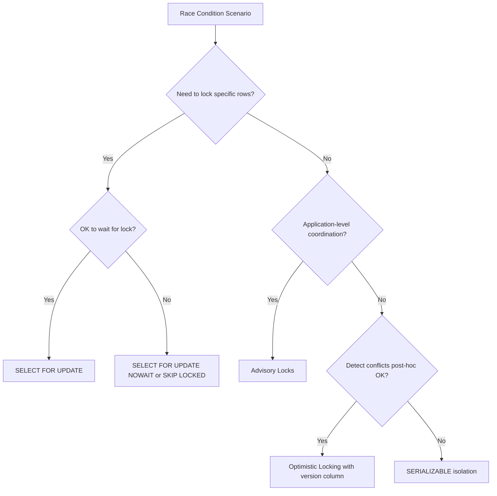

# How to Handle Race Conditions in PostgreSQL Functions

Author: [nawazdhandala](https://www.github.com/nawazdhandala)

Tags: PostgreSQL, Concurrency, Race Conditions, Locking, SERIALIZABLE, Advisory Locks

Description: Learn how to prevent race conditions in PostgreSQL functions using row locking, advisory locks, and serializable transactions. This guide covers common patterns and practical solutions.

---

Race conditions occur when multiple database connections try to read and modify the same data simultaneously. Without proper handling, this leads to lost updates, duplicate entries, and inconsistent data. PostgreSQL provides several mechanisms to prevent race conditions, and choosing the right one depends on your specific use case.

## Understanding the Problem

Consider a simple inventory update where two transactions read the same quantity and both try to decrement it.

```sql
-- Table setup
CREATE TABLE inventory (
    product_id INTEGER PRIMARY KEY,
    quantity INTEGER NOT NULL CHECK (quantity >= 0)
);

INSERT INTO inventory VALUES (1, 10);

-- Transaction 1 reads quantity = 10
-- Transaction 2 reads quantity = 10
-- Transaction 1 decrements: UPDATE inventory SET quantity = 9 WHERE product_id = 1
-- Transaction 2 decrements: UPDATE inventory SET quantity = 9 WHERE product_id = 1
-- Result: quantity = 9 (should be 8!)
```

Both transactions read the same value, compute the same result, and the second update overwrites the first. This is a classic lost update problem.

## Solution 1: SELECT FOR UPDATE

Row-level locking prevents concurrent access to the same rows.

```sql
-- Safe inventory decrement function
CREATE OR REPLACE FUNCTION decrement_inventory(
    p_product_id INTEGER,
    p_quantity INTEGER
) RETURNS INTEGER AS $$
DECLARE
    current_qty INTEGER;
    new_qty INTEGER;
BEGIN
    -- Lock the row for update (other transactions wait here)
    SELECT quantity INTO current_qty
    FROM inventory
    WHERE product_id = p_product_id
    FOR UPDATE;

    -- Check if we have enough inventory
    IF current_qty IS NULL THEN
        RAISE EXCEPTION 'Product % not found', p_product_id;
    END IF;

    IF current_qty < p_quantity THEN
        RAISE EXCEPTION 'Insufficient inventory: have %, need %',
            current_qty, p_quantity;
    END IF;

    -- Perform the update
    new_qty := current_qty - p_quantity;
    UPDATE inventory
    SET quantity = new_qty
    WHERE product_id = p_product_id;

    RETURN new_qty;
END;
$$ LANGUAGE plpgsql;

-- Usage
SELECT decrement_inventory(1, 3);
```

The `FOR UPDATE` clause locks the selected rows until the transaction commits or rolls back. Other transactions attempting to lock the same rows will wait.

## Solution 2: SKIP LOCKED for Job Queues

For queue-like patterns where any available row will do, use `SKIP LOCKED`.

```sql
-- Job queue table
CREATE TABLE job_queue (
    id SERIAL PRIMARY KEY,
    payload JSONB NOT NULL,
    status VARCHAR(20) DEFAULT 'pending',
    worker_id INTEGER,
    created_at TIMESTAMP DEFAULT CURRENT_TIMESTAMP,
    started_at TIMESTAMP,
    completed_at TIMESTAMP
);

-- Worker picks up a job without blocking
CREATE OR REPLACE FUNCTION claim_job(p_worker_id INTEGER)
RETURNS TABLE(job_id INTEGER, job_payload JSONB) AS $$
BEGIN
    RETURN QUERY
    UPDATE job_queue
    SET
        status = 'processing',
        worker_id = p_worker_id,
        started_at = CURRENT_TIMESTAMP
    WHERE id = (
        SELECT id
        FROM job_queue
        WHERE status = 'pending'
        ORDER BY created_at
        LIMIT 1
        FOR UPDATE SKIP LOCKED  -- Skip rows locked by other workers
    )
    RETURNING id, payload;
END;
$$ LANGUAGE plpgsql;

-- Multiple workers can call this simultaneously without blocking
SELECT * FROM claim_job(1);
```

## Solution 3: Advisory Locks

Advisory locks provide application-level locking that is not tied to specific rows.

```sql
-- Advisory lock for a specific operation
CREATE OR REPLACE FUNCTION process_daily_report(p_date DATE)
RETURNS void AS $$
DECLARE
    lock_key BIGINT;
    lock_acquired BOOLEAN;
BEGIN
    -- Generate a unique lock key from the date
    lock_key := hashtext(p_date::TEXT);

    -- Try to acquire the lock (non-blocking)
    lock_acquired := pg_try_advisory_lock(lock_key);

    IF NOT lock_acquired THEN
        RAISE NOTICE 'Another process is already generating report for %', p_date;
        RETURN;
    END IF;

    -- Perform the report generation
    BEGIN
        -- ... report logic here ...
        RAISE NOTICE 'Generating report for %', p_date;
        PERFORM pg_sleep(5);  -- Simulate work

    EXCEPTION WHEN OTHERS THEN
        -- Always release the lock on error
        PERFORM pg_advisory_unlock(lock_key);
        RAISE;
    END;

    -- Release the lock when done
    PERFORM pg_advisory_unlock(lock_key);
END;
$$ LANGUAGE plpgsql;

-- Transaction-level advisory locks (auto-release on commit/rollback)
CREATE OR REPLACE FUNCTION safe_transfer(
    from_account INTEGER,
    to_account INTEGER,
    amount DECIMAL
) RETURNS void AS $$
DECLARE
    lock1 BIGINT;
    lock2 BIGINT;
BEGIN
    -- Always acquire locks in consistent order to prevent deadlocks
    IF from_account < to_account THEN
        lock1 := from_account;
        lock2 := to_account;
    ELSE
        lock1 := to_account;
        lock2 := from_account;
    END IF;

    -- Acquire transaction-level advisory locks
    PERFORM pg_advisory_xact_lock(lock1);
    PERFORM pg_advisory_xact_lock(lock2);

    -- Perform transfer
    UPDATE accounts SET balance = balance - amount WHERE id = from_account;
    UPDATE accounts SET balance = balance + amount WHERE id = to_account;

    -- Locks automatically released on commit
END;
$$ LANGUAGE plpgsql;
```

## Solution 4: Serializable Isolation Level

The SERIALIZABLE isolation level detects and prevents serialization anomalies.

```sql
-- Use serializable for the entire transaction
BEGIN ISOLATION LEVEL SERIALIZABLE;

-- Read the value
SELECT balance FROM accounts WHERE id = 1;

-- Perform updates based on read value
UPDATE accounts SET balance = balance - 100 WHERE id = 1;

COMMIT;
-- If another transaction modified the row, this COMMIT will fail
-- with a serialization error, and you must retry
```

Function with retry logic for serializable transactions:

```sql
CREATE OR REPLACE FUNCTION transfer_with_retry(
    from_account INTEGER,
    to_account INTEGER,
    amount DECIMAL,
    max_retries INTEGER DEFAULT 3
) RETURNS BOOLEAN AS $$
DECLARE
    retry_count INTEGER := 0;
BEGIN
    LOOP
        BEGIN
            -- Start serializable transaction
            -- Note: In a function, we use SAVEPOINT for nested transaction-like behavior

            -- Check source balance
            IF (SELECT balance FROM accounts WHERE id = from_account) < amount THEN
                RAISE EXCEPTION 'Insufficient funds';
            END IF;

            -- Perform transfer
            UPDATE accounts SET balance = balance - amount WHERE id = from_account;
            UPDATE accounts SET balance = balance + amount WHERE id = to_account;

            RETURN TRUE;

        EXCEPTION
            WHEN serialization_failure OR deadlock_detected THEN
                retry_count := retry_count + 1;
                IF retry_count >= max_retries THEN
                    RAISE EXCEPTION 'Transfer failed after % retries', max_retries;
                END IF;
                -- Wait briefly before retry
                PERFORM pg_sleep(random() * 0.1);
        END;
    END LOOP;
END;
$$ LANGUAGE plpgsql;
```

## Solution 5: Optimistic Locking with Version Numbers

Track row versions and detect concurrent modifications.

```sql
-- Table with version column
CREATE TABLE documents (
    id SERIAL PRIMARY KEY,
    title VARCHAR(200),
    content TEXT,
    version INTEGER DEFAULT 1,
    updated_at TIMESTAMP DEFAULT CURRENT_TIMESTAMP
);

-- Update only if version matches
CREATE OR REPLACE FUNCTION update_document(
    p_id INTEGER,
    p_title VARCHAR,
    p_content TEXT,
    p_expected_version INTEGER
) RETURNS BOOLEAN AS $$
DECLARE
    rows_updated INTEGER;
BEGIN
    UPDATE documents
    SET
        title = p_title,
        content = p_content,
        version = version + 1,
        updated_at = CURRENT_TIMESTAMP
    WHERE id = p_id
        AND version = p_expected_version;

    GET DIAGNOSTICS rows_updated = ROW_COUNT;

    IF rows_updated = 0 THEN
        -- Either document doesn't exist or version mismatch
        IF EXISTS (SELECT 1 FROM documents WHERE id = p_id) THEN
            RAISE EXCEPTION 'Document was modified by another user. Please refresh and try again.';
        ELSE
            RAISE EXCEPTION 'Document not found';
        END IF;
    END IF;

    RETURN TRUE;
END;
$$ LANGUAGE plpgsql;

-- Usage
SELECT update_document(1, 'New Title', 'New Content', 1);
```

## Solution 6: Atomic Upserts with ON CONFLICT

The `INSERT ... ON CONFLICT` statement provides atomic upsert behavior.

```sql
-- Counter table
CREATE TABLE page_views (
    page_url TEXT PRIMARY KEY,
    view_count BIGINT DEFAULT 0,
    last_viewed TIMESTAMP
);

-- Atomic increment (no race condition possible)
INSERT INTO page_views (page_url, view_count, last_viewed)
VALUES ('/home', 1, CURRENT_TIMESTAMP)
ON CONFLICT (page_url) DO UPDATE SET
    view_count = page_views.view_count + 1,
    last_viewed = CURRENT_TIMESTAMP;

-- Function for atomic counter increment
CREATE OR REPLACE FUNCTION increment_page_view(p_url TEXT)
RETURNS BIGINT AS $$
DECLARE
    new_count BIGINT;
BEGIN
    INSERT INTO page_views (page_url, view_count, last_viewed)
    VALUES (p_url, 1, CURRENT_TIMESTAMP)
    ON CONFLICT (page_url) DO UPDATE SET
        view_count = page_views.view_count + 1,
        last_viewed = CURRENT_TIMESTAMP
    RETURNING view_count INTO new_count;

    RETURN new_count;
END;
$$ LANGUAGE plpgsql;
```

## Preventing Duplicate Inserts

Use unique constraints and handle conflicts gracefully.

```sql
-- Table with unique constraint
CREATE TABLE user_actions (
    user_id INTEGER,
    action_type VARCHAR(50),
    action_date DATE,
    details JSONB,
    created_at TIMESTAMP DEFAULT CURRENT_TIMESTAMP,
    UNIQUE (user_id, action_type, action_date)
);

-- Safe insert that handles duplicates
CREATE OR REPLACE FUNCTION record_user_action(
    p_user_id INTEGER,
    p_action_type VARCHAR,
    p_date DATE,
    p_details JSONB
) RETURNS BOOLEAN AS $$
BEGIN
    INSERT INTO user_actions (user_id, action_type, action_date, details)
    VALUES (p_user_id, p_action_type, p_date, p_details)
    ON CONFLICT (user_id, action_type, action_date) DO NOTHING;

    -- Return true if inserted, false if duplicate
    RETURN FOUND;
END;
$$ LANGUAGE plpgsql;
```

## Choosing the Right Approach



Each approach has trade-offs. Row locking is simple but can cause contention. Advisory locks are flexible but require careful management. Optimistic locking works well for rarely-conflicting updates. Choose based on your concurrency patterns and performance requirements.
