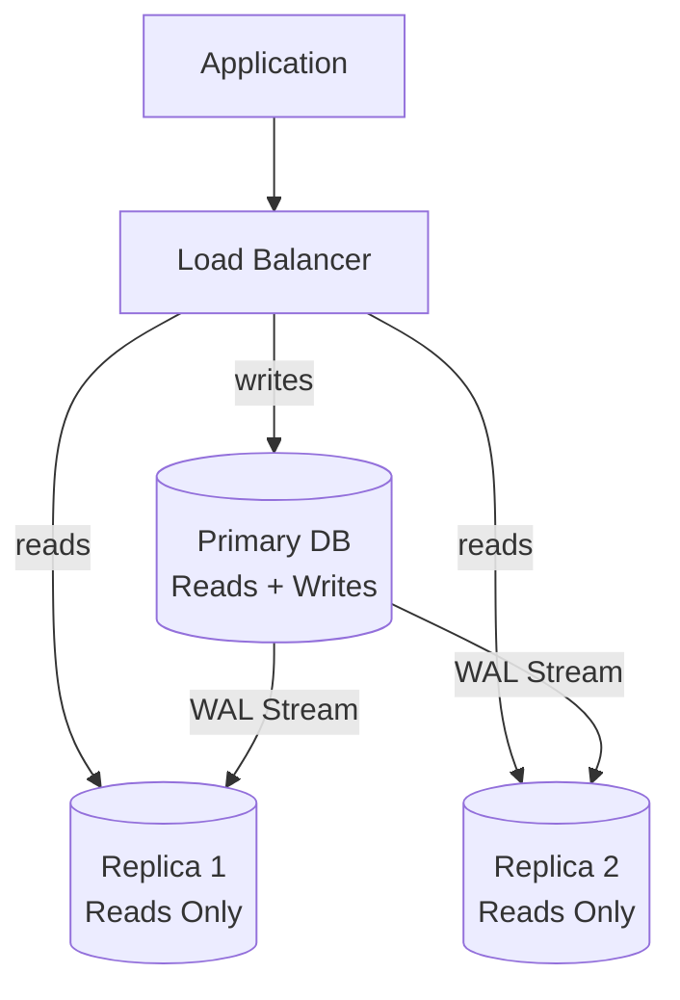

# How to Set Up Read Replicas in PostgreSQL

Author: [nawazdhandala](https://www.github.com/nawazdhandala)

Tags: PostgreSQL, Database, Replication, Read Replicas, High Availability, Scaling

Description: A practical guide to setting up PostgreSQL read replicas using streaming replication. Learn how to configure primary and replica servers, monitor replication lag, and handle failover scenarios.

---

As your application grows, the database often becomes the bottleneck. Read replicas solve this by distributing read queries across multiple servers while the primary handles all writes. PostgreSQL's streaming replication makes this straightforward to set up and maintain.

## Replication Architecture Overview



Streaming replication continuously ships Write-Ahead Log (WAL) records from the primary to replicas. Replicas apply these changes to stay synchronized.

## Prerequisites

- Two or more PostgreSQL servers running the same major version
- Network connectivity between servers on port 5432
- Sufficient disk space for WAL files on primary
- Same PostgreSQL configuration files as a starting point

## Step 1: Configure the Primary Server

Edit `postgresql.conf` on the primary server.

```ini
# Enable WAL archiving and replication
wal_level = replica                    # Required for replication
max_wal_senders = 10                   # Max number of replicas
wal_keep_size = 1GB                    # Keep WAL files for slow replicas
hot_standby = on                       # Allow queries on replicas

# Recommended settings for replication
synchronous_commit = on                # Can set to 'remote_apply' for sync replication
max_replication_slots = 10             # Prevent WAL deletion before replica catches up

# Archive settings (optional but recommended for point-in-time recovery)
archive_mode = on
archive_command = 'cp %p /var/lib/postgresql/archive/%f'
```

## Step 2: Create Replication User

Connect to the primary and create a dedicated replication user.

```sql
-- Create replication user with limited privileges
CREATE USER replicator WITH REPLICATION ENCRYPTED PASSWORD 'your_secure_password';

-- Grant necessary permissions
GRANT CONNECT ON DATABASE postgres TO replicator;
```

## Step 3: Configure Host-Based Authentication

Edit `pg_hba.conf` on the primary to allow replication connections.

```
# Allow replication connections from replica servers
# TYPE  DATABASE        USER            ADDRESS                 METHOD
host    replication     replicator      192.168.1.0/24          scram-sha-256

# Or for specific replica IPs
host    replication     replicator      192.168.1.101/32        scram-sha-256
host    replication     replicator      192.168.1.102/32        scram-sha-256
```

Reload the configuration.

```bash
# Reload PostgreSQL configuration
sudo systemctl reload postgresql

# Or from psql
SELECT pg_reload_conf();
```

## Step 4: Create Replication Slot

Replication slots prevent the primary from deleting WAL files that replicas still need.

```sql
-- Create a slot for each replica
SELECT pg_create_physical_replication_slot('replica_1_slot');
SELECT pg_create_physical_replication_slot('replica_2_slot');

-- Verify slots were created
SELECT slot_name, slot_type, active
FROM pg_replication_slots;
```

## Step 5: Set Up the Replica Server

On the replica server, stop PostgreSQL and clear the data directory.

```bash
# Stop PostgreSQL on replica
sudo systemctl stop postgresql

# Clear existing data (backup first if needed)
sudo rm -rf /var/lib/postgresql/16/main/*
```

Take a base backup from the primary.

```bash
# Run as postgres user on replica
sudo -u postgres pg_basebackup \
    -h primary.example.com \
    -D /var/lib/postgresql/16/main \
    -U replicator \
    -v \
    -P \
    -X stream \
    -S replica_1_slot \
    -R
```

The `-R` flag creates `standby.signal` and configures `postgresql.auto.conf` with connection settings.

## Step 6: Configure Replica Connection Settings

Check that `postgresql.auto.conf` on the replica contains the correct connection info.

```ini
# This should be auto-generated by pg_basebackup -R
primary_conninfo = 'host=primary.example.com port=5432 user=replicator password=your_secure_password'
primary_slot_name = 'replica_1_slot'
```

Verify `standby.signal` exists in the data directory.

```bash
# This file marks the server as a standby
ls -la /var/lib/postgresql/16/main/standby.signal
```

## Step 7: Start the Replica

```bash
# Start PostgreSQL on replica
sudo systemctl start postgresql

# Check logs for replication status
sudo tail -f /var/log/postgresql/postgresql-16-main.log
```

You should see messages like:

```
LOG:  entering standby mode
LOG:  redo starts at 0/3000028
LOG:  consistent recovery state reached at 0/3000100
LOG:  started streaming WAL from primary at 0/4000000
```

## Verifying Replication

### Check on Primary

```sql
-- View connected replicas
SELECT
    client_addr,
    state,
    sent_lsn,
    write_lsn,
    flush_lsn,
    replay_lsn,
    pg_size_pretty(pg_wal_lsn_diff(sent_lsn, replay_lsn)) AS replication_lag
FROM pg_stat_replication;

-- Check replication slot status
SELECT
    slot_name,
    active,
    pg_size_pretty(pg_wal_lsn_diff(pg_current_wal_lsn(), restart_lsn)) AS slot_lag
FROM pg_replication_slots;
```

### Check on Replica

```sql
-- Verify replica is in recovery mode
SELECT pg_is_in_recovery();

-- Check replication status
SELECT
    status,
    received_lsn,
    latest_end_lsn,
    last_msg_receipt_time
FROM pg_stat_wal_receiver;

-- Check lag in seconds
SELECT
    EXTRACT(EPOCH FROM (now() - pg_last_xact_replay_timestamp()))::INT
    AS lag_seconds;
```

## Monitoring Replication Lag

Create a monitoring query for alerting.

```sql
-- Run on primary to check all replicas
WITH replication_info AS (
    SELECT
        client_addr,
        application_name,
        state,
        pg_wal_lsn_diff(pg_current_wal_lsn(), replay_lsn) AS lag_bytes,
        pg_wal_lsn_diff(sent_lsn, replay_lsn) AS pending_bytes
    FROM pg_stat_replication
)
SELECT
    client_addr,
    application_name,
    state,
    pg_size_pretty(lag_bytes) AS lag,
    pg_size_pretty(pending_bytes) AS pending,
    CASE
        WHEN lag_bytes > 100000000 THEN 'CRITICAL'  -- 100MB
        WHEN lag_bytes > 10000000 THEN 'WARNING'    -- 10MB
        ELSE 'OK'
    END AS status
FROM replication_info;
```

## Handling Failover

When the primary fails, promote a replica to become the new primary.

### Manual Promotion

```bash
# On the replica to be promoted
sudo -u postgres pg_ctl promote -D /var/lib/postgresql/16/main

# Or use pg_promote() function
psql -c "SELECT pg_promote();"
```

### Post-Promotion Steps

```sql
-- On newly promoted primary, verify it is no longer in recovery
SELECT pg_is_in_recovery();  -- Should return false

-- Update other replicas to point to new primary
-- Edit postgresql.auto.conf on remaining replicas
-- primary_conninfo = 'host=new_primary.example.com ...'
```

## Synchronous Replication

For zero data loss, configure synchronous replication.

```ini
# On primary postgresql.conf
synchronous_standby_names = 'replica_1'  # Name from application_name
synchronous_commit = remote_apply         # Wait for replay on replica
```

```ini
# On replica postgresql.auto.conf
primary_conninfo = '... application_name=replica_1'
```

Synchronous replication increases write latency but guarantees the replica has committed transactions.

## Load Balancing Read Queries

### Application-Level Routing

```python
# Python example with psycopg2
import psycopg2
import random

PRIMARY = "host=primary.example.com dbname=myapp"
REPLICAS = [
    "host=replica1.example.com dbname=myapp",
    "host=replica2.example.com dbname=myapp"
]

def get_connection(read_only=False):
    if read_only:
        # Pick a random replica for reads
        connstr = random.choice(REPLICAS)
    else:
        # Always use primary for writes
        connstr = PRIMARY
    return psycopg2.connect(connstr)

# Usage
with get_connection(read_only=True) as conn:
    cursor = conn.cursor()
    cursor.execute("SELECT * FROM products WHERE active = true")
```

### Using PgBouncer with Target Session Attrs

```ini
# pgbouncer.ini for read-write splitting
[databases]
myapp_rw = host=primary.example.com dbname=myapp
myapp_ro = host=replica1.example.com,replica2.example.com dbname=myapp
```

## Troubleshooting Common Issues

### Replica Not Connecting

```sql
-- Check pg_hba.conf allows replication
-- Check firewall rules
-- Verify password authentication

-- On primary, check for connection attempts
SELECT * FROM pg_stat_activity
WHERE usename = 'replicator';
```

### Replication Slot Bloat

```sql
-- If a replica is down, its slot accumulates WAL
SELECT
    slot_name,
    pg_size_pretty(pg_wal_lsn_diff(pg_current_wal_lsn(), restart_lsn)) AS retained_wal
FROM pg_replication_slots
WHERE NOT active;

-- Drop unused slots to free space
SELECT pg_drop_replication_slot('unused_slot');
```

### Replica Fallen Too Far Behind

```bash
# If replica cannot catch up, re-sync from primary
sudo systemctl stop postgresql
sudo rm -rf /var/lib/postgresql/16/main/*
sudo -u postgres pg_basebackup -h primary.example.com -D /var/lib/postgresql/16/main -U replicator -R
sudo systemctl start postgresql
```

---

Read replicas are essential for scaling PostgreSQL read workloads. With streaming replication, you get near real-time data synchronization and the flexibility to add replicas as needed. Start with asynchronous replication for most use cases, and consider synchronous mode when you cannot afford any data loss.
