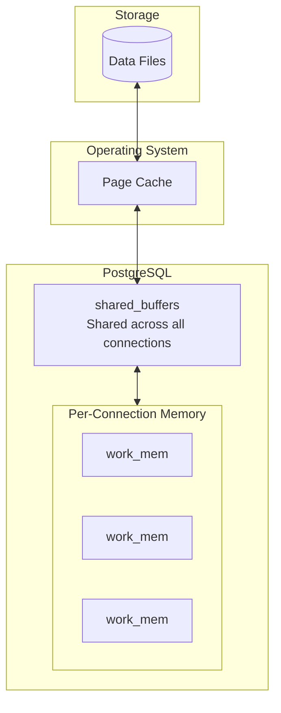

# How to Tune shared_buffers and work_mem in PostgreSQL

Author: [nawazdhandala](https://www.github.com/nawazdhandala)

Tags: PostgreSQL, Database, Performance, Tuning, Memory, Configuration

Description: Master PostgreSQL memory configuration by learning how to tune shared_buffers and work_mem. This guide covers sizing strategies, monitoring techniques, and common pitfalls with practical examples.

---

PostgreSQL memory settings are among the most impactful configuration options for database performance. Two parameters stand out as critical: `shared_buffers` controls the database's main cache, and `work_mem` controls memory for query operations. Getting these right can mean the difference between a sluggish database and one that flies.

## Understanding PostgreSQL Memory Architecture



PostgreSQL has two memory layers:
- **shared_buffers**: A cache shared by all connections, holding frequently accessed data pages
- **work_mem**: Per-operation memory for sorts, hash joins, and other query operations (each query can use multiple allocations)

## Tuning shared_buffers

### The Starting Point

The conventional wisdom is to set `shared_buffers` to 25% of total RAM for dedicated database servers. But this is just a starting point.

```sql
-- Check current setting
SHOW shared_buffers;

-- View in bytes
SELECT setting, unit FROM pg_settings WHERE name = 'shared_buffers';
```

### Sizing Guidelines

| Server RAM | shared_buffers | Notes |
|------------|----------------|-------|
| 4 GB | 1 GB | Small server, leave room for OS |
| 16 GB | 4 GB | Standard recommendation |
| 64 GB | 16 GB | Large server |
| 256+ GB | 32-64 GB | Diminishing returns past 32 GB |

### Why Not Use More?

Beyond 8-16 GB, PostgreSQL also relies heavily on the operating system's page cache. Double caching (data in both shared_buffers and OS cache) becomes inefficient. Better to let the OS cache hot data.

```ini
# postgresql.conf
# For a 64GB RAM dedicated database server
shared_buffers = 16GB
```

### Monitoring shared_buffers Usage

```sql
-- Install pg_buffercache extension
CREATE EXTENSION IF NOT EXISTS pg_buffercache;

-- See what is in the buffer cache
SELECT
    c.relname AS table_name,
    pg_size_pretty(count(*) * 8192) AS buffered_size,
    ROUND(100.0 * count(*) / (SELECT setting::integer FROM pg_settings WHERE name = 'shared_buffers'), 2) AS buffer_percent
FROM pg_buffercache b
JOIN pg_class c ON b.relfilenode = pg_relation_filenode(c.oid)
WHERE c.relname NOT LIKE 'pg_%'
GROUP BY c.relname
ORDER BY count(*) DESC
LIMIT 20;
```

### Check Buffer Cache Hit Ratio

```sql
-- Buffer cache hit ratio (aim for > 99%)
SELECT
    ROUND(100.0 * sum(blks_hit) / NULLIF(sum(blks_hit) + sum(blks_read), 0), 2) AS cache_hit_ratio
FROM pg_stat_database;

-- Per-table hit ratio
SELECT
    schemaname,
    relname,
    heap_blks_read,
    heap_blks_hit,
    ROUND(100.0 * heap_blks_hit / NULLIF(heap_blks_hit + heap_blks_read, 0), 2) AS hit_ratio
FROM pg_statio_user_tables
WHERE heap_blks_read + heap_blks_hit > 0
ORDER BY heap_blks_read DESC
LIMIT 20;
```

If hit ratio is below 95%, consider increasing `shared_buffers`.

## Tuning work_mem

### The Danger of work_mem

Unlike `shared_buffers`, `work_mem` is allocated per operation, not per connection. A single query with multiple sorts or hash joins can use several allocations. With 100 connections each running complex queries, memory usage can explode.

```sql
-- Check current setting
SHOW work_mem;
```

### The Math

```
Potential memory = max_connections x work_mem x operations_per_query
```

With defaults:
- max_connections = 100
- work_mem = 4MB
- 3 operations per query (conservative)

That is 100 x 4MB x 3 = 1.2 GB potential usage just for work_mem.

### Sizing Guidelines

| Server RAM | max_connections | Recommended work_mem |
|------------|-----------------|---------------------|
| 4 GB | 100 | 8-16 MB |
| 16 GB | 200 | 32-64 MB |
| 64 GB | 300 | 64-128 MB |
| 256 GB | 500 | 128-256 MB |

### Setting work_mem

```ini
# postgresql.conf
# Conservative global setting
work_mem = 32MB
```

### Per-Session Tuning

For specific workloads, set `work_mem` at the session level.

```sql
-- For a reporting query that needs to sort large datasets
SET work_mem = '512MB';
SELECT * FROM sales ORDER BY amount DESC;
RESET work_mem;

-- Or use SET LOCAL for transaction scope
BEGIN;
SET LOCAL work_mem = '256MB';
-- Complex analytical query here
COMMIT;
```

### Detecting work_mem Problems

Check for queries spilling to disk.

```sql
-- Look for temp file usage in pg_stat_statements
CREATE EXTENSION IF NOT EXISTS pg_stat_statements;

SELECT
    substring(query, 1, 80) AS query,
    calls,
    ROUND(temp_blks_written * 8 / 1024.0, 2) AS temp_mb_written,
    ROUND(temp_blks_read * 8 / 1024.0, 2) AS temp_mb_read
FROM pg_stat_statements
WHERE temp_blks_written > 0
ORDER BY temp_blks_written DESC
LIMIT 20;
```

### Using EXPLAIN to Check Memory Usage

```sql
-- See if sorts fit in memory
EXPLAIN (ANALYZE, BUFFERS)
SELECT * FROM orders ORDER BY created_at DESC LIMIT 1000;

-- Look for "Sort Method: external merge Disk" - means work_mem too small
-- "Sort Method: quicksort Memory: 25kB" - fits in memory
```

Example output showing disk spill:

```
Sort  (cost=... rows=1000000)
  Sort Key: created_at DESC
  Sort Method: external merge  Disk: 35000kB  <- Problem!
  ->  Seq Scan on orders
```

After increasing work_mem:

```
Sort  (cost=... rows=1000000)
  Sort Key: created_at DESC
  Sort Method: quicksort  Memory: 45000kB  <- Good!
  ->  Seq Scan on orders
```

## Related Memory Parameters

### effective_cache_size

This does not allocate memory but tells the query planner how much memory is available for caching (shared_buffers + OS cache).

```ini
# Set to 50-75% of total RAM
effective_cache_size = 48GB  # For 64GB RAM server
```

### maintenance_work_mem

Memory for maintenance operations like VACUUM, CREATE INDEX.

```ini
# Can be much higher than work_mem since these run one at a time
maintenance_work_mem = 2GB
```

### huge_pages

For servers with more than 32GB of shared_buffers, huge pages reduce memory management overhead.

```ini
# postgresql.conf
huge_pages = try  # or 'on' if kernel is configured
```

Configure the kernel:

```bash
# Calculate number of huge pages needed
# (shared_buffers in bytes / huge page size) + some buffer
# For 16GB shared_buffers with 2MB huge pages:
# (16 * 1024 * 1024 * 1024) / (2 * 1024 * 1024) = 8192

sudo sysctl -w vm.nr_hugepages=8500
```

## A Complete Memory Configuration Example

For a 64GB dedicated PostgreSQL server:

```ini
# postgresql.conf

# Shared memory
shared_buffers = 16GB              # 25% of RAM
huge_pages = try                   # Reduce TLB misses

# Query memory
work_mem = 64MB                    # Per-operation, be careful
maintenance_work_mem = 2GB         # For VACUUM, CREATE INDEX
effective_cache_size = 48GB        # Planner hint (75% of RAM)

# Connection limits
max_connections = 200              # Depends on your app
```

## Monitoring Memory Usage

### Real-Time Memory Check

```sql
-- Total memory used by PostgreSQL processes
SELECT
    pg_size_pretty(sum(total_bytes)) AS total_memory
FROM (
    SELECT
        pg_backend_pid() AS pid,
        pg_backend_memory_contexts() AS ctx
    FROM pg_stat_activity
) AS memory_info;

-- Simpler: check via OS
-- ps aux | grep postgres | awk '{sum += $6} END {print sum/1024 " MB"}'
```

### Memory Context Breakdown

```sql
-- View memory contexts for current session
SELECT * FROM pg_backend_memory_contexts()
ORDER BY total_bytes DESC
LIMIT 20;
```

## Applying Changes

```bash
# Some parameters require restart (shared_buffers, huge_pages)
sudo systemctl restart postgresql

# Others just need reload (work_mem, effective_cache_size)
sudo systemctl reload postgresql

# Or from psql
SELECT pg_reload_conf();
```

---

Memory tuning is iterative. Start with the guidelines, monitor your workload, and adjust based on what you observe. Watch the buffer cache hit ratio, look for temp file usage, and keep an eye on overall system memory. The goal is maximum performance without memory pressure causing swapping or OOM events.
