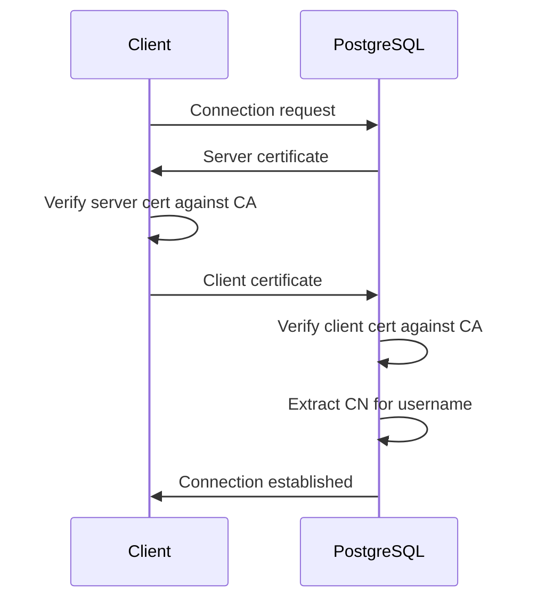

# How to Configure TLS Client Certificates in PostgreSQL

Author: [nawazdhandala](https://www.github.com/nawazdhandala)

Tags: PostgreSQL, Database, Security, TLS, SSL, Client Certificates, Authentication

Description: Learn how to set up mutual TLS authentication in PostgreSQL using client certificates. This guide covers certificate generation, server configuration, client setup, and certificate management for secure database connections.

---

Password authentication has a fundamental weakness: passwords can be intercepted, guessed, or stolen. TLS client certificates provide a stronger authentication mechanism where both the server and client prove their identity cryptographically. This mutual TLS (mTLS) approach is essential for high-security environments and zero-trust architectures.

## How Client Certificate Authentication Works



Both sides verify each other's certificate against a trusted Certificate Authority (CA). PostgreSQL extracts the username from the certificate's Common Name (CN) or Subject Alternative Name (SAN).

## Setting Up the Certificate Authority

First, create a private CA to sign both server and client certificates.

```bash
#!/bin/bash
# setup_ca.sh - Create a Certificate Authority

CA_DIR="/etc/postgresql/ssl/ca"
mkdir -p "${CA_DIR}"
cd "${CA_DIR}"

# Generate CA private key
openssl genrsa -out ca.key 4096

# Generate CA certificate (valid for 10 years)
openssl req -new -x509 \
    -days 3650 \
    -key ca.key \
    -out ca.crt \
    -subj "/C=US/ST=California/L=San Francisco/O=MyCompany/CN=PostgreSQL CA"

# Secure the CA key
chmod 400 ca.key
chmod 444 ca.crt

echo "CA certificate created at ${CA_DIR}/ca.crt"
```

## Generating the Server Certificate

Create a certificate for the PostgreSQL server.

```bash
#!/bin/bash
# generate_server_cert.sh - Create server certificate

SERVER_DIR="/etc/postgresql/ssl/server"
CA_DIR="/etc/postgresql/ssl/ca"
SERVER_HOSTNAME="db.example.com"

mkdir -p "${SERVER_DIR}"
cd "${SERVER_DIR}"

# Generate server private key
openssl genrsa -out server.key 2048
chmod 400 server.key

# Create certificate signing request
openssl req -new \
    -key server.key \
    -out server.csr \
    -subj "/C=US/ST=California/L=San Francisco/O=MyCompany/CN=${SERVER_HOSTNAME}"

# Create extension file for SAN (Subject Alternative Names)
cat > server_ext.cnf << EOF
basicConstraints = CA:FALSE
keyUsage = digitalSignature, keyEncipherment
extendedKeyUsage = serverAuth
subjectAltName = @alt_names

[alt_names]
DNS.1 = ${SERVER_HOSTNAME}
DNS.2 = localhost
IP.1 = 127.0.0.1
EOF

# Sign with CA
openssl x509 -req \
    -in server.csr \
    -CA "${CA_DIR}/ca.crt" \
    -CAkey "${CA_DIR}/ca.key" \
    -CAcreateserial \
    -out server.crt \
    -days 365 \
    -extfile server_ext.cnf

# Set ownership for PostgreSQL
chown postgres:postgres server.key server.crt
chmod 600 server.key
chmod 644 server.crt

echo "Server certificate created at ${SERVER_DIR}/server.crt"
```

## Generating Client Certificates

Create certificates for each user or application.

```bash
#!/bin/bash
# generate_client_cert.sh - Create client certificate
# Usage: ./generate_client_cert.sh username

USERNAME="${1:?Usage: $0 username}"
CLIENT_DIR="/etc/postgresql/ssl/clients"
CA_DIR="/etc/postgresql/ssl/ca"

mkdir -p "${CLIENT_DIR}/${USERNAME}"
cd "${CLIENT_DIR}/${USERNAME}"

# Generate client private key
openssl genrsa -out "${USERNAME}.key" 2048

# Create certificate signing request
# The CN (Common Name) will be used as the PostgreSQL username
openssl req -new \
    -key "${USERNAME}.key" \
    -out "${USERNAME}.csr" \
    -subj "/C=US/ST=California/L=San Francisco/O=MyCompany/CN=${USERNAME}"

# Create extension file
cat > client_ext.cnf << EOF
basicConstraints = CA:FALSE
keyUsage = digitalSignature
extendedKeyUsage = clientAuth
EOF

# Sign with CA
openssl x509 -req \
    -in "${USERNAME}.csr" \
    -CA "${CA_DIR}/ca.crt" \
    -CAkey "${CA_DIR}/ca.key" \
    -CAcreateserial \
    -out "${USERNAME}.crt" \
    -days 365 \
    -extfile client_ext.cnf

# Create PKCS12 bundle for easy distribution
openssl pkcs12 -export \
    -in "${USERNAME}.crt" \
    -inkey "${USERNAME}.key" \
    -out "${USERNAME}.p12" \
    -passout pass:changeme

echo "Client certificate created for ${USERNAME}"
echo "Files: ${CLIENT_DIR}/${USERNAME}/${USERNAME}.crt"
echo "       ${CLIENT_DIR}/${USERNAME}/${USERNAME}.key"
```

## Configuring PostgreSQL Server

### Update postgresql.conf

```ini
# SSL Configuration
ssl = on
ssl_cert_file = '/etc/postgresql/ssl/server/server.crt'
ssl_key_file = '/etc/postgresql/ssl/server/server.key'
ssl_ca_file = '/etc/postgresql/ssl/ca/ca.crt'

# Require client certificates
ssl_crl_file = ''  # Certificate Revocation List (optional but recommended)

# Cipher settings (use strong ciphers only)
ssl_ciphers = 'HIGH:MEDIUM:+3DES:!aNULL'
ssl_prefer_server_ciphers = on
ssl_min_protocol_version = 'TLSv1.2'
```

### Update pg_hba.conf

Configure host-based authentication to require client certificates.

```
# TYPE  DATABASE    USER        ADDRESS         METHOD

# Local connections - no SSL needed
local   all         postgres                    peer

# SSL with client certificate required
# 'cert' method extracts username from certificate CN
hostssl all         all         0.0.0.0/0       cert

# Alternative: require cert but also map to specific users
hostssl all         all         192.168.1.0/24  cert clientcert=verify-full

# For backwards compatibility, allow password auth on specific network
hostssl all         all         10.0.0.0/8      scram-sha-256
```

### Certificate Name Mapping

If certificate CNs do not match PostgreSQL usernames, use `pg_ident.conf`.

```
# pg_ident.conf
# MAPNAME       SYSTEM-USERNAME         PG-USERNAME

# Map certificate CN to PostgreSQL user
cert_map        john.doe@example.com    johndoe
cert_map        service-account         app_readonly
cert_map        /^(.*)@example\.com$    \1
```

Update `pg_hba.conf` to use the map:

```
hostssl all  all  0.0.0.0/0  cert map=cert_map
```

## Client Connection Setup

### Using psql

```bash
# Set environment variables
export PGSSLMODE=verify-full
export PGSSLCERT=/path/to/client.crt
export PGSSLKEY=/path/to/client.key
export PGSSLROOTCERT=/path/to/ca.crt

# Connect
psql -h db.example.com -U myuser -d mydb
```

Or use connection string:

```bash
psql "host=db.example.com dbname=mydb user=myuser \
      sslmode=verify-full \
      sslcert=/path/to/client.crt \
      sslkey=/path/to/client.key \
      sslrootcert=/path/to/ca.crt"
```

### Using Python (psycopg2)

```python
import psycopg2
import ssl

# Connection with client certificate
conn = psycopg2.connect(
    host="db.example.com",
    database="mydb",
    user="myuser",
    sslmode="verify-full",
    sslcert="/path/to/client.crt",
    sslkey="/path/to/client.key",
    sslrootcert="/path/to/ca.crt"
)

# Verify SSL is in use
cursor = conn.cursor()
cursor.execute("SELECT ssl_is_used()")
print(f"SSL enabled: {cursor.fetchone()[0]}")
```

### Using Node.js (pg)

```javascript
const { Client } = require('pg');
const fs = require('fs');

const client = new Client({
    host: 'db.example.com',
    database: 'mydb',
    user: 'myuser',
    ssl: {
        rejectUnauthorized: true,
        ca: fs.readFileSync('/path/to/ca.crt').toString(),
        key: fs.readFileSync('/path/to/client.key').toString(),
        cert: fs.readFileSync('/path/to/client.crt').toString()
    }
});

await client.connect();
```

### Using JDBC (Java)

```java
import java.sql.*;
import java.util.Properties;

Properties props = new Properties();
props.setProperty("user", "myuser");
props.setProperty("ssl", "true");
props.setProperty("sslmode", "verify-full");
props.setProperty("sslcert", "/path/to/client.crt");
props.setProperty("sslkey", "/path/to/client.key");
props.setProperty("sslrootcert", "/path/to/ca.crt");

Connection conn = DriverManager.getConnection(
    "jdbc:postgresql://db.example.com/mydb",
    props
);
```

## Certificate Revocation

When a certificate is compromised, revoke it using a Certificate Revocation List (CRL).

```bash
#!/bin/bash
# revoke_cert.sh - Revoke a client certificate

CA_DIR="/etc/postgresql/ssl/ca"
CERT_TO_REVOKE="$1"

cd "${CA_DIR}"

# Initialize index if it does not exist
if [ ! -f index.txt ]; then
    touch index.txt
    echo 1000 > serial
fi

# Revoke the certificate
openssl ca -revoke "${CERT_TO_REVOKE}" \
    -keyfile ca.key \
    -cert ca.crt

# Generate new CRL
openssl ca -gencrl \
    -keyfile ca.key \
    -cert ca.crt \
    -out crl.pem

# Copy CRL to PostgreSQL
cp crl.pem /etc/postgresql/ssl/server/

echo "Certificate revoked. Reload PostgreSQL to apply changes."
```

Update PostgreSQL configuration to use the CRL:

```ini
# postgresql.conf
ssl_crl_file = '/etc/postgresql/ssl/server/crl.pem'
```

## Monitoring Certificate Expiration

Create a monitoring script to alert before certificates expire.

```bash
#!/bin/bash
# check_cert_expiry.sh - Monitor certificate expiration

CERT_DIR="/etc/postgresql/ssl"
DAYS_WARNING=30
ALERT_EMAIL="dba@example.com"

check_cert() {
    local cert_file="$1"
    local cert_name="$2"

    if [ ! -f "${cert_file}" ]; then
        return
    fi

    expiry_date=$(openssl x509 -enddate -noout -in "${cert_file}" | cut -d= -f2)
    expiry_epoch=$(date -d "${expiry_date}" +%s)
    current_epoch=$(date +%s)
    days_left=$(( (expiry_epoch - current_epoch) / 86400 ))

    if [ ${days_left} -lt ${DAYS_WARNING} ]; then
        echo "WARNING: ${cert_name} expires in ${days_left} days (${expiry_date})"
        echo "Certificate ${cert_name} expires in ${days_left} days" | \
            mail -s "PostgreSQL Certificate Expiry Warning" "${ALERT_EMAIL}"
    else
        echo "OK: ${cert_name} expires in ${days_left} days"
    fi
}

# Check all certificates
check_cert "${CERT_DIR}/ca/ca.crt" "CA Certificate"
check_cert "${CERT_DIR}/server/server.crt" "Server Certificate"

for client_dir in ${CERT_DIR}/clients/*/; do
    username=$(basename "${client_dir}")
    check_cert "${client_dir}/${username}.crt" "Client: ${username}"
done
```

## Verifying the Configuration

```sql
-- Check if SSL is enabled
SHOW ssl;

-- View SSL connection details
SELECT
    usename,
    ssl,
    client_addr,
    application_name
FROM pg_stat_ssl
JOIN pg_stat_activity USING (pid)
WHERE ssl = true;

-- Get certificate info for current connection
SELECT ssl_client_cert_present();
SELECT ssl_client_dn();      -- Client certificate Distinguished Name
SELECT ssl_issuer_dn();      -- Issuer Distinguished Name
```

---

Client certificate authentication provides the strongest form of database authentication. Once set up, it eliminates password management headaches and provides non-repudiation. The initial setup requires effort, but the security benefits and simplified credential management make it worthwhile for production environments handling sensitive data.
