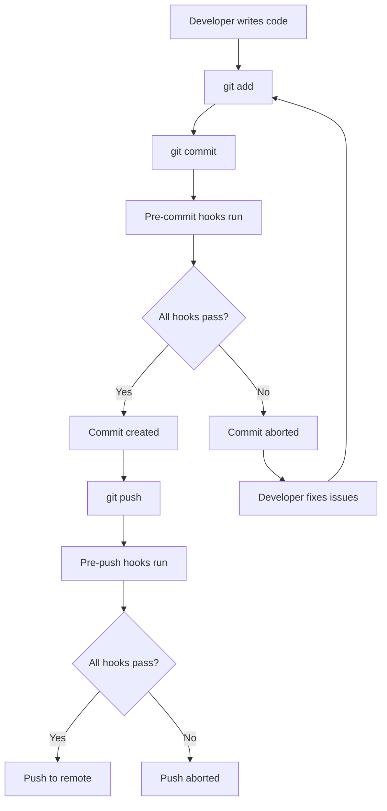

# How to Configure Pre-commit Hooks for Code Quality

Author: [nawazdhandala](https://www.github.com/nawazdhandala)

Tags: Pre-commit, Code Quality, Git Hooks, Linting, Developer Experience

Description: Learn how to set up pre-commit hooks that automatically check code quality before commits, catching issues early and maintaining consistent standards across your team.

---

Code review should focus on architecture decisions and business logic, not formatting issues or obvious bugs. Pre-commit hooks automate quality checks before code ever reaches a pull request, catching problems at the earliest possible moment. This guide shows you how to configure pre-commit hooks that improve code quality without slowing down your workflow.

## Understanding Git Hooks

Git supports hooks at various points in the workflow: pre-commit, prepare-commit-msg, commit-msg, pre-push, and more. The pre-commit hook runs after you type `git commit` but before Git creates the commit. If the hook script exits with a non-zero status, the commit is aborted.

You could write hooks directly in `.git/hooks/`, but these files are not version controlled and must be set up manually on each machine. Tools like pre-commit and Husky solve this by managing hooks through configuration files.

## Using the pre-commit Framework

The pre-commit framework (https://pre-commit.com) is language-agnostic and supports hundreds of ready-made hooks. Install it first:

```bash
# Install with pip
pip install pre-commit

# Or with Homebrew
brew install pre-commit

# Verify installation
pre-commit --version
```

Create a `.pre-commit-config.yaml` file in your repository root:

```yaml
# .pre-commit-config.yaml
# See https://pre-commit.com for more information

# Minimum pre-commit version required
minimum_pre_commit_version: '3.0.0'

# Repositories containing hook definitions
repos:
  # Standard pre-commit hooks
  - repo: https://github.com/pre-commit/pre-commit-hooks
    rev: v4.5.0
    hooks:
      # Prevent commits to main/master branch
      - id: no-commit-to-branch
        args: ['--branch', 'main', '--branch', 'master']

      # Ensure files end with a newline
      - id: end-of-file-fixer

      # Remove trailing whitespace
      - id: trailing-whitespace

      # Check for files that would conflict on case-insensitive filesystems
      - id: check-case-conflict

      # Ensure JSON files are valid
      - id: check-json

      # Ensure YAML files are valid
      - id: check-yaml

      # Check for merge conflict markers
      - id: check-merge-conflict

      # Detect private keys
      - id: detect-private-key

      # Ensure symlinks point to valid files
      - id: check-symlinks

  # Python formatting with Black
  - repo: https://github.com/psf/black
    rev: 24.1.0
    hooks:
      - id: black
        language_version: python3.11

  # Python import sorting
  - repo: https://github.com/pycqa/isort
    rev: 5.13.0
    hooks:
      - id: isort
        args: ['--profile', 'black']

  # Python linting with ruff
  - repo: https://github.com/astral-sh/ruff-pre-commit
    rev: v0.1.14
    hooks:
      - id: ruff
        args: ['--fix']
```

Install the hooks:

```bash
# Install hooks to .git/hooks/
pre-commit install

# Run hooks manually on all files
pre-commit run --all-files

# Update hooks to latest versions
pre-commit autoupdate
```

## JavaScript and TypeScript Projects

For Node.js projects, add these hooks:

```yaml
# .pre-commit-config.yaml for JavaScript/TypeScript

repos:
  - repo: https://github.com/pre-commit/pre-commit-hooks
    rev: v4.5.0
    hooks:
      - id: end-of-file-fixer
      - id: trailing-whitespace
      - id: check-json
      - id: check-yaml

  # ESLint for JavaScript/TypeScript
  - repo: https://github.com/pre-commit/mirrors-eslint
    rev: v8.56.0
    hooks:
      - id: eslint
        files: \.[jt]sx?$
        types: [file]
        additional_dependencies:
          - eslint@8.56.0
          - eslint-config-prettier@9.1.0
          - '@typescript-eslint/eslint-plugin@6.19.0'
          - '@typescript-eslint/parser@6.19.0'

  # Prettier for formatting
  - repo: https://github.com/pre-commit/mirrors-prettier
    rev: v3.1.0
    hooks:
      - id: prettier
        types_or: [javascript, jsx, ts, tsx, json, yaml, markdown, css]
```

## Using Husky for npm Projects

Many JavaScript teams prefer Husky for tighter npm integration:

```bash
# Install Husky
npm install husky --save-dev

# Initialize Husky
npx husky init
```

This creates a `.husky/` directory. Add a pre-commit hook:

```bash
# .husky/pre-commit
#!/bin/sh
. "$(dirname "$0")/_/husky.sh"

# Run lint-staged for staged files only
npx lint-staged
```

Configure lint-staged in `package.json`:

```json
{
  "name": "your-project",
  "scripts": {
    "lint": "eslint src/",
    "format": "prettier --write .",
    "prepare": "husky"
  },
  "lint-staged": {
    "*.{js,jsx,ts,tsx}": [
      "eslint --fix",
      "prettier --write"
    ],
    "*.{json,md,yaml,yml}": [
      "prettier --write"
    ],
    "*.css": [
      "prettier --write"
    ]
  },
  "devDependencies": {
    "eslint": "^8.56.0",
    "husky": "^9.0.0",
    "lint-staged": "^15.2.0",
    "prettier": "^3.2.0"
  }
}
```

## Multi-Language Projects

For projects with multiple languages, combine hooks:

```yaml
# .pre-commit-config.yaml for polyglot project

repos:
  # Universal checks
  - repo: https://github.com/pre-commit/pre-commit-hooks
    rev: v4.5.0
    hooks:
      - id: end-of-file-fixer
      - id: trailing-whitespace
      - id: check-yaml
      - id: check-json
      - id: check-merge-conflict
      - id: detect-private-key

  # Python
  - repo: https://github.com/astral-sh/ruff-pre-commit
    rev: v0.1.14
    hooks:
      - id: ruff
        args: ['--fix']
      - id: ruff-format

  # JavaScript/TypeScript
  - repo: local
    hooks:
      - id: eslint
        name: eslint
        entry: npx eslint --fix
        language: system
        files: \.[jt]sx?$
        pass_filenames: true

      - id: prettier
        name: prettier
        entry: npx prettier --write
        language: system
        files: \.(js|jsx|ts|tsx|json|md|yaml|yml|css)$
        pass_filenames: true

  # Go
  - repo: https://github.com/dnephin/pre-commit-golang
    rev: v0.5.1
    hooks:
      - id: go-fmt
      - id: go-vet
      - id: go-imports

  # Terraform
  - repo: https://github.com/antonbabenko/pre-commit-terraform
    rev: v1.86.0
    hooks:
      - id: terraform_fmt
      - id: terraform_validate

  # Shell scripts
  - repo: https://github.com/shellcheck-py/shellcheck-py
    rev: v0.9.0.6
    hooks:
      - id: shellcheck
```

## Custom Hooks

Create project-specific hooks for custom validations:

```yaml
# .pre-commit-config.yaml with custom hooks

repos:
  - repo: https://github.com/pre-commit/pre-commit-hooks
    rev: v4.5.0
    hooks:
      - id: check-yaml

  # Local custom hooks
  - repo: local
    hooks:
      # Validate API schema
      - id: validate-openapi
        name: Validate OpenAPI spec
        entry: npx @redocly/cli lint api/openapi.yaml
        language: system
        files: ^api/openapi\.yaml$
        pass_filenames: false

      # Check for console.log statements
      - id: no-console-log
        name: No console.log
        entry: bash -c 'grep -rn "console.log" src/ && exit 1 || exit 0'
        language: system
        files: \.[jt]sx?$
        pass_filenames: false

      # Ensure test files exist for source files
      - id: test-files-exist
        name: Check test files
        entry: python scripts/check_tests.py
        language: system
        files: ^src/.*\.[jt]s$
        pass_filenames: true

      # Run type checking
      - id: typecheck
        name: TypeScript type check
        entry: npx tsc --noEmit
        language: system
        files: \.tsx?$
        pass_filenames: false
```

The custom script for checking test files:

```python
#!/usr/bin/env python3
# scripts/check_tests.py
"""Verify that test files exist for source files."""

import sys
from pathlib import Path

def main():
    missing_tests = []

    for filepath in sys.argv[1:]:
        source = Path(filepath)

        # Convert src/utils/helper.ts to tests/utils/helper.test.ts
        test_path = Path(str(source)
            .replace('src/', 'tests/')
            .replace('.ts', '.test.ts')
            .replace('.js', '.test.js'))

        if not test_path.exists():
            missing_tests.append(f"Missing test: {test_path}")

    if missing_tests:
        print("\n".join(missing_tests))
        sys.exit(1)

    sys.exit(0)

if __name__ == "__main__":
    main()
```

## Hook Stages

Configure hooks for different Git events:

```yaml
# .pre-commit-config.yaml with multiple stages

repos:
  - repo: https://github.com/pre-commit/pre-commit-hooks
    rev: v4.5.0
    hooks:
      # Run on commit
      - id: trailing-whitespace
        stages: [commit]

      # Run on push (slower checks)
      - id: check-added-large-files
        stages: [push]
        args: ['--maxkb=1000']

  - repo: local
    hooks:
      # Fast checks on commit
      - id: lint
        name: lint
        entry: npm run lint
        language: system
        stages: [commit]
        pass_filenames: false

      # Slower tests on push
      - id: test
        name: test
        entry: npm test
        language: system
        stages: [push]
        pass_filenames: false
```

Install hooks for multiple stages:

```bash
# Install commit hooks
pre-commit install

# Install push hooks
pre-commit install --hook-type pre-push

# Install commit-msg hooks for conventional commits
pre-commit install --hook-type commit-msg
```

## Workflow Visualization

Here is how pre-commit hooks fit into the development workflow:



## CI Integration

Verify hooks run correctly in CI:

```yaml
# .github/workflows/lint.yml
name: Lint

on: [push, pull_request]

jobs:
  pre-commit:
    runs-on: ubuntu-latest
    steps:
      - uses: actions/checkout@v4

      - name: Set up Python
        uses: actions/setup-python@v5
        with:
          python-version: '3.11'

      - name: Run pre-commit
        uses: pre-commit/action@v3.0.0
```

## Best Practices

1. **Keep hooks fast**: Slow hooks frustrate developers. Run comprehensive checks in CI, not pre-commit.

2. **Fix, do not just report**: Configure formatters to auto-fix issues when possible. Developers should not manually fix formatting.

3. **Document hook requirements**: Include setup instructions in README. New team members need to know to run `pre-commit install`.

4. **Allow bypassing when needed**: Sometimes you need to commit work-in-progress. Document how to use `git commit --no-verify`.

5. **Update hooks regularly**: Run `pre-commit autoupdate` monthly to get bug fixes and new features.

Pre-commit hooks catch issues at the source, before they enter your codebase. Teams that adopt them spend less time in code review debating formatting and more time discussing what matters: whether the code solves the right problem the right way.
