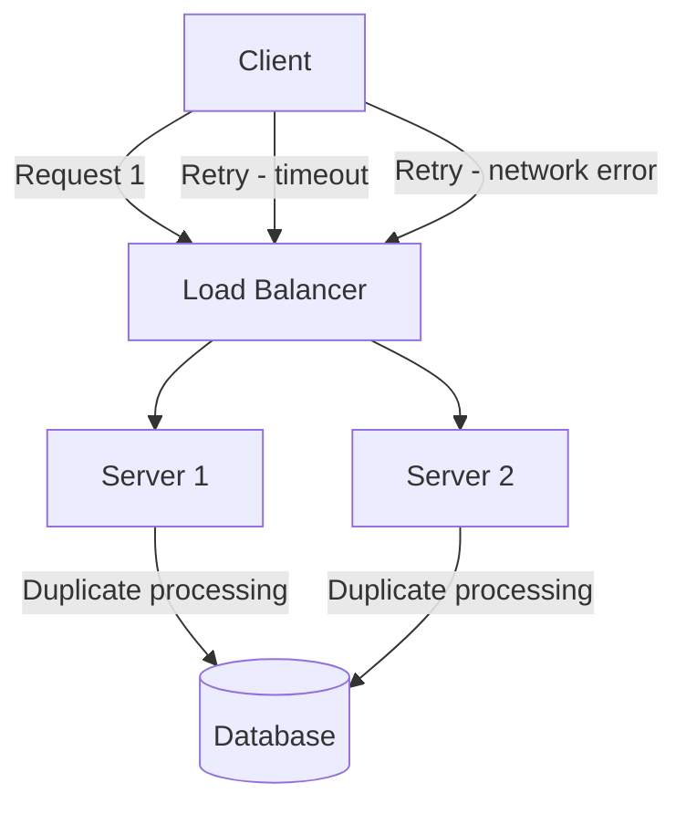

# How to Prevent Duplicate Requests in Python

Author: [nawazdhandala](https://www.github.com/nawazdhandala)

Tags: Python, Idempotency, API Design, Redis, FastAPI, Reliability, Distributed Systems

Description: Learn how to implement idempotency in Python APIs to prevent duplicate requests from causing unintended side effects. This guide covers idempotency keys, request fingerprinting, and distributed locking patterns.

---

> Duplicate requests are inevitable in distributed systems. Network retries, impatient users clicking submit multiple times, or client-side retry logic can all cause the same request to hit your server more than once. Without proper handling, this leads to double charges, duplicate records, and frustrated users.

I learned this lesson the hard way when a payment webhook retry caused a customer to be charged twice. The fix was straightforward once I understood idempotency, but the refund process was not. This guide will help you avoid similar mistakes.

---

## Understanding the Problem

Duplicate requests occur for several reasons:



Common causes include:
- Network timeouts causing client retries
- Users double-clicking submit buttons
- Webhook delivery retries
- Message queue redelivery
- Browser refresh during form submission

---

## Idempotency Keys

The most robust approach is using idempotency keys. The client provides a unique key with each request, and the server ensures that requests with the same key are processed only once.

```python
# idempotency.py
# Idempotency key implementation with Redis
import hashlib
import json
from dataclasses import dataclass
from datetime import datetime, timedelta
from typing import Optional, Any, Dict
import redis.asyncio as redis
from fastapi import FastAPI, Request, Response, HTTPException, Header
from fastapi.responses import JSONResponse
import pickle

@dataclass
class IdempotencyRecord:
    """Stores the result of a processed request"""
    key: str
    status_code: int
    response_body: bytes
    headers: Dict[str, str]
    created_at: datetime
    request_hash: str  # Hash of request body for verification

class IdempotencyStore:
    """
    Redis-backed store for idempotency records.
    Handles storing and retrieving previous request results.
    """

    def __init__(
        self,
        redis_client: redis.Redis,
        prefix: str = "idempotency",
        ttl_hours: int = 24
    ):
        self.redis = redis_client
        self.prefix = prefix
        self.ttl = timedelta(hours=ttl_hours)

    def _make_key(self, idempotency_key: str) -> str:
        """Create Redis key from idempotency key"""
        return f"{self.prefix}:{idempotency_key}"

    def _hash_request(self, method: str, path: str, body: bytes) -> str:
        """Create a hash of the request for verification"""
        content = f"{method}:{path}:{body.hex()}"
        return hashlib.sha256(content.encode()).hexdigest()

    async def get(self, idempotency_key: str) -> Optional[IdempotencyRecord]:
        """Retrieve a stored idempotency record"""
        redis_key = self._make_key(idempotency_key)
        data = await self.redis.get(redis_key)

        if data is None:
            return None

        return pickle.loads(data)

    async def set(
        self,
        idempotency_key: str,
        status_code: int,
        response_body: bytes,
        headers: Dict[str, str],
        request_hash: str
    ) -> IdempotencyRecord:
        """Store a new idempotency record"""
        record = IdempotencyRecord(
            key=idempotency_key,
            status_code=status_code,
            response_body=response_body,
            headers=headers,
            created_at=datetime.utcnow(),
            request_hash=request_hash
        )

        redis_key = self._make_key(idempotency_key)

        # Store with TTL so old records are automatically cleaned up
        await self.redis.setex(
            redis_key,
            self.ttl,
            pickle.dumps(record)
        )

        return record

    async def lock(self, idempotency_key: str, timeout: int = 30) -> bool:
        """
        Acquire a lock for processing a request.
        Prevents concurrent processing of same idempotency key.
        """
        lock_key = f"{self._make_key(idempotency_key)}:lock"

        # SET NX returns True only if key did not exist
        acquired = await self.redis.set(
            lock_key,
            "1",
            nx=True,  # Only set if not exists
            ex=timeout  # Auto-expire lock
        )

        return bool(acquired)

    async def unlock(self, idempotency_key: str):
        """Release the processing lock"""
        lock_key = f"{self._make_key(idempotency_key)}:lock"
        await self.redis.delete(lock_key)


# FastAPI middleware for idempotency
app = FastAPI()
idempotency_store: IdempotencyStore = None

@app.on_event("startup")
async def startup():
    global idempotency_store
    redis_client = redis.from_url("redis://localhost:6379")
    idempotency_store = IdempotencyStore(redis_client)

@app.middleware("http")
async def idempotency_middleware(request: Request, call_next):
    """
    Middleware that handles idempotency for POST/PUT/PATCH requests.
    GET and DELETE are naturally idempotent.
    """
    # Only apply to mutating methods
    if request.method not in ("POST", "PUT", "PATCH"):
        return await call_next(request)

    # Get idempotency key from header
    idempotency_key = request.headers.get("Idempotency-Key")

    if not idempotency_key:
        # No key provided - process normally
        return await call_next(request)

    # Read request body for hashing
    body = await request.body()
    request_hash = idempotency_store._hash_request(
        request.method,
        request.url.path,
        body
    )

    # Check for existing record
    existing = await idempotency_store.get(idempotency_key)

    if existing:
        # Verify request matches (same key should have same request)
        if existing.request_hash != request_hash:
            raise HTTPException(
                status_code=422,
                detail="Idempotency key already used with different request"
            )

        # Return cached response
        return Response(
            content=existing.response_body,
            status_code=existing.status_code,
            headers={
                **existing.headers,
                "X-Idempotent-Replayed": "true"
            }
        )

    # Try to acquire lock for processing
    if not await idempotency_store.lock(idempotency_key):
        # Another request is currently processing with this key
        raise HTTPException(
            status_code=409,
            detail="Request with this idempotency key is currently being processed"
        )

    try:
        # Process the request
        response = await call_next(request)

        # Read response body
        response_body = b""
        async for chunk in response.body_iterator:
            response_body += chunk

        # Store the result
        await idempotency_store.set(
            idempotency_key=idempotency_key,
            status_code=response.status_code,
            response_body=response_body,
            headers=dict(response.headers),
            request_hash=request_hash
        )

        # Return response with body
        return Response(
            content=response_body,
            status_code=response.status_code,
            headers=dict(response.headers)
        )
    finally:
        # Always release the lock
        await idempotency_store.unlock(idempotency_key)
```

---

## Request Fingerprinting

For cases where clients cannot provide idempotency keys, you can generate fingerprints based on request content.

```python
# fingerprinting.py
# Automatic request fingerprinting for duplicate detection
import hashlib
import json
from typing import Optional, Set
from datetime import datetime, timedelta
import redis.asyncio as redis
from fastapi import FastAPI, Request, HTTPException
from pydantic import BaseModel

class FingerprintConfig:
    """Configuration for request fingerprinting"""

    def __init__(
        self,
        window_seconds: int = 5,  # Time window for duplicate detection
        include_user: bool = True,  # Include user ID in fingerprint
        include_ip: bool = False,  # Include client IP in fingerprint
        excluded_fields: Set[str] = None  # Fields to exclude from fingerprint
    ):
        self.window_seconds = window_seconds
        self.include_user = include_user
        self.include_ip = include_ip
        self.excluded_fields = excluded_fields or {'timestamp', 'nonce'}

class RequestFingerprinter:
    """
    Generates fingerprints for requests to detect duplicates.
    Useful when clients cannot provide idempotency keys.
    """

    def __init__(self, redis_client: redis.Redis, config: FingerprintConfig):
        self.redis = redis_client
        self.config = config

    def _normalize_body(self, body: dict) -> dict:
        """Remove excluded fields and sort for consistent hashing"""
        normalized = {}

        for key, value in sorted(body.items()):
            if key not in self.config.excluded_fields:
                normalized[key] = value

        return normalized

    def generate_fingerprint(
        self,
        method: str,
        path: str,
        body: dict,
        user_id: Optional[str] = None,
        client_ip: Optional[str] = None
    ) -> str:
        """Generate a unique fingerprint for a request"""
        components = [method, path]

        # Add user context if configured
        if self.config.include_user and user_id:
            components.append(f"user:{user_id}")

        if self.config.include_ip and client_ip:
            components.append(f"ip:{client_ip}")

        # Add normalized request body
        normalized = self._normalize_body(body)
        body_json = json.dumps(normalized, sort_keys=True)
        components.append(body_json)

        # Create hash
        content = "|".join(components)
        return hashlib.sha256(content.encode()).hexdigest()[:32]

    async def is_duplicate(self, fingerprint: str) -> bool:
        """Check if this fingerprint was seen recently"""
        key = f"fingerprint:{fingerprint}"

        # Try to set the key (NX = only if not exists)
        result = await self.redis.set(
            key,
            datetime.utcnow().isoformat(),
            nx=True,
            ex=self.config.window_seconds
        )

        # If set succeeded, this is a new request
        # If set failed (returned None), this is a duplicate
        return result is None

    async def check_and_block_duplicate(
        self,
        method: str,
        path: str,
        body: dict,
        user_id: Optional[str] = None,
        client_ip: Optional[str] = None
    ) -> bool:
        """
        Check if request is duplicate and block if so.
        Returns True if request should proceed, raises exception if duplicate.
        """
        fingerprint = self.generate_fingerprint(
            method, path, body, user_id, client_ip
        )

        if await self.is_duplicate(fingerprint):
            raise HTTPException(
                status_code=429,
                detail="Duplicate request detected. Please wait before retrying."
            )

        return True


# FastAPI integration
app = FastAPI()
fingerprinter: RequestFingerprinter = None

@app.on_event("startup")
async def startup():
    global fingerprinter
    redis_client = redis.from_url("redis://localhost:6379")
    config = FingerprintConfig(
        window_seconds=5,
        include_user=True,
        excluded_fields={'timestamp', 'request_id', 'nonce'}
    )
    fingerprinter = RequestFingerprinter(redis_client, config)

# Decorator for endpoints that need duplicate protection
from functools import wraps

def prevent_duplicates(func):
    """Decorator to prevent duplicate requests on an endpoint"""
    @wraps(func)
    async def wrapper(request: Request, *args, **kwargs):
        # Get request body
        body = await request.json() if request.method in ("POST", "PUT", "PATCH") else {}

        # Get user ID from auth context (if available)
        user_id = getattr(request.state, 'user_id', None)

        # Check for duplicate
        await fingerprinter.check_and_block_duplicate(
            method=request.method,
            path=request.url.path,
            body=body,
            user_id=user_id,
            client_ip=request.client.host
        )

        return await func(request, *args, **kwargs)

    return wrapper


class PaymentRequest(BaseModel):
    amount: float
    currency: str
    recipient_id: str

@app.post("/payments")
@prevent_duplicates
async def create_payment(request: Request, payment: PaymentRequest):
    """Create a payment - protected against duplicate submissions"""
    # Process payment
    return {"status": "success", "payment_id": "pay_123"}
```

---

## Database-Level Idempotency

For critical operations, implement idempotency at the database level using unique constraints and transactions.

```python
# database_idempotency.py
# Database-level duplicate prevention with unique constraints
from dataclasses import dataclass
from datetime import datetime, timedelta
from typing import Optional
import asyncpg
from contextlib import asynccontextmanager

@dataclass
class Payment:
    id: str
    amount: float
    currency: str
    status: str
    idempotency_key: str
    created_at: datetime

class PaymentService:
    """
    Payment service with database-level idempotency.
    Uses unique constraints and transactions for safety.
    """

    def __init__(self, db_pool: asyncpg.Pool):
        self.db = db_pool

    async def create_payment(
        self,
        idempotency_key: str,
        amount: float,
        currency: str,
        recipient_id: str
    ) -> Payment:
        """
        Create a payment with idempotency guarantee.
        Uses database unique constraint on idempotency_key.
        """
        async with self.db.acquire() as conn:
            async with conn.transaction():
                # Try to insert the payment
                # If idempotency_key already exists, this will raise an error
                try:
                    payment_id = await self._generate_payment_id()

                    row = await conn.fetchrow(
                        """
                        INSERT INTO payments (
                            id, amount, currency, recipient_id,
                            status, idempotency_key, created_at
                        ) VALUES ($1, $2, $3, $4, $5, $6, $7)
                        RETURNING *
                        """,
                        payment_id,
                        amount,
                        currency,
                        recipient_id,
                        'pending',
                        idempotency_key,
                        datetime.utcnow()
                    )

                    # Process the payment
                    await self._process_payment(conn, payment_id)

                    return self._row_to_payment(row)

                except asyncpg.UniqueViolationError:
                    # Idempotency key already exists - return existing payment
                    existing = await conn.fetchrow(
                        """
                        SELECT * FROM payments WHERE idempotency_key = $1
                        """,
                        idempotency_key
                    )

                    if existing:
                        return self._row_to_payment(existing)

                    # Race condition - retry
                    raise

    async def _process_payment(self, conn, payment_id: str):
        """Process the payment (call payment provider, etc.)"""
        # Actual payment processing would go here

        # Update status after successful processing
        await conn.execute(
            """
            UPDATE payments SET status = 'completed' WHERE id = $1
            """,
            payment_id
        )

    async def _generate_payment_id(self) -> str:
        """Generate a unique payment ID"""
        import uuid
        return f"pay_{uuid.uuid4().hex[:16]}"

    def _row_to_payment(self, row) -> Payment:
        """Convert database row to Payment object"""
        return Payment(
            id=row['id'],
            amount=row['amount'],
            currency=row['currency'],
            status=row['status'],
            idempotency_key=row['idempotency_key'],
            created_at=row['created_at']
        )


# Database schema (PostgreSQL)
SCHEMA = """
CREATE TABLE payments (
    id VARCHAR(32) PRIMARY KEY,
    amount DECIMAL(10, 2) NOT NULL,
    currency VARCHAR(3) NOT NULL,
    recipient_id VARCHAR(64) NOT NULL,
    status VARCHAR(20) NOT NULL,
    idempotency_key VARCHAR(64) NOT NULL UNIQUE,  -- Unique constraint
    created_at TIMESTAMP NOT NULL,

    -- Index for looking up by idempotency key
    CONSTRAINT payments_idempotency_key_idx UNIQUE (idempotency_key)
);

-- Cleanup old idempotency keys (run periodically)
CREATE OR REPLACE FUNCTION cleanup_old_payments()
RETURNS void AS $$
BEGIN
    DELETE FROM payments
    WHERE created_at < NOW() - INTERVAL '30 days'
    AND status IN ('completed', 'failed');
END;
$$ LANGUAGE plpgsql;
"""
```

---

## Distributed Locking

For operations that span multiple services, use distributed locks to prevent concurrent execution.

```python
# distributed_lock.py
# Distributed locking for cross-service idempotency
import redis.asyncio as redis
import asyncio
from contextlib import asynccontextmanager
from typing import Optional
from datetime import datetime
import uuid

class DistributedLock:
    """
    Redis-based distributed lock with automatic renewal.
    Prevents concurrent execution of the same operation.
    """

    def __init__(
        self,
        redis_client: redis.Redis,
        name: str,
        ttl_seconds: int = 30,
        retry_interval: float = 0.1
    ):
        self.redis = redis_client
        self.name = name
        self.ttl = ttl_seconds
        self.retry_interval = retry_interval
        self.token = str(uuid.uuid4())  # Unique token for this lock holder
        self._renewal_task: Optional[asyncio.Task] = None

    @property
    def key(self) -> str:
        return f"lock:{self.name}"

    async def acquire(self, timeout: float = 10.0) -> bool:
        """
        Try to acquire the lock within the timeout period.
        Returns True if lock acquired, False if timeout.
        """
        start = datetime.utcnow()

        while True:
            # Try to set the lock
            acquired = await self.redis.set(
                self.key,
                self.token,
                nx=True,  # Only if not exists
                ex=self.ttl
            )

            if acquired:
                # Start background task to renew lock
                self._renewal_task = asyncio.create_task(self._renew_loop())
                return True

            # Check timeout
            elapsed = (datetime.utcnow() - start).total_seconds()
            if elapsed >= timeout:
                return False

            # Wait before retrying
            await asyncio.sleep(self.retry_interval)

    async def release(self):
        """Release the lock if we own it"""
        # Cancel renewal task
        if self._renewal_task:
            self._renewal_task.cancel()
            try:
                await self._renewal_task
            except asyncio.CancelledError:
                pass

        # Use Lua script to atomically check and delete
        # Only delete if we own the lock (token matches)
        script = """
        if redis.call("get", KEYS[1]) == ARGV[1] then
            return redis.call("del", KEYS[1])
        else
            return 0
        end
        """

        await self.redis.eval(script, 1, self.key, self.token)

    async def _renew_loop(self):
        """Background task to renew the lock before it expires"""
        while True:
            # Renew at half the TTL interval
            await asyncio.sleep(self.ttl / 2)

            # Extend the lock if we still own it
            script = """
            if redis.call("get", KEYS[1]) == ARGV[1] then
                return redis.call("expire", KEYS[1], ARGV[2])
            else
                return 0
            end
            """

            result = await self.redis.eval(
                script, 1, self.key, self.token, self.ttl
            )

            if not result:
                # Lost the lock
                break

    @asynccontextmanager
    async def hold(self, timeout: float = 10.0):
        """Context manager for holding the lock"""
        if not await self.acquire(timeout):
            raise TimeoutError(f"Could not acquire lock {self.name}")

        try:
            yield
        finally:
            await self.release()


# Usage example
class OrderService:
    """Order service with distributed locking for idempotency"""

    def __init__(self, redis_client: redis.Redis, db_pool):
        self.redis = redis_client
        self.db = db_pool

    async def create_order(
        self,
        idempotency_key: str,
        user_id: str,
        items: list
    ):
        """
        Create an order with distributed lock protection.
        Ensures only one server processes this order at a time.
        """
        lock = DistributedLock(
            self.redis,
            name=f"order:{idempotency_key}",
            ttl_seconds=60
        )

        async with lock.hold(timeout=30):
            # Check if order already exists
            existing = await self.db.fetchrow(
                "SELECT * FROM orders WHERE idempotency_key = $1",
                idempotency_key
            )

            if existing:
                return existing  # Return existing order

            # Create new order
            order = await self._create_order(user_id, items, idempotency_key)

            return order

    async def _create_order(self, user_id: str, items: list, idempotency_key: str):
        """Internal method to create order"""
        # Actual order creation logic
        pass
```

---

## Client-Side Best Practices

Provide your API clients with guidance on handling idempotency.

```python
# client_example.py
# Example API client with proper idempotency handling
import httpx
import uuid
from typing import Optional, Dict, Any
import asyncio

class APIClient:
    """
    API client with built-in retry and idempotency support.
    Demonstrates client-side best practices.
    """

    def __init__(self, base_url: str, api_key: str):
        self.base_url = base_url
        self.api_key = api_key

    async def create_payment(
        self,
        amount: float,
        currency: str,
        recipient_id: str,
        idempotency_key: Optional[str] = None
    ) -> Dict[str, Any]:
        """
        Create a payment with automatic retry and idempotency.

        Args:
            amount: Payment amount
            currency: Currency code (USD, EUR, etc.)
            recipient_id: ID of the recipient
            idempotency_key: Optional key for idempotency.
                           If not provided, one will be generated.
        """
        # Generate idempotency key if not provided
        # Use a deterministic key based on request params for automatic dedup
        if idempotency_key is None:
            idempotency_key = self._generate_idempotency_key(
                amount, currency, recipient_id
            )

        headers = {
            "Authorization": f"Bearer {self.api_key}",
            "Idempotency-Key": idempotency_key,
            "Content-Type": "application/json"
        }

        payload = {
            "amount": amount,
            "currency": currency,
            "recipient_id": recipient_id
        }

        # Retry with exponential backoff
        max_retries = 3

        for attempt in range(max_retries):
            try:
                async with httpx.AsyncClient() as client:
                    response = await client.post(
                        f"{self.base_url}/payments",
                        json=payload,
                        headers=headers,
                        timeout=30.0
                    )

                # Check if this was a replayed response
                if response.headers.get("X-Idempotent-Replayed") == "true":
                    print(f"Response was replayed from previous request")

                response.raise_for_status()
                return response.json()

            except httpx.HTTPStatusError as e:
                # Don't retry client errors (4xx)
                if 400 <= e.response.status_code < 500:
                    raise

                # Retry server errors (5xx)
                if attempt < max_retries - 1:
                    wait_time = 2 ** attempt  # 1, 2, 4 seconds
                    await asyncio.sleep(wait_time)
                else:
                    raise

            except httpx.TimeoutException:
                # Timeout - safe to retry with same idempotency key
                if attempt < max_retries - 1:
                    wait_time = 2 ** attempt
                    await asyncio.sleep(wait_time)
                else:
                    raise

    def _generate_idempotency_key(
        self,
        amount: float,
        currency: str,
        recipient_id: str
    ) -> str:
        """
        Generate a deterministic idempotency key.
        Same parameters will always produce the same key.
        """
        import hashlib
        content = f"{amount}:{currency}:{recipient_id}"
        return hashlib.sha256(content.encode()).hexdigest()[:32]
```

---

## Best Practices Summary

1. **Always use idempotency keys for mutations** - POST, PUT, PATCH should support idempotency keys
2. **Store complete responses** - Return the exact same response for duplicate requests
3. **Use appropriate TTLs** - Balance between catching retries and storage costs (24 hours is common)
4. **Verify request content** - Same key with different body should be rejected
5. **Handle concurrent requests** - Use locking to prevent race conditions
6. **Document for clients** - Provide clear guidance on idempotency key usage

---

## Conclusion

Duplicate request handling is essential for building reliable APIs. The approach you choose depends on your requirements: idempotency keys provide the most control, fingerprinting works when clients cannot provide keys, and database constraints provide the strongest guarantees for critical operations.

The key insight is that idempotency should be explicit and verifiable. Clients should be able to safely retry any request without worrying about unintended side effects.

---

*Want to monitor duplicate request rates in your API? [OneUptime](https://oneuptime.com) provides real-time metrics and alerting for API reliability.*

**Related Reading:**
- [How to Build Rate Limiting in Python Without External Services](https://oneuptime.com/blog/post/2025-01-06-fastapi-rate-limiting/view)
- [How to Implement Retry with Exponential Backoff in Python](https://oneuptime.com/blog/post/2025-01-06-python-retry-exponential-backoff/view)
