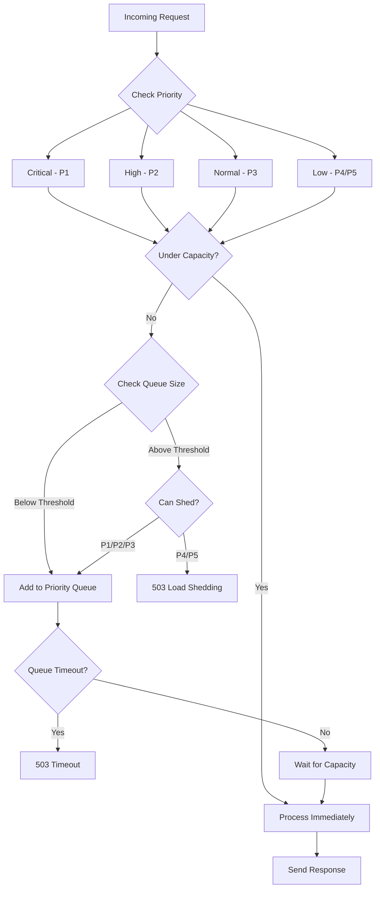

# How to Prioritize Requests in High-Load Node.js Services

Author: [nawazdhandala](https://www.github.com/nawazdhandala)

Tags: NodeJS, TypeScript, Performance, Load Management, Scalability

Description: Learn how to implement request prioritization in Node.js services to ensure critical traffic gets through during high-load scenarios using priority queues, admission control, and load shedding.

---

When your Node.js service is under heavy load, treating all requests equally is a recipe for disaster. A flood of low-priority analytics events can starve critical payment processing requests. This guide covers practical patterns to ensure your most important traffic gets through when resources are constrained.

## Why Request Prioritization Matters

Under normal conditions, your service handles all requests equally. But during traffic spikes, system degradation, or partial outages, you need to make choices. Without prioritization, a first-come-first-served approach means critical requests wait behind bulk data imports or background syncs.

| Scenario | Without Prioritization | With Prioritization |
|----------|----------------------|---------------------|
| Traffic spike | All requests slow down equally | Critical requests maintain SLA |
| Partial outage | Random failures across all request types | Low-priority requests shed first |
| Resource exhaustion | System crashes | Graceful degradation |

## Basic Priority Queue Implementation

The foundation of request prioritization is a priority queue. This implementation uses a min-heap to efficiently serve higher-priority requests first. Priority 1 is highest, priority 10 is lowest.

```typescript
// PriorityQueue.ts
// A min-heap based priority queue where lower numbers mean higher priority
// Time complexity: O(log n) for enqueue/dequeue, O(1) for peek

interface QueueItem<T> {
  priority: number;
  timestamp: number;
  data: T;
}

export class PriorityQueue<T> {
  private heap: QueueItem<T>[] = [];

  // Add item to queue with given priority (1 = highest)
  enqueue(data: T, priority: number): void {
    const item: QueueItem<T> = {
      priority,
      timestamp: Date.now(),
      data,
    };
    this.heap.push(item);
    this.bubbleUp(this.heap.length - 1);
  }

  // Remove and return highest priority item
  dequeue(): T | undefined {
    if (this.heap.length === 0) return undefined;

    const result = this.heap[0];
    const last = this.heap.pop();

    if (this.heap.length > 0 && last) {
      this.heap[0] = last;
      this.bubbleDown(0);
    }

    return result.data;
  }

  peek(): T | undefined {
    return this.heap[0]?.data;
  }

  size(): number {
    return this.heap.length;
  }

  isEmpty(): boolean {
    return this.heap.length === 0;
  }

  // Move item up the heap until heap property is restored
  private bubbleUp(index: number): void {
    while (index > 0) {
      const parentIndex = Math.floor((index - 1) / 2);

      // Compare by priority first, then by timestamp for FIFO within same priority
      if (this.compare(this.heap[index], this.heap[parentIndex]) < 0) {
        this.swap(index, parentIndex);
        index = parentIndex;
      } else {
        break;
      }
    }
  }

  // Move item down the heap until heap property is restored
  private bubbleDown(index: number): void {
    while (true) {
      const leftChild = 2 * index + 1;
      const rightChild = 2 * index + 2;
      let smallest = index;

      if (leftChild < this.heap.length &&
          this.compare(this.heap[leftChild], this.heap[smallest]) < 0) {
        smallest = leftChild;
      }

      if (rightChild < this.heap.length &&
          this.compare(this.heap[rightChild], this.heap[smallest]) < 0) {
        smallest = rightChild;
      }

      if (smallest !== index) {
        this.swap(index, smallest);
        index = smallest;
      } else {
        break;
      }
    }
  }

  // Compare two items: first by priority, then by timestamp
  private compare(a: QueueItem<T>, b: QueueItem<T>): number {
    if (a.priority !== b.priority) {
      return a.priority - b.priority;
    }
    return a.timestamp - b.timestamp;
  }

  private swap(i: number, j: number): void {
    [this.heap[i], this.heap[j]] = [this.heap[j], this.heap[i]];
  }
}
```

## Priority-Based Request Handler

Now let's build a request handler that uses the priority queue. This middleware assigns priorities based on request characteristics and queues requests when the system is under load.

```typescript
// PriorityRequestHandler.ts
import { Request, Response, NextFunction } from 'express';
import { PriorityQueue } from './PriorityQueue';

interface PendingRequest {
  req: Request;
  res: Response;
  next: NextFunction;
  timeout: NodeJS.Timeout;
}

// Priority levels for different request types
export enum RequestPriority {
  CRITICAL = 1,    // Health checks, payments
  HIGH = 2,        // User-facing API calls
  NORMAL = 3,      // Standard operations
  LOW = 4,         // Background tasks, analytics
  BULK = 5,        // Batch operations, exports
}

export class PriorityRequestHandler {
  private queue: PriorityQueue<PendingRequest>;
  private activeRequests: number = 0;
  private maxConcurrent: number;
  private queueTimeout: number;

  constructor(options: { maxConcurrent?: number; queueTimeout?: number } = {}) {
    this.queue = new PriorityQueue();
    this.maxConcurrent = options.maxConcurrent || 100;
    this.queueTimeout = options.queueTimeout || 30000;
  }

  // Determine request priority based on path, headers, or method
  private getPriority(req: Request): number {
    // Health checks are always critical
    if (req.path === '/health' || req.path === '/ready') {
      return RequestPriority.CRITICAL;
    }

    // Check for explicit priority header
    const headerPriority = req.headers['x-request-priority'];
    if (headerPriority && typeof headerPriority === 'string') {
      const parsed = parseInt(headerPriority, 10);
      if (parsed >= 1 && parsed <= 5) {
        return parsed;
      }
    }

    // Payment and checkout endpoints are high priority
    if (req.path.includes('/payment') || req.path.includes('/checkout')) {
      return RequestPriority.CRITICAL;
    }

    // User authentication is high priority
    if (req.path.includes('/auth') || req.path.includes('/login')) {
      return RequestPriority.HIGH;
    }

    // Bulk operations are low priority
    if (req.path.includes('/bulk') || req.path.includes('/export')) {
      return RequestPriority.BULK;
    }

    // Analytics and tracking are low priority
    if (req.path.includes('/analytics') || req.path.includes('/track')) {
      return RequestPriority.LOW;
    }

    return RequestPriority.NORMAL;
  }

  // Express middleware function
  middleware = (req: Request, res: Response, next: NextFunction): void => {
    const priority = this.getPriority(req);

    // If we have capacity, process immediately
    if (this.activeRequests < this.maxConcurrent) {
      this.activeRequests++;
      res.on('finish', () => {
        this.activeRequests--;
        this.processQueue();
      });
      next();
      return;
    }

    // Queue the request
    const timeout = setTimeout(() => {
      res.status(503).json({
        error: 'Service temporarily unavailable',
        message: 'Request timed out in queue',
        retryAfter: 5,
      });
    }, this.queueTimeout);

    const pendingRequest: PendingRequest = { req, res, next, timeout };
    this.queue.enqueue(pendingRequest, priority);

    console.log(`Request queued with priority ${priority}. Queue size: ${this.queue.size()}`);
  };

  // Process next item from the queue
  private processQueue(): void {
    if (this.activeRequests >= this.maxConcurrent || this.queue.isEmpty()) {
      return;
    }

    const pendingRequest = this.queue.dequeue();
    if (!pendingRequest) return;

    clearTimeout(pendingRequest.timeout);

    // Check if response was already sent (timeout occurred)
    if (pendingRequest.res.headersSent) {
      this.processQueue();
      return;
    }

    this.activeRequests++;
    pendingRequest.res.on('finish', () => {
      this.activeRequests--;
      this.processQueue();
    });

    pendingRequest.next();
  }

  // Get current stats for monitoring
  getStats(): { activeRequests: number; queueSize: number; maxConcurrent: number } {
    return {
      activeRequests: this.activeRequests,
      queueSize: this.queue.size(),
      maxConcurrent: this.maxConcurrent,
    };
  }
}
```

## Adding Load Shedding

When the queue grows too large, we need to start rejecting requests. Load shedding drops low-priority requests to protect critical traffic.

```typescript
// LoadShedder.ts
// Implements adaptive load shedding based on queue depth and system load

interface LoadShedderOptions {
  maxQueueSize: number;       // Start shedding when queue exceeds this
  shedThresholds: number[];   // Queue sizes at which to shed each priority level
}

export class LoadShedder {
  private options: LoadShedderOptions;

  constructor(options: Partial<LoadShedderOptions> = {}) {
    this.options = {
      maxQueueSize: options.maxQueueSize || 1000,
      // Default: shed BULK at 200, LOW at 400, NORMAL at 600
      shedThresholds: options.shedThresholds || [0, 800, 600, 400, 200],
    };
  }

  // Determine if a request should be shed based on its priority and current queue depth
  shouldShed(priority: number, queueSize: number): boolean {
    // Never shed critical requests (priority 1)
    if (priority === RequestPriority.CRITICAL) {
      return false;
    }

    const threshold = this.options.shedThresholds[priority] || 0;
    return queueSize >= threshold;
  }

  // Calculate how overloaded the system is (0-1 scale)
  getLoadFactor(queueSize: number): number {
    return Math.min(1, queueSize / this.options.maxQueueSize);
  }
}

// Enhanced middleware with load shedding
export function createPriorityMiddleware(options: {
  maxConcurrent?: number;
  maxQueueSize?: number;
  queueTimeout?: number;
}) {
  const handler = new PriorityRequestHandler(options);
  const loadShedder = new LoadShedder({ maxQueueSize: options.maxQueueSize });

  return (req: Request, res: Response, next: NextFunction): void => {
    const stats = handler.getStats();
    const priority = getPriorityForRequest(req);

    // Check if we should shed this request
    if (loadShedder.shouldShed(priority, stats.queueSize)) {
      res.status(503).json({
        error: 'Service overloaded',
        message: 'Request shed due to high load',
        priority: priority,
        retryAfter: 10 + Math.floor(Math.random() * 20),
      });
      return;
    }

    handler.middleware(req, res, next);
  };
}
```

## Request Flow Diagram



## Weighted Fair Queuing

Sometimes pure priority ordering is too aggressive. Weighted fair queuing ensures lower-priority requests still make progress, just more slowly.

```typescript
// WeightedFairQueue.ts
// Ensures all priority levels get some throughput, weighted by importance

interface WeightedQueueOptions {
  weights: Record<number, number>;  // Priority level to weight mapping
}

export class WeightedFairQueue<T> {
  private queues: Map<number, T[]> = new Map();
  private weights: Record<number, number>;
  private counters: Map<number, number> = new Map();

  constructor(options: WeightedQueueOptions) {
    // Default weights: P1 gets 50%, P2 gets 25%, P3 gets 15%, P4/P5 get 10%
    this.weights = options.weights || {
      1: 50,
      2: 25,
      3: 15,
      4: 5,
      5: 5,
    };

    // Initialize queues and counters for each priority level
    for (let i = 1; i <= 5; i++) {
      this.queues.set(i, []);
      this.counters.set(i, 0);
    }
  }

  enqueue(item: T, priority: number): void {
    const queue = this.queues.get(priority);
    if (queue) {
      queue.push(item);
    }
  }

  // Select next item using weighted round-robin
  dequeue(): T | undefined {
    const totalWeight = Object.values(this.weights).reduce((a, b) => a + b, 0);

    // Try each priority level, weighted by its share
    for (let priority = 1; priority <= 5; priority++) {
      const queue = this.queues.get(priority);
      const weight = this.weights[priority] || 0;
      const counter = this.counters.get(priority) || 0;

      if (queue && queue.length > 0) {
        // Check if this priority should be served based on its weight
        const threshold = (counter * totalWeight) / weight;
        const minCounter = Math.min(...Array.from(this.counters.values()));

        if (counter <= minCounter + 1 || priority === 1) {
          this.counters.set(priority, counter + 1);
          return queue.shift();
        }
      }
    }

    // Fallback: return from any non-empty queue
    for (let priority = 1; priority <= 5; priority++) {
      const queue = this.queues.get(priority);
      if (queue && queue.length > 0) {
        return queue.shift();
      }
    }

    return undefined;
  }

  size(): number {
    let total = 0;
    this.queues.forEach(queue => {
      total += queue.length;
    });
    return total;
  }

  isEmpty(): boolean {
    return this.size() === 0;
  }
}
```

## Adaptive Concurrency Limits

Static concurrency limits work poorly when downstream services slow down. Adaptive limits adjust based on response times and error rates.

```typescript
// AdaptiveConcurrency.ts
// Dynamically adjusts concurrency based on latency and error signals

export class AdaptiveConcurrencyLimiter {
  private currentLimit: number;
  private minLimit: number;
  private maxLimit: number;
  private inFlight: number = 0;

  // Track recent latencies and errors
  private latencies: number[] = [];
  private errors: number = 0;
  private successes: number = 0;
  private windowSize: number = 100;

  // Target latency - increase limit if below, decrease if above
  private targetLatency: number;

  constructor(options: {
    initialLimit?: number;
    minLimit?: number;
    maxLimit?: number;
    targetLatency?: number;
  } = {}) {
    this.currentLimit = options.initialLimit || 50;
    this.minLimit = options.minLimit || 10;
    this.maxLimit = options.maxLimit || 500;
    this.targetLatency = options.targetLatency || 200;
  }

  // Try to acquire a slot. Returns false if limit reached.
  tryAcquire(): boolean {
    if (this.inFlight >= this.currentLimit) {
      return false;
    }
    this.inFlight++;
    return true;
  }

  // Release a slot and record the result
  release(latency: number, success: boolean): void {
    this.inFlight--;

    // Record metrics
    this.latencies.push(latency);
    if (this.latencies.length > this.windowSize) {
      this.latencies.shift();
    }

    if (success) {
      this.successes++;
    } else {
      this.errors++;
    }

    // Adjust limit periodically
    if (this.successes + this.errors >= 10) {
      this.adjustLimit();
    }
  }

  private adjustLimit(): void {
    const errorRate = this.errors / (this.successes + this.errors);
    const avgLatency = this.latencies.reduce((a, b) => a + b, 0) / this.latencies.length;

    // High error rate: decrease limit aggressively
    if (errorRate > 0.1) {
      this.currentLimit = Math.max(this.minLimit, Math.floor(this.currentLimit * 0.7));
    }
    // Latency above target: decrease limit
    else if (avgLatency > this.targetLatency * 1.5) {
      this.currentLimit = Math.max(this.minLimit, Math.floor(this.currentLimit * 0.9));
    }
    // Latency below target and low error rate: increase limit
    else if (avgLatency < this.targetLatency && errorRate < 0.01) {
      this.currentLimit = Math.min(this.maxLimit, Math.floor(this.currentLimit * 1.1));
    }

    // Reset counters
    this.errors = 0;
    this.successes = 0;

    console.log(`Adjusted concurrency limit to ${this.currentLimit} (latency: ${avgLatency.toFixed(0)}ms, errors: ${(errorRate * 100).toFixed(1)}%)`);
  }

  getCurrentLimit(): number {
    return this.currentLimit;
  }

  getInFlight(): number {
    return this.inFlight;
  }
}
```

## Putting It All Together

Here is a complete Express setup combining all the patterns.

```typescript
// server.ts
import express from 'express';
import { PriorityRequestHandler, RequestPriority } from './PriorityRequestHandler';
import { LoadShedder } from './LoadShedder';
import { AdaptiveConcurrencyLimiter } from './AdaptiveConcurrency';

const app = express();

// Initialize components
const priorityHandler = new PriorityRequestHandler({
  maxConcurrent: 100,
  queueTimeout: 30000,
});

const loadShedder = new LoadShedder({
  maxQueueSize: 500,
  shedThresholds: [0, 400, 300, 200, 100],
});

const concurrencyLimiter = new AdaptiveConcurrencyLimiter({
  initialLimit: 100,
  minLimit: 20,
  maxLimit: 200,
  targetLatency: 100,
});

// Middleware: check load shedding before queuing
app.use((req, res, next) => {
  const stats = priorityHandler.getStats();
  const priority = parseInt(req.headers['x-request-priority'] as string) || RequestPriority.NORMAL;

  if (loadShedder.shouldShed(priority, stats.queueSize)) {
    return res.status(503).json({
      error: 'Service overloaded',
      retryAfter: 10,
    });
  }

  next();
});

// Middleware: priority queue handling
app.use(priorityHandler.middleware);

// Metrics endpoint for monitoring
app.get('/metrics/priority', (req, res) => {
  const stats = priorityHandler.getStats();
  res.json({
    ...stats,
    concurrencyLimit: concurrencyLimiter.getCurrentLimit(),
    concurrencyInFlight: concurrencyLimiter.getInFlight(),
  });
});

app.listen(3000, () => {
  console.log('Server running with request prioritization');
});
```

## Summary

| Pattern | Purpose | When to Use |
|---------|---------|-------------|
| Priority Queue | Process important requests first | Always under variable load |
| Load Shedding | Reject low-priority requests | During overload |
| Weighted Fair Queuing | Balance between priorities | When low-priority still needs progress |
| Adaptive Concurrency | Adjust to downstream performance | With variable backend latency |

Request prioritization is essential for maintaining service quality under pressure. By combining these patterns, you can ensure critical traffic flows smoothly while gracefully degrading non-essential operations during peak load.
