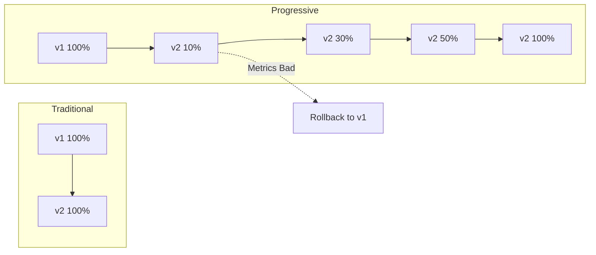

# How to Implement Progressive Delivery with ArgoCD

Author: [nawazdhandala](https://www.github.com/nawazdhandala)

Tags: ArgoCD, Progressive Delivery, Argo Rollouts, Canary, Blue-Green, GitOps

Description: Learn how to implement progressive delivery strategies with ArgoCD and Argo Rollouts, including canary deployments, blue-green deployments, and automated analysis for safe production releases.

---

Deploying directly to 100% of traffic is risky. Progressive delivery lets you gradually roll out changes, observe their impact, and automatically rollback if something goes wrong. Combined with ArgoCD, you get GitOps-driven progressive delivery.

## What Is Progressive Delivery?

Progressive delivery extends continuous delivery with gradual rollouts and automated analysis:



Key strategies:
- **Canary**: Gradually shift traffic to the new version
- **Blue-Green**: Switch all traffic at once between two environments
- **A/B Testing**: Route traffic based on user attributes

## Installing Argo Rollouts

Argo Rollouts provides the Rollout CRD that replaces Deployments:

```bash
# Install Argo Rollouts
kubectl create namespace argo-rollouts
kubectl apply -n argo-rollouts -f https://github.com/argoproj/argo-rollouts/releases/latest/download/install.yaml

# Install kubectl plugin
brew install argoproj/tap/kubectl-argo-rollouts

# Or for Linux
curl -LO https://github.com/argoproj/argo-rollouts/releases/latest/download/kubectl-argo-rollouts-linux-amd64
chmod +x kubectl-argo-rollouts-linux-amd64
sudo mv kubectl-argo-rollouts-linux-amd64 /usr/local/bin/kubectl-argo-rollouts
```

## Canary Deployment

Gradually shift traffic to the new version:

```yaml
# rollout.yaml
apiVersion: argoproj.io/v1alpha1
kind: Rollout
metadata:
  name: myapp
spec:
  replicas: 10
  selector:
    matchLabels:
      app: myapp
  template:
    metadata:
      labels:
        app: myapp
    spec:
      containers:
        - name: myapp
          image: myapp:v1.0.0
          ports:
            - containerPort: 8080
          resources:
            requests:
              memory: 256Mi
              cpu: 100m
  strategy:
    canary:
      # Traffic splitting steps
      steps:
        - setWeight: 10
        - pause: {duration: 5m}
        - setWeight: 30
        - pause: {duration: 5m}
        - setWeight: 50
        - pause: {duration: 10m}
        - setWeight: 80
        - pause: {duration: 10m}
        # Final step goes to 100%
      # Traffic routing
      canaryService: myapp-canary
      stableService: myapp-stable
      trafficRouting:
        nginx:
          stableIngress: myapp-ingress
```

Create the services:

```yaml
# services.yaml
apiVersion: v1
kind: Service
metadata:
  name: myapp-stable
spec:
  selector:
    app: myapp
  ports:
    - port: 80
      targetPort: 8080
---
apiVersion: v1
kind: Service
metadata:
  name: myapp-canary
spec:
  selector:
    app: myapp
  ports:
    - port: 80
      targetPort: 8080
```

## Blue-Green Deployment

Maintain two identical environments and switch traffic:

```yaml
# blue-green-rollout.yaml
apiVersion: argoproj.io/v1alpha1
kind: Rollout
metadata:
  name: myapp
spec:
  replicas: 5
  selector:
    matchLabels:
      app: myapp
  template:
    metadata:
      labels:
        app: myapp
    spec:
      containers:
        - name: myapp
          image: myapp:v1.0.0
          ports:
            - containerPort: 8080
  strategy:
    blueGreen:
      # Active service receives production traffic
      activeService: myapp-active
      # Preview service for testing before promotion
      previewService: myapp-preview
      # Auto-promote after this duration
      autoPromotionSeconds: 300
      # Scale down old version after this duration
      scaleDownDelaySeconds: 30
      # Preview replicas (optional)
      previewReplicaCount: 2
```

Services for blue-green:

```yaml
apiVersion: v1
kind: Service
metadata:
  name: myapp-active
spec:
  selector:
    app: myapp
  ports:
    - port: 80
      targetPort: 8080
---
apiVersion: v1
kind: Service
metadata:
  name: myapp-preview
spec:
  selector:
    app: myapp
  ports:
    - port: 80
      targetPort: 8080
```

## Traffic Routing with Ingress Controllers

### Nginx Ingress

```yaml
apiVersion: argoproj.io/v1alpha1
kind: Rollout
metadata:
  name: myapp
spec:
  strategy:
    canary:
      canaryService: myapp-canary
      stableService: myapp-stable
      trafficRouting:
        nginx:
          stableIngress: myapp-ingress
          # Additional canary annotations
          additionalIngressAnnotations:
            canary-by-header: X-Canary
```

```yaml
# ingress.yaml
apiVersion: networking.k8s.io/v1
kind: Ingress
metadata:
  name: myapp-ingress
  annotations:
    kubernetes.io/ingress.class: nginx
spec:
  rules:
    - host: myapp.example.com
      http:
        paths:
          - path: /
            pathType: Prefix
            backend:
              service:
                name: myapp-stable
                port:
                  number: 80
```

### Istio

```yaml
apiVersion: argoproj.io/v1alpha1
kind: Rollout
metadata:
  name: myapp
spec:
  strategy:
    canary:
      canaryService: myapp-canary
      stableService: myapp-stable
      trafficRouting:
        istio:
          virtualService:
            name: myapp-vsvc
            routes:
              - primary
```

```yaml
# virtual-service.yaml
apiVersion: networking.istio.io/v1beta1
kind: VirtualService
metadata:
  name: myapp-vsvc
spec:
  hosts:
    - myapp.example.com
  http:
    - name: primary
      route:
        - destination:
            host: myapp-stable
          weight: 100
        - destination:
            host: myapp-canary
          weight: 0
```

## Automated Analysis

Let Argo Rollouts automatically verify your canary:

```yaml
# analysis-template.yaml
apiVersion: argoproj.io/v1alpha1
kind: AnalysisTemplate
metadata:
  name: success-rate
spec:
  args:
    - name: service-name
  metrics:
    - name: success-rate
      # Run every 5 minutes
      interval: 5m
      # Need at least 3 successful measurements
      successCondition: result[0] >= 0.95
      failureLimit: 3
      provider:
        prometheus:
          address: http://prometheus:9090
          query: |
            sum(rate(http_requests_total{service="{{args.service-name}}",status=~"2.*"}[5m]))
            /
            sum(rate(http_requests_total{service="{{args.service-name}}"}[5m]))
```

Use the analysis in your rollout:

```yaml
apiVersion: argoproj.io/v1alpha1
kind: Rollout
metadata:
  name: myapp
spec:
  strategy:
    canary:
      steps:
        - setWeight: 10
        - pause: {duration: 2m}
        - analysis:
            templates:
              - templateName: success-rate
            args:
              - name: service-name
                value: myapp-canary
        - setWeight: 50
        - pause: {duration: 5m}
        - analysis:
            templates:
              - templateName: success-rate
            args:
              - name: service-name
                value: myapp-canary
```

### Multiple Analysis Metrics

```yaml
apiVersion: argoproj.io/v1alpha1
kind: AnalysisTemplate
metadata:
  name: comprehensive-analysis
spec:
  args:
    - name: service-name
  metrics:
    # Check error rate
    - name: error-rate
      interval: 2m
      successCondition: result[0] < 0.01
      failureLimit: 3
      provider:
        prometheus:
          address: http://prometheus:9090
          query: |
            sum(rate(http_requests_total{service="{{args.service-name}}",status=~"5.*"}[2m]))
            /
            sum(rate(http_requests_total{service="{{args.service-name}}"}[2m]))

    # Check latency
    - name: latency-p99
      interval: 2m
      successCondition: result[0] < 500
      failureLimit: 3
      provider:
        prometheus:
          address: http://prometheus:9090
          query: |
            histogram_quantile(0.99, sum(rate(http_request_duration_seconds_bucket{service="{{args.service-name}}"}[2m])) by (le)) * 1000

    # Check pod health
    - name: pod-restarts
      interval: 2m
      successCondition: result[0] == 0
      failureLimit: 1
      provider:
        prometheus:
          address: http://prometheus:9090
          query: |
            sum(increase(kube_pod_container_status_restarts_total{pod=~"myapp-.*"}[5m]))
```

## ArgoCD Application for Rollouts

Create an ArgoCD Application that manages Rollouts:

```yaml
apiVersion: argoproj.io/v1alpha1
kind: Application
metadata:
  name: myapp
  namespace: argocd
spec:
  project: default
  source:
    repoURL: https://github.com/myorg/myapp.git
    targetRevision: HEAD
    path: k8s
  destination:
    server: https://kubernetes.default.svc
    namespace: myapp
  syncPolicy:
    automated:
      prune: true
      selfHeal: true
```

ArgoCD automatically recognizes Rollout health status.

## Managing Rollouts

### CLI Commands

```bash
# Watch rollout progress
kubectl argo rollouts get rollout myapp -w

# Manually promote a canary
kubectl argo rollouts promote myapp

# Abort a rollout
kubectl argo rollouts abort myapp

# Retry a failed rollout
kubectl argo rollouts retry rollout myapp

# Undo to previous version
kubectl argo rollouts undo myapp
```

### Dashboard

Access the Argo Rollouts dashboard:

```bash
kubectl argo rollouts dashboard

# Open http://localhost:3100
```

## Pause and Manual Gates

Add manual approval gates:

```yaml
apiVersion: argoproj.io/v1alpha1
kind: Rollout
metadata:
  name: myapp
spec:
  strategy:
    canary:
      steps:
        - setWeight: 10
        - pause: {}  # Indefinite pause, requires manual promotion
        - setWeight: 50
        - pause: {duration: 10m}
        - setWeight: 100
```

Promote manually:

```bash
kubectl argo rollouts promote myapp
```

## Rollback Strategies

### Automatic Rollback

Configure automatic rollback on analysis failure:

```yaml
apiVersion: argoproj.io/v1alpha1
kind: Rollout
metadata:
  name: myapp
spec:
  strategy:
    canary:
      steps:
        - setWeight: 20
        - analysis:
            templates:
              - templateName: success-rate
      # Automatically rollback on failure
      abortScaleDownDelaySeconds: 30
```

### Manual Rollback

```bash
# Abort current rollout and rollback
kubectl argo rollouts abort myapp

# Or undo to specific revision
kubectl argo rollouts undo myapp --to-revision=2
```

## Best Practices

### Start Conservative

Begin with small traffic percentages:

```yaml
steps:
  - setWeight: 5
  - pause: {duration: 10m}
  - setWeight: 10
  - pause: {duration: 10m}
```

### Use Multiple Metrics

Do not rely on a single metric:

```yaml
metrics:
  - name: error-rate
  - name: latency
  - name: saturation
```

### Set Appropriate Timeouts

```yaml
analysisRunMetadata:
  labels:
    app: myapp
progressDeadlineSeconds: 600
```

### Notify on Rollout Events

Combine with ArgoCD notifications:

```yaml
metadata:
  annotations:
    notifications.argoproj.io/subscribe.on-rollout-completed.slack: deployments
    notifications.argoproj.io/subscribe.on-rollout-aborted.slack: alerts
```

## Troubleshooting

### Check Rollout Status

```bash
kubectl argo rollouts status myapp
kubectl describe rollout myapp
```

### View Analysis Results

```bash
kubectl get analysisrun -l rollouts-pod-template-hash
kubectl describe analysisrun <name>
```

### Common Issues

**Rollout stuck:**
- Check analysis template metrics
- Verify Prometheus queries work
- Check for resource constraints

**Traffic not splitting:**
- Verify ingress controller supports traffic splitting
- Check service selectors match pods

Progressive delivery reduces deployment risk significantly. Start with basic canary deployments, add automated analysis as you mature, and let ArgoCD manage it all through Git. The combination gives you confidence to deploy frequently while maintaining system stability.
