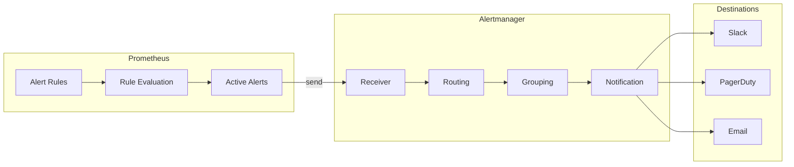

# How to Configure Alert Rules in Prometheus

Author: [nawazdhandala](https://www.github.com/nawazdhandala)

Tags: Prometheus, Alerting, Alert Rules, Alertmanager, Monitoring, SRE, Observability

Description: Learn how to configure Prometheus alert rules effectively, including syntax, labels, annotations, severity levels, and integration with Alertmanager for notification routing.

---

Alert rules define the conditions that trigger notifications. Well-configured alerts catch real problems without generating noise. This guide covers everything from basic syntax to advanced patterns for alert rule configuration.

## Alert Rule Architecture



## Alert Rule Syntax

Alert rules are defined in YAML files:

```yaml
# alerts.yml
groups:
  - name: example-alerts
    # How often to evaluate rules in this group
    interval: 30s
    rules:
      - alert: HighErrorRate
        # PromQL expression that triggers the alert
        expr: |
          (
            sum(rate(http_requests_total{status=~"5.."}[5m]))
            /
            sum(rate(http_requests_total[5m]))
          ) > 0.05
        # Wait this long before firing
        for: 5m
        # Labels attached to the alert
        labels:
          severity: critical
          team: backend
        # Annotations provide context
        annotations:
          summary: "High error rate detected"
          description: "Error rate is {{ printf \"%.2f\" $value }}% over the last 5 minutes"
          runbook_url: "https://wiki.example.com/runbooks/high-error-rate"
```

## Loading Alert Rules

### Prometheus Configuration

```yaml
# prometheus.yml
global:
  scrape_interval: 15s
  evaluation_interval: 15s

rule_files:
  - '/etc/prometheus/rules/*.yml'
  - '/etc/prometheus/alerts/*.yml'

alerting:
  alertmanagers:
    - static_configs:
        - targets:
            - 'alertmanager:9093'
```

### Kubernetes with Prometheus Operator

Use PrometheusRule custom resources:

```yaml
# prometheusrule.yaml
apiVersion: monitoring.coreos.com/v1
kind: PrometheusRule
metadata:
  name: application-alerts
  namespace: monitoring
  labels:
    # Must match Prometheus ruleSelector
    release: prometheus
spec:
  groups:
    - name: application.rules
      rules:
        - alert: HighErrorRate
          expr: |
            (
              sum by (service) (rate(http_requests_total{status=~"5.."}[5m]))
              /
              sum by (service) (rate(http_requests_total[5m]))
            ) > 0.05
          for: 5m
          labels:
            severity: critical
          annotations:
            summary: "High error rate on {{ $labels.service }}"
```

## Alert Labels

Labels categorize alerts and enable routing:

```yaml
rules:
  - alert: ServiceDown
    expr: up == 0
    for: 2m
    labels:
      # Severity for routing priority
      severity: critical

      # Team ownership for routing
      team: platform

      # Environment context
      environment: production

      # Preserve labels from the expression
      # job and instance labels come from the metric
```

### Common Label Patterns

| Label | Purpose | Example Values |
|-------|---------|----------------|
| severity | Priority level | critical, warning, info |
| team | Ownership | backend, frontend, platform |
| environment | Deployment tier | production, staging, development |
| service | Service name | api, web, database |
| component | Service component | cache, queue, worker |

## Alert Annotations

Annotations provide human-readable context:

```yaml
rules:
  - alert: HighMemoryUsage
    expr: |
      (
        container_memory_usage_bytes / container_spec_memory_limit_bytes
      ) > 0.9
    for: 10m
    labels:
      severity: warning
    annotations:
      # Short description for notification titles
      summary: "High memory usage on {{ $labels.pod }}"

      # Detailed description with template variables
      description: |
        Pod {{ $labels.pod }} in namespace {{ $labels.namespace }} is using
        {{ printf "%.1f" $value }}% of its memory limit.
        Current usage: {{ with query "container_memory_usage_bytes{pod=\"" }}{{ . | first | value | humanize1024 }}{{ end }}

      # Link to troubleshooting documentation
      runbook_url: "https://wiki.example.com/runbooks/memory-pressure"

      # Dashboard link
      dashboard_url: "https://grafana.example.com/d/pods?var-pod={{ $labels.pod }}"
```

### Template Functions

Annotations support Go templating with Prometheus functions:

```yaml
annotations:
  # Format numbers
  description: "Error rate: {{ printf \"%.2f\" $value }}%"

  # Humanize bytes
  description: "Memory: {{ $value | humanize1024 }}B"

  # Humanize duration
  description: "Uptime: {{ $value | humanizeDuration }}"

  # Query current value
  description: |
    Current value: {{ with query "up{job='api'}" }}
      {{ . | first | value }}
    {{ end }}

  # Access labels
  description: "Service {{ $labels.service }} in {{ $labels.namespace }}"
```

## Alert Rule Examples

### Infrastructure Alerts

```yaml
groups:
  - name: infrastructure
    rules:
      # Node down
      - alert: NodeDown
        expr: up{job="node-exporter"} == 0
        for: 5m
        labels:
          severity: critical
        annotations:
          summary: "Node {{ $labels.instance }} is down"

      # High CPU usage
      - alert: HighCPUUsage
        expr: |
          100 - (avg by (instance) (rate(node_cpu_seconds_total{mode="idle"}[5m])) * 100) > 80
        for: 10m
        labels:
          severity: warning
        annotations:
          summary: "High CPU usage on {{ $labels.instance }}"
          description: "CPU usage is {{ printf \"%.1f\" $value }}%"

      # Disk space low
      - alert: DiskSpaceLow
        expr: |
          (
            node_filesystem_avail_bytes{mountpoint="/"}
            / node_filesystem_size_bytes{mountpoint="/"}
          ) < 0.1
        for: 15m
        labels:
          severity: warning
        annotations:
          summary: "Low disk space on {{ $labels.instance }}"
          description: "Only {{ printf \"%.1f\" $value }}% disk space remaining"

      # Disk will fill soon
      - alert: DiskWillFill
        expr: |
          predict_linear(node_filesystem_avail_bytes{mountpoint="/"}[6h], 24*60*60) < 0
        for: 1h
        labels:
          severity: warning
        annotations:
          summary: "Disk on {{ $labels.instance }} will fill within 24 hours"
```

### Application Alerts

```yaml
groups:
  - name: application
    rules:
      # High error rate
      - alert: HighErrorRate
        expr: |
          (
            sum by (service) (rate(http_requests_total{status=~"5.."}[5m]))
            /
            sum by (service) (rate(http_requests_total[5m]))
          ) > 0.05
        for: 5m
        labels:
          severity: critical
        annotations:
          summary: "High error rate on {{ $labels.service }}"
          description: "Error rate is {{ printf \"%.2f\" $value | mul 100 }}%"

      # High latency
      - alert: HighLatency
        expr: |
          histogram_quantile(0.95,
            sum by (service, le) (rate(http_request_duration_seconds_bucket[5m]))
          ) > 0.5
        for: 5m
        labels:
          severity: warning
        annotations:
          summary: "High latency on {{ $labels.service }}"
          description: "95th percentile latency is {{ printf \"%.3f\" $value }}s"

      # Low request rate (traffic drop)
      - alert: LowTraffic
        expr: |
          sum by (service) (rate(http_requests_total[5m])) < 10
          and
          sum by (service) (rate(http_requests_total[5m] offset 1h)) > 100
        for: 10m
        labels:
          severity: warning
        annotations:
          summary: "Significant traffic drop on {{ $labels.service }}"
```

### Kubernetes Alerts

```yaml
groups:
  - name: kubernetes
    rules:
      # Pod not ready
      - alert: PodNotReady
        expr: |
          kube_pod_status_ready{condition="true"} == 0
        for: 10m
        labels:
          severity: warning
        annotations:
          summary: "Pod {{ $labels.pod }} not ready"
          description: "Pod {{ $labels.pod }} in {{ $labels.namespace }} has been not ready for 10 minutes"

      # Container restarting
      - alert: ContainerRestarting
        expr: |
          increase(kube_pod_container_status_restarts_total[1h]) > 5
        for: 5m
        labels:
          severity: warning
        annotations:
          summary: "Container {{ $labels.container }} restarting frequently"
          description: "Container {{ $labels.container }} in pod {{ $labels.pod }} has restarted {{ printf \"%.0f\" $value }} times in the last hour"

      # Deployment replicas mismatch
      - alert: DeploymentReplicasMismatch
        expr: |
          kube_deployment_spec_replicas != kube_deployment_status_available_replicas
        for: 15m
        labels:
          severity: warning
        annotations:
          summary: "Deployment {{ $labels.deployment }} has replica mismatch"
          description: "Deployment {{ $labels.deployment }} has {{ $value }} unavailable replicas"

      # PVC almost full
      - alert: PersistentVolumeAlmostFull
        expr: |
          kubelet_volume_stats_used_bytes / kubelet_volume_stats_capacity_bytes > 0.85
        for: 10m
        labels:
          severity: warning
        annotations:
          summary: "PVC {{ $labels.persistentvolumeclaim }} almost full"
          description: "PVC is {{ printf \"%.1f\" $value | mul 100 }}% full"
```

## Alertmanager Configuration

Configure Alertmanager to route and deliver alerts:

```yaml
# alertmanager.yml
global:
  smtp_smarthost: 'smtp.example.com:587'
  smtp_from: 'alerts@example.com'
  slack_api_url: 'https://hooks.slack.com/services/xxx/yyy/zzz'

route:
  # Default receiver
  receiver: 'slack-notifications'
  # Group alerts by these labels
  group_by: ['alertname', 'service']
  # Wait before sending first notification
  group_wait: 30s
  # Wait before sending updates
  group_interval: 5m
  # Wait before resending
  repeat_interval: 4h

  routes:
    # Critical alerts go to PagerDuty
    - match:
        severity: critical
      receiver: 'pagerduty'
      continue: true

    # Team-specific routing
    - match:
        team: backend
      receiver: 'backend-slack'

    - match:
        team: frontend
      receiver: 'frontend-slack'

receivers:
  - name: 'slack-notifications'
    slack_configs:
      - channel: '#alerts'
        title: '{{ .GroupLabels.alertname }}'
        text: '{{ range .Alerts }}{{ .Annotations.summary }}{{ end }}'

  - name: 'pagerduty'
    pagerduty_configs:
      - service_key: 'your-pagerduty-key'
        severity: '{{ if eq .GroupLabels.severity "critical" }}critical{{ else }}warning{{ end }}'

  - name: 'backend-slack'
    slack_configs:
      - channel: '#backend-alerts'

  - name: 'frontend-slack'
    slack_configs:
      - channel: '#frontend-alerts'

inhibit_rules:
  # Don't alert on warning if critical is already firing
  - source_match:
      severity: 'critical'
    target_match:
      severity: 'warning'
    equal: ['alertname', 'service']
```

## Validating Alert Rules

### Check Syntax

```bash
# Validate rule files
promtool check rules /etc/prometheus/rules/*.yml

# Expected output
# Checking rules.yml
#   SUCCESS: 10 rules found
```

### Unit Testing

```yaml
# test_alerts.yml
rule_files:
  - alerts.yml

evaluation_interval: 1m

tests:
  - interval: 1m
    input_series:
      - series: 'http_requests_total{status="500", service="api"}'
        values: '0+10x10'
      - series: 'http_requests_total{status="200", service="api"}'
        values: '0+100x10'

    alert_rule_test:
      - eval_time: 5m
        alertname: HighErrorRate
        exp_alerts:
          - exp_labels:
              severity: critical
              service: api
            exp_annotations:
              summary: "High error rate on api"
```

Run tests:

```bash
promtool test rules test_alerts.yml
```

## Best Practices

1. **Use meaningful for durations** - Avoid flapping with appropriate wait times
2. **Include runbook URLs** - Every alert should link to documentation
3. **Set appropriate severity** - Not everything is critical
4. **Test alerts before deploying** - Use promtool to validate
5. **Group related alerts** - Use grouping to reduce notification volume
6. **Review and prune regularly** - Remove alerts that never fire or always fire

---

Well-configured alert rules are the foundation of reliable monitoring. Start with a few high-value alerts, refine thresholds based on real data, and always include context in annotations. Remember that the goal is actionable alerts, not comprehensive coverage.
