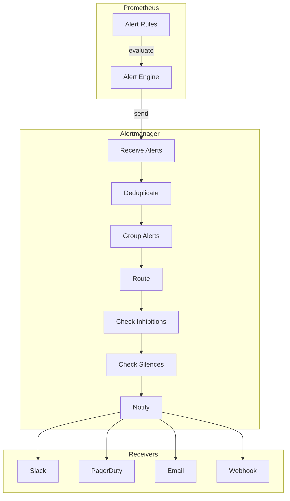

# How to Configure Alertmanager with Prometheus

Author: [nawazdhandala](https://www.github.com/nawazdhandala)

Tags: Prometheus, Alertmanager, Alerting, Notifications, PagerDuty, Slack, Email, Routing, Inhibition, Silences

Description: A comprehensive guide to configuring Alertmanager with Prometheus. Learn how to set up routing rules, configure notification receivers, implement alert grouping, and manage silences for effective incident management.

---

## What Is Alertmanager?

Alertmanager handles alerts sent by Prometheus and other monitoring systems. It manages deduplication, grouping, routing, silencing, and sending notifications through various channels like email, Slack, PagerDuty, and webhooks.

Key responsibilities include:

- **Deduplication**: Consolidate identical alerts from multiple sources
- **Grouping**: Bundle related alerts into single notifications
- **Routing**: Direct alerts to appropriate receivers based on labels
- **Inhibition**: Suppress alerts when related higher-priority alerts are firing
- **Silencing**: Temporarily mute specific alerts during maintenance

## Installing Alertmanager

### Standalone Installation

```bash
# Download and extract Alertmanager
wget https://github.com/prometheus/alertmanager/releases/download/v0.26.0/alertmanager-0.26.0.linux-amd64.tar.gz
tar xvfz alertmanager-0.26.0.linux-amd64.tar.gz
cd alertmanager-0.26.0.linux-amd64

# Start Alertmanager
./alertmanager --config.file=alertmanager.yml
```

### Docker Installation

```yaml
# docker-compose.yml
version: '3.8'
services:
  alertmanager:
    image: prom/alertmanager:v0.26.0
    ports:
      - "9093:9093"
    volumes:
      - ./alertmanager.yml:/etc/alertmanager/alertmanager.yml
      - alertmanager_data:/alertmanager
    command:
      - '--config.file=/etc/alertmanager/alertmanager.yml'
      - '--storage.path=/alertmanager'
      - '--web.external-url=https://alertmanager.example.com'
    restart: unless-stopped

volumes:
  alertmanager_data:
```

## Basic Configuration Structure

Alertmanager configuration consists of several key sections:

```yaml
# alertmanager.yml - Complete configuration structure
global:
  # Default settings applied to all notifications
  resolve_timeout: 5m
  smtp_smarthost: 'smtp.example.com:587'
  smtp_from: 'alertmanager@example.com'
  smtp_auth_username: 'alertmanager@example.com'
  smtp_auth_password: 'password'
  slack_api_url: 'https://hooks.slack.com/services/XXX/YYY/ZZZ'
  pagerduty_url: 'https://events.pagerduty.com/v2/enqueue'

# Notification templates
templates:
  - '/etc/alertmanager/templates/*.tmpl'

# The root route
route:
  receiver: 'default-receiver'
  group_by: ['alertname', 'cluster', 'service']
  group_wait: 30s
  group_interval: 5m
  repeat_interval: 4h
  routes:
    # Child routes here

# Alert receivers
receivers:
  - name: 'default-receiver'
    # Receiver configuration here

# Inhibition rules
inhibit_rules:
  - source_match:
      severity: 'critical'
    target_match:
      severity: 'warning'
    equal: ['alertname', 'cluster', 'service']
```

## Configuring Alert Routing

The routing tree determines which receiver handles each alert:

```yaml
# alertmanager.yml - Routing configuration
route:
  # Default receiver for unmatched alerts
  receiver: 'team-ops-default'

  # Labels to group alerts by
  group_by: ['alertname', 'cluster', 'namespace']

  # How long to wait before sending initial notification
  group_wait: 30s

  # How long to wait before sending updates to a group
  group_interval: 5m

  # How long to wait before re-sending a notification
  repeat_interval: 4h

  # Child routes (evaluated in order, first match wins)
  routes:
    # Critical production alerts to PagerDuty
    - receiver: 'team-ops-pagerduty'
      matchers:
        - severity = critical
        - environment = production
      continue: false  # Stop evaluating after match

    # Database alerts to DBA team
    - receiver: 'team-dba-slack'
      matchers:
        - service =~ "postgres|mysql|mongodb"
      group_by: ['alertname', 'service', 'instance']

    # Platform team alerts
    - receiver: 'team-platform-slack'
      matchers:
        - team = platform
      routes:
        # Critical platform alerts also page
        - receiver: 'team-platform-pagerduty'
          matchers:
            - severity = critical
          continue: true  # Also send to parent receiver

    # All warnings go to general Slack
    - receiver: 'team-ops-slack'
      matchers:
        - severity = warning

    # Catch-all for info alerts
    - receiver: 'team-ops-email'
      matchers:
        - severity = info
      group_wait: 1h
      repeat_interval: 24h
```

## Configuring Receivers

### Slack Receiver

```yaml
receivers:
  - name: 'team-platform-slack'
    slack_configs:
      - api_url: 'https://hooks.slack.com/services/XXX/YYY/ZZZ'
        channel: '#platform-alerts'
        username: 'Alertmanager'
        icon_emoji: ':prometheus:'
        send_resolved: true

        # Message formatting
        title: '{{ template "slack.title" . }}'
        text: '{{ template "slack.text" . }}'

        # Color based on severity
        color: '{{ if eq .Status "firing" }}{{ if eq .CommonLabels.severity "critical" }}danger{{ else }}warning{{ end }}{{ else }}good{{ end }}'

        # Action buttons
        actions:
          - type: button
            text: 'Runbook'
            url: '{{ (index .Alerts 0).Annotations.runbook_url }}'
          - type: button
            text: 'Silence'
            url: '{{ template "silence.link" . }}'
```

### PagerDuty Receiver

```yaml
receivers:
  - name: 'team-ops-pagerduty'
    pagerduty_configs:
      - routing_key: 'your-pagerduty-integration-key'
        severity: '{{ .CommonLabels.severity }}'
        description: '{{ .CommonAnnotations.summary }}'

        # Custom details for PagerDuty
        details:
          firing: '{{ template "pagerduty.instances" .Alerts.Firing }}'
          resolved: '{{ template "pagerduty.instances" .Alerts.Resolved }}'
          num_firing: '{{ .Alerts.Firing | len }}'
          num_resolved: '{{ .Alerts.Resolved | len }}'

        # Links and images
        links:
          - href: '{{ template "runbook.link" . }}'
            text: 'Runbook'
          - href: '{{ template "dashboard.link" . }}'
            text: 'Dashboard'
```

### Email Receiver

```yaml
receivers:
  - name: 'team-ops-email'
    email_configs:
      - to: 'ops-team@example.com'
        from: 'alertmanager@example.com'
        smarthost: 'smtp.example.com:587'
        auth_username: 'alertmanager@example.com'
        auth_password: 'password'
        auth_identity: 'alertmanager@example.com'
        send_resolved: true

        # HTML email template
        html: '{{ template "email.html" . }}'

        # Headers
        headers:
          Subject: '[{{ .Status | toUpper }}] {{ .CommonLabels.alertname }}'
```

### Webhook Receiver

```yaml
receivers:
  - name: 'custom-webhook'
    webhook_configs:
      - url: 'https://api.example.com/alerts'
        send_resolved: true
        http_config:
          bearer_token: 'your-api-token'
          tls_config:
            insecure_skip_verify: false
        max_alerts: 10  # Max alerts per webhook call
```

### Microsoft Teams Receiver

```yaml
receivers:
  - name: 'team-ops-teams'
    msteams_configs:
      - webhook_url: 'https://outlook.office.com/webhook/XXX'
        title: '{{ .CommonLabels.alertname }}'
        text: '{{ .CommonAnnotations.description }}'
        send_resolved: true
```

## Alert Flow Visualization



## Inhibition Rules

Inhibition prevents notifications for lower-severity alerts when a related higher-severity alert is firing:

```yaml
# alertmanager.yml - Inhibition rules
inhibit_rules:
  # Critical alerts suppress warnings for the same service
  - source_matchers:
      - severity = critical
    target_matchers:
      - severity = warning
    equal:
      - alertname
      - cluster
      - service

  # Cluster-down suppresses all other cluster alerts
  - source_matchers:
      - alertname = ClusterDown
    target_matchers:
      - cluster =~ ".+"
    equal:
      - cluster

  # Node-down suppresses pod alerts on that node
  - source_matchers:
      - alertname = NodeDown
    target_matchers:
      - alertname =~ "Pod.*"
    equal:
      - node

  # Maintenance mode suppresses all alerts for a service
  - source_matchers:
      - alertname = MaintenanceMode
    target_matchers:
      - severity =~ "warning|critical"
    equal:
      - service
```

## Custom Notification Templates

Create custom templates for better alert formatting:

```go
{{/* templates/slack.tmpl */}}

{{ define "slack.title" -}}
{{ if eq .Status "firing" }}[FIRING:{{ .Alerts.Firing | len }}]{{ else }}[RESOLVED:{{ .Alerts.Resolved | len }}]{{ end }} {{ .CommonLabels.alertname }}
{{- end }}

{{ define "slack.text" -}}
{{ range .Alerts }}
*Alert:* {{ .Labels.alertname }}
*Severity:* {{ .Labels.severity }}
*Description:* {{ .Annotations.description }}
*Details:*
{{ range .Labels.SortedPairs }}  - {{ .Name }}: {{ .Value }}
{{ end }}
{{ end }}
{{- end }}

{{ define "silence.link" -}}
{{ .ExternalURL }}/#/silences/new?filter=%7B
{{- range $i, $label := .CommonLabels.SortedPairs -}}
{{- if $i }},{{ end }}{{ $label.Name }}%3D%22{{ $label.Value }}%22
{{- end -}}
%7D
{{- end }}

{{ define "runbook.link" -}}
{{ if (index .Alerts 0).Annotations.runbook_url }}{{ (index .Alerts 0).Annotations.runbook_url }}{{ else }}https://wiki.example.com/runbooks{{ end }}
{{- end }}
```

```go
{{/* templates/email.tmpl */}}

{{ define "email.html" }}
<!DOCTYPE html>
<html>
<head>
  <style>
    .alert { padding: 10px; margin: 10px 0; border-radius: 5px; }
    .critical { background-color: #ff4444; color: white; }
    .warning { background-color: #ffaa00; color: black; }
    .info { background-color: #4444ff; color: white; }
  </style>
</head>
<body>
  <h2>{{ .Status | title }} Alerts</h2>
  {{ range .Alerts }}
  <div class="alert {{ .Labels.severity }}">
    <h3>{{ .Labels.alertname }}</h3>
    <p><strong>Severity:</strong> {{ .Labels.severity }}</p>
    <p><strong>Description:</strong> {{ .Annotations.description }}</p>
    <p><strong>Started:</strong> {{ .StartsAt }}</p>
    {{ if .EndsAt }}<p><strong>Ended:</strong> {{ .EndsAt }}</p>{{ end }}
  </div>
  {{ end }}
</body>
</html>
{{ end }}
```

## Managing Silences

Create silences programmatically using the API:

```bash
# Create a silence via API
curl -X POST http://alertmanager:9093/api/v2/silences \
  -H "Content-Type: application/json" \
  -d '{
    "matchers": [
      {
        "name": "alertname",
        "value": "HighMemoryUsage",
        "isRegex": false
      },
      {
        "name": "instance",
        "value": "server-1",
        "isRegex": false
      }
    ],
    "startsAt": "2026-01-25T00:00:00Z",
    "endsAt": "2026-01-25T06:00:00Z",
    "createdBy": "maintenance-script",
    "comment": "Scheduled maintenance window"
  }'

# List active silences
curl http://alertmanager:9093/api/v2/silences

# Delete a silence
curl -X DELETE http://alertmanager:9093/api/v2/silence/silence-id
```

## High Availability Setup

Deploy multiple Alertmanager instances in a cluster:

```yaml
# docker-compose-ha.yml
version: '3.8'
services:
  alertmanager-1:
    image: prom/alertmanager:v0.26.0
    command:
      - '--config.file=/etc/alertmanager/alertmanager.yml'
      - '--storage.path=/alertmanager'
      - '--cluster.listen-address=0.0.0.0:9094'
      - '--cluster.peer=alertmanager-2:9094'
      - '--cluster.peer=alertmanager-3:9094'
    ports:
      - "9093:9093"
    volumes:
      - ./alertmanager.yml:/etc/alertmanager/alertmanager.yml

  alertmanager-2:
    image: prom/alertmanager:v0.26.0
    command:
      - '--config.file=/etc/alertmanager/alertmanager.yml'
      - '--storage.path=/alertmanager'
      - '--cluster.listen-address=0.0.0.0:9094'
      - '--cluster.peer=alertmanager-1:9094'
      - '--cluster.peer=alertmanager-3:9094'
    volumes:
      - ./alertmanager.yml:/etc/alertmanager/alertmanager.yml

  alertmanager-3:
    image: prom/alertmanager:v0.26.0
    command:
      - '--config.file=/etc/alertmanager/alertmanager.yml'
      - '--storage.path=/alertmanager'
      - '--cluster.listen-address=0.0.0.0:9094'
      - '--cluster.peer=alertmanager-1:9094'
      - '--cluster.peer=alertmanager-2:9094'
    volumes:
      - ./alertmanager.yml:/etc/alertmanager/alertmanager.yml
```

Configure Prometheus to send to all Alertmanager instances:

```yaml
# prometheus.yml
alerting:
  alertmanagers:
    - static_configs:
        - targets:
            - alertmanager-1:9093
            - alertmanager-2:9093
            - alertmanager-3:9093
```

## Best Practices

1. **Start simple**: Begin with basic routing and add complexity as needed.

2. **Use meaningful group labels**: Group alerts by service, environment, and severity for actionable notifications.

3. **Set appropriate intervals**: Balance between notification speed and alert fatigue.

4. **Test your configuration**: Use the Alertmanager API to verify routing logic.

```bash
# Test alert routing
curl -X POST http://alertmanager:9093/api/v2/alerts \
  -H "Content-Type: application/json" \
  -d '[{
    "labels": {
      "alertname": "TestAlert",
      "severity": "warning",
      "service": "test"
    },
    "annotations": {
      "summary": "Test alert summary"
    }
  }]'
```

5. **Document your routing rules**: Keep a runbook explaining which teams receive which alerts.

6. **Monitor Alertmanager itself**: Set up alerts for notification failures.

## Conclusion

Alertmanager transforms raw Prometheus alerts into actionable notifications. By configuring routing rules, grouping, and inhibitions, you can reduce noise and ensure the right people receive the right alerts. Start with a simple configuration and iterate based on your team's needs and incident patterns.
