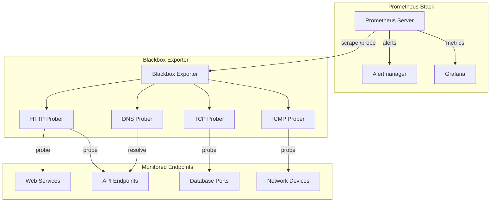

# How to Implement Blackbox Monitoring with Prometheus

Author: [nawazdhandala](https://www.github.com/nawazdhandala)

Tags: Prometheus, Blackbox Monitoring, Blackbox Exporter, HTTP Probes, TCP Probes, ICMP, Observability, Site Reliability Engineering

Description: Learn how to set up blackbox monitoring with Prometheus using the Blackbox Exporter. This guide covers HTTP, TCP, ICMP, and DNS probes with practical configuration examples for monitoring external endpoints.

---

## What Is Blackbox Monitoring?

Blackbox monitoring treats your services as opaque boxes. Instead of instrumenting application internals, you probe endpoints from the outside, just like your users would. This approach answers the fundamental question: "Is my service reachable and responding correctly?"

While whitebox monitoring (application metrics, traces, logs) tells you why something broke, blackbox monitoring tells you that something broke from the user's perspective. Both approaches complement each other in a well-designed observability stack.

## Why Use the Prometheus Blackbox Exporter?

The Blackbox Exporter is a Prometheus component that probes endpoints over HTTP, HTTPS, TCP, ICMP, and DNS. It then exposes the probe results as Prometheus metrics that you can alert on and visualize.

Common use cases include:

- Monitoring external APIs and third-party dependencies
- Checking SSL certificate expiration
- Verifying DNS resolution
- Testing TCP port availability
- Measuring response times from different geographic locations

## Installing the Blackbox Exporter

You can run the Blackbox Exporter as a standalone binary, Docker container, or Kubernetes deployment.

### Docker Installation

```bash
# Pull and run the Blackbox Exporter container
docker run -d \
  --name blackbox-exporter \
  -p 9115:9115 \
  -v /path/to/blackbox.yml:/etc/blackbox_exporter/config.yml \
  prom/blackbox-exporter:latest
```

### Kubernetes Installation with Helm

```bash
# Add the Prometheus community Helm repository
helm repo add prometheus-community https://prometheus-community.github.io/helm-charts
helm repo update

# Install the Blackbox Exporter
helm install blackbox-exporter prometheus-community/prometheus-blackbox-exporter \
  --namespace monitoring \
  --create-namespace
```

## Configuring Probe Modules

The Blackbox Exporter uses modules to define probe behavior. Create a configuration file that specifies different probe types for various monitoring scenarios.

```yaml
# blackbox.yml - Main configuration file for Blackbox Exporter
modules:
  # HTTP probe for checking website availability
  http_2xx:
    prober: http
    timeout: 5s
    http:
      valid_http_versions: ["HTTP/1.1", "HTTP/2.0"]
      valid_status_codes: [200, 201, 202, 204]
      method: GET
      follow_redirects: true
      preferred_ip_protocol: "ip4"

  # HTTP probe with authentication
  http_basic_auth:
    prober: http
    timeout: 5s
    http:
      method: GET
      basic_auth:
        username: "monitoring"
        password_file: "/etc/blackbox_exporter/password"

  # HTTP POST probe for API health checks
  http_post_2xx:
    prober: http
    timeout: 5s
    http:
      method: POST
      headers:
        Content-Type: application/json
      body: '{"health": "check"}'
      valid_status_codes: [200]

  # TCP connection probe
  tcp_connect:
    prober: tcp
    timeout: 5s
    tcp:
      preferred_ip_protocol: "ip4"

  # TCP probe with TLS verification
  tcp_tls:
    prober: tcp
    timeout: 5s
    tcp:
      tls: true
      tls_config:
        insecure_skip_verify: false

  # ICMP ping probe
  icmp_probe:
    prober: icmp
    timeout: 5s
    icmp:
      preferred_ip_protocol: "ip4"

  # DNS lookup probe
  dns_lookup:
    prober: dns
    timeout: 5s
    dns:
      query_name: "example.com"
      query_type: "A"
      valid_rcodes:
        - NOERROR
```

## Configuring Prometheus to Scrape the Blackbox Exporter

The key to blackbox monitoring is using Prometheus relabeling to pass target URLs to the Blackbox Exporter. Here is a Prometheus configuration example:

```yaml
# prometheus.yml - Scrape configuration for blackbox monitoring
scrape_configs:
  # Scrape the Blackbox Exporter itself for its own metrics
  - job_name: 'blackbox_exporter'
    static_configs:
      - targets: ['blackbox-exporter:9115']

  # HTTP endpoint monitoring
  - job_name: 'blackbox_http'
    metrics_path: /probe
    params:
      module: [http_2xx]
    static_configs:
      - targets:
          - https://example.com
          - https://api.example.com/health
          - https://www.google.com
        labels:
          probe_type: http
    relabel_configs:
      # Store the original target in a label
      - source_labels: [__address__]
        target_label: __param_target
      # Use the target as the instance label
      - source_labels: [__param_target]
        target_label: instance
      # Point to the Blackbox Exporter address
      - target_label: __address__
        replacement: blackbox-exporter:9115

  # TCP port monitoring
  - job_name: 'blackbox_tcp'
    metrics_path: /probe
    params:
      module: [tcp_connect]
    static_configs:
      - targets:
          - db.example.com:5432
          - redis.example.com:6379
          - rabbitmq.example.com:5672
        labels:
          probe_type: tcp
    relabel_configs:
      - source_labels: [__address__]
        target_label: __param_target
      - source_labels: [__param_target]
        target_label: instance
      - target_label: __address__
        replacement: blackbox-exporter:9115

  # ICMP ping monitoring
  - job_name: 'blackbox_icmp'
    metrics_path: /probe
    params:
      module: [icmp_probe]
    static_configs:
      - targets:
          - 8.8.8.8
          - 1.1.1.1
          - gateway.internal
        labels:
          probe_type: icmp
    relabel_configs:
      - source_labels: [__address__]
        target_label: __param_target
      - source_labels: [__param_target]
        target_label: instance
      - target_label: __address__
        replacement: blackbox-exporter:9115
```

## Understanding Blackbox Exporter Metrics

The Blackbox Exporter exposes several important metrics for each probe:

```promql
# Check if the probe succeeded (1 = success, 0 = failure)
probe_success{instance="https://example.com", job="blackbox_http"}

# Measure probe duration in seconds
probe_duration_seconds{instance="https://example.com", job="blackbox_http"}

# HTTP-specific metrics
probe_http_status_code{instance="https://example.com"}
probe_http_content_length{instance="https://example.com"}
probe_http_ssl_earliest_cert_expiry{instance="https://example.com"}

# DNS phase timing breakdown
probe_dns_lookup_time_seconds{instance="https://example.com"}

# TLS handshake timing
probe_tls_version_info{instance="https://example.com"}
```

## Creating Alerting Rules

Define alerting rules based on probe results to get notified when endpoints become unreachable or slow.

```yaml
# alerting_rules.yml - Blackbox monitoring alerts
groups:
  - name: blackbox_alerts
    rules:
      # Alert when an endpoint is down
      - alert: EndpointDown
        expr: probe_success == 0
        for: 2m
        labels:
          severity: critical
        annotations:
          summary: "Endpoint {{ $labels.instance }} is down"
          description: "The endpoint {{ $labels.instance }} has been unreachable for more than 2 minutes."

      # Alert on slow response times
      - alert: SlowEndpoint
        expr: probe_duration_seconds > 2
        for: 5m
        labels:
          severity: warning
        annotations:
          summary: "Endpoint {{ $labels.instance }} is slow"
          description: "Response time for {{ $labels.instance }} exceeds 2 seconds."

      # Alert on SSL certificate expiring soon
      - alert: SSLCertificateExpiringSoon
        expr: (probe_ssl_earliest_cert_expiry - time()) / 86400 < 30
        for: 1h
        labels:
          severity: warning
        annotations:
          summary: "SSL certificate expiring soon for {{ $labels.instance }}"
          description: "SSL certificate for {{ $labels.instance }} expires in {{ $value | humanizeDuration }}."

      # Alert on SSL certificate expired
      - alert: SSLCertificateExpired
        expr: (probe_ssl_earliest_cert_expiry - time()) < 0
        labels:
          severity: critical
        annotations:
          summary: "SSL certificate expired for {{ $labels.instance }}"
          description: "The SSL certificate for {{ $labels.instance }} has expired."
```

## Monitoring Architecture with Blackbox Exporter

Here is a visual representation of how blackbox monitoring fits into your infrastructure:



## Multi-Location Probing

For global services, deploy multiple Blackbox Exporters in different regions and add location labels:

```yaml
# prometheus.yml - Multi-location probing
scrape_configs:
  - job_name: 'blackbox_http_us_east'
    metrics_path: /probe
    params:
      module: [http_2xx]
    static_configs:
      - targets:
          - https://example.com
        labels:
          region: us-east
          datacenter: dc1
    relabel_configs:
      - source_labels: [__address__]
        target_label: __param_target
      - source_labels: [__param_target]
        target_label: instance
      - target_label: __address__
        replacement: blackbox-us-east:9115

  - job_name: 'blackbox_http_eu_west'
    metrics_path: /probe
    params:
      module: [http_2xx]
    static_configs:
      - targets:
          - https://example.com
        labels:
          region: eu-west
          datacenter: dc2
    relabel_configs:
      - source_labels: [__address__]
        target_label: __param_target
      - source_labels: [__param_target]
        target_label: instance
      - target_label: __address__
        replacement: blackbox-eu-west:9115
```

## Best Practices

1. **Set appropriate timeouts**: Match probe timeouts to your SLO expectations. If your SLO requires 2-second responses, set probe timeout accordingly.

2. **Use meaningful labels**: Add labels for environment, region, team ownership, and service tier to enable flexible filtering and aggregation.

3. **Combine with synthetic monitoring**: Use blackbox probes alongside synthetic transaction monitoring for comprehensive external visibility.

4. **Monitor the monitor**: Set up alerts for when the Blackbox Exporter itself becomes unreachable.

5. **Avoid probe storms**: Be mindful of probe frequency, especially when monitoring third-party services that might rate-limit your requests.

## Conclusion

Blackbox monitoring with Prometheus gives you an outside-in view of your services. By deploying the Blackbox Exporter and configuring appropriate probes, you can detect outages before users report them, track SSL certificate expiration, and measure endpoint availability across regions. Combined with application-level metrics, blackbox monitoring forms a complete picture of your system's health.
