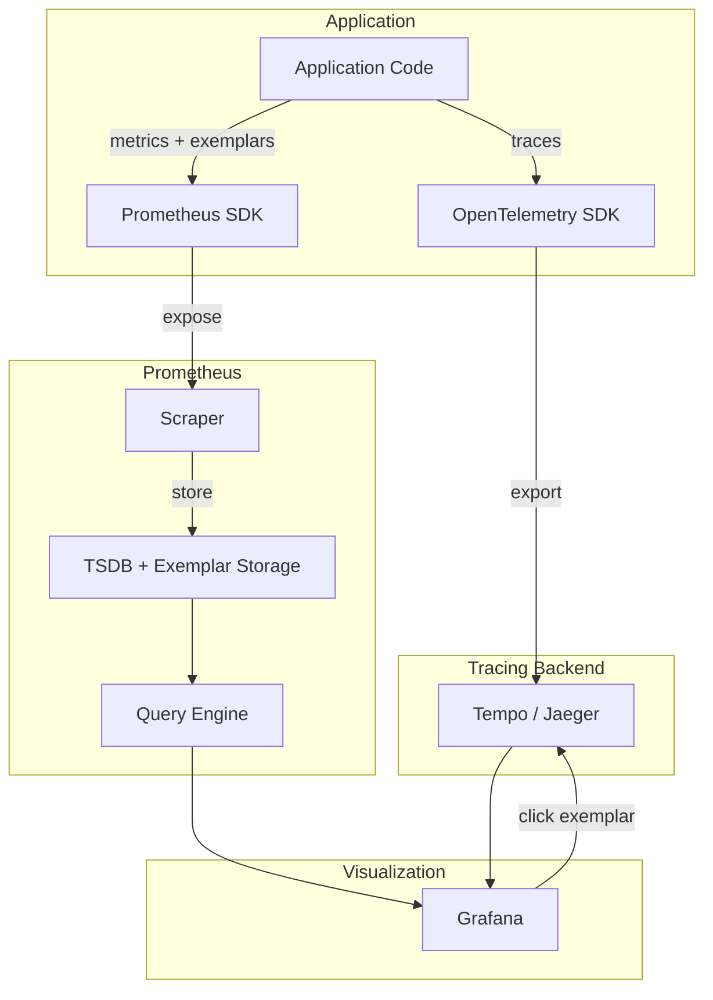

# How to Implement Exemplars in Prometheus

Author: [nawazdhandala](https://www.github.com/nawazdhandala)

Tags: Prometheus, Exemplars, Tracing, OpenTelemetry, Metrics, Observability, Grafana, Correlation

Description: Learn how to implement exemplars in Prometheus to connect metrics with traces. This guide covers enabling exemplars, instrumenting applications, and using Grafana to navigate from metrics to specific trace data.

---

## What Are Exemplars?

Exemplars are references to trace data attached to metric samples. They bridge the gap between metrics and traces, allowing you to click on a spike in a graph and jump directly to a representative trace showing what happened.

A typical workflow:
1. You see a latency spike on a dashboard
2. Click on the data point
3. Follow the exemplar link to a specific trace
4. Investigate the exact request that caused the spike

This connection between aggregated metrics and detailed traces significantly reduces mean time to resolution (MTTR) for performance issues.

## Prerequisites

Exemplars require:
- Prometheus 2.26+ with native histogram or classic histogram metrics
- Application instrumentation that attaches trace IDs to metrics
- A trace backend (Jaeger, Tempo, Zipkin) to view traces
- Grafana 7.4+ for visualization with exemplar support

## Enabling Exemplars in Prometheus

Enable exemplar storage in Prometheus:

```yaml
# prometheus.yml
global:
  scrape_interval: 15s
  evaluation_interval: 15s

# Enable exemplar storage
storage:
  exemplars:
    max_exemplars: 100000  # Maximum number of exemplars to store

scrape_configs:
  - job_name: 'app'
    static_configs:
      - targets: ['app:8080']
```

Or via command line:

```bash
prometheus \
  --config.file=/etc/prometheus/prometheus.yml \
  --storage.tsdb.path=/prometheus \
  --storage.exemplars.max-exemplars=100000 \
  --enable-feature=exemplar-storage
```

## Instrumenting Applications

### Python with OpenTelemetry

```python
# app.py - Flask application with exemplars
from flask import Flask, request
from prometheus_client import Histogram, Counter, generate_latest, CONTENT_TYPE_LATEST
from prometheus_client.openmetrics.exposition import generate_latest as generate_openmetrics
from opentelemetry import trace
from opentelemetry.sdk.trace import TracerProvider
from opentelemetry.sdk.trace.export import BatchSpanProcessor
from opentelemetry.exporter.otlp.proto.grpc.trace_exporter import OTLPSpanExporter
from opentelemetry.instrumentation.flask import FlaskInstrumentor
import time
import random

# Initialize OpenTelemetry tracing
trace.set_tracer_provider(TracerProvider())
otlp_exporter = OTLPSpanExporter(endpoint="tempo:4317", insecure=True)
trace.get_tracer_provider().add_span_processor(BatchSpanProcessor(otlp_exporter))
tracer = trace.get_tracer(__name__)

app = Flask(__name__)
FlaskInstrumentor().instrument_app(app)

# Define histogram with exemplar support
request_duration = Histogram(
    'http_request_duration_seconds',
    'Request duration in seconds',
    ['method', 'endpoint', 'status'],
    buckets=[0.01, 0.025, 0.05, 0.1, 0.25, 0.5, 1.0, 2.5, 5.0, 10.0]
)

request_count = Counter(
    'http_requests_total',
    'Total HTTP requests',
    ['method', 'endpoint', 'status']
)


def get_exemplar():
    """Get current trace context for exemplar."""
    span = trace.get_current_span()
    if span.is_recording():
        ctx = span.get_span_context()
        return {'trace_id': format(ctx.trace_id, '032x')}
    return {}


@app.route('/api/users')
def get_users():
    start_time = time.time()

    # Simulate variable latency
    latency = random.uniform(0.01, 0.5)
    if random.random() < 0.1:  # 10% chance of slow request
        latency += random.uniform(0.5, 2.0)

    time.sleep(latency)

    duration = time.time() - start_time

    # Record metric with exemplar
    exemplar = get_exemplar()
    request_duration.labels(
        method='GET',
        endpoint='/api/users',
        status='200'
    ).observe(duration, exemplar=exemplar)

    request_count.labels(
        method='GET',
        endpoint='/api/users',
        status='200'
    ).inc(exemplar=exemplar)

    return {'users': ['alice', 'bob']}


@app.route('/metrics')
def metrics():
    # Use OpenMetrics format for exemplar support
    return generate_openmetrics(REGISTRY), 200, {
        'Content-Type': 'application/openmetrics-text; version=1.0.0; charset=utf-8'
    }


if __name__ == '__main__':
    app.run(host='0.0.0.0', port=8080)
```

### Go with OpenTelemetry

```go
// main.go - Go application with exemplars
package main

import (
    "context"
    "fmt"
    "math/rand"
    "net/http"
    "time"

    "github.com/prometheus/client_golang/prometheus"
    "github.com/prometheus/client_golang/prometheus/promauto"
    "github.com/prometheus/client_golang/prometheus/promhttp"
    "go.opentelemetry.io/otel"
    "go.opentelemetry.io/otel/exporters/otlp/otlptrace/otlptracegrpc"
    "go.opentelemetry.io/otel/sdk/resource"
    sdktrace "go.opentelemetry.io/otel/sdk/trace"
    semconv "go.opentelemetry.io/otel/semconv/v1.17.0"
    "go.opentelemetry.io/otel/trace"
)

var (
    // Use prometheus.ExemplarObserver for histogram with exemplar support
    requestDuration = promauto.NewHistogramVec(
        prometheus.HistogramOpts{
            Name:    "http_request_duration_seconds",
            Help:    "Request duration in seconds",
            Buckets: []float64{0.01, 0.025, 0.05, 0.1, 0.25, 0.5, 1.0, 2.5, 5.0},
        },
        []string{"method", "endpoint", "status"},
    )

    tracer trace.Tracer
)

func initTracer() func() {
    ctx := context.Background()

    exporter, err := otlptracegrpc.New(ctx,
        otlptracegrpc.WithInsecure(),
        otlptracegrpc.WithEndpoint("tempo:4317"),
    )
    if err != nil {
        panic(err)
    }

    tp := sdktrace.NewTracerProvider(
        sdktrace.WithBatcher(exporter),
        sdktrace.WithResource(resource.NewWithAttributes(
            semconv.SchemaURL,
            semconv.ServiceName("my-service"),
        )),
    )

    otel.SetTracerProvider(tp)
    tracer = tp.Tracer("my-service")

    return func() { tp.Shutdown(ctx) }
}

func handleRequest(w http.ResponseWriter, r *http.Request) {
    ctx, span := tracer.Start(r.Context(), "handleRequest")
    defer span.End()

    start := time.Now()

    // Simulate work with variable latency
    latency := time.Duration(rand.Intn(500)) * time.Millisecond
    if rand.Float32() < 0.1 {
        latency += time.Duration(rand.Intn(2000)) * time.Millisecond
    }
    time.Sleep(latency)

    duration := time.Since(start).Seconds()

    // Get trace ID for exemplar
    spanCtx := trace.SpanContextFromContext(ctx)
    traceID := spanCtx.TraceID().String()

    // Observe with exemplar
    requestDuration.WithLabelValues("GET", "/api/users", "200").(prometheus.ExemplarObserver).ObserveWithExemplar(
        duration,
        prometheus.Labels{"trace_id": traceID},
    )

    w.Write([]byte(`{"users": ["alice", "bob"]}`))
}

func main() {
    cleanup := initTracer()
    defer cleanup()

    http.HandleFunc("/api/users", handleRequest)

    // Use OpenMetrics handler for exemplar support
    http.Handle("/metrics", promhttp.HandlerFor(
        prometheus.DefaultGatherer,
        promhttp.HandlerOpts{
            EnableOpenMetrics: true,
        },
    ))

    http.ListenAndServe(":8080", nil)
}
```

### Node.js with OpenTelemetry

```javascript
// app.js - Express with exemplars
const express = require('express');
const promClient = require('prom-client');
const opentelemetry = require('@opentelemetry/api');
const { NodeTracerProvider } = require('@opentelemetry/sdk-trace-node');
const { OTLPTraceExporter } = require('@opentelemetry/exporter-trace-otlp-grpc');
const { BatchSpanProcessor } = require('@opentelemetry/sdk-trace-base');
const { Resource } = require('@opentelemetry/resources');
const { SemanticResourceAttributes } = require('@opentelemetry/semantic-conventions');

// Initialize OpenTelemetry
const provider = new NodeTracerProvider({
  resource: new Resource({
    [SemanticResourceAttributes.SERVICE_NAME]: 'my-service',
  }),
});

const exporter = new OTLPTraceExporter({
  url: 'grpc://tempo:4317',
});

provider.addSpanProcessor(new BatchSpanProcessor(exporter));
provider.register();

const tracer = opentelemetry.trace.getTracer('my-service');

const app = express();

// Create registry with OpenMetrics content type
const register = new promClient.Registry();
register.setContentType(promClient.Registry.OPENMETRICS_CONTENT_TYPE);

// Histogram with exemplar support
const requestDuration = new promClient.Histogram({
  name: 'http_request_duration_seconds',
  help: 'Request duration in seconds',
  labelNames: ['method', 'endpoint', 'status'],
  buckets: [0.01, 0.025, 0.05, 0.1, 0.25, 0.5, 1.0, 2.5, 5.0],
  enableExemplars: true,
  registers: [register],
});

app.get('/api/users', async (req, res) => {
  const span = tracer.startSpan('handleRequest');

  const start = Date.now();

  // Simulate work
  const latency = Math.random() * 500;
  const extraLatency = Math.random() < 0.1 ? Math.random() * 2000 : 0;
  await new Promise((resolve) => setTimeout(resolve, latency + extraLatency));

  const duration = (Date.now() - start) / 1000;

  // Record with exemplar
  const spanContext = span.spanContext();
  requestDuration.observe(
    { method: 'GET', endpoint: '/api/users', status: '200' },
    duration,
    { trace_id: spanContext.traceId }
  );

  span.end();
  res.json({ users: ['alice', 'bob'] });
});

app.get('/metrics', async (req, res) => {
  res.set('Content-Type', register.contentType);
  res.end(await register.metrics());
});

app.listen(8080, () => console.log('Server running on port 8080'));
```

## Exemplar Flow Architecture



## Configuring Grafana for Exemplars

### Data Source Configuration

```yaml
# grafana-datasources.yml
apiVersion: 1
datasources:
  - name: Prometheus
    type: prometheus
    url: http://prometheus:9090
    access: proxy
    jsonData:
      httpMethod: POST
      exemplarTraceIdDestinations:
        - name: trace_id
          datasourceUid: tempo
          urlDisplayLabel: View Trace

  - name: Tempo
    uid: tempo
    type: tempo
    url: http://tempo:3200
    access: proxy
```

### Dashboard Panel with Exemplars

```json
{
  "panels": [
    {
      "title": "Request Duration",
      "type": "timeseries",
      "datasource": "Prometheus",
      "targets": [
        {
          "expr": "histogram_quantile(0.99, sum(rate(http_request_duration_seconds_bucket[5m])) by (le))",
          "legendFormat": "p99",
          "exemplar": true
        },
        {
          "expr": "histogram_quantile(0.95, sum(rate(http_request_duration_seconds_bucket[5m])) by (le))",
          "legendFormat": "p95",
          "exemplar": true
        }
      ],
      "options": {
        "tooltip": {
          "mode": "single"
        }
      }
    }
  ]
}
```

## Querying Exemplars

### PromQL with Exemplars

```promql
# Histogram quantile query - exemplars are attached automatically
histogram_quantile(0.99, sum(rate(http_request_duration_seconds_bucket[5m])) by (le))

# Query exemplars directly via API
# GET /api/v1/query_exemplars?query=http_request_duration_seconds_bucket&start=<start>&end=<end>
```

### Prometheus API for Exemplars

```bash
# Query exemplars via API
curl -G http://prometheus:9090/api/v1/query_exemplars \
  --data-urlencode 'query=http_request_duration_seconds_bucket' \
  --data-urlencode 'start=2026-01-25T00:00:00Z' \
  --data-urlencode 'end=2026-01-25T01:00:00Z' | jq

# Response includes exemplars with trace IDs
{
  "status": "success",
  "data": [
    {
      "seriesLabels": {
        "__name__": "http_request_duration_seconds_bucket",
        "endpoint": "/api/users",
        "le": "0.5",
        "method": "GET"
      },
      "exemplars": [
        {
          "labels": {
            "trace_id": "abc123def456..."
          },
          "value": "0.432",
          "timestamp": 1706140800.000
        }
      ]
    }
  ]
}
```

## Docker Compose Setup

Complete setup with Prometheus, Tempo, and Grafana:

```yaml
# docker-compose.yml
version: '3.8'

services:
  app:
    build: .
    ports:
      - "8080:8080"
    environment:
      - OTEL_EXPORTER_OTLP_ENDPOINT=http://tempo:4317

  prometheus:
    image: prom/prometheus:latest
    ports:
      - "9090:9090"
    command:
      - '--config.file=/etc/prometheus/prometheus.yml'
      - '--storage.tsdb.path=/prometheus'
      - '--enable-feature=exemplar-storage'
      - '--storage.exemplars.max-exemplars=100000'
    volumes:
      - ./prometheus.yml:/etc/prometheus/prometheus.yml

  tempo:
    image: grafana/tempo:latest
    ports:
      - "3200:3200"   # Tempo query
      - "4317:4317"   # OTLP gRPC
    command: ["-config.file=/etc/tempo.yaml"]
    volumes:
      - ./tempo.yaml:/etc/tempo.yaml

  grafana:
    image: grafana/grafana:latest
    ports:
      - "3000:3000"
    environment:
      - GF_AUTH_ANONYMOUS_ENABLED=true
      - GF_AUTH_ANONYMOUS_ORG_ROLE=Admin
    volumes:
      - ./grafana-datasources.yml:/etc/grafana/provisioning/datasources/datasources.yml
```

```yaml
# tempo.yaml
server:
  http_listen_port: 3200

distributor:
  receivers:
    otlp:
      protocols:
        grpc:

storage:
  trace:
    backend: local
    local:
      path: /tmp/tempo/blocks
```

## Best Practices

1. **Sample strategically**: Not every metric observation needs an exemplar; focus on histograms for latency
2. **Limit exemplar storage**: Set appropriate `max_exemplars` based on retention needs
3. **Use consistent trace ID format**: Ensure trace IDs match between metrics and trace backend
4. **Configure Grafana correctly**: Link Prometheus to Tempo with proper trace ID mapping
5. **Consider cardinality**: Exemplars add overhead; monitor Prometheus memory usage

## Troubleshooting

### Exemplars Not Showing

1. Verify OpenMetrics format is used (`Content-Type: application/openmetrics-text`)
2. Check that `enable-feature=exemplar-storage` is set
3. Confirm trace context is available when recording metrics
4. Ensure Grafana data source has exemplar destination configured

### Missing Trace Links

```promql
# Verify exemplars are being stored
prometheus_tsdb_exemplar_exemplars_in_storage

# Check exemplar append failures
prometheus_tsdb_exemplar_out_of_order_exemplars_total
```

## Conclusion

Exemplars bridge the gap between metrics and traces, enabling rapid root cause analysis. When you see a latency spike, you can immediately jump to a specific trace showing exactly what happened. Implementing exemplars requires coordination between your application, Prometheus, and Grafana, but the debugging efficiency gains make it worthwhile for any serious observability setup.
