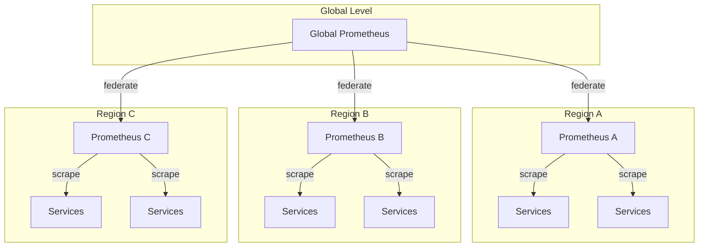

# How to Configure Prometheus Federation

Author: [nawazdhandala](https://www.github.com/nawazdhandala)

Tags: Prometheus, Federation, Monitoring, Scalability, Multi-cluster, Metrics, DevOps

Description: Learn how to set up Prometheus federation for hierarchical metric collection, enabling centralized monitoring across multiple clusters and teams while managing cardinality and performance.

---

As your infrastructure grows, a single Prometheus instance cannot handle all metrics. Federation allows you to aggregate metrics from multiple Prometheus servers into a global view. This guide covers federation architectures, configuration patterns, and performance considerations.

## What is Prometheus Federation?

Federation enables one Prometheus server to scrape selected metrics from another Prometheus server. This creates a hierarchy where local servers collect detailed metrics, and global servers aggregate summaries.



## Federation Use Cases

| Pattern | Description | When to Use |
|---------|-------------|-------------|
| Hierarchical | Global aggregates from regional instances | Multi-region deployments |
| Cross-service | Team A queries Team B metrics | Microservices observability |
| Data center | Central view of all DCs | Hybrid cloud environments |

## Basic Federation Configuration

### Federated Prometheus Setup

Configure the global Prometheus to scrape from downstream instances:

```yaml
# prometheus-global.yml
global:
  scrape_interval: 60s
  evaluation_interval: 60s

scrape_configs:
  # Federate from Prometheus instance in region-a
  - job_name: 'federate-region-a'
    honor_labels: true
    metrics_path: '/federate'
    params:
      'match[]':
        # Pull specific metrics that need global aggregation
        - '{job="api-server"}'
        - '{job="database"}'
        - 'up'
    static_configs:
      - targets:
          - 'prometheus-region-a.example.com:9090'
        labels:
          region: 'us-east-1'

  # Federate from Prometheus instance in region-b
  - job_name: 'federate-region-b'
    honor_labels: true
    metrics_path: '/federate'
    params:
      'match[]':
        - '{job="api-server"}'
        - '{job="database"}'
        - 'up'
    static_configs:
      - targets:
          - 'prometheus-region-b.example.com:9090'
        labels:
          region: 'eu-west-1'
```

### Understanding honor_labels

The `honor_labels: true` setting preserves labels from the source:

```yaml
# With honor_labels: true
# Source metric: http_requests_total{instance="app-1:8080", job="api"}
# Federated metric: http_requests_total{instance="app-1:8080", job="api", region="us-east-1"}

# With honor_labels: false (default)
# Source metric: http_requests_total{instance="app-1:8080", job="api"}
# Federated metric: http_requests_total{instance="prometheus-region-a:9090", job="federate-region-a"}
```

Always use `honor_labels: true` for federation to preserve original labels.

## Match Parameter Strategies

The `match[]` parameter controls which metrics are federated. Be selective to avoid pulling too much data:

```yaml
params:
  'match[]':
    # Match by job name
    - '{job="important-service"}'

    # Match by metric name
    - 'http_requests_total'
    - 'http_request_duration_seconds_bucket'

    # Match with regex
    - '{__name__=~"http_.*"}'

    # Match aggregated recording rules only
    - '{__name__=~"job:.*"}'

    # Match specific labels
    - '{env="production", severity="critical"}'
```

### Federating Recording Rules

Best practice: federate pre-aggregated recording rules instead of raw metrics:

```yaml
# Local Prometheus recording rules (prometheus-local.yml)
groups:
  - name: federation-aggregates
    rules:
      # Pre-aggregate for federation
      - record: job:http_requests_total:rate5m
        expr: sum by (job, status) (rate(http_requests_total[5m]))

      - record: job:http_request_duration_seconds:p95
        expr: histogram_quantile(0.95, sum by (job, le) (rate(http_request_duration_seconds_bucket[5m])))

      - record: job:up:count
        expr: count by (job) (up == 1)
```

Then federate only the recording rules:

```yaml
# Global Prometheus federation config
params:
  'match[]':
    # Only pull pre-aggregated metrics
    - '{__name__=~"job:.*"}'
```

This approach:
- Reduces data transfer between Prometheus instances
- Lowers cardinality at the global level
- Improves query performance

## Kubernetes Federation Setup

### Deploy Global Prometheus

```yaml
# global-prometheus-values.yaml
prometheus:
  prometheusSpec:
    # Longer scrape interval for federation
    scrapeInterval: 60s

    # Storage for aggregated metrics
    retention: 90d
    storageSpec:
      volumeClaimTemplate:
        spec:
          resources:
            requests:
              storage: 200Gi

    # Federation scrape configs
    additionalScrapeConfigs:
      - job_name: 'federate-cluster-a'
        honor_labels: true
        metrics_path: '/federate'
        params:
          'match[]':
            - '{__name__=~"cluster:.*"}'
            - '{__name__=~"namespace:.*"}'
            - 'up'
        static_configs:
          - targets:
              - 'prometheus.cluster-a.svc.cluster.local:9090'
            labels:
              cluster: 'cluster-a'

      - job_name: 'federate-cluster-b'
        honor_labels: true
        metrics_path: '/federate'
        params:
          'match[]':
            - '{__name__=~"cluster:.*"}'
            - '{__name__=~"namespace:.*"}'
            - 'up'
        static_configs:
          - targets:
              - 'prometheus.cluster-b.svc.cluster.local:9090'
            labels:
              cluster: 'cluster-b'
```

### Expose Prometheus for Federation

Create a service to expose the federation endpoint:

```yaml
# prometheus-federation-service.yaml
apiVersion: v1
kind: Service
metadata:
  name: prometheus-federation
  namespace: monitoring
spec:
  type: ClusterIP
  ports:
    - port: 9090
      targetPort: 9090
      name: web
  selector:
    app.kubernetes.io/name: prometheus
```

For cross-cluster federation, use external DNS or service mesh:

```yaml
# ExternalName service for remote cluster
apiVersion: v1
kind: Service
metadata:
  name: prometheus-cluster-b
  namespace: monitoring
spec:
  type: ExternalName
  externalName: prometheus.cluster-b.example.com
```

## Federation with Authentication

Secure federation endpoints with authentication:

```yaml
# Using basic auth
scrape_configs:
  - job_name: 'federate-secure'
    honor_labels: true
    metrics_path: '/federate'
    basic_auth:
      username: 'federation-user'
      password_file: '/etc/prometheus/federation-password'
    params:
      'match[]':
        - '{__name__=~"job:.*"}'
    static_configs:
      - targets:
          - 'prometheus-secure.example.com:9090'

# Using bearer token
  - job_name: 'federate-bearer'
    honor_labels: true
    metrics_path: '/federate'
    bearer_token_file: '/etc/prometheus/federation-token'
    params:
      'match[]':
        - '{__name__=~"job:.*"}'
    static_configs:
      - targets:
          - 'prometheus-k8s.example.com:9090'
```

### TLS Configuration

```yaml
scrape_configs:
  - job_name: 'federate-tls'
    honor_labels: true
    metrics_path: '/federate'
    scheme: https
    tls_config:
      ca_file: '/etc/prometheus/ca.crt'
      cert_file: '/etc/prometheus/client.crt'
      key_file: '/etc/prometheus/client.key'
      # Or skip verification (not recommended for production)
      # insecure_skip_verify: true
    params:
      'match[]':
        - '{__name__=~"job:.*"}'
    static_configs:
      - targets:
          - 'prometheus.example.com:9090'
```

## Handling Federation at Scale

### Performance Considerations

Monitor federation performance:

```promql
# Federation scrape duration
prometheus_target_interval_length_seconds{job=~"federate-.*"}

# Samples scraped per federation job
scrape_samples_scraped{job=~"federate-.*"}

# Federation scrape errors
up{job=~"federate-.*"} == 0
```

### Reducing Federation Load

1. **Use recording rules aggressively**

```yaml
# On source Prometheus
groups:
  - name: aggregations
    interval: 60s
    rules:
      - record: namespace:container_cpu_usage:sum
        expr: sum by (namespace) (rate(container_cpu_usage_seconds_total[5m]))
```

2. **Increase federation scrape interval**

```yaml
scrape_configs:
  - job_name: 'federate-region-a'
    scrape_interval: 120s  # Longer interval reduces load
    scrape_timeout: 60s
```

3. **Filter metrics carefully**

```yaml
# Bad: pulls all metrics (high cardinality)
params:
  'match[]':
    - '{job="api-server"}'

# Good: pulls specific metrics only
params:
  'match[]':
    - 'api_requests_total{job="api-server"}'
    - 'api_latency_seconds_bucket{job="api-server"}'
```

## Query Federation vs Metric Federation

Instead of federating metrics, you can query remote Prometheus instances directly:

```yaml
# Remote read configuration
remote_read:
  - url: 'http://prometheus-region-a:9090/api/v1/read'
    read_recent: true

  - url: 'http://prometheus-region-b:9090/api/v1/read'
    read_recent: true
```

| Approach | Pros | Cons |
|----------|------|------|
| Federation | Data is local, fast queries | Data duplication, storage cost |
| Remote Read | No duplication, always fresh | Network latency, query performance |

## Verifying Federation

Check that federation is working:

```bash
# Query the federation endpoint directly
curl -G 'http://prometheus-local:9090/federate' \
  --data-urlencode 'match[]={job="api-server"}'

# Check federated metrics in global Prometheus
curl 'http://prometheus-global:9090/api/v1/query?query=up{job="federate-region-a"}'
```

Query to verify data is flowing:

```promql
# Check federation target health
up{job=~"federate-.*"}

# Compare local vs federated metric counts
count({__name__=~"job:.*"})
```

## Best Practices

1. **Federate aggregates, not raw metrics** - Use recording rules to pre-aggregate
2. **Add identifying labels** - Include region, cluster, or environment labels
3. **Use honor_labels: true** - Preserve original labels from source
4. **Monitor federation lag** - Track scrape durations and failures
5. **Secure federation endpoints** - Use authentication and TLS
6. **Set appropriate intervals** - Longer intervals for higher-level aggregation

---

Federation scales Prometheus to large deployments by creating a hierarchy of metric collection. Focus on federating pre-aggregated recording rules rather than raw metrics to keep the global instance performant. For very large deployments, consider dedicated solutions like Thanos or Cortex that provide additional features like long-term storage and global querying.
