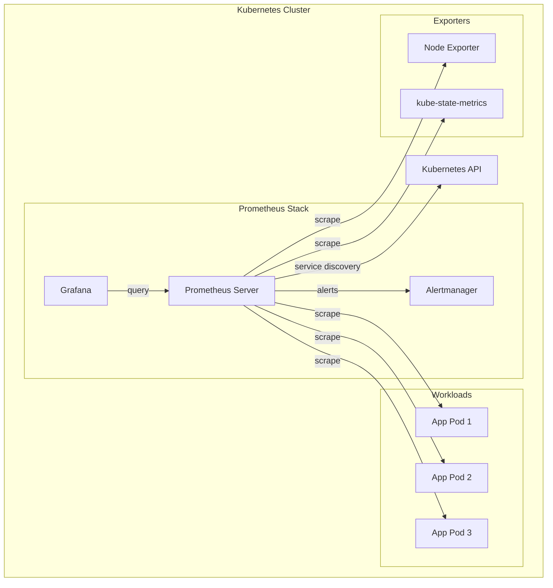

# How to Set Up Prometheus for Kubernetes Monitoring

Author: [nawazdhandala](https://www.github.com/nawazdhandala)

Tags: Prometheus, Kubernetes, Monitoring, Observability, Metrics, Helm, DevOps

Description: A step-by-step guide to deploying Prometheus on Kubernetes using Helm and the Prometheus Operator, with practical configurations for scraping pod metrics and setting up dashboards.

---

Prometheus has become the standard for monitoring Kubernetes clusters. Its pull-based model works well with dynamic container environments, and its tight integration with the Kubernetes API makes service discovery straightforward. This guide walks you through setting up a production-ready Prometheus installation.

## Architecture Overview

Before diving into setup, let's understand how Prometheus fits into Kubernetes:



## Prerequisites

You need a running Kubernetes cluster and Helm 3 installed:

```bash
# Verify kubectl is configured
kubectl cluster-info

# Verify Helm is installed
helm version

# Add the Prometheus community Helm repository
helm repo add prometheus-community https://prometheus-community.github.io/helm-charts
helm repo update
```

## Installing Prometheus with Helm

The kube-prometheus-stack chart installs Prometheus, Alertmanager, Grafana, and node exporters in one command:

```bash
# Create a namespace for monitoring
kubectl create namespace monitoring

# Install the kube-prometheus-stack
helm install prometheus prometheus-community/kube-prometheus-stack \
  --namespace monitoring \
  --set prometheus.prometheusSpec.retention=15d \
  --set prometheus.prometheusSpec.storageSpec.volumeClaimTemplate.spec.resources.requests.storage=50Gi
```

Verify the installation:

```bash
# Check all pods are running
kubectl get pods -n monitoring

# Expected output shows Prometheus, Alertmanager, Grafana, and exporters
# NAME                                                     READY   STATUS
# alertmanager-prometheus-kube-prometheus-alertmanager-0   2/2     Running
# prometheus-grafana-5f7d8c9b8f-xxxxx                      3/3     Running
# prometheus-kube-prometheus-operator-7d8b9c8f9f-xxxxx     1/1     Running
# prometheus-prometheus-kube-prometheus-prometheus-0       2/2     Running
# prometheus-kube-state-metrics-7c8b9d8f8f-xxxxx          1/1     Running
# prometheus-prometheus-node-exporter-xxxxx               1/1     Running
```

## Custom Values Configuration

For production deployments, create a custom values file:

```yaml
# prometheus-values.yaml
prometheus:
  prometheusSpec:
    # Retention period for metrics
    retention: 30d

    # Resource requests and limits
    resources:
      requests:
        memory: 2Gi
        cpu: 500m
      limits:
        memory: 4Gi
        cpu: 1000m

    # Persistent storage configuration
    storageSpec:
      volumeClaimTemplate:
        spec:
          storageClassName: standard
          accessModes: ["ReadWriteOnce"]
          resources:
            requests:
              storage: 100Gi

    # Scrape interval (how often to collect metrics)
    scrapeInterval: 30s

    # Evaluation interval (how often to evaluate rules)
    evaluationInterval: 30s

    # Additional scrape configs for custom targets
    additionalScrapeConfigs:
      - job_name: 'custom-app'
        kubernetes_sd_configs:
          - role: pod
        relabel_configs:
          - source_labels: [__meta_kubernetes_pod_annotation_prometheus_io_scrape]
            action: keep
            regex: true
          - source_labels: [__meta_kubernetes_pod_annotation_prometheus_io_path]
            action: replace
            target_label: __metrics_path__
            regex: (.+)
          - source_labels: [__address__, __meta_kubernetes_pod_annotation_prometheus_io_port]
            action: replace
            regex: ([^:]+)(?::\d+)?;(\d+)
            replacement: $1:$2
            target_label: __address__

alertmanager:
  alertmanagerSpec:
    storage:
      volumeClaimTemplate:
        spec:
          storageClassName: standard
          accessModes: ["ReadWriteOnce"]
          resources:
            requests:
              storage: 10Gi

grafana:
  persistence:
    enabled: true
    size: 10Gi

  # Admin credentials (change in production)
  adminPassword: your-secure-password
```

Apply the custom configuration:

```bash
helm upgrade --install prometheus prometheus-community/kube-prometheus-stack \
  --namespace monitoring \
  -f prometheus-values.yaml
```

## Configuring Applications for Scraping

Prometheus discovers targets through Kubernetes service discovery. Add annotations to your pods to enable scraping:

```yaml
# deployment.yaml
apiVersion: apps/v1
kind: Deployment
metadata:
  name: my-application
spec:
  replicas: 3
  selector:
    matchLabels:
      app: my-application
  template:
    metadata:
      labels:
        app: my-application
      annotations:
        # Enable Prometheus scraping
        prometheus.io/scrape: "true"
        # Metrics endpoint path
        prometheus.io/path: "/metrics"
        # Port where metrics are exposed
        prometheus.io/port: "8080"
    spec:
      containers:
        - name: app
          image: my-app:latest
          ports:
            - containerPort: 8080
              name: http
```

## Using ServiceMonitors

The Prometheus Operator introduces Custom Resource Definitions for managing scrape configurations. ServiceMonitors provide a more Kubernetes-native approach:

```yaml
# servicemonitor.yaml
apiVersion: monitoring.coreos.com/v1
kind: ServiceMonitor
metadata:
  name: my-application
  namespace: monitoring
  labels:
    # This label must match the Prometheus serviceMonitorSelector
    release: prometheus
spec:
  # Select services with these labels
  selector:
    matchLabels:
      app: my-application

  # Namespace where the service lives
  namespaceSelector:
    matchNames:
      - default
      - production

  # Endpoints to scrape
  endpoints:
    - port: http
      path: /metrics
      interval: 30s
      scrapeTimeout: 10s
```

Create a corresponding Service:

```yaml
# service.yaml
apiVersion: v1
kind: Service
metadata:
  name: my-application
  labels:
    app: my-application
spec:
  selector:
    app: my-application
  ports:
    - name: http
      port: 8080
      targetPort: 8080
```

## Verifying Prometheus Targets

Access the Prometheus UI to verify targets are being scraped:

```bash
# Port forward to Prometheus
kubectl port-forward -n monitoring svc/prometheus-kube-prometheus-prometheus 9090:9090

# Open http://localhost:9090/targets in your browser
```

You can also check targets using the API:

```bash
# List all active targets
curl -s http://localhost:9090/api/v1/targets | jq '.data.activeTargets[] | {job: .labels.job, instance: .labels.instance, health: .health}'
```

## Querying Metrics

Test that metrics are being collected:

```promql
# Total number of running pods per namespace
sum by (namespace) (kube_pod_status_phase{phase="Running"})

# CPU usage by pod
sum by (pod) (rate(container_cpu_usage_seconds_total{container!=""}[5m]))

# Memory usage by pod
sum by (pod) (container_memory_usage_bytes{container!=""})

# HTTP request rate by service
sum by (service) (rate(http_requests_total[5m]))
```

## Accessing Grafana

Grafana comes pre-installed with useful dashboards:

```bash
# Port forward to Grafana
kubectl port-forward -n monitoring svc/prometheus-grafana 3000:80

# Default credentials (unless changed in values)
# Username: admin
# Password: prom-operator (or your custom password)
```

The kube-prometheus-stack includes dashboards for:
- Kubernetes cluster overview
- Node metrics
- Pod metrics
- Namespace metrics
- Workload metrics

## Troubleshooting Common Issues

### Prometheus Pod Pending

Check if PersistentVolumeClaims are bound:

```bash
kubectl get pvc -n monitoring

# If PVCs are pending, check storage class
kubectl get storageclass
```

### Targets Not Discovered

Verify ServiceMonitor labels match Prometheus configuration:

```bash
# Check Prometheus serviceMonitorSelector
kubectl get prometheus -n monitoring -o yaml | grep -A5 serviceMonitorSelector

# Verify ServiceMonitor has matching labels
kubectl get servicemonitor -n monitoring --show-labels
```

### High Memory Usage

If Prometheus uses too much memory, reduce cardinality:

```yaml
# Add metric relabeling to drop high-cardinality labels
prometheus:
  prometheusSpec:
    additionalScrapeConfigs:
      - job_name: 'kubernetes-pods'
        metric_relabel_configs:
          # Drop metrics with high cardinality
          - source_labels: [__name__]
            regex: '(go_gc_duration_seconds|go_goroutines)'
            action: drop
```

## Best Practices

1. **Set appropriate retention** - Balance storage costs with data needs
2. **Use recording rules** - Pre-compute expensive queries
3. **Configure resource limits** - Prevent Prometheus from consuming all cluster resources
4. **Use ServiceMonitors** - They provide better manageability than scrape annotations
5. **Enable persistent storage** - Prevent data loss during pod restarts
6. **Monitor Prometheus itself** - Track scrape duration and sample counts

## Next Steps

With Prometheus running, you can:
- Set up alerting rules for critical conditions
- Create custom dashboards in Grafana
- Configure remote write for long-term storage
- Add recording rules for performance optimization

---

Prometheus on Kubernetes provides a solid foundation for cluster observability. The Prometheus Operator and Helm charts simplify deployment, while ServiceMonitors offer a declarative way to manage scrape configurations. Start with the defaults, then tune retention, storage, and scrape intervals based on your monitoring requirements.
