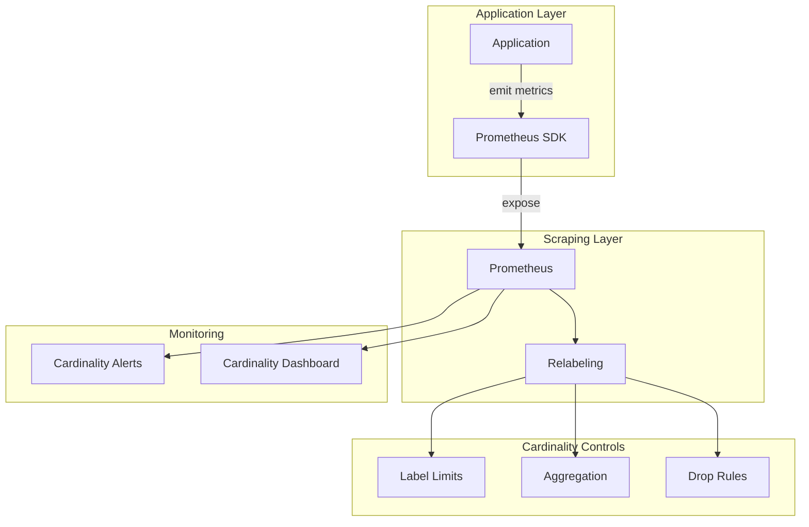

# How to Manage Metric Cardinality in Prometheus

Author: [nawazdhandala](https://www.github.com/nawazdhandala)

Tags: Prometheus, Cardinality, Metrics, Performance, Optimization, Labels, Memory, Observability

Description: Learn how to identify and control metric cardinality in Prometheus. This guide covers cardinality analysis, label management strategies, relabeling techniques, and practical approaches to prevent cardinality explosions.

---

## What Is Metric Cardinality?

Cardinality refers to the number of unique time series in your Prometheus database. Each unique combination of metric name and label values creates a separate time series.

For example, a metric with 3 labels:
- `method` (5 values: GET, POST, PUT, DELETE, PATCH)
- `status` (10 values: 200, 201, 204, 400, 401, 403, 404, 500, 502, 503)
- `endpoint` (50 values)

Creates up to 5 x 10 x 50 = 2,500 time series for just one metric.

High cardinality impacts:
- **Memory usage**: Each series consumes memory for indexing and caching
- **Query performance**: More series means slower queries
- **Storage costs**: More data to store and backup
- **Scrape time**: More data to transfer and process

## Analyzing Current Cardinality

### Check Total Time Series

```promql
# Total number of active time series
prometheus_tsdb_head_series

# Time series created per second
rate(prometheus_tsdb_head_series_created_total[5m])

# Time series removed per second
rate(prometheus_tsdb_head_series_removed_total[5m])
```

### Find High-Cardinality Metrics

```promql
# Top 10 metrics by cardinality
topk(10, count by (__name__) ({__name__=~".+"}))

# Cardinality per job
count by (job) ({__name__=~".+"})

# Specific metric cardinality
count(http_requests_total)

# Cardinality by label
count by (endpoint) (http_requests_total)
```

### Using TSDB Status API

```bash
# Get cardinality statistics
curl -s http://prometheus:9090/api/v1/status/tsdb | jq '.data'

# Output includes:
# - seriesCountByMetricName: Top metrics by series count
# - labelValueCountByLabelName: Labels with most unique values
# - memoryInBytesByLabelName: Memory usage by label
```

## Common Cardinality Problems

### Problem 1: Unbounded Label Values

```yaml
# Bad: User IDs create millions of series
http_requests_total{user_id="user123", method="GET"}
http_requests_total{user_id="user456", method="GET"}
# ... millions more

# Good: Aggregate or remove high-cardinality labels
http_requests_total{method="GET", user_type="premium"}
```

### Problem 2: Timestamp or UUID Labels

```yaml
# Bad: Every request creates a new series
request_duration_seconds{request_id="550e8400-e29b-41d4-a716-446655440000"}

# Good: Use histograms without unique identifiers
request_duration_seconds_bucket{method="GET", le="0.5"}
```

### Problem 3: Path Parameters in Labels

```yaml
# Bad: Each unique URL creates a series
http_requests_total{path="/users/123/orders/456"}
http_requests_total{path="/users/789/orders/012"}

# Good: Use route patterns
http_requests_total{route="/users/{id}/orders/{orderId}"}
```

### Problem 4: Exploding Label Combinations

```yaml
# Bad: Too many label dimensions
http_requests_total{
  method, status, path, instance, pod, node,
  datacenter, region, az, version, build
}

# Good: Keep only actionable dimensions
http_requests_total{method, status, route, service}
```

## Cardinality Monitoring Architecture



## Controlling Cardinality at the Source

### Application-Level Controls

```python
# Python example: Normalize paths before using as labels
import re
from prometheus_client import Counter

http_requests = Counter(
    'http_requests_total',
    'Total HTTP requests',
    ['method', 'route', 'status']
)

def normalize_path(path: str) -> str:
    """Convert dynamic path segments to placeholders."""
    # Replace numeric IDs
    path = re.sub(r'/\d+', '/{id}', path)
    # Replace UUIDs
    path = re.sub(
        r'/[0-9a-f]{8}-[0-9a-f]{4}-[0-9a-f]{4}-[0-9a-f]{4}-[0-9a-f]{12}',
        '/{uuid}',
        path,
        flags=re.IGNORECASE
    )
    return path

def record_request(method: str, path: str, status: int):
    """Record a request with normalized path."""
    route = normalize_path(path)
    http_requests.labels(
        method=method,
        route=route,
        status=str(status)
    ).inc()
```

```go
// Go example: Limit label values
package main

import (
    "regexp"
    "github.com/prometheus/client_golang/prometheus"
)

var (
    idPattern   = regexp.MustCompile(`/\d+`)
    uuidPattern = regexp.MustCompile(
        `/[0-9a-f]{8}-[0-9a-f]{4}-[0-9a-f]{4}-[0-9a-f]{4}-[0-9a-f]{12}`,
    )

    httpRequests = prometheus.NewCounterVec(
        prometheus.CounterOpts{
            Name: "http_requests_total",
            Help: "Total HTTP requests",
        },
        []string{"method", "route", "status"},
    )
)

func normalizePath(path string) string {
    path = idPattern.ReplaceAllString(path, "/{id}")
    path = uuidPattern.ReplaceAllString(path, "/{uuid}")
    return path
}

func recordRequest(method, path string, status int) {
    route := normalizePath(path)
    httpRequests.WithLabelValues(method, route, string(status)).Inc()
}
```

## Relabeling Strategies

### Drop High-Cardinality Labels

```yaml
# prometheus.yml - Drop labels during scraping
scrape_configs:
  - job_name: 'app'
    static_configs:
      - targets: ['app:9090']
    metric_relabel_configs:
      # Drop specific high-cardinality labels
      - regex: '(request_id|trace_id|span_id|user_id)'
        action: labeldrop

      # Drop labels matching a pattern
      - source_labels: [__name__]
        regex: 'http_.*'
        action: keep
      - regex: 'session_id'
        action: labeldrop
```

### Replace Dynamic Values

```yaml
# prometheus.yml - Normalize label values
metric_relabel_configs:
  # Replace numeric IDs in path label
  - source_labels: [path]
    regex: '(.*/)\d+(.*)'
    replacement: '${1}{id}${2}'
    target_label: path

  # Bucket status codes
  - source_labels: [status_code]
    regex: '2..'
    replacement: '2xx'
    target_label: status_class
  - source_labels: [status_code]
    regex: '4..'
    replacement: '4xx'
    target_label: status_class
  - source_labels: [status_code]
    regex: '5..'
    replacement: '5xx'
    target_label: status_class
```

### Drop Entire Metrics

```yaml
# prometheus.yml - Drop metrics with too many series
metric_relabel_configs:
  # Drop specific metrics
  - source_labels: [__name__]
    regex: 'high_cardinality_metric_.*'
    action: drop

  # Drop metrics with specific label values
  - source_labels: [__name__, environment]
    regex: 'debug_.*;development'
    action: drop
```

### Aggregate Before Storage

```yaml
# recording_rules.yml - Aggregate high-cardinality metrics
groups:
  - name: cardinality_reduction
    interval: 1m
    rules:
      # Aggregate per-instance metrics to per-service
      - record: service:http_requests:rate5m
        expr: |
          sum by (service, method, status) (
            rate(http_requests_total[5m])
          )

      # Drop instance-level after aggregation
      # Then drop the original in scrape config
```

## Setting Cardinality Limits

### Prometheus Configuration Limits

```yaml
# prometheus.yml - Global limits
global:
  scrape_interval: 15s
  # Limit samples per scrape
  sample_limit: 10000
  # Limit labels per sample
  label_limit: 30
  # Limit label name length
  label_name_length_limit: 128
  # Limit label value length
  label_value_length_limit: 512

scrape_configs:
  - job_name: 'high-cardinality-app'
    # Per-job sample limit (overrides global)
    sample_limit: 5000
    static_configs:
      - targets: ['app:9090']
```

### Application-Level Limits

```python
# Python: Limit total label combinations
from prometheus_client import Counter
from collections import OrderedDict

class LimitedCounter:
    """Counter with cardinality limit."""

    def __init__(self, name, description, labels, max_series=1000):
        self.counter = Counter(name, description, labels)
        self.seen_combinations = OrderedDict()
        self.max_series = max_series

    def labels(self, **kwargs):
        key = tuple(sorted(kwargs.items()))

        if key not in self.seen_combinations:
            if len(self.seen_combinations) >= self.max_series:
                # Drop oldest or use "other" bucket
                kwargs = {k: 'other' for k in kwargs}
            else:
                self.seen_combinations[key] = True

        return self.counter.labels(**kwargs)

# Usage
requests = LimitedCounter(
    'http_requests_total',
    'Total requests',
    ['method', 'endpoint'],
    max_series=500
)
```

## Cardinality Alerting

```yaml
# cardinality_alerts.yml
groups:
  - name: cardinality_alerts
    rules:
      # Alert on total cardinality growth
      - alert: HighTotalCardinality
        expr: prometheus_tsdb_head_series > 1000000
        for: 15m
        labels:
          severity: warning
        annotations:
          summary: "Total time series exceeds 1 million"
          description: |
            Current series count: {{ $value | humanize }}
            This may impact Prometheus performance.

      # Alert on rapid cardinality growth
      - alert: RapidCardinalityGrowth
        expr: |
          rate(prometheus_tsdb_head_series_created_total[1h]) > 1000
        for: 30m
        labels:
          severity: warning
        annotations:
          summary: "Rapid time series creation detected"
          description: |
            Creating {{ $value | humanize }} series per second.

      # Alert on specific metric cardinality
      - alert: MetricCardinalityTooHigh
        expr: |
          count by (__name__) ({__name__=~".+"}) > 10000
        for: 15m
        labels:
          severity: warning
        annotations:
          summary: "Metric {{ $labels.__name__ }} has high cardinality"
          description: |
            {{ $labels.__name__ }} has {{ $value }} series.

      # Alert on scrape sample limit hits
      - alert: ScrapeSampleLimitReached
        expr: |
          increase(prometheus_target_scrapes_exceeded_sample_limit_total[1h]) > 0
        labels:
          severity: warning
        annotations:
          summary: "Scrape sample limit exceeded"
          description: |
            Target {{ $labels.job }} is hitting sample limits.
```

## Cardinality Dashboard Queries

Create a Grafana dashboard to monitor cardinality:

```promql
# Panel 1: Total Time Series
prometheus_tsdb_head_series

# Panel 2: Series by Job
count by (job) ({__name__=~".+"})

# Panel 3: Top 10 High-Cardinality Metrics
topk(10, count by (__name__) ({__name__=~".+"}))

# Panel 4: Series Creation Rate
rate(prometheus_tsdb_head_series_created_total[5m])

# Panel 5: Memory Usage by Label
# Use TSDB status API for this data

# Panel 6: Scrape Samples
scrape_samples_scraped

# Panel 7: Sample Limit Exceeded Events
increase(prometheus_target_scrapes_exceeded_sample_limit_total[1h])
```

## Best Practices Summary

1. **Design labels carefully**: Only include labels you will filter or aggregate by
2. **Normalize dynamic values**: Replace IDs, UUIDs, and timestamps with placeholders
3. **Set limits early**: Configure sample_limit before cardinality explodes
4. **Monitor continuously**: Alert on cardinality growth
5. **Use recording rules**: Aggregate high-cardinality data for dashboards
6. **Review regularly**: Audit label usage and drop unused dimensions
7. **Document conventions**: Create guidelines for instrumentation teams

## Cardinality Reduction Checklist

```markdown
## Pre-Deployment Checklist

- [ ] All dynamic values (IDs, timestamps) are normalized or excluded
- [ ] Label cardinality is estimated and within limits
- [ ] Sample limits are configured
- [ ] Recording rules aggregate high-cardinality sources
- [ ] Relabeling drops unnecessary dimensions
- [ ] Cardinality alerts are configured
- [ ] Dashboard monitors cardinality trends

## Periodic Review

- [ ] Identify top 10 high-cardinality metrics
- [ ] Review label usage in dashboards and alerts
- [ ] Drop unused labels via relabeling
- [ ] Update application instrumentation as needed
```

## Conclusion

Metric cardinality is the silent killer of Prometheus performance. Proactive management through careful label design, relabeling rules, and continuous monitoring prevents cardinality explosions before they impact your monitoring infrastructure. Start with application-level controls, add relabeling as a safety net, and monitor cardinality trends to catch problems early.
