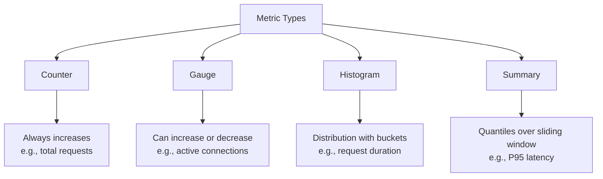

# How to Create Prometheus Metrics in .NET

Author: [nawazdhandala](https://www.github.com/nawazdhandala)

Tags: .NET, C#, Prometheus, Metrics, Monitoring, Observability, Grafana, Kubernetes

Description: Learn how to instrument .NET applications with Prometheus metrics. This guide covers counters, gauges, histograms, and summaries with practical examples for ASP.NET Core applications.

---

Prometheus has become the standard for metrics collection in cloud-native applications. When combined with Grafana for visualization, it provides powerful insights into application performance and behavior. This guide shows how to instrument your .NET applications with Prometheus metrics using the prometheus-net library.

## Setting Up Prometheus Metrics

Install the required packages:

```bash
dotnet add package prometheus-net.AspNetCore
```

Add the metrics endpoint to your application:

```csharp
// Program.cs
using Prometheus;

var builder = WebApplication.CreateBuilder(args);

builder.Services.AddControllers();

var app = builder.Build();

// Expose metrics at /metrics endpoint
app.UseMetricServer();

// Collect HTTP request metrics automatically
app.UseHttpMetrics(options =>
{
    // Include path labels (be careful with high cardinality)
    options.AddCustomLabel("service", context => "my-api");
});

app.MapControllers();
app.Run();
```

The `/metrics` endpoint now exposes Prometheus-formatted metrics:

```
# HELP http_requests_received_total Total number of HTTP requests received
# TYPE http_requests_received_total counter
http_requests_received_total{code="200",method="GET",controller="Products",action="GetAll"} 42
```

## Understanding Metric Types

Prometheus supports four metric types, each suited for different use cases:



## Counters

Counters track values that only increase, like total requests or errors:

```csharp
public class OrderMetrics
{
    // Define counter with labels
    private static readonly Counter OrdersCreated = Metrics.CreateCounter(
        "orders_created_total",
        "Total number of orders created",
        new CounterConfiguration
        {
            LabelNames = new[] { "status", "payment_method" }
        });

    private static readonly Counter OrderErrors = Metrics.CreateCounter(
        "order_errors_total",
        "Total number of order processing errors",
        new CounterConfiguration
        {
            LabelNames = new[] { "error_type" }
        });

    public void RecordOrderCreated(string status, string paymentMethod)
    {
        OrdersCreated.WithLabels(status, paymentMethod).Inc();
    }

    public void RecordOrderError(string errorType)
    {
        OrderErrors.WithLabels(errorType).Inc();
    }
}
```

Use counters in your services:

```csharp
[ApiController]
[Route("api/[controller]")]
public class OrdersController : ControllerBase
{
    private readonly IOrderService _orderService;
    private readonly OrderMetrics _metrics;

    public OrdersController(IOrderService orderService, OrderMetrics metrics)
    {
        _orderService = orderService;
        _metrics = metrics;
    }

    [HttpPost]
    public async Task<ActionResult<Order>> CreateOrder(OrderDto dto)
    {
        try
        {
            var order = await _orderService.CreateAsync(dto);

            // Record successful order
            _metrics.RecordOrderCreated("success", dto.PaymentMethod);

            return CreatedAtAction(nameof(GetOrder), new { id = order.Id }, order);
        }
        catch (PaymentFailedException ex)
        {
            _metrics.RecordOrderCreated("payment_failed", dto.PaymentMethod);
            _metrics.RecordOrderError("payment_failure");
            return BadRequest(new { error = ex.Message });
        }
        catch (Exception ex)
        {
            _metrics.RecordOrderError("internal_error");
            throw;
        }
    }
}
```

## Gauges

Gauges represent values that can go up or down, like current connections or queue length:

```csharp
public class SystemMetrics
{
    private static readonly Gauge ActiveConnections = Metrics.CreateGauge(
        "active_connections",
        "Number of active connections",
        new GaugeConfiguration
        {
            LabelNames = new[] { "connection_type" }
        });

    private static readonly Gauge QueueLength = Metrics.CreateGauge(
        "job_queue_length",
        "Number of jobs waiting in queue",
        new GaugeConfiguration
        {
            LabelNames = new[] { "queue_name" }
        });

    private static readonly Gauge CacheSize = Metrics.CreateGauge(
        "cache_size_bytes",
        "Current size of cache in bytes");

    public void SetActiveConnections(string type, int count)
    {
        ActiveConnections.WithLabels(type).Set(count);
    }

    public void IncrementConnections(string type)
    {
        ActiveConnections.WithLabels(type).Inc();
    }

    public void DecrementConnections(string type)
    {
        ActiveConnections.WithLabels(type).Dec();
    }

    public void SetQueueLength(string queueName, int length)
    {
        QueueLength.WithLabels(queueName).Set(length);
    }

    public void SetCacheSize(long bytes)
    {
        CacheSize.Set(bytes);
    }
}
```

Track active connections with middleware:

```csharp
public class ConnectionTrackingMiddleware
{
    private readonly RequestDelegate _next;
    private readonly SystemMetrics _metrics;

    public ConnectionTrackingMiddleware(RequestDelegate next, SystemMetrics metrics)
    {
        _next = next;
        _metrics = metrics;
    }

    public async Task InvokeAsync(HttpContext context)
    {
        _metrics.IncrementConnections("http");

        try
        {
            await _next(context);
        }
        finally
        {
            _metrics.DecrementConnections("http");
        }
    }
}
```

## Histograms

Histograms track the distribution of values, perfect for measuring request durations:

```csharp
public class RequestMetrics
{
    // Define buckets for request duration (in seconds)
    private static readonly double[] DurationBuckets = new[]
    {
        0.001, 0.005, 0.01, 0.025, 0.05, 0.075, 0.1, 0.25, 0.5, 0.75, 1.0, 2.5, 5.0, 10.0
    };

    private static readonly Histogram RequestDuration = Metrics.CreateHistogram(
        "http_request_duration_seconds",
        "Duration of HTTP requests in seconds",
        new HistogramConfiguration
        {
            LabelNames = new[] { "method", "endpoint", "status_code" },
            Buckets = DurationBuckets
        });

    private static readonly Histogram DatabaseQueryDuration = Metrics.CreateHistogram(
        "database_query_duration_seconds",
        "Duration of database queries in seconds",
        new HistogramConfiguration
        {
            LabelNames = new[] { "operation", "table" },
            Buckets = new[] { 0.001, 0.005, 0.01, 0.05, 0.1, 0.5, 1.0, 5.0 }
        });

    public IDisposable MeasureRequestDuration(string method, string endpoint, string statusCode)
    {
        return RequestDuration.WithLabels(method, endpoint, statusCode).NewTimer();
    }

    public void RecordRequestDuration(string method, string endpoint, string statusCode, double seconds)
    {
        RequestDuration.WithLabels(method, endpoint, statusCode).Observe(seconds);
    }

    public void RecordQueryDuration(string operation, string table, double seconds)
    {
        DatabaseQueryDuration.WithLabels(operation, table).Observe(seconds);
    }
}
```

Middleware to measure request duration:

```csharp
public class RequestDurationMiddleware
{
    private readonly RequestDelegate _next;
    private static readonly Histogram RequestDuration = Metrics.CreateHistogram(
        "http_server_request_duration_seconds",
        "Duration of HTTP server requests",
        new HistogramConfiguration
        {
            LabelNames = new[] { "method", "route", "status_code" },
            Buckets = Histogram.ExponentialBuckets(0.001, 2, 15)
        });

    public RequestDurationMiddleware(RequestDelegate next)
    {
        _next = next;
    }

    public async Task InvokeAsync(HttpContext context)
    {
        var stopwatch = Stopwatch.StartNew();

        try
        {
            await _next(context);
        }
        finally
        {
            stopwatch.Stop();

            var route = context.GetEndpoint()?.DisplayName ?? context.Request.Path.Value ?? "unknown";
            var statusCode = context.Response.StatusCode.ToString();

            RequestDuration
                .WithLabels(context.Request.Method, route, statusCode)
                .Observe(stopwatch.Elapsed.TotalSeconds);
        }
    }
}
```

## Summaries

Summaries calculate quantiles over a sliding time window:

```csharp
public class LatencyMetrics
{
    // Configure quantiles: P50, P90, P95, P99
    private static readonly Summary ResponseLatency = Metrics.CreateSummary(
        "http_response_latency_seconds",
        "Response latency in seconds",
        new SummaryConfiguration
        {
            LabelNames = new[] { "endpoint" },
            Objectives = new[]
            {
                new QuantileEpsilonPair(0.5, 0.05),   // P50 with 5% error
                new QuantileEpsilonPair(0.9, 0.01),   // P90 with 1% error
                new QuantileEpsilonPair(0.95, 0.005), // P95 with 0.5% error
                new QuantileEpsilonPair(0.99, 0.001)  // P99 with 0.1% error
            },
            MaxAge = TimeSpan.FromMinutes(5)
        });

    public void RecordLatency(string endpoint, double seconds)
    {
        ResponseLatency.WithLabels(endpoint).Observe(seconds);
    }
}
```

## Custom Business Metrics

Create metrics for business-specific measurements:

```csharp
public class BusinessMetrics
{
    // Revenue tracking
    private static readonly Counter Revenue = Metrics.CreateCounter(
        "revenue_total_dollars",
        "Total revenue in dollars",
        new CounterConfiguration
        {
            LabelNames = new[] { "product_category", "region" }
        });

    // User activity
    private static readonly Gauge ActiveUsers = Metrics.CreateGauge(
        "active_users_count",
        "Number of active users",
        new GaugeConfiguration
        {
            LabelNames = new[] { "plan_type" }
        });

    // Cart metrics
    private static readonly Histogram CartValue = Metrics.CreateHistogram(
        "cart_value_dollars",
        "Shopping cart value distribution",
        new HistogramConfiguration
        {
            Buckets = new[] { 10.0, 25.0, 50.0, 100.0, 250.0, 500.0, 1000.0 }
        });

    // Feature usage
    private static readonly Counter FeatureUsage = Metrics.CreateCounter(
        "feature_usage_total",
        "Feature usage counter",
        new CounterConfiguration
        {
            LabelNames = new[] { "feature_name", "user_tier" }
        });

    public void RecordRevenue(string category, string region, double amount)
    {
        Revenue.WithLabels(category, region).Inc(amount);
    }

    public void SetActiveUsers(string planType, int count)
    {
        ActiveUsers.WithLabels(planType).Set(count);
    }

    public void RecordCartValue(double value)
    {
        CartValue.Observe(value);
    }

    public void RecordFeatureUsage(string feature, string userTier)
    {
        FeatureUsage.WithLabels(feature, userTier).Inc();
    }
}
```

## Metrics Service with Dependency Injection

Organize metrics into a service for cleaner code:

```csharp
public interface IMetricsService
{
    void RecordHttpRequest(string method, string path, int statusCode, double duration);
    void RecordDatabaseQuery(string operation, double duration);
    void RecordCacheHit(bool hit);
    void SetActiveConnections(int count);
}

public class PrometheusMetricsService : IMetricsService
{
    private readonly Counter _httpRequests;
    private readonly Histogram _httpDuration;
    private readonly Histogram _dbDuration;
    private readonly Counter _cacheOperations;
    private readonly Gauge _activeConnections;

    public PrometheusMetricsService()
    {
        _httpRequests = Metrics.CreateCounter(
            "http_requests_total",
            "Total HTTP requests",
            new CounterConfiguration
            {
                LabelNames = new[] { "method", "path", "status" }
            });

        _httpDuration = Metrics.CreateHistogram(
            "http_request_duration_seconds",
            "HTTP request duration",
            new HistogramConfiguration
            {
                LabelNames = new[] { "method", "path" },
                Buckets = Histogram.ExponentialBuckets(0.001, 2, 12)
            });

        _dbDuration = Metrics.CreateHistogram(
            "database_operation_duration_seconds",
            "Database operation duration",
            new HistogramConfiguration
            {
                LabelNames = new[] { "operation" },
                Buckets = new[] { 0.001, 0.005, 0.01, 0.05, 0.1, 0.5, 1.0 }
            });

        _cacheOperations = Metrics.CreateCounter(
            "cache_operations_total",
            "Cache operations",
            new CounterConfiguration
            {
                LabelNames = new[] { "result" }
            });

        _activeConnections = Metrics.CreateGauge(
            "active_connections",
            "Active connections");
    }

    public void RecordHttpRequest(string method, string path, int statusCode, double duration)
    {
        // Normalize path to avoid high cardinality
        var normalizedPath = NormalizePath(path);

        _httpRequests.WithLabels(method, normalizedPath, statusCode.ToString()).Inc();
        _httpDuration.WithLabels(method, normalizedPath).Observe(duration);
    }

    public void RecordDatabaseQuery(string operation, double duration)
    {
        _dbDuration.WithLabels(operation).Observe(duration);
    }

    public void RecordCacheHit(bool hit)
    {
        _cacheOperations.WithLabels(hit ? "hit" : "miss").Inc();
    }

    public void SetActiveConnections(int count)
    {
        _activeConnections.Set(count);
    }

    private static string NormalizePath(string path)
    {
        // Replace IDs with placeholders to reduce cardinality
        // /api/users/123 becomes /api/users/{id}
        return System.Text.RegularExpressions.Regex.Replace(
            path,
            @"/\d+",
            "/{id}");
    }
}

// Register in Program.cs
builder.Services.AddSingleton<IMetricsService, PrometheusMetricsService>();
```

## Exposing Metrics for Kubernetes

Configure metrics for Kubernetes scraping:

```csharp
// Program.cs
var builder = WebApplication.CreateBuilder(args);

// Add services
builder.Services.AddControllers();
builder.Services.AddSingleton<IMetricsService, PrometheusMetricsService>();

var app = builder.Build();

// Use a separate port for metrics (recommended for production)
app.UseMetricServer(port: 9090);

// Or use the same port with a specific path
// app.UseMetricServer(url: "/metrics");

app.UseHttpMetrics();
app.MapControllers();
app.Run();
```

Kubernetes ServiceMonitor for Prometheus Operator:

```yaml
apiVersion: monitoring.coreos.com/v1
kind: ServiceMonitor
metadata:
  name: my-api-metrics
  labels:
    app: my-api
spec:
  selector:
    matchLabels:
      app: my-api
  endpoints:
  - port: metrics
    interval: 15s
    path: /metrics
```

## Best Practices

When implementing Prometheus metrics, keep these guidelines in mind:

1. **Control label cardinality** - High cardinality labels (like user IDs) can cause memory issues
2. **Use meaningful names** - Follow the convention: `application_unit_suffix` (e.g., `http_requests_total`)
3. **Choose the right metric type** - Counters for totals, gauges for current values, histograms for distributions
4. **Define appropriate buckets** - Match histogram buckets to your expected value ranges
5. **Document metrics** - Use clear descriptions in metric definitions

## Summary

| Metric Type | Use Case | Example |
|-------------|----------|---------|
| **Counter** | Totals that only increase | Request count, errors |
| **Gauge** | Values that can increase/decrease | Active connections, queue size |
| **Histogram** | Distribution with defined buckets | Request duration, response size |
| **Summary** | Quantiles over sliding window | P95 latency |

Prometheus metrics give you visibility into your .NET application's behavior in production. Start with basic HTTP metrics, then add custom business metrics as you identify what matters most for your application. Combined with Grafana dashboards and alerting, you can build a comprehensive monitoring solution.

The prometheus-net library makes it straightforward to add metrics to any .NET application. Focus on metrics that help you understand system health and user experience, and avoid high-cardinality labels that can cause performance issues.
