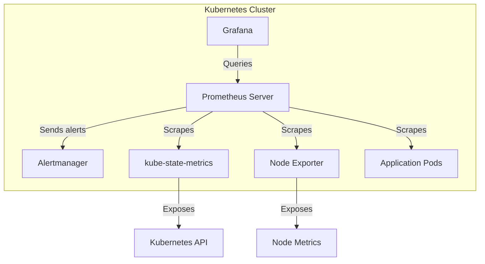

# How to Set Up Prometheus Monitoring for Kubernetes

Author: [nawazdhandala](https://www.github.com/nawazdhandala)

Tags: Kubernetes, Prometheus, Monitoring, Observability, Metrics

Description: Learn how to deploy and configure Prometheus for monitoring Kubernetes clusters, including service discovery, scrape configurations, and essential alerting rules for production environments.

---

Prometheus is the standard monitoring solution for Kubernetes. It collects metrics from your cluster, stores them as time series data, and enables alerting when things go wrong. This guide walks through setting up Prometheus for comprehensive Kubernetes monitoring.

## Prometheus Architecture in Kubernetes

Prometheus uses a pull model to collect metrics:



Key components:
- **Prometheus Server**: Scrapes and stores metrics
- **kube-state-metrics**: Exposes Kubernetes object states
- **Node Exporter**: Exposes node-level metrics
- **Alertmanager**: Handles alert routing and notifications

## Installing with Prometheus Operator

The Prometheus Operator simplifies deployment and configuration:

```bash
# Add the prometheus-community Helm repo
helm repo add prometheus-community https://prometheus-community.github.io/helm-charts
helm repo update

# Install kube-prometheus-stack (includes Prometheus, Grafana, Alertmanager)
helm install prometheus prometheus-community/kube-prometheus-stack \
  --namespace monitoring \
  --create-namespace \
  --set prometheus.prometheusSpec.retention=15d \
  --set prometheus.prometheusSpec.storageSpec.volumeClaimTemplate.spec.resources.requests.storage=50Gi

# Verify installation
kubectl get pods -n monitoring
```

## Configuring Service Discovery

Prometheus automatically discovers targets in Kubernetes using service discovery:

```yaml
# prometheus-additional-scrape-config.yaml
apiVersion: v1
kind: Secret
metadata:
  name: additional-scrape-configs
  namespace: monitoring
stringData:
  additional-scrape-configs.yaml: |
    # Scrape pods with prometheus.io/scrape annotation
    - job_name: 'kubernetes-pods'
      kubernetes_sd_configs:
        - role: pod
      relabel_configs:
        # Only scrape pods with prometheus.io/scrape=true
        - source_labels: [__meta_kubernetes_pod_annotation_prometheus_io_scrape]
          action: keep
          regex: true

        # Use custom path if prometheus.io/path is set
        - source_labels: [__meta_kubernetes_pod_annotation_prometheus_io_path]
          action: replace
          target_label: __metrics_path__
          regex: (.+)

        # Use custom port if prometheus.io/port is set
        - source_labels: [__address__, __meta_kubernetes_pod_annotation_prometheus_io_port]
          action: replace
          regex: ([^:]+)(?::\d+)?;(\d+)
          replacement: $1:$2
          target_label: __address__

        # Add pod labels as metric labels
        - action: labelmap
          regex: __meta_kubernetes_pod_label_(.+)

        # Add namespace and pod name labels
        - source_labels: [__meta_kubernetes_namespace]
          action: replace
          target_label: namespace
        - source_labels: [__meta_kubernetes_pod_name]
          action: replace
          target_label: pod
```

## Annotating Applications for Scraping

Add annotations to your deployments so Prometheus discovers them:

```yaml
# deployment-with-metrics.yaml
apiVersion: apps/v1
kind: Deployment
metadata:
  name: api-server
  namespace: production
spec:
  replicas: 3
  selector:
    matchLabels:
      app: api-server
  template:
    metadata:
      labels:
        app: api-server
      annotations:
        # Tell Prometheus to scrape this pod
        prometheus.io/scrape: "true"
        # Metrics endpoint path
        prometheus.io/path: "/metrics"
        # Metrics endpoint port
        prometheus.io/port: "8080"
    spec:
      containers:
        - name: api
          image: myapi:1.5.0
          ports:
            - containerPort: 8080
              name: http
            - containerPort: 9090
              name: metrics
```

## Using ServiceMonitor for Operator-based Setup

With Prometheus Operator, use ServiceMonitor resources:

```yaml
# servicemonitor.yaml
apiVersion: monitoring.coreos.com/v1
kind: ServiceMonitor
metadata:
  name: api-server-metrics
  namespace: monitoring
  labels:
    # This label must match Prometheus serviceMonitorSelector
    release: prometheus
spec:
  # Select services to monitor
  selector:
    matchLabels:
      app: api-server
  namespaceSelector:
    matchNames:
      - production
  endpoints:
    - port: metrics
      interval: 30s
      path: /metrics
      scheme: http
---
# Make sure your Service has the matching label and port name
apiVersion: v1
kind: Service
metadata:
  name: api-server
  namespace: production
  labels:
    app: api-server
spec:
  selector:
    app: api-server
  ports:
    - name: http
      port: 80
      targetPort: 8080
    - name: metrics
      port: 9090
      targetPort: 9090
```

## Essential Kubernetes Metrics

Key metrics to monitor in any Kubernetes cluster:

```yaml
# prometheus-rules.yaml
apiVersion: monitoring.coreos.com/v1
kind: PrometheusRule
metadata:
  name: kubernetes-alerts
  namespace: monitoring
  labels:
    release: prometheus
spec:
  groups:
    - name: kubernetes-resources
      rules:
        # Alert when pod is in CrashLoopBackOff
        - alert: PodCrashLooping
          expr: |
            increase(kube_pod_container_status_restarts_total[1h]) > 5
          for: 10m
          labels:
            severity: warning
          annotations:
            summary: "Pod {{ $labels.namespace }}/{{ $labels.pod }} is crash looping"
            description: "Pod has restarted more than 5 times in the last hour"

        # Alert when pod is not ready
        - alert: PodNotReady
          expr: |
            kube_pod_status_ready{condition="true"} == 0
          for: 15m
          labels:
            severity: warning
          annotations:
            summary: "Pod {{ $labels.namespace }}/{{ $labels.pod }} is not ready"

        # Alert on high memory usage
        - alert: ContainerHighMemory
          expr: |
            (container_memory_usage_bytes / container_spec_memory_limit_bytes) > 0.9
          for: 5m
          labels:
            severity: warning
          annotations:
            summary: "Container {{ $labels.container }} memory usage above 90%"

        # Alert when node is low on disk
        - alert: NodeDiskPressure
          expr: |
            kube_node_status_condition{condition="DiskPressure",status="true"} == 1
          for: 5m
          labels:
            severity: critical
          annotations:
            summary: "Node {{ $labels.node }} has disk pressure"
```

## Configuring Alertmanager

Set up Alertmanager to route alerts to the right channels:

```yaml
# alertmanager-config.yaml
apiVersion: v1
kind: Secret
metadata:
  name: alertmanager-prometheus-kube-prometheus-alertmanager
  namespace: monitoring
stringData:
  alertmanager.yaml: |
    global:
      # Default settings
      resolve_timeout: 5m

    route:
      # Default receiver
      receiver: 'slack-notifications'
      # Group alerts by these labels
      group_by: ['alertname', 'namespace', 'severity']
      # Wait before sending initial notification
      group_wait: 30s
      # Wait before sending updated notification
      group_interval: 5m
      # Wait before resending notification
      repeat_interval: 4h

      routes:
        # Critical alerts go to PagerDuty
        - match:
            severity: critical
          receiver: 'pagerduty-critical'
          continue: true

        # All alerts also go to Slack
        - match_re:
            severity: warning|critical
          receiver: 'slack-notifications'

    receivers:
      - name: 'slack-notifications'
        slack_configs:
          - api_url: 'https://hooks.slack.com/services/XXX/YYY/ZZZ'
            channel: '#alerts'
            send_resolved: true
            title: '{{ .Status | toUpper }}: {{ .CommonLabels.alertname }}'
            text: '{{ range .Alerts }}{{ .Annotations.description }}{{ end }}'

      - name: 'pagerduty-critical'
        pagerduty_configs:
          - service_key: 'your-pagerduty-service-key'
            severity: critical
```

## Querying Metrics with PromQL

Access the Prometheus UI and run queries:

```bash
# Port-forward to access Prometheus UI
kubectl port-forward -n monitoring svc/prometheus-kube-prometheus-prometheus 9090:9090

# Open http://localhost:9090 in your browser
```

Essential PromQL queries for Kubernetes:

```promql
# CPU usage by namespace
sum(rate(container_cpu_usage_seconds_total{namespace!=""}[5m])) by (namespace)

# Memory usage by pod
container_memory_usage_bytes{pod!="", container!="POD"} / 1024 / 1024

# Request rate by service
sum(rate(http_requests_total[5m])) by (service)

# Error rate percentage
sum(rate(http_requests_total{status=~"5.."}[5m])) / sum(rate(http_requests_total[5m])) * 100

# Pod restart count
sum(kube_pod_container_status_restarts_total) by (namespace, pod)

# Node CPU usage percentage
100 - (avg by (instance) (irate(node_cpu_seconds_total{mode="idle"}[5m])) * 100)

# Available memory per node
node_memory_MemAvailable_bytes / node_memory_MemTotal_bytes * 100
```

## Setting Up Grafana Dashboards

The kube-prometheus-stack includes Grafana with pre-built dashboards:

```bash
# Port-forward to access Grafana
kubectl port-forward -n monitoring svc/prometheus-grafana 3000:80

# Default credentials: admin / prom-operator
```

Import additional dashboards by ID:
- 315: Kubernetes cluster monitoring
- 6417: Kubernetes pods
- 7249: Kubernetes cluster (via Prometheus)

## Persistent Storage Configuration

Configure persistent storage to retain metrics across restarts:

```yaml
# prometheus-values.yaml (for Helm)
prometheus:
  prometheusSpec:
    # Retain metrics for 15 days
    retention: 15d

    # Configure persistent storage
    storageSpec:
      volumeClaimTemplate:
        spec:
          storageClassName: fast-ssd
          accessModes: ["ReadWriteOnce"]
          resources:
            requests:
              storage: 100Gi

    # Resource limits for Prometheus
    resources:
      requests:
        memory: 2Gi
        cpu: 500m
      limits:
        memory: 4Gi
        cpu: 2000m
```

Apply with Helm:

```bash
helm upgrade prometheus prometheus-community/kube-prometheus-stack \
  --namespace monitoring \
  -f prometheus-values.yaml
```

## Federation for Multi-Cluster Monitoring

For monitoring multiple clusters, set up federation:

```yaml
# Federation scrape config on central Prometheus
scrape_configs:
  - job_name: 'federate-cluster-1'
    scrape_interval: 30s
    honor_labels: true
    metrics_path: '/federate'
    params:
      'match[]':
        - '{job=~".+"}'
    static_configs:
      - targets:
          - 'prometheus-cluster-1.example.com:9090'
        labels:
          cluster: 'cluster-1'
```

## Troubleshooting Prometheus

Debug common issues:

```bash
# Check Prometheus targets
kubectl port-forward -n monitoring svc/prometheus-kube-prometheus-prometheus 9090:9090
# Then visit http://localhost:9090/targets

# Check ServiceMonitor is being picked up
kubectl get servicemonitor -n monitoring

# View Prometheus configuration
kubectl get secret prometheus-prometheus-kube-prometheus-prometheus -n monitoring \
  -o jsonpath='{.data.prometheus\.yaml\.gz}' | base64 -d | gunzip

# Check Prometheus logs for scrape errors
kubectl logs -n monitoring prometheus-prometheus-kube-prometheus-prometheus-0 \
  -c prometheus | grep -i error
```

---

Prometheus provides comprehensive monitoring for Kubernetes clusters. Start with the kube-prometheus-stack for a complete setup including Grafana and Alertmanager. Use ServiceMonitors to configure scraping declaratively, set up meaningful alerts with PrometheusRules, and build dashboards in Grafana to visualize your cluster health. With proper monitoring in place, you can detect and respond to issues before they impact users.
