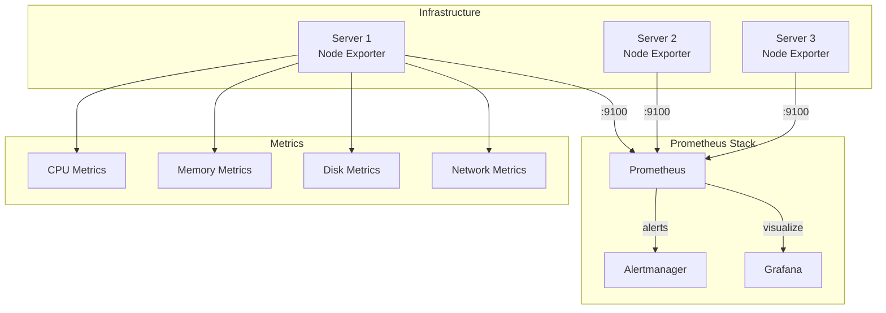

# How to Configure Node Exporter for Prometheus

Author: [nawazdhandala](https://www.github.com/nawazdhandala)

Tags: Prometheus, Node Exporter, Linux Monitoring, System Metrics, CPU, Memory, Disk, Network, Observability

Description: A complete guide to configuring Prometheus Node Exporter for Linux system monitoring. Learn how to install, configure collectors, create dashboards, and set up alerts for comprehensive infrastructure monitoring.

---

## What Is Node Exporter?

Node Exporter is a Prometheus exporter for hardware and OS metrics exposed by Linux kernels. It collects system-level metrics including CPU, memory, disk, network, and filesystem statistics.

Node Exporter is the standard way to monitor Linux servers with Prometheus. It runs as a daemon on each server you want to monitor and exposes metrics on port 9100.

## Installation Methods

### Binary Installation

```bash
# Download the latest release
wget https://github.com/prometheus/node_exporter/releases/download/v1.7.0/node_exporter-1.7.0.linux-amd64.tar.gz

# Extract and install
tar xvfz node_exporter-1.7.0.linux-amd64.tar.gz
sudo mv node_exporter-1.7.0.linux-amd64/node_exporter /usr/local/bin/

# Create a systemd service
sudo cat > /etc/systemd/system/node_exporter.service << EOF
[Unit]
Description=Node Exporter
Wants=network-online.target
After=network-online.target

[Service]
User=node_exporter
Group=node_exporter
Type=simple
ExecStart=/usr/local/bin/node_exporter

[Install]
WantedBy=multi-user.target
EOF

# Create user and start service
sudo useradd -rs /bin/false node_exporter
sudo systemctl daemon-reload
sudo systemctl enable node_exporter
sudo systemctl start node_exporter
```

### Docker Installation

```bash
# Run Node Exporter in Docker
docker run -d \
  --name node-exporter \
  --net="host" \
  --pid="host" \
  -v "/:/host:ro,rslave" \
  quay.io/prometheus/node-exporter:latest \
  --path.rootfs=/host
```

### Kubernetes DaemonSet

```yaml
# node-exporter-daemonset.yaml
apiVersion: apps/v1
kind: DaemonSet
metadata:
  name: node-exporter
  namespace: monitoring
  labels:
    app: node-exporter
spec:
  selector:
    matchLabels:
      app: node-exporter
  template:
    metadata:
      labels:
        app: node-exporter
      annotations:
        prometheus.io/scrape: "true"
        prometheus.io/port: "9100"
    spec:
      hostPID: true
      hostNetwork: true
      containers:
        - name: node-exporter
          image: quay.io/prometheus/node-exporter:latest
          args:
            - '--path.procfs=/host/proc'
            - '--path.sysfs=/host/sys'
            - '--path.rootfs=/host'
            - '--collector.filesystem.mount-points-exclude=^/(sys|proc|dev|host|etc)($$|/)'
          ports:
            - containerPort: 9100
              hostPort: 9100
          volumeMounts:
            - name: proc
              mountPath: /host/proc
              readOnly: true
            - name: sys
              mountPath: /host/sys
              readOnly: true
            - name: rootfs
              mountPath: /host
              readOnly: true
          resources:
            limits:
              memory: 128Mi
              cpu: 100m
            requests:
              memory: 64Mi
              cpu: 50m
      tolerations:
        - effect: NoSchedule
          operator: Exists
      volumes:
        - name: proc
          hostPath:
            path: /proc
        - name: sys
          hostPath:
            path: /sys
        - name: rootfs
          hostPath:
            path: /
---
apiVersion: v1
kind: Service
metadata:
  name: node-exporter
  namespace: monitoring
spec:
  selector:
    app: node-exporter
  ports:
    - port: 9100
      targetPort: 9100
  clusterIP: None
```

## Configuring Collectors

Node Exporter uses collectors to gather different types of metrics. You can enable or disable collectors based on your needs.

### Starting with Specific Collectors

```bash
# Enable only specific collectors
node_exporter \
  --collector.cpu \
  --collector.meminfo \
  --collector.diskstats \
  --collector.netdev \
  --collector.filesystem \
  --collector.loadavg \
  --collector.vmstat \
  --no-collector.bcache \
  --no-collector.bonding \
  --no-collector.infiniband \
  --no-collector.nfs \
  --no-collector.nfsd
```

### Collector Configuration Options

```bash
# Full systemd service with collector configuration
[Service]
User=node_exporter
Group=node_exporter
Type=simple
ExecStart=/usr/local/bin/node_exporter \
  --web.listen-address=:9100 \
  --collector.filesystem.mount-points-exclude="^/(sys|proc|dev|host|etc)($$|/)" \
  --collector.filesystem.fs-types-exclude="^(autofs|binfmt_misc|cgroup|configfs|debugfs|devpts|devtmpfs|fusectl|hugetlbfs|mqueue|overlay|proc|procfs|pstore|rpc_pipefs|securityfs|sysfs|tracefs)$$" \
  --collector.netclass.ignored-devices="^(veth.*|docker.*|br-.*|cni.*)$$" \
  --collector.netdev.device-exclude="^(veth.*|docker.*|br-.*|cni.*)$$" \
  --collector.systemd \
  --collector.processes
```

## Essential Metrics Reference

### CPU Metrics

```promql
# CPU usage percentage (all cores combined)
100 - (avg by (instance) (irate(node_cpu_seconds_total{mode="idle"}[5m])) * 100)

# CPU usage by mode
sum by (mode) (irate(node_cpu_seconds_total[5m]))

# Per-core CPU usage
100 - (irate(node_cpu_seconds_total{mode="idle"}[5m]) * 100)

# CPU load averages
node_load1   # 1 minute load average
node_load5   # 5 minute load average
node_load15  # 15 minute load average

# CPU saturation (load per CPU)
node_load1 / count by (instance) (node_cpu_seconds_total{mode="idle"})
```

### Memory Metrics

```promql
# Total memory
node_memory_MemTotal_bytes

# Available memory (accounts for cache/buffers)
node_memory_MemAvailable_bytes

# Memory usage percentage
(1 - (node_memory_MemAvailable_bytes / node_memory_MemTotal_bytes)) * 100

# Memory components
node_memory_MemFree_bytes      # Free memory
node_memory_Cached_bytes       # Page cache
node_memory_Buffers_bytes      # Buffer cache
node_memory_SwapTotal_bytes    # Total swap
node_memory_SwapFree_bytes     # Free swap

# Swap usage percentage
(1 - (node_memory_SwapFree_bytes / node_memory_SwapTotal_bytes)) * 100
```

### Disk Metrics

```promql
# Disk space usage
(node_filesystem_size_bytes - node_filesystem_avail_bytes) /
node_filesystem_size_bytes * 100

# Available disk space
node_filesystem_avail_bytes

# Disk I/O (reads per second)
rate(node_disk_reads_completed_total[5m])

# Disk I/O (writes per second)
rate(node_disk_writes_completed_total[5m])

# Disk read throughput (bytes/sec)
rate(node_disk_read_bytes_total[5m])

# Disk write throughput (bytes/sec)
rate(node_disk_written_bytes_total[5m])

# Disk I/O utilization (time spent doing I/O)
rate(node_disk_io_time_seconds_total[5m])

# Disk I/O wait time
rate(node_disk_io_time_weighted_seconds_total[5m]) /
rate(node_disk_io_time_seconds_total[5m])
```

### Network Metrics

```promql
# Network receive rate (bytes/sec)
rate(node_network_receive_bytes_total[5m])

# Network transmit rate (bytes/sec)
rate(node_network_transmit_bytes_total[5m])

# Network errors received
rate(node_network_receive_errs_total[5m])

# Network errors transmitted
rate(node_network_transmit_errs_total[5m])

# Network packets dropped
rate(node_network_receive_drop_total[5m])

# Network interface status (1 = up)
node_network_up
```

## Prometheus Scrape Configuration

```yaml
# prometheus.yml
scrape_configs:
  - job_name: 'node'
    static_configs:
      - targets:
          - 'server1:9100'
          - 'server2:9100'
          - 'server3:9100'
    relabel_configs:
      # Add hostname label
      - source_labels: [__address__]
        regex: '([^:]+):\d+'
        target_label: hostname
        replacement: '${1}'

  # Kubernetes service discovery for node-exporter
  - job_name: 'kubernetes-nodes'
    kubernetes_sd_configs:
      - role: node
    relabel_configs:
      - source_labels: [__address__]
        regex: '(.*):\d+'
        target_label: __address__
        replacement: '${1}:9100'
      - source_labels: [__meta_kubernetes_node_name]
        target_label: node
```

## Alerting Rules

```yaml
# node_alerts.yml
groups:
  - name: node_exporter_alerts
    rules:
      # High CPU usage
      - alert: HighCPUUsage
        expr: |
          100 - (avg by (instance) (irate(node_cpu_seconds_total{mode="idle"}[5m])) * 100) > 80
        for: 10m
        labels:
          severity: warning
        annotations:
          summary: "High CPU usage on {{ $labels.instance }}"
          description: "CPU usage is {{ $value | printf \"%.1f\" }}%"

      # High memory usage
      - alert: HighMemoryUsage
        expr: |
          (1 - (node_memory_MemAvailable_bytes / node_memory_MemTotal_bytes)) * 100 > 85
        for: 10m
        labels:
          severity: warning
        annotations:
          summary: "High memory usage on {{ $labels.instance }}"
          description: "Memory usage is {{ $value | printf \"%.1f\" }}%"

      # Disk space running low
      - alert: DiskSpaceLow
        expr: |
          (node_filesystem_avail_bytes{fstype!~"tmpfs|overlay"} /
           node_filesystem_size_bytes{fstype!~"tmpfs|overlay"}) * 100 < 15
        for: 15m
        labels:
          severity: warning
        annotations:
          summary: "Disk space low on {{ $labels.instance }}"
          description: |
            Filesystem {{ $labels.mountpoint }} has only
            {{ $value | printf "%.1f" }}% space remaining.

      # Disk space critical
      - alert: DiskSpaceCritical
        expr: |
          (node_filesystem_avail_bytes{fstype!~"tmpfs|overlay"} /
           node_filesystem_size_bytes{fstype!~"tmpfs|overlay"}) * 100 < 5
        for: 5m
        labels:
          severity: critical
        annotations:
          summary: "Disk space critical on {{ $labels.instance }}"
          description: |
            Filesystem {{ $labels.mountpoint }} has only
            {{ $value | printf "%.1f" }}% space remaining.

      # High load average
      - alert: HighLoadAverage
        expr: |
          node_load15 / count by (instance) (node_cpu_seconds_total{mode="idle"}) > 2
        for: 15m
        labels:
          severity: warning
        annotations:
          summary: "High load average on {{ $labels.instance }}"
          description: "15-minute load average is {{ $value | printf \"%.2f\" }} per CPU"

      # Node down
      - alert: NodeDown
        expr: up{job="node"} == 0
        for: 5m
        labels:
          severity: critical
        annotations:
          summary: "Node {{ $labels.instance }} is down"
          description: "Node exporter on {{ $labels.instance }} is not responding."

      # Swap usage
      - alert: HighSwapUsage
        expr: |
          (1 - (node_memory_SwapFree_bytes / node_memory_SwapTotal_bytes)) * 100 > 50
        for: 15m
        labels:
          severity: warning
        annotations:
          summary: "High swap usage on {{ $labels.instance }}"
          description: "Swap usage is {{ $value | printf \"%.1f\" }}%"

      # Network errors
      - alert: NetworkErrors
        expr: |
          rate(node_network_receive_errs_total[5m]) +
          rate(node_network_transmit_errs_total[5m]) > 10
        for: 5m
        labels:
          severity: warning
        annotations:
          summary: "Network errors on {{ $labels.instance }}"
          description: "Network interface {{ $labels.device }} has errors."

      # Disk I/O saturation
      - alert: DiskIOSaturation
        expr: |
          rate(node_disk_io_time_seconds_total[5m]) > 0.9
        for: 15m
        labels:
          severity: warning
        annotations:
          summary: "Disk I/O saturation on {{ $labels.instance }}"
          description: "Disk {{ $labels.device }} is saturated."
```

## Recording Rules for Performance

```yaml
# node_recording_rules.yml
groups:
  - name: node_recording_rules
    interval: 30s
    rules:
      # Pre-compute CPU usage
      - record: instance:node_cpu:usage_percent
        expr: |
          100 - (avg by (instance) (irate(node_cpu_seconds_total{mode="idle"}[5m])) * 100)

      # Pre-compute memory usage
      - record: instance:node_memory:usage_percent
        expr: |
          (1 - (node_memory_MemAvailable_bytes / node_memory_MemTotal_bytes)) * 100

      # Pre-compute disk usage
      - record: instance:node_filesystem:usage_percent
        expr: |
          (node_filesystem_size_bytes - node_filesystem_avail_bytes) /
          node_filesystem_size_bytes * 100

      # Pre-compute network throughput
      - record: instance:node_network:receive_bytes_rate5m
        expr: |
          sum by (instance) (rate(node_network_receive_bytes_total[5m]))

      - record: instance:node_network:transmit_bytes_rate5m
        expr: |
          sum by (instance) (rate(node_network_transmit_bytes_total[5m]))

      # Load per CPU
      - record: instance:node_load:per_cpu
        expr: |
          node_load1 / count by (instance) (node_cpu_seconds_total{mode="idle"})
```

## System Monitoring Architecture



## Securing Node Exporter

Enable TLS and authentication:

```yaml
# web-config.yml for Node Exporter
tls_server_config:
  cert_file: /etc/node_exporter/certs/node.crt
  key_file: /etc/node_exporter/certs/node.key
  client_auth_type: RequireAndVerifyClientCert
  client_ca_file: /etc/node_exporter/certs/ca.crt

basic_auth_users:
  prometheus: $2b$12$xxxxx...
```

```bash
# Start with TLS config
node_exporter --web.config.file=/etc/node_exporter/web-config.yml
```

Update Prometheus to use TLS:

```yaml
# prometheus.yml with TLS
scrape_configs:
  - job_name: 'node'
    scheme: https
    basic_auth:
      username: prometheus
      password_file: /etc/prometheus/node_exporter_password
    tls_config:
      ca_file: /etc/prometheus/certs/ca.crt
      cert_file: /etc/prometheus/certs/prometheus.crt
      key_file: /etc/prometheus/certs/prometheus.key
    static_configs:
      - targets: ['server1:9100']
```

## Best Practices

1. **Deploy everywhere**: Run Node Exporter on every server you want to monitor
2. **Use DaemonSets in Kubernetes**: Ensures coverage as nodes are added/removed
3. **Filter unnecessary collectors**: Reduce metric volume by disabling unused collectors
4. **Set up comprehensive alerts**: Cover CPU, memory, disk, and network
5. **Use recording rules**: Pre-compute expensive queries
6. **Secure the endpoint**: Enable TLS in production environments
7. **Monitor the monitors**: Alert when Node Exporter is down

## Conclusion

Node Exporter is the foundation of infrastructure monitoring with Prometheus. By exposing detailed system metrics, it enables comprehensive visibility into server health. Focus on the USE method (Utilization, Saturation, Errors) when building alerts and dashboards. Combine Node Exporter data with application metrics for full-stack observability.
