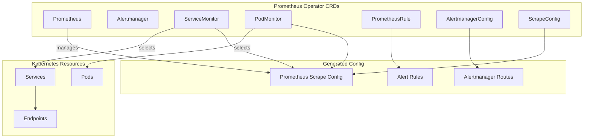

# How to Use Prometheus Operator

Author: [nawazdhandala](https://www.github.com/nawazdhandala)

Tags: Prometheus, Prometheus Operator, Kubernetes, ServiceMonitor, PodMonitor, AlertmanagerConfig, CRDs, GitOps, Observability

Description: Learn how to deploy and manage Prometheus on Kubernetes using the Prometheus Operator. This guide covers Custom Resource Definitions, ServiceMonitors, PodMonitors, and declarative alerting configuration.

---

## What Is Prometheus Operator?

The Prometheus Operator simplifies Prometheus deployment and management on Kubernetes. Instead of manually configuring Prometheus scrape configs and alert rules, you define Kubernetes Custom Resources that the operator translates into native Prometheus configuration.

Key benefits include:

- **Declarative configuration**: Define monitoring as code with Kubernetes manifests
- **Automatic discovery**: ServiceMonitors and PodMonitors auto-discover targets
- **GitOps friendly**: Version control your entire monitoring stack
- **Multi-tenant**: Isolate monitoring configurations per namespace
- **Simplified upgrades**: Operator handles configuration migrations

## Installing Prometheus Operator

The recommended installation method is through the kube-prometheus-stack Helm chart:

```bash
# Add the Prometheus community Helm repository
helm repo add prometheus-community https://prometheus-community.github.io/helm-charts
helm repo update

# Install with default configuration
helm install prometheus prometheus-community/kube-prometheus-stack \
  --namespace monitoring \
  --create-namespace

# Or install with custom values
helm install prometheus prometheus-community/kube-prometheus-stack \
  --namespace monitoring \
  --create-namespace \
  --values values.yaml
```

Example values file:

```yaml
# values.yaml - Custom Helm values
prometheus:
  prometheusSpec:
    # Resource limits
    resources:
      requests:
        memory: "2Gi"
        cpu: "500m"
      limits:
        memory: "4Gi"
        cpu: "1"
    # Retention settings
    retention: 15d
    retentionSize: "50GB"
    # Storage configuration
    storageSpec:
      volumeClaimTemplate:
        spec:
          storageClassName: fast-ssd
          accessModes: ["ReadWriteOnce"]
          resources:
            requests:
              storage: 100Gi
    # Enable all ServiceMonitors across namespaces
    serviceMonitorSelectorNilUsesHelmValues: false
    podMonitorSelectorNilUsesHelmValues: false
    ruleSelectorNilUsesHelmValues: false

alertmanager:
  alertmanagerSpec:
    storage:
      volumeClaimTemplate:
        spec:
          storageClassName: standard
          accessModes: ["ReadWriteOnce"]
          resources:
            requests:
              storage: 10Gi

grafana:
  adminPassword: "your-secure-password"
  persistence:
    enabled: true
    size: 10Gi
```

## Understanding Custom Resource Definitions

The Prometheus Operator introduces several CRDs for managing monitoring:



## Creating a ServiceMonitor

ServiceMonitors tell Prometheus how to discover and scrape services:

```yaml
# servicemonitor.yaml - Monitor a service
apiVersion: monitoring.coreos.com/v1
kind: ServiceMonitor
metadata:
  name: api-gateway-monitor
  namespace: monitoring
  labels:
    app: api-gateway
    release: prometheus  # Match the Helm release label
spec:
  # Which namespaces to look for services
  namespaceSelector:
    matchNames:
      - production
      - staging

  # Which services to monitor (by label)
  selector:
    matchLabels:
      app: api-gateway
      monitoring: enabled

  # How to scrape the endpoints
  endpoints:
    - port: metrics  # Name of the service port
      interval: 15s
      scrapeTimeout: 10s
      path: /metrics
      scheme: http

      # Optional: relabel configurations
      relabelings:
        # Add environment label from namespace
        - sourceLabels: [__meta_kubernetes_namespace]
          targetLabel: environment

      # Optional: metric relabeling
      metricRelabelings:
        # Drop high-cardinality metrics
        - sourceLabels: [__name__]
          regex: 'go_gc_.*'
          action: drop
```

The corresponding service must expose a metrics port:

```yaml
# service.yaml - Service with metrics port
apiVersion: v1
kind: Service
metadata:
  name: api-gateway
  namespace: production
  labels:
    app: api-gateway
    monitoring: enabled  # Matches ServiceMonitor selector
spec:
  selector:
    app: api-gateway
  ports:
    - name: http
      port: 8080
      targetPort: 8080
    - name: metrics  # Must match ServiceMonitor endpoint port
      port: 9090
      targetPort: 9090
```

## Creating a PodMonitor

PodMonitors scrape pods directly without requiring a service:

```yaml
# podmonitor.yaml - Monitor pods directly
apiVersion: monitoring.coreos.com/v1
kind: PodMonitor
metadata:
  name: batch-jobs-monitor
  namespace: monitoring
spec:
  # Which namespaces to look for pods
  namespaceSelector:
    matchNames:
      - batch-processing

  # Which pods to monitor
  selector:
    matchLabels:
      app: batch-processor

  # Pod metrics endpoints
  podMetricsEndpoints:
    - port: metrics
      interval: 30s
      path: /metrics

      # Scrape only running pods
      relabelings:
        - sourceLabels: [__meta_kubernetes_pod_phase]
          regex: Pending|Succeeded|Failed
          action: drop
```

## Defining PrometheusRules

PrometheusRules define recording rules and alerts:

```yaml
# prometheusrule.yaml - Recording and alerting rules
apiVersion: monitoring.coreos.com/v1
kind: PrometheusRule
metadata:
  name: api-gateway-rules
  namespace: monitoring
  labels:
    release: prometheus  # Must match Prometheus ruleSelector
spec:
  groups:
    # Recording rules for precomputed metrics
    - name: api-gateway-recording
      interval: 30s
      rules:
        - record: job:http_requests:rate5m
          expr: |
            sum by (job, status_code) (
              rate(http_requests_total[5m])
            )

        - record: job:http_request_duration:p99
          expr: |
            histogram_quantile(0.99,
              sum by (job, le) (
                rate(http_request_duration_seconds_bucket[5m])
              )
            )

    # Alerting rules
    - name: api-gateway-alerts
      rules:
        - alert: HighErrorRate
          expr: |
            sum(rate(http_requests_total{status_code=~"5.."}[5m])) /
            sum(rate(http_requests_total[5m])) > 0.05
          for: 5m
          labels:
            severity: critical
            team: platform
          annotations:
            summary: "High error rate on {{ $labels.job }}"
            description: |
              Error rate is {{ $value | humanizePercentage }}
              for the last 5 minutes.
            runbook_url: "https://wiki.example.com/runbooks/high-error-rate"

        - alert: SlowResponses
          expr: job:http_request_duration:p99 > 0.5
          for: 10m
          labels:
            severity: warning
            team: platform
          annotations:
            summary: "Slow responses on {{ $labels.job }}"
            description: "p99 latency is {{ $value }}s"
```

## Configuring Alertmanager

Use AlertmanagerConfig for namespace-scoped alerting configuration:

```yaml
# alertmanagerconfig.yaml - Alerting routes and receivers
apiVersion: monitoring.coreos.com/v1alpha1
kind: AlertmanagerConfig
metadata:
  name: team-platform-alerts
  namespace: production
  labels:
    alertmanagerConfig: enabled
spec:
  # Route alerts to appropriate receivers
  route:
    receiver: 'platform-default'
    groupBy: ['alertname', 'job']
    groupWait: 30s
    groupInterval: 5m
    repeatInterval: 4h
    routes:
      # Critical alerts go to PagerDuty
      - receiver: 'platform-pagerduty'
        matchers:
          - name: severity
            value: critical
        continue: true

      # All alerts also go to Slack
      - receiver: 'platform-slack'
        matchers:
          - name: team
            value: platform

  receivers:
    - name: 'platform-default'
      # Fallback receiver (optional webhook)

    - name: 'platform-pagerduty'
      pagerdutyConfigs:
        - routingKey:
            name: pagerduty-secret
            key: routing-key
          severity: critical
          description: '{{ .CommonAnnotations.summary }}'

    - name: 'platform-slack'
      slackConfigs:
        - apiURL:
            name: slack-webhook-secret
            key: webhook-url
          channel: '#platform-alerts'
          title: '{{ .CommonAnnotations.summary }}'
          text: '{{ .CommonAnnotations.description }}'
          sendResolved: true
```

## Custom Scrape Configurations

For advanced scraping scenarios, use ScrapeConfig:

```yaml
# scrapeconfig.yaml - Custom scrape configuration
apiVersion: monitoring.coreos.com/v1alpha1
kind: ScrapeConfig
metadata:
  name: external-services
  namespace: monitoring
  labels:
    release: prometheus
spec:
  # Static targets for external services
  staticConfigs:
    - targets:
        - 'external-api.example.com:9090'
        - 'partner-service.example.com:8080'
      labels:
        source: external

  # Scrape settings
  scrapeInterval: 30s
  scrapeTimeout: 10s
  metricsPath: /metrics
  scheme: https

  # TLS configuration
  tlsConfig:
    insecureSkipVerify: false
    ca:
      secret:
        name: external-ca-cert
        key: ca.crt

  # Basic authentication
  basicAuth:
    username:
      name: external-auth-secret
      key: username
    password:
      name: external-auth-secret
      key: password
```

## Multi-Tenant Monitoring Setup

Configure namespace isolation for multi-tenant clusters:

```yaml
# prometheus-per-team.yaml - Team-specific Prometheus
apiVersion: monitoring.coreos.com/v1
kind: Prometheus
metadata:
  name: team-alpha-prometheus
  namespace: team-alpha-monitoring
spec:
  replicas: 2
  version: v2.45.0

  # Only select monitors from this namespace
  serviceMonitorNamespaceSelector:
    matchLabels:
      team: alpha
  serviceMonitorSelector:
    matchLabels:
      team: alpha

  podMonitorNamespaceSelector:
    matchLabels:
      team: alpha
  podMonitorSelector:
    matchLabels:
      team: alpha

  ruleNamespaceSelector:
    matchLabels:
      team: alpha
  ruleSelector:
    matchLabels:
      team: alpha

  # Resource limits
  resources:
    requests:
      memory: "1Gi"
      cpu: "250m"
    limits:
      memory: "2Gi"
      cpu: "500m"

  # Storage
  storage:
    volumeClaimTemplate:
      spec:
        storageClassName: standard
        accessModes: ["ReadWriteOnce"]
        resources:
          requests:
            storage: 20Gi

  # Security context
  securityContext:
    fsGroup: 2000
    runAsNonRoot: true
    runAsUser: 1000
```

## Automated Application Monitoring

Create a pattern for automatic monitoring of new deployments:

```yaml
# deployment-with-monitoring.yaml - Application with built-in monitoring
apiVersion: apps/v1
kind: Deployment
metadata:
  name: my-application
  namespace: production
  labels:
    app: my-application
spec:
  replicas: 3
  selector:
    matchLabels:
      app: my-application
  template:
    metadata:
      labels:
        app: my-application
      annotations:
        # Prometheus annotation-based discovery (legacy)
        prometheus.io/scrape: "true"
        prometheus.io/port: "9090"
        prometheus.io/path: "/metrics"
    spec:
      containers:
        - name: app
          image: my-application:latest
          ports:
            - name: http
              containerPort: 8080
            - name: metrics
              containerPort: 9090
---
apiVersion: v1
kind: Service
metadata:
  name: my-application
  namespace: production
  labels:
    app: my-application
    monitoring: enabled
spec:
  selector:
    app: my-application
  ports:
    - name: http
      port: 80
      targetPort: 8080
    - name: metrics
      port: 9090
      targetPort: 9090
---
apiVersion: monitoring.coreos.com/v1
kind: ServiceMonitor
metadata:
  name: my-application
  namespace: production
spec:
  selector:
    matchLabels:
      app: my-application
  endpoints:
    - port: metrics
      interval: 15s
---
apiVersion: monitoring.coreos.com/v1
kind: PrometheusRule
metadata:
  name: my-application-alerts
  namespace: production
spec:
  groups:
    - name: my-application
      rules:
        - alert: MyApplicationDown
          expr: up{job="my-application"} == 0
          for: 1m
          labels:
            severity: critical
          annotations:
            summary: "my-application is down"
```

## Best Practices

1. **Use labels consistently**: Define a labeling standard for ServiceMonitors and selectors.

2. **Namespace isolation**: Use namespace selectors to prevent cross-team monitoring interference.

3. **Version control everything**: Store all CRDs in Git for auditability and rollback.

4. **Set resource limits**: Prevent Prometheus from consuming excessive cluster resources.

5. **Use recording rules**: Precompute expensive queries to improve dashboard performance.

6. **Test rules before deployment**: Use `promtool` to validate PrometheusRules.

```bash
# Validate PrometheusRule syntax
promtool check rules prometheusrule.yaml
```

## Conclusion

The Prometheus Operator transforms Prometheus management from manual configuration to declarative Kubernetes resources. ServiceMonitors and PodMonitors enable automatic target discovery, while PrometheusRules and AlertmanagerConfigs provide version-controlled alerting. This approach fits naturally into GitOps workflows and scales across multi-tenant Kubernetes environments.
