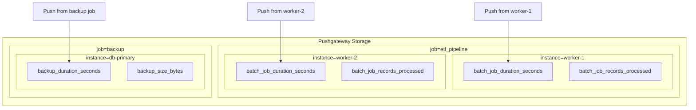

# How to Implement Pushgateway in Prometheus

Author: [nawazdhandala](https://www.github.com/nawazdhandala)

Tags: Prometheus, Pushgateway, Batch Jobs, Short-lived Jobs, Metrics, Cron Jobs, ETL, Observability

Description: Learn how to use Prometheus Pushgateway for batch jobs and short-lived processes. This guide covers installation, pushing metrics, job grouping, and best practices for reliable batch job monitoring.

---

## What Is Pushgateway?

Prometheus uses a pull model where it scrapes metrics from targets. This works well for long-running services, but batch jobs and short-lived processes may complete before Prometheus can scrape them.

Pushgateway acts as an intermediary cache. Jobs push their metrics to Pushgateway, which stores them until Prometheus scrapes the gateway. This bridges the gap between push-based jobs and pull-based Prometheus.

## When to Use Pushgateway

Pushgateway is appropriate for:

- Batch jobs (ETL pipelines, data imports)
- Cron jobs (scheduled tasks, cleanup scripts)
- Short-lived processes (CI/CD jobs, one-off scripts)
- Jobs behind firewalls where Prometheus cannot reach

Pushgateway is NOT recommended for:

- Long-running services (use direct scraping instead)
- Machine-level metrics (use Node Exporter)
- Service instance monitoring (instances can disappear incorrectly)

## Installing Pushgateway

### Docker Installation

```bash
# Run Pushgateway container
docker run -d \
  --name pushgateway \
  -p 9091:9091 \
  prom/pushgateway:latest

# With persistence
docker run -d \
  --name pushgateway \
  -p 9091:9091 \
  -v pushgateway_data:/pushgateway \
  prom/pushgateway:latest \
  --persistence.file=/pushgateway/metrics \
  --persistence.interval=5m
```

### Kubernetes Deployment

```yaml
# pushgateway-deployment.yaml
apiVersion: apps/v1
kind: Deployment
metadata:
  name: pushgateway
  namespace: monitoring
spec:
  replicas: 1
  selector:
    matchLabels:
      app: pushgateway
  template:
    metadata:
      labels:
        app: pushgateway
    spec:
      containers:
        - name: pushgateway
          image: prom/pushgateway:v1.6.2
          args:
            - '--persistence.file=/data/metrics'
            - '--persistence.interval=5m'
          ports:
            - containerPort: 9091
          volumeMounts:
            - name: data
              mountPath: /data
          resources:
            requests:
              memory: "64Mi"
              cpu: "50m"
            limits:
              memory: "128Mi"
              cpu: "100m"
      volumes:
        - name: data
          persistentVolumeClaim:
            claimName: pushgateway-pvc
---
apiVersion: v1
kind: Service
metadata:
  name: pushgateway
  namespace: monitoring
spec:
  selector:
    app: pushgateway
  ports:
    - port: 9091
      targetPort: 9091
---
apiVersion: v1
kind: PersistentVolumeClaim
metadata:
  name: pushgateway-pvc
  namespace: monitoring
spec:
  accessModes:
    - ReadWriteOnce
  resources:
    requests:
      storage: 1Gi
```

## Pushing Metrics

### Using curl

The simplest way to push metrics is via HTTP:

```bash
# Push a single metric
echo "batch_job_duration_seconds 42.5" | \
  curl --data-binary @- http://pushgateway:9091/metrics/job/etl_pipeline

# Push multiple metrics
cat <<EOF | curl --data-binary @- http://pushgateway:9091/metrics/job/etl_pipeline/instance/server1
# TYPE batch_job_duration_seconds gauge
batch_job_duration_seconds 42.5
# TYPE batch_job_records_processed counter
batch_job_records_processed 15000
# TYPE batch_job_last_success_timestamp gauge
batch_job_last_success_timestamp $(date +%s)
EOF

# Push with additional labels
echo "backup_size_bytes 1073741824" | \
  curl --data-binary @- \
  http://pushgateway:9091/metrics/job/backup/instance/db-primary/database/users
```

### Using Python

```python
# push_metrics.py - Python batch job with metrics
from prometheus_client import CollectorRegistry, Counter, Gauge, Histogram, push_to_gateway
import time
import random

# Create a separate registry for this job
registry = CollectorRegistry()

# Define metrics
job_duration = Gauge(
    'batch_job_duration_seconds',
    'Duration of batch job in seconds',
    registry=registry
)

records_processed = Counter(
    'batch_job_records_processed_total',
    'Total records processed by batch job',
    registry=registry
)

processing_time = Histogram(
    'batch_job_record_processing_seconds',
    'Time to process each record',
    buckets=[0.001, 0.005, 0.01, 0.05, 0.1, 0.5, 1.0],
    registry=registry
)

job_success = Gauge(
    'batch_job_last_success_timestamp',
    'Timestamp of last successful job run',
    registry=registry
)


def process_batch():
    """Simulate batch processing."""
    start_time = time.time()

    # Simulate processing records
    num_records = random.randint(1000, 5000)
    for _ in range(num_records):
        record_start = time.time()
        # Simulate work
        time.sleep(random.uniform(0.001, 0.01))
        processing_time.observe(time.time() - record_start)
        records_processed.inc()

    duration = time.time() - start_time
    job_duration.set(duration)
    job_success.set(time.time())

    return num_records, duration


def main():
    try:
        records, duration = process_batch()
        print(f"Processed {records} records in {duration:.2f}s")

        # Push metrics to Pushgateway
        push_to_gateway(
            'pushgateway:9091',
            job='etl_pipeline',
            registry=registry,
            grouping_key={'instance': 'worker-1'}
        )
        print("Metrics pushed successfully")

    except Exception as e:
        print(f"Error: {e}")
        # Push failure metric
        failure_gauge = Gauge(
            'batch_job_failure_timestamp',
            'Timestamp of job failure',
            registry=registry
        )
        failure_gauge.set(time.time())
        push_to_gateway(
            'pushgateway:9091',
            job='etl_pipeline',
            registry=registry,
            grouping_key={'instance': 'worker-1'}
        )
        raise


if __name__ == '__main__':
    main()
```

### Using Go

```go
// main.go - Go batch job with metrics
package main

import (
    "log"
    "math/rand"
    "time"

    "github.com/prometheus/client_golang/prometheus"
    "github.com/prometheus/client_golang/prometheus/push"
)

var (
    jobDuration = prometheus.NewGauge(prometheus.GaugeOpts{
        Name: "batch_job_duration_seconds",
        Help: "Duration of batch job in seconds",
    })

    recordsProcessed = prometheus.NewCounter(prometheus.CounterOpts{
        Name: "batch_job_records_processed_total",
        Help: "Total records processed by batch job",
    })

    lastSuccess = prometheus.NewGauge(prometheus.GaugeOpts{
        Name: "batch_job_last_success_timestamp",
        Help: "Timestamp of last successful job run",
    })
)

func processBatch() (int, float64) {
    start := time.Now()

    // Simulate processing records
    numRecords := rand.Intn(4000) + 1000
    for i := 0; i < numRecords; i++ {
        time.Sleep(time.Duration(rand.Intn(10)) * time.Millisecond)
        recordsProcessed.Inc()
    }

    duration := time.Since(start).Seconds()
    jobDuration.Set(duration)
    lastSuccess.Set(float64(time.Now().Unix()))

    return numRecords, duration
}

func main() {
    // Create registry and register metrics
    registry := prometheus.NewRegistry()
    registry.MustRegister(jobDuration, recordsProcessed, lastSuccess)

    // Process batch
    records, duration := processBatch()
    log.Printf("Processed %d records in %.2fs", records, duration)

    // Push metrics to Pushgateway
    pusher := push.New("http://pushgateway:9091", "etl_pipeline").
        Grouping("instance", "worker-1").
        Gatherer(registry)

    if err := pusher.Push(); err != nil {
        log.Fatalf("Could not push metrics: %v", err)
    }

    log.Println("Metrics pushed successfully")
}
```

### Using Bash Scripts

```bash
#!/bin/bash
# backup_job.sh - Backup script with metrics

PUSHGATEWAY="http://pushgateway:9091"
JOB_NAME="database_backup"
INSTANCE="db-primary"

# Start timing
START_TIME=$(date +%s.%N)

# Perform backup
pg_dump -h localhost -U postgres mydb > /backup/mydb_$(date +%Y%m%d).sql
BACKUP_STATUS=$?
BACKUP_SIZE=$(stat -f%z /backup/mydb_$(date +%Y%m%d).sql 2>/dev/null || echo 0)

# Calculate duration
END_TIME=$(date +%s.%N)
DURATION=$(echo "$END_TIME - $START_TIME" | bc)

# Prepare metrics
cat <<EOF | curl --data-binary @- "${PUSHGATEWAY}/metrics/job/${JOB_NAME}/instance/${INSTANCE}"
# HELP backup_duration_seconds Time taken to complete backup
# TYPE backup_duration_seconds gauge
backup_duration_seconds ${DURATION}
# HELP backup_size_bytes Size of backup file in bytes
# TYPE backup_size_bytes gauge
backup_size_bytes ${BACKUP_SIZE}
# HELP backup_last_completion_timestamp Unix timestamp of last backup completion
# TYPE backup_last_completion_timestamp gauge
backup_last_completion_timestamp ${END_TIME}
# HELP backup_success Whether the backup succeeded (1) or failed (0)
# TYPE backup_success gauge
backup_success $([[ $BACKUP_STATUS -eq 0 ]] && echo 1 || echo 0)
EOF

echo "Backup completed: status=$BACKUP_STATUS, size=$BACKUP_SIZE, duration=${DURATION}s"
```

## Configuring Prometheus to Scrape Pushgateway

```yaml
# prometheus.yml
scrape_configs:
  - job_name: 'pushgateway'
    honor_labels: true  # Preserve job and instance labels from pushed metrics
    static_configs:
      - targets: ['pushgateway:9091']
```

The `honor_labels: true` setting is important. Without it, Prometheus overwrites the `job` and `instance` labels with the Pushgateway's values.

## Understanding Job Grouping

Pushgateway organizes metrics by grouping keys (job, instance, and custom labels):



## Deleting Metrics

Remove stale metrics from Pushgateway:

```bash
# Delete all metrics for a specific job
curl -X DELETE http://pushgateway:9091/metrics/job/etl_pipeline

# Delete metrics for a specific job and instance
curl -X DELETE http://pushgateway:9091/metrics/job/etl_pipeline/instance/worker-1

# Delete with additional grouping keys
curl -X DELETE http://pushgateway:9091/metrics/job/backup/instance/db-primary/database/users
```

## Monitoring Pushgateway Itself

Create alerts for Pushgateway health:

```yaml
# pushgateway_alerts.yml
groups:
  - name: pushgateway_alerts
    rules:
      # Alert if Pushgateway is down
      - alert: PushgatewayDown
        expr: up{job="pushgateway"} == 0
        for: 5m
        labels:
          severity: critical
        annotations:
          summary: "Pushgateway is down"

      # Alert if a batch job hasn't run recently
      - alert: BatchJobNotRunning
        expr: |
          time() - batch_job_last_success_timestamp{job="etl_pipeline"} > 3600
        for: 5m
        labels:
          severity: warning
        annotations:
          summary: "Batch job {{ $labels.job }} hasn't run in over an hour"

      # Alert if batch job failed
      - alert: BatchJobFailed
        expr: batch_job_success == 0
        for: 0m
        labels:
          severity: critical
        annotations:
          summary: "Batch job {{ $labels.job }} failed"
```

## Best Practices

### 1. Always Push Completion Timestamp

```python
# Include a timestamp so you can detect stale metrics
job_completion = Gauge('batch_job_last_success_timestamp', 'Last success time')
job_completion.set(time.time())
```

### 2. Push on Both Success and Failure

```python
try:
    process_batch()
    job_success.set(1)
except Exception as e:
    job_success.set(0)
    job_error_message.labels(error=str(e)).set(1)
finally:
    push_to_gateway(...)
```

### 3. Use Unique Grouping Keys

```python
# Include enough context to identify the job run
push_to_gateway(
    'pushgateway:9091',
    job='etl_pipeline',
    grouping_key={
        'instance': hostname,
        'run_id': run_id,
    }
)
```

### 4. Clean Up Old Metrics

```bash
# Add to cron to clean up old job metrics
0 * * * * curl -X DELETE http://pushgateway:9091/metrics/job/old_job
```

### 5. Use Pushadd for Counters

When pushing counters, use `pushadd` instead of `push` to add to existing values:

```python
from prometheus_client import pushadd_to_gateway

# pushadd adds to existing counter values
pushadd_to_gateway(
    'pushgateway:9091',
    job='etl_pipeline',
    registry=registry
)
```

## Limitations and Alternatives

Pushgateway has some limitations:

1. **Single point of failure**: All pushed metrics go through one gateway
2. **Stale metrics**: Metrics persist until explicitly deleted
3. **No timestamps**: Metrics use scrape time, not push time
4. **Limited scalability**: Not designed for high-throughput pushes

For high-volume scenarios, consider:

- **Remote write**: Push directly to remote storage (Cortex, Thanos, VictoriaMetrics)
- **OpenTelemetry Collector**: More flexible metric collection
- **Custom aggregation**: Aggregate in your application before pushing

## Conclusion

Pushgateway fills a specific gap in Prometheus monitoring: collecting metrics from short-lived batch jobs. Use it for cron jobs, ETL pipelines, and scheduled tasks where direct scraping is not practical. Always push completion timestamps, handle failures gracefully, and clean up stale metrics to maintain a healthy monitoring system.
