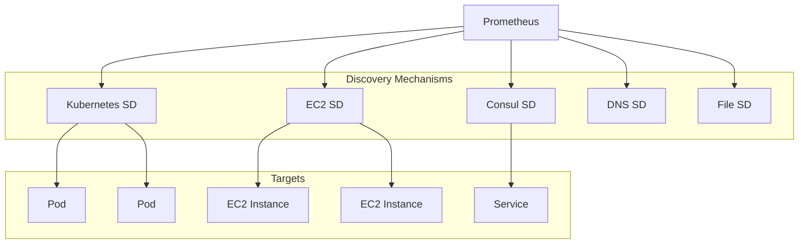

# How to Implement Service Discovery in Prometheus

Author: [nawazdhandala](https://www.github.com/nawazdhandala)

Tags: Prometheus, Service Discovery, Kubernetes, Monitoring, Consul, AWS, DevOps

Description: A comprehensive guide to configuring Prometheus service discovery for dynamic environments, covering Kubernetes, Consul, EC2, file-based discovery, and custom solutions.

---

Static target configuration becomes unmanageable as infrastructure scales. Service discovery allows Prometheus to automatically find and scrape new targets as they appear. This guide covers the most common service discovery mechanisms and how to configure them effectively.

## Service Discovery Overview

Prometheus supports multiple service discovery mechanisms:



## Kubernetes Service Discovery

Kubernetes SD is the most commonly used mechanism for containerized workloads.

### Discovering Pods

```yaml
# prometheus.yml
scrape_configs:
  - job_name: 'kubernetes-pods'
    kubernetes_sd_configs:
      - role: pod

    relabel_configs:
      # Only scrape pods with annotation prometheus.io/scrape=true
      - source_labels: [__meta_kubernetes_pod_annotation_prometheus_io_scrape]
        action: keep
        regex: true

      # Use custom path if specified
      - source_labels: [__meta_kubernetes_pod_annotation_prometheus_io_path]
        action: replace
        target_label: __metrics_path__
        regex: (.+)

      # Use custom port if specified
      - source_labels: [__address__, __meta_kubernetes_pod_annotation_prometheus_io_port]
        action: replace
        regex: ([^:]+)(?::\d+)?;(\d+)
        replacement: $1:$2
        target_label: __address__

      # Add pod labels as metric labels
      - action: labelmap
        regex: __meta_kubernetes_pod_label_(.+)

      # Add namespace label
      - source_labels: [__meta_kubernetes_namespace]
        action: replace
        target_label: namespace

      # Add pod name label
      - source_labels: [__meta_kubernetes_pod_name]
        action: replace
        target_label: pod
```

### Discovering Services

```yaml
scrape_configs:
  - job_name: 'kubernetes-services'
    kubernetes_sd_configs:
      - role: service

    relabel_configs:
      # Only scrape services with annotation
      - source_labels: [__meta_kubernetes_service_annotation_prometheus_io_scrape]
        action: keep
        regex: true

      # Use service annotation for scheme (http/https)
      - source_labels: [__meta_kubernetes_service_annotation_prometheus_io_scheme]
        action: replace
        target_label: __scheme__
        regex: (https?)

      # Use service annotation for path
      - source_labels: [__meta_kubernetes_service_annotation_prometheus_io_path]
        action: replace
        target_label: __metrics_path__
        regex: (.+)

      # Use service annotation for port
      - source_labels: [__address__, __meta_kubernetes_service_annotation_prometheus_io_port]
        action: replace
        target_label: __address__
        regex: ([^:]+)(?::\d+)?;(\d+)
        replacement: $1:$2
```

### Discovering Endpoints

```yaml
scrape_configs:
  - job_name: 'kubernetes-endpoints'
    kubernetes_sd_configs:
      - role: endpoints

    relabel_configs:
      # Keep endpoints from services with scrape annotation
      - source_labels: [__meta_kubernetes_service_annotation_prometheus_io_scrape]
        action: keep
        regex: true

      # Replace port with annotated port
      - source_labels: [__address__, __meta_kubernetes_service_annotation_prometheus_io_port]
        action: replace
        regex: ([^:]+)(?::\d+)?;(\d+)
        replacement: $1:$2
        target_label: __address__

      # Set namespace label
      - source_labels: [__meta_kubernetes_namespace]
        target_label: namespace

      # Set service label
      - source_labels: [__meta_kubernetes_service_name]
        target_label: service

      # Set pod label
      - source_labels: [__meta_kubernetes_pod_name]
        target_label: pod
```

### Discovering Nodes

```yaml
scrape_configs:
  - job_name: 'kubernetes-nodes'
    kubernetes_sd_configs:
      - role: node

    relabel_configs:
      # Use kubelet HTTPS endpoint
      - action: labelmap
        regex: __meta_kubernetes_node_label_(.+)

      - target_label: __address__
        replacement: kubernetes.default.svc:443

      - source_labels: [__meta_kubernetes_node_name]
        regex: (.+)
        target_label: __metrics_path__
        replacement: /api/v1/nodes/${1}/proxy/metrics
```

## Consul Service Discovery

Consul provides a service registry that Prometheus can query:

```yaml
scrape_configs:
  - job_name: 'consul-services'
    consul_sd_configs:
      - server: 'consul.example.com:8500'
        services: []  # Empty means all services
        # Or specify specific services
        # services: ['web', 'api', 'database']

    relabel_configs:
      # Use service name as job label
      - source_labels: [__meta_consul_service]
        target_label: job

      # Add datacenter label
      - source_labels: [__meta_consul_dc]
        target_label: datacenter

      # Add service tags as labels
      - source_labels: [__meta_consul_tags]
        target_label: tags

      # Filter by tag
      - source_labels: [__meta_consul_tags]
        regex: .*,prometheus,.*
        action: keep
```

### Consul with Authentication

```yaml
scrape_configs:
  - job_name: 'consul-services'
    consul_sd_configs:
      - server: 'consul.example.com:8500'
        token: 'your-consul-acl-token'
        # Or use token_file for better security
        # token_file: '/etc/prometheus/consul-token'

        # TLS configuration
        tls_config:
          ca_file: '/etc/prometheus/consul-ca.pem'
```

## AWS EC2 Service Discovery

Discover EC2 instances by tags or other attributes:

```yaml
scrape_configs:
  - job_name: 'ec2-instances'
    ec2_sd_configs:
      - region: us-east-1
        access_key: 'YOUR_ACCESS_KEY'
        secret_key: 'YOUR_SECRET_KEY'
        # Or use IAM role (recommended)
        # role_arn: 'arn:aws:iam::123456789:role/prometheus'

        port: 9100  # Node exporter port

        filters:
          # Only discover instances with specific tag
          - name: tag:Environment
            values: ['production']
          - name: tag:monitoring
            values: ['enabled']

    relabel_configs:
      # Use instance ID as instance label
      - source_labels: [__meta_ec2_instance_id]
        target_label: instance_id

      # Use private IP for scraping
      - source_labels: [__meta_ec2_private_ip]
        target_label: __address__
        replacement: '${1}:9100'

      # Add instance type label
      - source_labels: [__meta_ec2_instance_type]
        target_label: instance_type

      # Add availability zone label
      - source_labels: [__meta_ec2_availability_zone]
        target_label: availability_zone

      # Add tags as labels
      - source_labels: [__meta_ec2_tag_Name]
        target_label: name

      - source_labels: [__meta_ec2_tag_Environment]
        target_label: environment
```

## DNS Service Discovery

DNS SD discovers targets via DNS queries:

```yaml
scrape_configs:
  # A record discovery
  - job_name: 'dns-a-records'
    dns_sd_configs:
      - names:
          - 'api.example.com'
          - 'web.example.com'
        type: A
        port: 9090
        refresh_interval: 30s

  # SRV record discovery
  - job_name: 'dns-srv-records'
    dns_sd_configs:
      - names:
          - '_prometheus._tcp.example.com'
        type: SRV
        refresh_interval: 30s
```

## File-Based Service Discovery

For custom discovery mechanisms, use file-based SD:

```yaml
scrape_configs:
  - job_name: 'file-sd-targets'
    file_sd_configs:
      - files:
          - '/etc/prometheus/targets/*.json'
          - '/etc/prometheus/targets/*.yml'
        refresh_interval: 5m
```

Target files can be JSON or YAML:

```json
// /etc/prometheus/targets/webservers.json
[
  {
    "targets": ["web1.example.com:9090", "web2.example.com:9090"],
    "labels": {
      "job": "webserver",
      "environment": "production",
      "team": "platform"
    }
  },
  {
    "targets": ["web3.example.com:9090"],
    "labels": {
      "job": "webserver",
      "environment": "staging",
      "team": "platform"
    }
  }
]
```

Or in YAML format:

```yaml
# /etc/prometheus/targets/databases.yml
- targets:
    - 'db1.example.com:9104'
    - 'db2.example.com:9104'
  labels:
    job: mysql
    environment: production

- targets:
    - 'db3.example.com:9104'
  labels:
    job: mysql
    environment: staging
```

### Dynamic File Generation

Generate target files from your infrastructure:

```python
#!/usr/bin/env python3
# generate_targets.py
import json
import boto3

def get_ec2_targets():
    ec2 = boto3.client('ec2')
    instances = ec2.describe_instances(
        Filters=[
            {'Name': 'tag:monitoring', 'Values': ['enabled']},
            {'Name': 'instance-state-name', 'Values': ['running']}
        ]
    )

    targets = []
    for reservation in instances['Reservations']:
        for instance in reservation['Instances']:
            ip = instance['PrivateIpAddress']
            name = next(
                (t['Value'] for t in instance.get('Tags', []) if t['Key'] == 'Name'),
                instance['InstanceId']
            )
            targets.append({
                'targets': [f'{ip}:9100'],
                'labels': {
                    'job': 'node',
                    'instance_name': name,
                    'instance_id': instance['InstanceId']
                }
            })

    return targets

if __name__ == '__main__':
    targets = get_ec2_targets()
    with open('/etc/prometheus/targets/ec2.json', 'w') as f:
        json.dump(targets, f, indent=2)
```

Run this script periodically via cron:

```bash
# Update targets every 5 minutes
*/5 * * * * /usr/local/bin/generate_targets.py
```

## Combining Multiple Discovery Mechanisms

You can use multiple discovery mechanisms in a single Prometheus instance:

```yaml
scrape_configs:
  # Kubernetes pods
  - job_name: 'k8s-pods'
    kubernetes_sd_configs:
      - role: pod
    relabel_configs:
      # ... relabeling rules

  # Consul services
  - job_name: 'consul-services'
    consul_sd_configs:
      - server: 'consul:8500'
    relabel_configs:
      # ... relabeling rules

  # EC2 instances
  - job_name: 'ec2-nodes'
    ec2_sd_configs:
      - region: us-east-1
    relabel_configs:
      # ... relabeling rules

  # Static targets for things that don't support SD
  - job_name: 'static-targets'
    static_configs:
      - targets:
          - 'legacy-server.example.com:9090'
```

## Debugging Service Discovery

### Check Discovered Targets

```bash
# View all discovered targets
curl http://localhost:9090/api/v1/targets | jq

# View targets for specific job
curl 'http://localhost:9090/api/v1/targets?state=active' | jq '.data.activeTargets[] | select(.labels.job=="kubernetes-pods")'
```

### View Service Discovery Output

The Prometheus UI shows discovered targets at:
- `http://prometheus:9090/service-discovery`

This page shows:
- All discovered targets before relabeling
- Target labels after relabeling
- Which targets were dropped and why

### Common Issues

1. **No targets discovered** - Check network connectivity and permissions
2. **Wrong labels** - Review relabel_configs carefully
3. **Too many targets** - Add filters or keep/drop rules
4. **Missing metrics** - Verify target is exposing metrics endpoint

## Best Practices

1. **Use annotations for opt-in scraping** - Don't scrape everything by default
2. **Apply consistent labeling** - Use relabel_configs to standardize labels
3. **Filter aggressively** - Only discover targets you need
4. **Monitor discovery** - Track target counts and scrape failures
5. **Secure credentials** - Use IAM roles, token files, or secrets management
6. **Set appropriate refresh intervals** - Balance freshness with load

---

Service discovery transforms Prometheus from a static monitoring tool into a dynamic system that adapts to infrastructure changes. Start with the discovery mechanism that matches your environment, add relabeling rules to standardize labels, and filter to only the targets you need.
