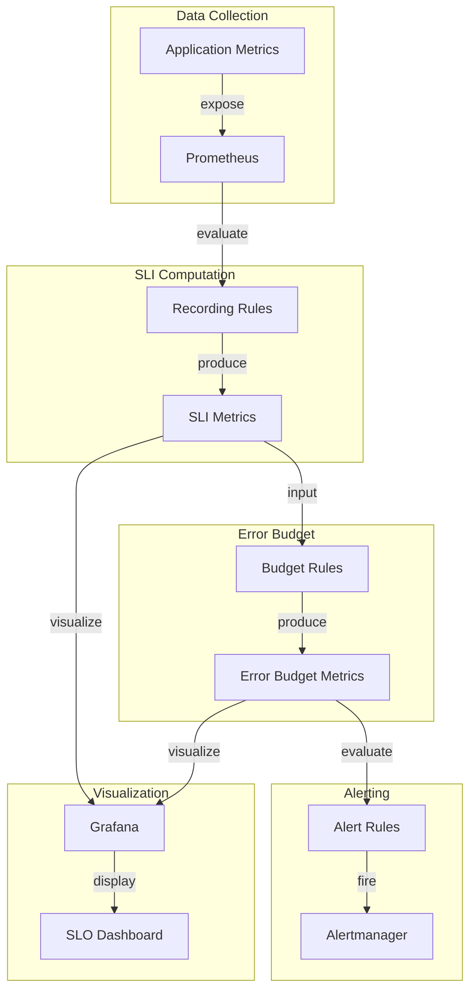

# How to Implement SLO Monitoring with Prometheus

Author: [nawazdhandala](https://www.github.com/nawazdhandala)

Tags: Prometheus, SLO, SLI, Error Budget, Site Reliability Engineering, Observability, Alerting, Recording Rules

Description: Learn how to implement Service Level Objective (SLO) monitoring with Prometheus. This guide covers defining SLIs, creating recording rules for error budgets, and setting up multi-window multi-burn-rate alerts.

---

## Understanding SLOs, SLIs, and Error Budgets

Service Level Objectives (SLOs) define the target reliability for your services. They answer the question: "How reliable should this service be?" SLOs are built on Service Level Indicators (SLIs), which are the metrics that measure actual performance.

The error budget is the difference between perfect reliability (100%) and your SLO target. If your SLO is 99.9% availability, your error budget is 0.1% - the amount of unreliability you can tolerate.

## Choosing the Right SLIs

Good SLIs measure what users actually experience. The most common SLI types are:

- **Availability**: Ratio of successful requests to total requests
- **Latency**: Ratio of requests faster than a threshold to total requests
- **Quality**: Ratio of responses meeting quality standards

```yaml
# Example SLI definitions
slis:
  availability:
    description: "Percentage of requests that succeed"
    good_events: "HTTP status codes 2xx and 3xx"
    total_events: "All HTTP requests excluding health checks"

  latency:
    description: "Percentage of requests faster than 300ms"
    good_events: "Requests with response time < 300ms"
    total_events: "All HTTP requests"
```

## Creating Recording Rules for SLIs

Recording rules pre-compute SLI values for efficient querying and alerting.

```yaml
# recording_rules.yml - SLI recording rules
groups:
  - name: sli_recording_rules
    interval: 30s
    rules:
      # Total requests counter (excluding health checks)
      - record: sli:http_requests:total
        expr: |
          sum by (service, environment) (
            rate(http_requests_total{path!~"/health|/ready|/metrics"}[5m])
          )

      # Successful requests (2xx and 3xx status codes)
      - record: sli:http_requests:success
        expr: |
          sum by (service, environment) (
            rate(http_requests_total{
              path!~"/health|/ready|/metrics",
              status=~"2..|3.."
            }[5m])
          )

      # Failed requests (5xx status codes)
      - record: sli:http_requests:errors
        expr: |
          sum by (service, environment) (
            rate(http_requests_total{
              path!~"/health|/ready|/metrics",
              status=~"5.."
            }[5m])
          )

      # Availability SLI (success rate)
      - record: sli:availability:ratio
        expr: |
          sli:http_requests:success / sli:http_requests:total

      # Latency SLI - requests under 300ms threshold
      - record: sli:latency:good_requests
        expr: |
          sum by (service, environment) (
            rate(http_request_duration_seconds_bucket{le="0.3"}[5m])
          )

      - record: sli:latency:total_requests
        expr: |
          sum by (service, environment) (
            rate(http_request_duration_seconds_count[5m])
          )

      - record: sli:latency:ratio
        expr: |
          sli:latency:good_requests / sli:latency:total_requests
```

## Computing Error Budgets

Error budget calculations tell you how much unreliability you have consumed:

```yaml
# error_budget_rules.yml - Error budget recording rules
groups:
  - name: error_budget_rules
    interval: 1m
    rules:
      # Define SLO targets as recording rules for flexibility
      - record: slo:availability:target
        expr: vector(0.999)  # 99.9% availability SLO
        labels:
          service: api-gateway

      - record: slo:latency:target
        expr: vector(0.99)   # 99% of requests under latency threshold
        labels:
          service: api-gateway

      # Error budget remaining (as a ratio)
      # 1.0 = full budget, 0 = budget exhausted, negative = over budget
      - record: error_budget:availability:remaining
        expr: |
          1 - (
            (1 - sli:availability:ratio) /
            (1 - slo:availability:target)
          )

      - record: error_budget:latency:remaining
        expr: |
          1 - (
            (1 - sli:latency:ratio) /
            (1 - slo:latency:target)
          )

      # Error budget consumption rate over different windows
      - record: error_budget:availability:burn_rate:1h
        expr: |
          1 - (
            sum_over_time(sli:http_requests:success[1h]) /
            sum_over_time(sli:http_requests:total[1h])
          ) / (1 - 0.999)

      - record: error_budget:availability:burn_rate:6h
        expr: |
          1 - (
            sum_over_time(sli:http_requests:success[6h]) /
            sum_over_time(sli:http_requests:total[6h])
          ) / (1 - 0.999)

      - record: error_budget:availability:burn_rate:24h
        expr: |
          1 - (
            sum_over_time(sli:http_requests:success[1d]) /
            sum_over_time(sli:http_requests:total[1d])
          ) / (1 - 0.999)
```

## Multi-Window Multi-Burn-Rate Alerts

The most effective SLO alerting strategy uses multiple time windows and burn rates to balance alert speed with noise reduction.

```yaml
# slo_alerts.yml - Multi-window multi-burn-rate alerting
groups:
  - name: slo_alerts
    rules:
      # Critical: Fast burn - 2% of monthly budget in 1 hour
      # Burn rate of 14.4x consumes 2% in 1 hour
      - alert: SLOHighErrorRate
        expr: |
          (
            error_budget:availability:burn_rate:1h > 14.4
            and
            error_budget:availability:burn_rate:5m > 14.4
          )
        for: 2m
        labels:
          severity: critical
          slo: availability
        annotations:
          summary: "High error rate burning through SLO budget"
          description: |
            Service {{ $labels.service }} is burning error budget
            at {{ $value | printf "%.1f" }}x the sustainable rate.
            At this rate, the monthly budget will be exhausted in
            {{ printf "%.1f" (720 / $value) }} hours.

      # Warning: Medium burn - 5% of monthly budget in 6 hours
      # Burn rate of 6x consumes 5% in 6 hours
      - alert: SLOElevatedErrorRate
        expr: |
          (
            error_budget:availability:burn_rate:6h > 6
            and
            error_budget:availability:burn_rate:30m > 6
          )
        for: 15m
        labels:
          severity: warning
          slo: availability
        annotations:
          summary: "Elevated error rate affecting SLO"
          description: |
            Service {{ $labels.service }} error budget burn rate
            is {{ $value | printf "%.1f" }}x sustainable.

      # Info: Slow burn - 10% of monthly budget in 3 days
      # Burn rate of 1x is sustainable, 2x burns 10% in 3 days
      - alert: SLOSlowBurn
        expr: |
          (
            error_budget:availability:burn_rate:24h > 2
            and
            error_budget:availability:burn_rate:6h > 2
          )
        for: 1h
        labels:
          severity: info
          slo: availability
        annotations:
          summary: "Slow burn on SLO error budget"
          description: |
            Service {{ $labels.service }} has sustained elevated
            error rates. Review recent changes.

      # Critical: Error budget exhausted
      - alert: SLOBudgetExhausted
        expr: error_budget:availability:remaining < 0
        for: 5m
        labels:
          severity: critical
          slo: availability
        annotations:
          summary: "SLO error budget exhausted"
          description: |
            Service {{ $labels.service }} has exceeded its
            error budget for the current period.
```

## SLO Monitoring Architecture

Here is how the components fit together:



## Practical PromQL Queries for SLO Dashboards

Use these queries to build comprehensive SLO dashboards:

```promql
# Current availability over the last 30 days
sum_over_time(sli:http_requests:success[30d]) /
sum_over_time(sli:http_requests:total[30d])

# Error budget remaining (percentage)
100 * error_budget:availability:remaining

# Error budget consumption over time (for trending)
1 - (
  sum_over_time(sli:http_requests:success[30d] offset 1d) /
  sum_over_time(sli:http_requests:total[30d] offset 1d)
)

# Time until error budget exhaustion at current burn rate
# (in hours, assuming 30-day window)
(error_budget:availability:remaining * 720) /
error_budget:availability:burn_rate:1h

# Availability by percentile over rolling windows
# 30-day availability
sum_over_time(sli:http_requests:success[30d]) /
sum_over_time(sli:http_requests:total[30d])

# 7-day availability
sum_over_time(sli:http_requests:success[7d]) /
sum_over_time(sli:http_requests:total[7d])

# 24-hour availability
sum_over_time(sli:http_requests:success[1d]) /
sum_over_time(sli:http_requests:total[1d])
```

## Implementing SLOs with Sloth

Sloth is a tool that generates Prometheus recording rules and alerts from SLO definitions:

```yaml
# slo.yml - Sloth SLO definition
version: "prometheus/v1"
service: "api-gateway"
labels:
  owner: platform-team
  tier: "1"
slos:
  - name: "requests-availability"
    objective: 99.9
    description: "99.9% of requests should be successful"
    sli:
      events:
        error_query: |
          sum(rate(http_requests_total{
            service="api-gateway",
            status=~"5.."
          }[{{.window}}]))
        total_query: |
          sum(rate(http_requests_total{
            service="api-gateway"
          }[{{.window}}]))
    alerting:
      name: APIGatewayAvailability
      labels:
        category: availability
      annotations:
        runbook: "https://wiki.example.com/runbooks/api-gateway"
      page_alert:
        labels:
          severity: critical
      ticket_alert:
        labels:
          severity: warning

  - name: "requests-latency"
    objective: 99
    description: "99% of requests should be faster than 300ms"
    sli:
      events:
        error_query: |
          sum(rate(http_request_duration_seconds_count{
            service="api-gateway"
          }[{{.window}}]))
          -
          sum(rate(http_request_duration_seconds_bucket{
            service="api-gateway",
            le="0.3"
          }[{{.window}}]))
        total_query: |
          sum(rate(http_request_duration_seconds_count{
            service="api-gateway"
          }[{{.window}}]))
    alerting:
      name: APIGatewayLatency
      labels:
        category: latency
```

Generate rules with Sloth:

```bash
# Generate Prometheus rules from SLO definition
sloth generate -i slo.yml -o prometheus_rules.yml

# Validate the generated rules
promtool check rules prometheus_rules.yml
```

## SLO Reporting and Communication

Create standardized SLO reports for stakeholders:

```python
# slo_report.py - Generate SLO report from Prometheus
import requests
from datetime import datetime, timedelta

PROMETHEUS_URL = "http://prometheus:9090"

def query_prometheus(query: str) -> float:
    """Execute a PromQL query and return the result."""
    response = requests.get(
        f"{PROMETHEUS_URL}/api/v1/query",
        params={"query": query}
    )
    result = response.json()
    if result["data"]["result"]:
        return float(result["data"]["result"][0]["value"][1])
    return 0.0

def generate_slo_report(service: str, slo_target: float = 0.999):
    """Generate an SLO report for a service."""
    # Query current SLI values
    availability_30d = query_prometheus(
        f'sum_over_time(sli:http_requests:success{{service="{service}"}}[30d]) / '
        f'sum_over_time(sli:http_requests:total{{service="{service}"}}[30d])'
    )

    error_budget_remaining = query_prometheus(
        f'error_budget:availability:remaining{{service="{service}"}}'
    )

    burn_rate_1h = query_prometheus(
        f'error_budget:availability:burn_rate:1h{{service="{service}"}}'
    )

    # Calculate metrics
    budget_consumed = (1 - error_budget_remaining) * 100
    days_until_exhaustion = (error_budget_remaining * 30) / burn_rate_1h if burn_rate_1h > 0 else float('inf')

    report = {
        "service": service,
        "period": "30 days",
        "generated_at": datetime.now().isoformat(),
        "slo_target": f"{slo_target * 100:.2f}%",
        "current_availability": f"{availability_30d * 100:.3f}%",
        "meeting_slo": availability_30d >= slo_target,
        "error_budget_consumed": f"{budget_consumed:.1f}%",
        "error_budget_remaining": f"{error_budget_remaining * 100:.1f}%",
        "current_burn_rate": f"{burn_rate_1h:.2f}x",
        "projected_exhaustion": f"{days_until_exhaustion:.1f} days" if days_until_exhaustion < 30 else "N/A"
    }

    return report

# Generate report
report = generate_slo_report("api-gateway")
for key, value in report.items():
    print(f"{key}: {value}")
```

## Best Practices

1. **Start with user journeys**: Define SLOs based on what matters to users, not internal metrics.

2. **Use consistent windows**: Align SLO windows with business cycles (monthly, quarterly).

3. **Alert on burn rate, not thresholds**: Multi-burn-rate alerts reduce noise while catching real issues.

4. **Review SLOs quarterly**: Adjust targets based on business needs and historical performance.

5. **Make error budgets visible**: Display error budget status on team dashboards.

6. **Document SLO policies**: Define what happens when budgets are exhausted (feature freezes, remediation sprints).

## Conclusion

SLO monitoring with Prometheus transforms reliability from a vague goal into a measurable objective. By defining clear SLIs, computing error budgets with recording rules, and implementing multi-window burn-rate alerts, you can balance innovation velocity with user experience. The key is starting with what users care about and building measurement systems that reflect those priorities.
