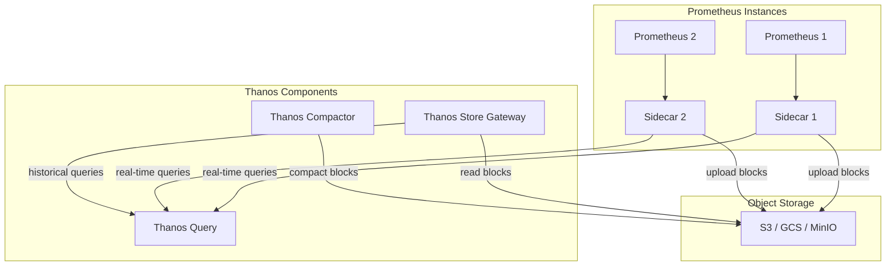

# How to Configure Storage Backend for Prometheus

Author: [nawazdhandala](https://www.github.com/nawazdhandala)

Tags: Prometheus, Storage, TSDB, Remote Storage, Long-term Retention, Metrics Storage, Performance Tuning, Observability

Description: A comprehensive guide to configuring Prometheus storage backends. Learn about local TSDB tuning, remote write configurations, and integrating with long-term storage solutions like Thanos, Cortex, and VictoriaMetrics.

---

## Understanding Prometheus Storage Architecture

Prometheus uses a custom time-series database (TSDB) optimized for metrics storage. Understanding how this storage works helps you make informed decisions about retention, performance, and scaling.

The TSDB stores data in blocks, where each block contains samples for a specific time range. By default, Prometheus creates 2-hour blocks that get compacted over time into larger blocks for efficient querying.

## Local Storage Configuration

The simplest storage setup uses Prometheus's built-in local storage. Configure it through command-line flags when starting Prometheus.

```bash
# Start Prometheus with custom storage settings
prometheus \
  --config.file=/etc/prometheus/prometheus.yml \
  --storage.tsdb.path=/var/lib/prometheus/data \
  --storage.tsdb.retention.time=30d \
  --storage.tsdb.retention.size=50GB \
  --storage.tsdb.min-block-duration=2h \
  --storage.tsdb.max-block-duration=24h \
  --storage.tsdb.wal-compression
```

### Key Storage Flags Explained

```yaml
# Docker Compose example with storage configuration
version: '3.8'
services:
  prometheus:
    image: prom/prometheus:latest
    command:
      # Path where Prometheus stores its data
      - '--storage.tsdb.path=/prometheus'
      # Keep data for 15 days
      - '--storage.tsdb.retention.time=15d'
      # Or limit by size (uses whichever limit is hit first)
      - '--storage.tsdb.retention.size=100GB'
      # Enable WAL compression to reduce disk I/O
      - '--storage.tsdb.wal-compression'
      # Allow out-of-order samples (useful for remote write scenarios)
      - '--storage.tsdb.out-of-order-time-window=30m'
    volumes:
      - prometheus_data:/prometheus
    ports:
      - "9090:9090"

volumes:
  prometheus_data:
    driver: local
```

## Calculating Storage Requirements

Estimate your storage needs based on your scrape configuration:

```python
# storage_calculator.py - Estimate Prometheus storage requirements

def calculate_storage(
    num_targets: int,
    metrics_per_target: int,
    scrape_interval_seconds: int,
    retention_days: int,
    bytes_per_sample: float = 1.5  # Average after compression
) -> dict:
    """
    Calculate estimated storage requirements for Prometheus.

    Args:
        num_targets: Number of scrape targets
        metrics_per_target: Average metrics exposed per target
        scrape_interval_seconds: Scrape interval in seconds
        retention_days: Data retention period in days
        bytes_per_sample: Bytes per sample (1-2 bytes typical)
    """
    # Calculate samples per day
    samples_per_day_per_metric = (24 * 60 * 60) / scrape_interval_seconds
    total_metrics = num_targets * metrics_per_target
    samples_per_day = total_metrics * samples_per_day_per_metric

    # Calculate total samples over retention period
    total_samples = samples_per_day * retention_days

    # Calculate storage in various units
    storage_bytes = total_samples * bytes_per_sample
    storage_gb = storage_bytes / (1024 ** 3)

    return {
        "total_metrics": total_metrics,
        "samples_per_day": int(samples_per_day),
        "total_samples": int(total_samples),
        "estimated_storage_gb": round(storage_gb, 2),
        "recommended_disk_gb": round(storage_gb * 1.3, 2)  # 30% headroom
    }

# Example calculation
result = calculate_storage(
    num_targets=100,
    metrics_per_target=500,
    scrape_interval_seconds=15,
    retention_days=30
)

print(f"Total metrics: {result['total_metrics']:,}")
print(f"Samples per day: {result['samples_per_day']:,}")
print(f"Estimated storage: {result['estimated_storage_gb']} GB")
print(f"Recommended disk: {result['recommended_disk_gb']} GB")
```

## Remote Write Configuration

For long-term storage and high availability, configure Prometheus to send data to a remote storage system.

```yaml
# prometheus.yml - Remote write configuration
global:
  scrape_interval: 15s
  evaluation_interval: 15s

remote_write:
  # Primary remote storage endpoint
  - url: "http://remote-storage:9090/api/v1/write"
    # Queue configuration for buffering during outages
    queue_config:
      capacity: 10000
      max_shards: 50
      min_shards: 1
      max_samples_per_send: 5000
      batch_send_deadline: 5s
      min_backoff: 30ms
      max_backoff: 5s
      retry_on_http_429: true
    # Filter which metrics to send
    write_relabel_configs:
      # Only send metrics with specific prefix
      - source_labels: [__name__]
        regex: 'important_.*'
        action: keep
      # Drop high-cardinality labels before sending
      - regex: 'instance_id'
        action: labeldrop

  # Secondary remote storage for redundancy
  - url: "http://backup-storage:9090/api/v1/write"
    queue_config:
      capacity: 5000
      max_shards: 10
```

## Configuring Remote Write for VictoriaMetrics

VictoriaMetrics is a popular long-term storage solution that is compatible with Prometheus remote write.

```yaml
# prometheus.yml - VictoriaMetrics remote write
remote_write:
  - url: "http://victoriametrics:8428/api/v1/write"
    queue_config:
      max_samples_per_send: 10000
      capacity: 20000
      max_shards: 30
    # Optional: send metadata for metric descriptions
    metadata_config:
      send: true
      send_interval: 1m

# Docker Compose with VictoriaMetrics
version: '3.8'
services:
  victoriametrics:
    image: victoriametrics/victoria-metrics:latest
    command:
      # Retention period
      - '-retentionPeriod=1y'
      # Storage path
      - '-storageDataPath=/storage'
      # Enable deduplication for HA setups
      - '-dedup.minScrapeInterval=15s'
    volumes:
      - vm_data:/storage
    ports:
      - "8428:8428"

  prometheus:
    image: prom/prometheus:latest
    volumes:
      - ./prometheus.yml:/etc/prometheus/prometheus.yml
    command:
      - '--config.file=/etc/prometheus/prometheus.yml'
      - '--storage.tsdb.retention.time=2d'  # Short local retention
    depends_on:
      - victoriametrics

volumes:
  vm_data:
```

## Remote Read Configuration

Enable remote read to query historical data from long-term storage:

```yaml
# prometheus.yml - Remote read configuration
remote_read:
  - url: "http://remote-storage:9090/api/v1/read"
    # Read timeout
    read_recent: false  # Don't use remote for recent data (use local)
    # Filter which queries go to remote storage
    required_matchers:
      job: important_service
```

## Storage Architecture with Thanos

Thanos extends Prometheus for unlimited retention and global querying. Here is a typical setup:



### Thanos Sidecar Configuration

```yaml
# docker-compose-thanos.yml
version: '3.8'
services:
  prometheus:
    image: prom/prometheus:latest
    command:
      - '--config.file=/etc/prometheus/prometheus.yml'
      - '--storage.tsdb.path=/prometheus'
      - '--storage.tsdb.retention.time=2d'
      # Required for Thanos sidecar
      - '--storage.tsdb.min-block-duration=2h'
      - '--storage.tsdb.max-block-duration=2h'
      - '--web.enable-lifecycle'
    volumes:
      - prometheus_data:/prometheus
      - ./prometheus.yml:/etc/prometheus/prometheus.yml

  thanos-sidecar:
    image: quay.io/thanos/thanos:latest
    command:
      - sidecar
      - '--tsdb.path=/prometheus'
      - '--prometheus.url=http://prometheus:9090'
      - '--objstore.config-file=/etc/thanos/bucket.yml'
      - '--grpc-address=0.0.0.0:10901'
    volumes:
      - prometheus_data:/prometheus:ro
      - ./bucket.yml:/etc/thanos/bucket.yml
    depends_on:
      - prometheus

  thanos-query:
    image: quay.io/thanos/thanos:latest
    command:
      - query
      - '--store=thanos-sidecar:10901'
      - '--store=thanos-store:10901'
      - '--http-address=0.0.0.0:9090'
    ports:
      - "19090:9090"

  thanos-store:
    image: quay.io/thanos/thanos:latest
    command:
      - store
      - '--objstore.config-file=/etc/thanos/bucket.yml'
      - '--data-dir=/var/thanos/store'
    volumes:
      - ./bucket.yml:/etc/thanos/bucket.yml
      - thanos_store:/var/thanos/store

volumes:
  prometheus_data:
  thanos_store:
```

### Object Storage Configuration

```yaml
# bucket.yml - S3 compatible storage
type: S3
config:
  bucket: "prometheus-metrics"
  endpoint: "s3.amazonaws.com"
  region: "us-east-1"
  access_key: "${AWS_ACCESS_KEY_ID}"
  secret_key: "${AWS_SECRET_ACCESS_KEY}"
  insecure: false
  signature_version2: false
```

## Performance Tuning

Optimize Prometheus storage performance with these settings:

```yaml
# prometheus.yml - Performance tuning
global:
  scrape_interval: 15s
  scrape_timeout: 10s

storage:
  tsdb:
    # Increase chunk encoding efficiency
    out_of_order_time_window: 30m

# Kubernetes deployment with resource tuning
apiVersion: apps/v1
kind: StatefulSet
metadata:
  name: prometheus
spec:
  template:
    spec:
      containers:
        - name: prometheus
          resources:
            requests:
              memory: "4Gi"
              cpu: "2"
            limits:
              memory: "8Gi"
              cpu: "4"
          args:
            - '--storage.tsdb.path=/prometheus'
            - '--storage.tsdb.retention.time=15d'
            - '--storage.tsdb.wal-compression'
            # Memory-mapped chunks for faster queries
            - '--storage.tsdb.head-chunks-write-queue-size=1000'
      volumes:
        - name: prometheus-storage
          persistentVolumeClaim:
            claimName: prometheus-pvc
---
apiVersion: v1
kind: PersistentVolumeClaim
metadata:
  name: prometheus-pvc
spec:
  accessModes:
    - ReadWriteOnce
  storageClassName: fast-ssd  # Use SSD storage class
  resources:
    requests:
      storage: 100Gi
```

## Monitoring Storage Health

Create alerts for storage-related issues:

```yaml
# alerting_rules.yml - Storage health alerts
groups:
  - name: prometheus_storage
    rules:
      # Alert when storage is filling up
      - alert: PrometheusStorageFillingUp
        expr: |
          (prometheus_tsdb_storage_blocks_bytes /
           prometheus_tsdb_retention_limit_bytes) > 0.8
        for: 15m
        labels:
          severity: warning
        annotations:
          summary: "Prometheus storage is 80% full"

      # Alert on high WAL corruption
      - alert: PrometheusWALCorruption
        expr: increase(prometheus_tsdb_wal_corruptions_total[1h]) > 0
        labels:
          severity: critical
        annotations:
          summary: "Prometheus WAL corruption detected"

      # Alert on compaction failures
      - alert: PrometheusCompactionsFailing
        expr: increase(prometheus_tsdb_compactions_failed_total[1h]) > 0
        for: 15m
        labels:
          severity: warning
        annotations:
          summary: "Prometheus compactions are failing"

      # Alert on remote write failures
      - alert: PrometheusRemoteWriteFailures
        expr: |
          rate(prometheus_remote_storage_failed_samples_total[5m]) > 0
        for: 15m
        labels:
          severity: warning
        annotations:
          summary: "Prometheus remote write is failing"
```

## Best Practices

1. **Use SSDs**: Prometheus performs many small random I/O operations. SSDs significantly improve performance.

2. **Size retention appropriately**: Keep local retention short (2-15 days) when using remote storage for long-term data.

3. **Enable WAL compression**: Reduces disk I/O with minimal CPU overhead.

4. **Monitor storage metrics**: Set up alerts for storage capacity, WAL health, and compaction status.

5. **Plan for growth**: Calculate storage requirements before deployment and monitor actual usage trends.

6. **Use remote write for durability**: Local storage alone risks data loss during failures.

## Conclusion

Prometheus storage configuration depends on your retention requirements, query patterns, and infrastructure constraints. For short-term monitoring, local TSDB with appropriate retention settings works well. For long-term storage and high availability, integrate remote storage solutions like VictoriaMetrics, Thanos, or Cortex. Monitor your storage health and plan capacity based on your metric cardinality and scrape frequency.
