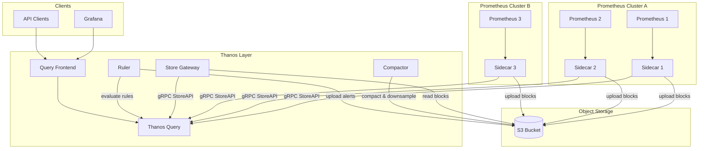

# How to Configure Thanos with Prometheus

Author: [nawazdhandala](https://www.github.com/nawazdhandala)

Tags: Prometheus, Thanos, Long-term Storage, High Availability, Global View, Object Storage, Kubernetes, Observability

Description: A complete guide to configuring Thanos with Prometheus for unlimited retention, global querying, and high availability. Learn how to set up Thanos components including Sidecar, Query, Store Gateway, Compactor, and Ruler.

---

## What Is Thanos?

Thanos is a set of components that extend Prometheus for long-term storage, high availability, and global querying across multiple Prometheus instances. It solves common Prometheus scaling challenges without replacing Prometheus itself.

Key capabilities include:

- **Unlimited retention**: Store metrics in object storage (S3, GCS, Azure Blob)
- **Global query view**: Query metrics across multiple Prometheus instances
- **High availability**: Deduplicate data from redundant Prometheus servers
- **Downsampling**: Reduce storage costs for historical data
- **Cross-cluster queries**: Aggregate metrics from different environments

## Thanos Architecture Overview



## Setting Up Object Storage

First, configure the object storage backend. Create a bucket configuration file that Thanos components will use.

```yaml
# bucket.yml - S3 configuration
type: S3
config:
  bucket: "thanos-metrics"
  endpoint: "s3.us-east-1.amazonaws.com"
  region: "us-east-1"
  access_key: "${AWS_ACCESS_KEY_ID}"
  secret_key: "${AWS_SECRET_ACCESS_KEY}"
  insecure: false
  signature_version2: false
  # Optional: Use IAM role instead of credentials
  # aws_sdk_auth: true
  sse_config:
    type: "SSE-S3"
```

```yaml
# bucket.yml - GCS configuration
type: GCS
config:
  bucket: "thanos-metrics"
  service_account: "/var/secrets/gcs-service-account.json"
```

```yaml
# bucket.yml - MinIO (S3-compatible) for on-premises
type: S3
config:
  bucket: "thanos-metrics"
  endpoint: "minio.storage.svc.cluster.local:9000"
  access_key: "minio-access-key"
  secret_key: "minio-secret-key"
  insecure: true  # Set to false with TLS
  signature_version2: false
```

## Configuring Prometheus for Thanos

Prometheus needs specific settings to work with Thanos Sidecar:

```yaml
# prometheus.yml - Prometheus configuration for Thanos
global:
  scrape_interval: 15s
  evaluation_interval: 15s
  # External labels are REQUIRED for Thanos deduplication
  external_labels:
    cluster: "production-us-east"
    replica: "0"  # Different for each HA replica

scrape_configs:
  - job_name: 'prometheus'
    static_configs:
      - targets: ['localhost:9090']

  # Your other scrape configs here
```

```bash
# Start Prometheus with Thanos-compatible settings
prometheus \
  --config.file=/etc/prometheus/prometheus.yml \
  --storage.tsdb.path=/prometheus \
  --storage.tsdb.retention.time=2d \
  --storage.tsdb.min-block-duration=2h \
  --storage.tsdb.max-block-duration=2h \
  --web.enable-lifecycle \
  --web.enable-admin-api
```

The critical settings are:
- `min-block-duration` and `max-block-duration` must be equal (typically 2h) so Thanos can upload complete blocks
- `retention.time` can be short since Thanos handles long-term storage
- External labels must uniquely identify each Prometheus instance

## Deploying Thanos Sidecar

The Sidecar runs alongside Prometheus and uploads blocks to object storage:

```yaml
# kubernetes/thanos-sidecar.yaml
apiVersion: apps/v1
kind: StatefulSet
metadata:
  name: prometheus
  namespace: monitoring
spec:
  serviceName: prometheus
  replicas: 2
  selector:
    matchLabels:
      app: prometheus
  template:
    metadata:
      labels:
        app: prometheus
    spec:
      containers:
        # Prometheus container
        - name: prometheus
          image: prom/prometheus:v2.45.0
          args:
            - '--config.file=/etc/prometheus/prometheus.yml'
            - '--storage.tsdb.path=/prometheus'
            - '--storage.tsdb.retention.time=2d'
            - '--storage.tsdb.min-block-duration=2h'
            - '--storage.tsdb.max-block-duration=2h'
            - '--web.enable-lifecycle'
            - '--web.enable-admin-api'
          ports:
            - containerPort: 9090
          volumeMounts:
            - name: prometheus-storage
              mountPath: /prometheus
            - name: prometheus-config
              mountPath: /etc/prometheus

        # Thanos Sidecar container
        - name: thanos-sidecar
          image: quay.io/thanos/thanos:v0.32.0
          args:
            - sidecar
            - '--tsdb.path=/prometheus'
            - '--prometheus.url=http://localhost:9090'
            - '--objstore.config-file=/etc/thanos/bucket.yml'
            - '--grpc-address=0.0.0.0:10901'
            - '--http-address=0.0.0.0:10902'
          ports:
            - name: grpc
              containerPort: 10901
            - name: http
              containerPort: 10902
          volumeMounts:
            - name: prometheus-storage
              mountPath: /prometheus
              readOnly: false
            - name: thanos-config
              mountPath: /etc/thanos

      volumes:
        - name: prometheus-config
          configMap:
            name: prometheus-config
        - name: thanos-config
          secret:
            secretName: thanos-bucket-config

  volumeClaimTemplates:
    - metadata:
        name: prometheus-storage
      spec:
        accessModes: ["ReadWriteOnce"]
        storageClassName: fast-ssd
        resources:
          requests:
            storage: 50Gi
---
apiVersion: v1
kind: Service
metadata:
  name: prometheus-sidecar
  namespace: monitoring
spec:
  selector:
    app: prometheus
  ports:
    - name: grpc
      port: 10901
      targetPort: 10901
  clusterIP: None  # Headless for discovery
```

## Deploying Thanos Query

Thanos Query provides a unified query interface across all data sources:

```yaml
# kubernetes/thanos-query.yaml
apiVersion: apps/v1
kind: Deployment
metadata:
  name: thanos-query
  namespace: monitoring
spec:
  replicas: 2
  selector:
    matchLabels:
      app: thanos-query
  template:
    metadata:
      labels:
        app: thanos-query
    spec:
      containers:
        - name: thanos-query
          image: quay.io/thanos/thanos:v0.32.0
          args:
            - query
            # Connect to sidecars for recent data
            - '--store=dnssrv+_grpc._tcp.prometheus-sidecar.monitoring.svc.cluster.local'
            # Connect to Store Gateway for historical data
            - '--store=dnssrv+_grpc._tcp.thanos-store.monitoring.svc.cluster.local'
            # Enable deduplication
            - '--query.replica-label=replica'
            # Auto-downsampling for long time ranges
            - '--query.auto-downsampling'
            - '--http-address=0.0.0.0:9090'
            - '--grpc-address=0.0.0.0:10901'
          ports:
            - name: http
              containerPort: 9090
            - name: grpc
              containerPort: 10901
          livenessProbe:
            httpGet:
              path: /-/healthy
              port: http
          readinessProbe:
            httpGet:
              path: /-/ready
              port: http
---
apiVersion: v1
kind: Service
metadata:
  name: thanos-query
  namespace: monitoring
spec:
  selector:
    app: thanos-query
  ports:
    - name: http
      port: 9090
      targetPort: 9090
    - name: grpc
      port: 10901
      targetPort: 10901
```

## Deploying Thanos Store Gateway

The Store Gateway serves historical data from object storage:

```yaml
# kubernetes/thanos-store.yaml
apiVersion: apps/v1
kind: StatefulSet
metadata:
  name: thanos-store
  namespace: monitoring
spec:
  serviceName: thanos-store
  replicas: 2
  selector:
    matchLabels:
      app: thanos-store
  template:
    metadata:
      labels:
        app: thanos-store
    spec:
      containers:
        - name: thanos-store
          image: quay.io/thanos/thanos:v0.32.0
          args:
            - store
            - '--objstore.config-file=/etc/thanos/bucket.yml'
            - '--data-dir=/var/thanos/store'
            - '--grpc-address=0.0.0.0:10901'
            - '--http-address=0.0.0.0:10902'
            # Index cache for faster queries
            - '--index-cache-size=500MB'
            # Chunk pool for memory efficiency
            - '--chunk-pool-size=2GB'
          ports:
            - name: grpc
              containerPort: 10901
            - name: http
              containerPort: 10902
          volumeMounts:
            - name: data
              mountPath: /var/thanos/store
            - name: thanos-config
              mountPath: /etc/thanos
          resources:
            requests:
              memory: "4Gi"
              cpu: "1"
            limits:
              memory: "8Gi"
              cpu: "2"

      volumes:
        - name: thanos-config
          secret:
            secretName: thanos-bucket-config

  volumeClaimTemplates:
    - metadata:
        name: data
      spec:
        accessModes: ["ReadWriteOnce"]
        storageClassName: fast-ssd
        resources:
          requests:
            storage: 20Gi
---
apiVersion: v1
kind: Service
metadata:
  name: thanos-store
  namespace: monitoring
spec:
  selector:
    app: thanos-store
  ports:
    - name: grpc
      port: 10901
      targetPort: 10901
  clusterIP: None
```

## Deploying Thanos Compactor

The Compactor handles block compaction and downsampling:

```yaml
# kubernetes/thanos-compactor.yaml
apiVersion: apps/v1
kind: StatefulSet
metadata:
  name: thanos-compactor
  namespace: monitoring
spec:
  serviceName: thanos-compactor
  replicas: 1  # Must be singleton
  selector:
    matchLabels:
      app: thanos-compactor
  template:
    metadata:
      labels:
        app: thanos-compactor
    spec:
      containers:
        - name: thanos-compactor
          image: quay.io/thanos/thanos:v0.32.0
          args:
            - compact
            - '--objstore.config-file=/etc/thanos/bucket.yml'
            - '--data-dir=/var/thanos/compact'
            - '--http-address=0.0.0.0:10902'
            # Enable downsampling
            - '--downsampling.disable=false'
            # Retention policies
            - '--retention.resolution-raw=30d'
            - '--retention.resolution-5m=90d'
            - '--retention.resolution-1h=365d'
            # Wait interval between compaction cycles
            - '--wait'
            - '--wait-interval=5m'
          ports:
            - name: http
              containerPort: 10902
          volumeMounts:
            - name: data
              mountPath: /var/thanos/compact
            - name: thanos-config
              mountPath: /etc/thanos
          resources:
            requests:
              memory: "2Gi"
              cpu: "500m"
            limits:
              memory: "4Gi"
              cpu: "1"

      volumes:
        - name: thanos-config
          secret:
            secretName: thanos-bucket-config

  volumeClaimTemplates:
    - metadata:
        name: data
      spec:
        accessModes: ["ReadWriteOnce"]
        storageClassName: standard
        resources:
          requests:
            storage: 100Gi
```

## Deploying Query Frontend

The Query Frontend caches and splits queries for better performance:

```yaml
# kubernetes/thanos-query-frontend.yaml
apiVersion: apps/v1
kind: Deployment
metadata:
  name: thanos-query-frontend
  namespace: monitoring
spec:
  replicas: 2
  selector:
    matchLabels:
      app: thanos-query-frontend
  template:
    metadata:
      labels:
        app: thanos-query-frontend
    spec:
      containers:
        - name: thanos-query-frontend
          image: quay.io/thanos/thanos:v0.32.0
          args:
            - query-frontend
            - '--http-address=0.0.0.0:9090'
            - '--query-frontend.downstream-url=http://thanos-query:9090'
            # Split long queries
            - '--query-range.split-interval=24h'
            # Cache query results
            - '--query-range.max-retries-per-request=3'
            - '--query-frontend.log-queries-longer-than=5s'
          ports:
            - name: http
              containerPort: 9090
---
apiVersion: v1
kind: Service
metadata:
  name: thanos-query-frontend
  namespace: monitoring
spec:
  selector:
    app: thanos-query-frontend
  ports:
    - name: http
      port: 9090
      targetPort: 9090
```

## Docker Compose Setup for Development

For local development and testing:

```yaml
# docker-compose.yml
version: '3.8'

services:
  minio:
    image: minio/minio:latest
    command: server /data --console-address ":9001"
    environment:
      MINIO_ROOT_USER: thanos
      MINIO_ROOT_PASSWORD: thanospass
    ports:
      - "9000:9000"
      - "9001:9001"
    volumes:
      - minio_data:/data

  createbucket:
    image: minio/mc:latest
    depends_on:
      - minio
    entrypoint: >
      /bin/sh -c "
      sleep 5;
      mc alias set myminio http://minio:9000 thanos thanospass;
      mc mb myminio/thanos-data --ignore-existing;
      exit 0;
      "

  prometheus:
    image: prom/prometheus:latest
    command:
      - '--config.file=/etc/prometheus/prometheus.yml'
      - '--storage.tsdb.path=/prometheus'
      - '--storage.tsdb.retention.time=2d'
      - '--storage.tsdb.min-block-duration=2h'
      - '--storage.tsdb.max-block-duration=2h'
      - '--web.enable-lifecycle'
      - '--web.enable-admin-api'
    volumes:
      - ./prometheus.yml:/etc/prometheus/prometheus.yml
      - prometheus_data:/prometheus
    ports:
      - "9090:9090"

  thanos-sidecar:
    image: quay.io/thanos/thanos:latest
    command:
      - sidecar
      - '--tsdb.path=/prometheus'
      - '--prometheus.url=http://prometheus:9090'
      - '--objstore.config-file=/etc/thanos/bucket.yml'
      - '--grpc-address=0.0.0.0:10901'
    volumes:
      - prometheus_data:/prometheus:ro
      - ./bucket.yml:/etc/thanos/bucket.yml
    depends_on:
      - prometheus
      - createbucket

  thanos-query:
    image: quay.io/thanos/thanos:latest
    command:
      - query
      - '--store=thanos-sidecar:10901'
      - '--store=thanos-store:10901'
      - '--http-address=0.0.0.0:9090'
    ports:
      - "19090:9090"
    depends_on:
      - thanos-sidecar

  thanos-store:
    image: quay.io/thanos/thanos:latest
    command:
      - store
      - '--objstore.config-file=/etc/thanos/bucket.yml'
      - '--data-dir=/var/thanos/store'
    volumes:
      - ./bucket.yml:/etc/thanos/bucket.yml
      - thanos_store:/var/thanos/store
    depends_on:
      - createbucket

  thanos-compactor:
    image: quay.io/thanos/thanos:latest
    command:
      - compact
      - '--objstore.config-file=/etc/thanos/bucket.yml'
      - '--data-dir=/var/thanos/compact'
      - '--wait'
    volumes:
      - ./bucket.yml:/etc/thanos/bucket.yml
      - thanos_compact:/var/thanos/compact
    depends_on:
      - createbucket

volumes:
  minio_data:
  prometheus_data:
  thanos_store:
  thanos_compact:
```

## Monitoring Thanos Components

Set up alerts for Thanos health:

```yaml
# thanos_alerts.yml
groups:
  - name: thanos
    rules:
      - alert: ThanosSidecarUnhealthy
        expr: thanos_sidecar_prometheus_up == 0
        for: 5m
        labels:
          severity: critical
        annotations:
          summary: "Thanos Sidecar cannot reach Prometheus"

      - alert: ThanosCompactHalted
        expr: thanos_compact_halted == 1
        for: 5m
        labels:
          severity: critical
        annotations:
          summary: "Thanos Compactor has halted"

      - alert: ThanosStoreGrpcErrors
        expr: |
          rate(grpc_server_handled_total{
            job=~".*thanos-store.*",
            grpc_code!="OK"
          }[5m]) > 0
        for: 5m
        labels:
          severity: warning
        annotations:
          summary: "Thanos Store experiencing gRPC errors"
```

## Best Practices

1. **Use external labels wisely**: They drive deduplication, so ensure unique identification across all Prometheus instances.

2. **Size the Compactor appropriately**: It needs significant disk space for compaction operations.

3. **Enable downsampling**: Reduces storage costs for data older than a few weeks.

4. **Use Query Frontend**: Caching and query splitting improve performance significantly.

5. **Monitor object storage costs**: Large deployments can generate significant storage and request costs.

## Conclusion

Thanos transforms Prometheus into a scalable, highly available monitoring platform with unlimited retention. By deploying the core components (Sidecar, Query, Store Gateway, Compactor), you gain global querying, deduplication, and cost-effective long-term storage. Start with a simple setup and add components like Query Frontend and Ruler as your needs grow.
