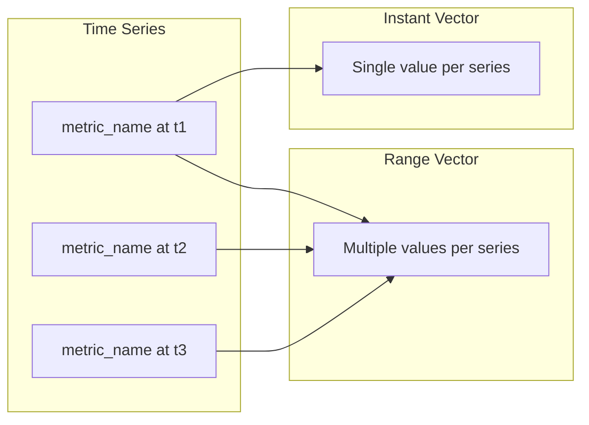

# How to Write PromQL Queries for Alerting

Author: [nawazdhandala](https://www.github.com/nawazdhandala)

Tags: Prometheus, PromQL, Alerting, Monitoring, SRE, Observability, Metrics

Description: Learn how to write effective PromQL queries for alerting, covering rate calculations, aggregations, histogram percentiles, and patterns for reducing alert noise while catching real issues.

---

Writing good alerting queries is harder than it looks. A poorly written query either fires too often (alert fatigue) or misses real incidents. This guide covers PromQL patterns that produce reliable, actionable alerts.

## PromQL Fundamentals for Alerting

Before writing alert queries, you need to understand how Prometheus handles time series data:



### Instant vs Range Vectors

Instant vectors return the most recent value for each time series:

```promql
# Instant vector - current value
http_requests_total
```

Range vectors return multiple samples over a time range:

```promql
# Range vector - last 5 minutes of samples
http_requests_total[5m]
```

Alert expressions must evaluate to instant vectors. You cannot alert directly on range vectors.

## Rate and Increase Functions

Raw counters always go up. Use `rate()` or `increase()` to get meaningful values:

```promql
# Calculate requests per second over 5 minutes
rate(http_requests_total[5m])

# Calculate total increase over 5 minutes
increase(http_requests_total[5m])
```

### Choosing the Right Time Window

The time window affects query sensitivity:

```promql
# Short window (1m) - sensitive to spikes, more volatile
rate(http_requests_total[1m])

# Medium window (5m) - balanced sensitivity
rate(http_requests_total[5m])

# Long window (15m) - smooths out spikes, slower to detect issues
rate(http_requests_total[15m])
```

For alerting, use windows that are at least 4x your scrape interval:

```promql
# With 15s scrape interval, use at least 1m window
# With 30s scrape interval, use at least 2m window
rate(http_requests_total[2m])
```

## Error Rate Alerts

The most common alert pattern tracks error rates:

```promql
# Error rate as a percentage
100 * (
  sum(rate(http_requests_total{status=~"5.."}[5m]))
  /
  sum(rate(http_requests_total[5m]))
)
```

Add a minimum request threshold to avoid alerts during low traffic:

```promql
# Only alert if error rate > 5% AND request rate > 10 rps
(
  sum(rate(http_requests_total{status=~"5.."}[5m]))
  /
  sum(rate(http_requests_total[5m]))
) > 0.05
and
sum(rate(http_requests_total[5m])) > 10
```

### By Service or Endpoint

Break down error rates by dimension:

```promql
# Error rate per service
sum by (service) (rate(http_requests_total{status=~"5.."}[5m]))
/
sum by (service) (rate(http_requests_total[5m]))
> 0.05

# Error rate per endpoint (be careful with cardinality)
sum by (service, endpoint) (rate(http_requests_total{status=~"5.."}[5m]))
/
sum by (service, endpoint) (rate(http_requests_total[5m]))
> 0.10
```

## Latency Alerts with Histograms

Histograms track request duration distributions. Use `histogram_quantile()` for percentile calculations:

```promql
# 95th percentile latency
histogram_quantile(0.95,
  sum by (le) (rate(http_request_duration_seconds_bucket[5m]))
)

# 99th percentile latency per service
histogram_quantile(0.99,
  sum by (service, le) (rate(http_request_duration_seconds_bucket[5m]))
)
```

### Alert on High Latency

```promql
# Alert when p95 latency exceeds 500ms
histogram_quantile(0.95,
  sum by (le) (rate(http_request_duration_seconds_bucket[5m]))
) > 0.5

# Alert when p99 latency exceeds 1 second for any service
histogram_quantile(0.99,
  sum by (service, le) (rate(http_request_duration_seconds_bucket[5m]))
) > 1
```

## Availability and Uptime

Track service availability using probe or heartbeat metrics:

```promql
# Probe success rate
avg_over_time(probe_success[5m]) < 0.9

# Service availability across instances
(
  count(up{job="my-service"} == 1)
  /
  count(up{job="my-service"})
) < 0.5
```

### Instance Down Alert

```promql
# Alert if instance has been down for more than 5 minutes
up{job="my-service"} == 0
```

This expression is commonly used with `for` duration in alert rules:

```yaml
# In alert rule, waits 5 minutes before firing
for: 5m
```

## Resource Utilization Alerts

### CPU Usage

```promql
# CPU usage percentage per pod
100 * (
  sum by (pod) (rate(container_cpu_usage_seconds_total{container!=""}[5m]))
  /
  sum by (pod) (kube_pod_container_resource_limits{resource="cpu"})
) > 80

# CPU throttling
sum by (pod) (rate(container_cpu_cfs_throttled_seconds_total[5m]))
/
sum by (pod) (rate(container_cpu_cfs_periods_total[5m]))
> 0.25
```

### Memory Usage

```promql
# Memory usage percentage
100 * (
  sum by (pod) (container_memory_usage_bytes{container!=""})
  /
  sum by (pod) (kube_pod_container_resource_limits{resource="memory"})
) > 85

# Memory approaching limit (within 100MB)
(
  sum by (pod) (kube_pod_container_resource_limits{resource="memory"})
  -
  sum by (pod) (container_memory_usage_bytes{container!=""})
) < 100 * 1024 * 1024
```

### Disk Usage

```promql
# Disk usage percentage
100 * (
  1 - (
    node_filesystem_avail_bytes{mountpoint="/"}
    /
    node_filesystem_size_bytes{mountpoint="/"}
  )
) > 80

# Predict disk full within 24 hours
predict_linear(node_filesystem_avail_bytes{mountpoint="/"}[6h], 24*60*60) < 0
```

## Aggregation Patterns

### Absent Metrics

Alert when expected metrics disappear:

```promql
# Alert if no metrics received from job
absent(up{job="critical-service"})

# Alert if specific metric is missing
absent(http_requests_total{job="api-server"})
```

### Threshold Crossing

```promql
# Queue depth too high
sum(queue_depth{job="worker"}) > 1000

# Too many pending jobs
sum(pending_jobs) > 100
for: 10m
```

### Rate of Change

```promql
# Sudden spike in errors (2x normal rate)
rate(errors_total[5m]) > 2 * avg_over_time(rate(errors_total[5m])[1h:5m])

# Rapid memory growth
deriv(process_resident_memory_bytes[5m]) > 10 * 1024 * 1024
```

## Multi-Window Alerts for SLOs

Catch both slow burns and fast burns with multiple windows:

```promql
# Fast burn: high error rate in short window
(
  sum(rate(http_requests_total{status=~"5.."}[5m]))
  /
  sum(rate(http_requests_total[5m]))
) > 0.10

or

# Slow burn: moderate error rate sustained over longer period
(
  sum(rate(http_requests_total{status=~"5.."}[1h]))
  /
  sum(rate(http_requests_total[1h]))
) > 0.02
```

## Practical Alert Examples

### Complete Alert Rule File

```yaml
# alerts.yaml
groups:
  - name: application-alerts
    rules:
      # High error rate alert
      - alert: HighErrorRate
        expr: |
          (
            sum by (service) (rate(http_requests_total{status=~"5.."}[5m]))
            /
            sum by (service) (rate(http_requests_total[5m]))
          ) > 0.05
        for: 5m
        labels:
          severity: critical
        annotations:
          summary: "High error rate on {{ $labels.service }}"
          description: "Error rate is {{ printf \"%.2f\" $value }}% for {{ $labels.service }}"

      # High latency alert
      - alert: HighLatency
        expr: |
          histogram_quantile(0.95,
            sum by (service, le) (rate(http_request_duration_seconds_bucket[5m]))
          ) > 0.5
        for: 5m
        labels:
          severity: warning
        annotations:
          summary: "High latency on {{ $labels.service }}"
          description: "95th percentile latency is {{ printf \"%.3f\" $value }}s"

      # Service down alert
      - alert: ServiceDown
        expr: up{job=~"api-.*"} == 0
        for: 2m
        labels:
          severity: critical
        annotations:
          summary: "Service {{ $labels.job }} is down"
          description: "Instance {{ $labels.instance }} has been down for more than 2 minutes"

      # Memory pressure alert
      - alert: HighMemoryUsage
        expr: |
          100 * (
            sum by (pod) (container_memory_usage_bytes{container!=""})
            /
            sum by (pod) (kube_pod_container_resource_limits{resource="memory"})
          ) > 85
        for: 10m
        labels:
          severity: warning
        annotations:
          summary: "High memory usage on {{ $labels.pod }}"
          description: "Memory usage is {{ printf \"%.1f\" $value }}%"
```

## Testing Queries

Before deploying alerts, test queries in the Prometheus UI:

```bash
# Port forward to Prometheus
kubectl port-forward -n monitoring svc/prometheus 9090:9090
```

Use the expression browser to:
1. Run the query and verify it returns expected results
2. Check the number of time series returned
3. Graph the expression over time to see behavior

## Best Practices

1. **Use `for` durations** - Prevent flapping by requiring conditions to persist
2. **Include context in annotations** - Use template variables like `{{ $labels.service }}`
3. **Set appropriate severity levels** - Not everything is critical
4. **Test with real data** - Validate queries return expected series
5. **Avoid high cardinality** - Don't alert on individual request IDs or user IDs
6. **Add minimum thresholds** - Avoid percentage-based alerts during low traffic

---

Good PromQL queries balance sensitivity with stability. Start with simple expressions, add filters and aggregations as needed, and always test with historical data before enabling alerts in production.
