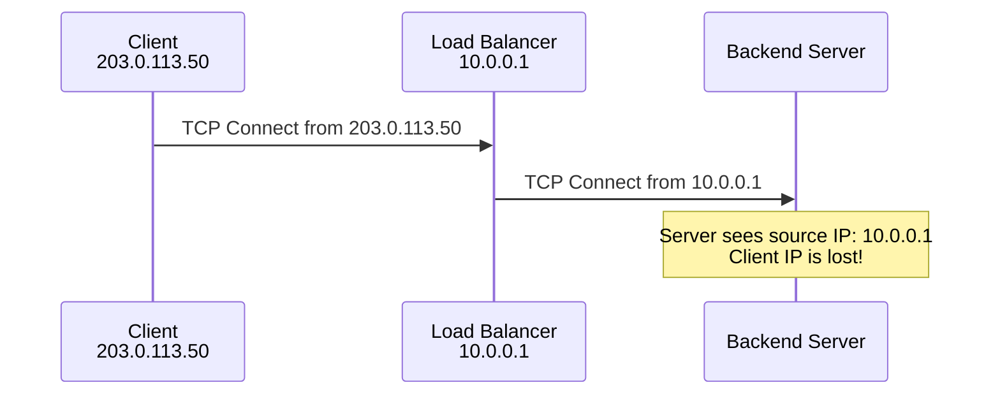
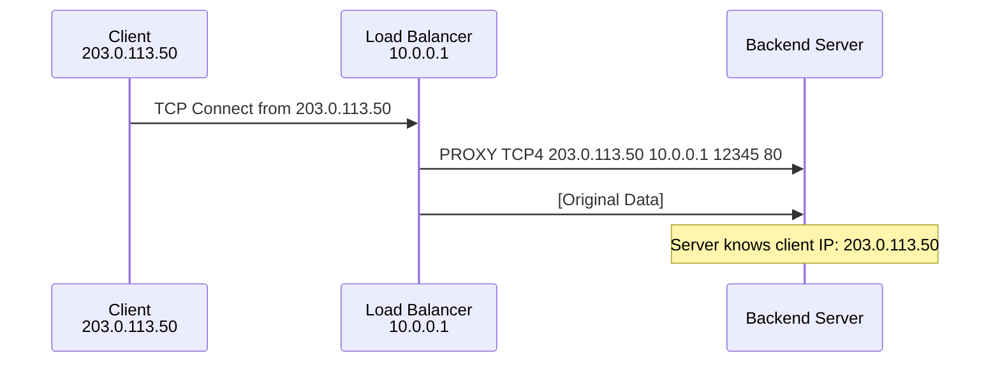

# How to Configure Proxy Protocol

Author: [nawazdhandala](https://www.github.com/nawazdhandala)

Tags: Networking, Proxy Protocol, Load Balancing, HAProxy, NGINX, TCP, Client IP

Description: Learn how to configure Proxy Protocol to preserve client IP addresses through load balancers and proxies. This guide covers HAProxy, NGINX, and AWS ELB configurations with practical examples.

---

Proxy Protocol solves a fundamental problem in network architecture: when traffic passes through a load balancer or proxy, the original client IP address is lost. The backend server only sees the proxy's IP address. Proxy Protocol preserves this information by prepending connection metadata to the TCP stream.

## The Problem Proxy Protocol Solves

Without Proxy Protocol, backend servers cannot identify the original client:



With Proxy Protocol:



## Proxy Protocol Versions

**Version 1 (Text):**
```
PROXY TCP4 203.0.113.50 10.0.0.1 56789 80\r\n
```

**Version 2 (Binary):**
- More efficient parsing
- Supports additional metadata (TLS info, unique connection ID)
- Fixed-size header for faster processing

## HAProxy as Proxy Protocol Source

Configure HAProxy to send Proxy Protocol to backends:

```haproxy
# /etc/haproxy/haproxy.cfg

global
    maxconn 50000
    log /dev/log local0

defaults
    mode tcp
    timeout connect 5s
    timeout client 30s
    timeout server 30s

frontend tcp_front
    bind *:443
    default_backend tcp_back

backend tcp_back
    balance roundrobin

    # Send Proxy Protocol v2 to backend servers
    server web1 10.0.1.10:8443 send-proxy-v2 check
    server web2 10.0.1.11:8443 send-proxy-v2 check

    # Alternative: Send Proxy Protocol v1 (text format)
    # server web1 10.0.1.10:8443 send-proxy check
```

## HAProxy as Proxy Protocol Receiver

Configure HAProxy to receive and process Proxy Protocol:

```haproxy
# /etc/haproxy/haproxy.cfg

frontend https_front
    # Accept Proxy Protocol v1 or v2 on this port
    bind *:8443 accept-proxy

    mode http
    default_backend http_back

    # Now we can use the real client IP
    http-request set-header X-Forwarded-For %[src]
    http-request set-header X-Real-IP %[src]

backend http_back
    balance roundrobin
    server app1 10.0.2.10:8080 check
    server app2 10.0.2.11:8080 check

# Frontend that accepts both proxy protocol and direct connections
frontend mixed_front
    # Port 443 expects Proxy Protocol
    bind *:443 accept-proxy

    # Port 8080 accepts direct connections (no proxy protocol)
    bind *:8080

    mode http
    default_backend http_back
```

## NGINX as Proxy Protocol Receiver

Configure NGINX to accept Proxy Protocol:

```nginx
# /etc/nginx/nginx.conf

http {
    # Define log format that includes real client IP from Proxy Protocol
    log_format proxy_protocol '$proxy_protocol_addr - $remote_user [$time_local] '
                              '"$request" $status $body_bytes_sent '
                              '"$http_referer" "$http_user_agent"';

    server {
        # Enable Proxy Protocol on this listener
        listen 80 proxy_protocol;
        listen 443 ssl proxy_protocol;

        ssl_certificate /etc/ssl/certs/server.crt;
        ssl_certificate_key /etc/ssl/private/server.key;

        # Use the log format that shows real client IP
        access_log /var/log/nginx/access.log proxy_protocol;

        # Set real IP from Proxy Protocol
        set_real_ip_from 10.0.0.0/8;  # Trust proxy protocol from this range
        real_ip_header proxy_protocol;

        location / {
            proxy_pass http://backend;

            # Forward the real client IP to backend
            proxy_set_header X-Real-IP $proxy_protocol_addr;
            proxy_set_header X-Forwarded-For $proxy_protocol_addr;
            proxy_set_header X-Forwarded-Proto $scheme;
        }
    }
}

stream {
    # TCP/UDP proxy with Proxy Protocol
    server {
        listen 3306 proxy_protocol;

        # Forward to MySQL with client IP preserved
        proxy_pass mysql_backend;
        proxy_protocol on;  # Send Proxy Protocol to upstream
    }

    upstream mysql_backend {
        server 10.0.2.50:3306;
    }
}
```

## NGINX as Proxy Protocol Source

Send Proxy Protocol to upstream servers:

```nginx
# /etc/nginx/nginx.conf

stream {
    upstream backend_servers {
        server 10.0.1.10:8080;
        server 10.0.1.11:8080;
    }

    server {
        listen 443;

        proxy_pass backend_servers;

        # Send Proxy Protocol v1 to upstream
        proxy_protocol on;
    }
}
```

## AWS Network Load Balancer with Proxy Protocol

Enable Proxy Protocol v2 on AWS NLB:

```python
# aws_nlb_proxy_protocol.py - Enable Proxy Protocol on NLB target group
import boto3

elbv2 = boto3.client('elbv2')

def enable_proxy_protocol(target_group_arn: str):
    """Enable Proxy Protocol v2 on a target group"""
    elbv2.modify_target_group_attributes(
        TargetGroupArn=target_group_arn,
        Attributes=[
            {
                'Key': 'proxy_protocol_v2.enabled',
                'Value': 'true'
            }
        ]
    )
    print(f"Proxy Protocol v2 enabled for {target_group_arn}")

def create_nlb_with_proxy_protocol(vpc_id: str, subnet_ids: list):
    """Create NLB with Proxy Protocol enabled target group"""

    # Create the NLB
    nlb_response = elbv2.create_load_balancer(
        Name='my-nlb',
        Subnets=subnet_ids,
        Type='network',
        Scheme='internet-facing'
    )

    nlb_arn = nlb_response['LoadBalancers'][0]['LoadBalancerArn']

    # Create target group with Proxy Protocol
    tg_response = elbv2.create_target_group(
        Name='my-target-group',
        Protocol='TCP',
        Port=443,
        VpcId=vpc_id,
        TargetType='instance',
        HealthCheckProtocol='TCP',
        HealthCheckPort='443'
    )

    tg_arn = tg_response['TargetGroups'][0]['TargetGroupArn']

    # Enable Proxy Protocol v2
    enable_proxy_protocol(tg_arn)

    # Create listener
    elbv2.create_listener(
        LoadBalancerArn=nlb_arn,
        Protocol='TCP',
        Port=443,
        DefaultActions=[
            {
                'Type': 'forward',
                'TargetGroupArn': tg_arn
            }
        ]
    )

    return nlb_arn, tg_arn

# Enable on existing target group
enable_proxy_protocol('arn:aws:elasticloadbalancing:us-east-1:123456789:targetgroup/my-tg/abc123')
```

## Parsing Proxy Protocol in Applications

Handle Proxy Protocol directly in your application:

```python
# proxy_protocol_server.py - TCP server that parses Proxy Protocol
import socket
import struct
from dataclasses import dataclass
from typing import Optional, Tuple

@dataclass
class ProxyInfo:
    """Information extracted from Proxy Protocol header"""
    client_ip: str
    client_port: int
    server_ip: str
    server_port: int
    protocol: str  # TCP4, TCP6, UNKNOWN

def parse_proxy_protocol_v1(data: bytes) -> Tuple[Optional[ProxyInfo], bytes]:
    """Parse Proxy Protocol v1 (text format)"""
    # V1 format: PROXY TCP4 <src_ip> <dst_ip> <src_port> <dst_port>\r\n

    if not data.startswith(b'PROXY '):
        return None, data

    # Find the end of the header
    header_end = data.find(b'\r\n')
    if header_end == -1:
        return None, data

    header = data[:header_end].decode('ascii')
    remaining = data[header_end + 2:]

    parts = header.split(' ')
    if len(parts) != 6:
        return None, data

    _, protocol, src_ip, dst_ip, src_port, dst_port = parts

    return ProxyInfo(
        client_ip=src_ip,
        client_port=int(src_port),
        server_ip=dst_ip,
        server_port=int(dst_port),
        protocol=protocol
    ), remaining

def parse_proxy_protocol_v2(data: bytes) -> Tuple[Optional[ProxyInfo], bytes]:
    """Parse Proxy Protocol v2 (binary format)"""
    # V2 signature: \r\n\r\n\x00\r\nQUIT\n
    V2_SIGNATURE = b'\r\n\r\n\x00\r\nQUIT\n'

    if not data.startswith(V2_SIGNATURE):
        return None, data

    if len(data) < 16:
        return None, data

    # Parse header
    ver_cmd = data[12]
    family_protocol = data[13]
    length = struct.unpack('!H', data[14:16])[0]

    # Extract version and command
    version = (ver_cmd & 0xF0) >> 4
    command = ver_cmd & 0x0F

    if version != 2:
        return None, data

    # Extract address family and protocol
    family = (family_protocol & 0xF0) >> 4
    protocol = family_protocol & 0x0F

    header_length = 16 + length
    if len(data) < header_length:
        return None, data

    remaining = data[header_length:]
    address_data = data[16:header_length]

    # Parse addresses based on family
    if family == 1:  # AF_INET (IPv4)
        src_ip = socket.inet_ntoa(address_data[0:4])
        dst_ip = socket.inet_ntoa(address_data[4:8])
        src_port, dst_port = struct.unpack('!HH', address_data[8:12])
        proto_str = 'TCP4' if protocol == 1 else 'UDP4'
    elif family == 2:  # AF_INET6 (IPv6)
        src_ip = socket.inet_ntop(socket.AF_INET6, address_data[0:16])
        dst_ip = socket.inet_ntop(socket.AF_INET6, address_data[16:32])
        src_port, dst_port = struct.unpack('!HH', address_data[32:36])
        proto_str = 'TCP6' if protocol == 1 else 'UDP6'
    else:
        return ProxyInfo('', 0, '', 0, 'UNKNOWN'), remaining

    return ProxyInfo(
        client_ip=src_ip,
        client_port=src_port,
        server_ip=dst_ip,
        server_port=dst_port,
        protocol=proto_str
    ), remaining

def parse_proxy_protocol(data: bytes) -> Tuple[Optional[ProxyInfo], bytes]:
    """Parse either v1 or v2 Proxy Protocol"""
    # Check for v2 signature first
    if data.startswith(b'\r\n\r\n\x00\r\nQUIT\n'):
        return parse_proxy_protocol_v2(data)
    elif data.startswith(b'PROXY '):
        return parse_proxy_protocol_v1(data)
    else:
        return None, data

# Example TCP server
def run_server(host: str = '0.0.0.0', port: int = 8080):
    """Run a TCP server that handles Proxy Protocol"""
    server = socket.socket(socket.AF_INET, socket.SOCK_STREAM)
    server.setsockopt(socket.SOL_SOCKET, socket.SO_REUSEADDR, 1)
    server.bind((host, port))
    server.listen(10)

    print(f"Server listening on {host}:{port}")

    while True:
        client, addr = server.accept()
        print(f"Connection from proxy: {addr}")

        # Receive initial data (should contain Proxy Protocol header)
        data = client.recv(4096)

        # Parse Proxy Protocol
        proxy_info, remaining_data = parse_proxy_protocol(data)

        if proxy_info:
            print(f"Real client: {proxy_info.client_ip}:{proxy_info.client_port}")
            print(f"Protocol: {proxy_info.protocol}")
        else:
            print("No Proxy Protocol header found")

        # Process remaining data as normal request
        print(f"Request data: {remaining_data[:100]}")

        # Send response
        client.send(b"HTTP/1.1 200 OK\r\nContent-Length: 2\r\n\r\nOK")
        client.close()

if __name__ == '__main__':
    run_server()
```

## Go Implementation

```go
// proxy_protocol.go - Proxy Protocol handling in Go
package main

import (
    "bufio"
    "fmt"
    "net"
    "strings"

    proxyproto "github.com/pires/go-proxyproto"
)

func main() {
    // Create listener with Proxy Protocol support
    listener, err := net.Listen("tcp", ":8080")
    if err != nil {
        panic(err)
    }

    // Wrap with Proxy Protocol listener
    proxyListener := &proxyproto.Listener{
        Listener: listener,
        // Optional: Validate source of Proxy Protocol
        Policy: func(upstream net.Addr) (proxyproto.Policy, error) {
            // Only accept Proxy Protocol from trusted proxies
            if strings.HasPrefix(upstream.String(), "10.0.") {
                return proxyproto.REQUIRE, nil
            }
            return proxyproto.REJECT, nil
        },
    }

    fmt.Println("Server listening on :8080 with Proxy Protocol support")

    for {
        conn, err := proxyListener.Accept()
        if err != nil {
            fmt.Printf("Accept error: %v\n", err)
            continue
        }

        go handleConnection(conn)
    }
}

func handleConnection(conn net.Conn) {
    defer conn.Close()

    // RemoteAddr now returns the real client IP
    clientAddr := conn.RemoteAddr()
    fmt.Printf("Connection from real client: %s\n", clientAddr)

    // Handle the connection normally
    reader := bufio.NewReader(conn)
    line, _ := reader.ReadString('\n')
    fmt.Printf("Received: %s", line)

    conn.Write([]byte("HTTP/1.1 200 OK\r\nContent-Length: 2\r\n\r\nOK"))
}
```

## Security Considerations

Proxy Protocol must be handled carefully:

```nginx
# nginx-security.conf - Secure Proxy Protocol configuration

# Only accept Proxy Protocol from trusted load balancers
geo $proxy_protocol_allowed {
    default         0;
    10.0.0.0/8      1;  # Internal network
    172.16.0.0/12   1;  # Internal network
}

server {
    listen 80 proxy_protocol;

    # Reject connections from untrusted sources
    if ($proxy_protocol_allowed = 0) {
        return 403;
    }

    # Set real IP only from trusted proxies
    set_real_ip_from 10.0.0.0/8;
    set_real_ip_from 172.16.0.0/12;
    real_ip_header proxy_protocol;

    location / {
        proxy_pass http://backend;
    }
}
```

## Testing Proxy Protocol

Verify your configuration works:

```bash
#!/bin/bash
# test-proxy-protocol.sh - Test Proxy Protocol handling

# Test Proxy Protocol v1
echo -e "PROXY TCP4 203.0.113.50 10.0.0.1 56789 80\r\nGET / HTTP/1.1\r\nHost: example.com\r\n\r\n" | \
    nc localhost 8080

# Test with curl through a proxy that sends Proxy Protocol
# (requires HAProxy or similar configured to send Proxy Protocol)
curl -v http://localhost:8080/

# Check NGINX access log for real client IP
tail -f /var/log/nginx/access.log
```

## Best Practices

1. **Always validate the source** - Only accept Proxy Protocol from trusted proxies. Untrusted sources could spoof client IPs.

2. **Use v2 when possible** - Binary format is more efficient and supports additional metadata.

3. **Do not mix modes** - A listener should either always expect Proxy Protocol or never expect it. Mixing causes parsing errors.

4. **Configure timeouts** - Set timeouts for receiving the Proxy Protocol header to prevent slowloris-style attacks.

5. **Log both IPs** - Log both the proxy IP and the real client IP for debugging.

6. **Test the full chain** - Verify Proxy Protocol works through your entire infrastructure, not just individual components.

## Conclusion

Proxy Protocol provides a reliable, protocol-agnostic way to preserve client IP addresses through proxies and load balancers. Configure your load balancers to send Proxy Protocol, your backends to receive it, and always validate that Proxy Protocol data comes from trusted sources. This preserves client identity for logging, rate limiting, and access control throughout your infrastructure.
