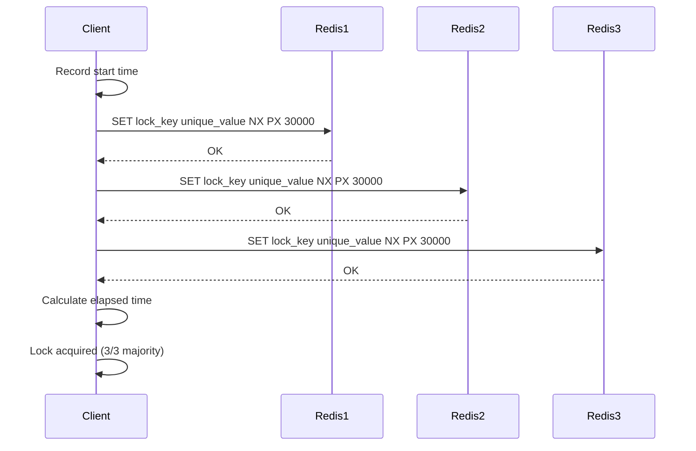

# How to Implement Distributed Locks with Redlock in Python

Author: [nawazdhandala](https://www.github.com/nawazdhandala)

Tags: Python, Distributed Systems, Redis, Redlock, Concurrency, Locking, Distributed Locks

Description: Learn how to implement distributed locks in Python using the Redlock algorithm. This guide covers the theory behind Redlock, practical implementation with redis-py, handling edge cases, and best practices for production systems.

---

> When you run multiple instances of your application, coordinating access to shared resources becomes a challenge. A distributed lock ensures that only one process can access a critical section at any given time, even across multiple servers.

In a single-process application, you can use threading locks or asyncio locks. But once you scale to multiple servers, you need a distributed locking mechanism. Redlock, proposed by Redis creator Salvatore Sanfilippo, provides a practical algorithm for distributed locks using multiple Redis instances.

---

## Understanding the Redlock Algorithm

The Redlock algorithm works by acquiring locks across multiple independent Redis instances. The key insight is that if a majority of instances grant the lock, you can be confident that no other process has it.

Here is how the algorithm works:

1. Get the current time in milliseconds
2. Try to acquire the lock on all N Redis instances sequentially
3. Calculate the elapsed time; the lock is valid only if acquired on majority (N/2 + 1) instances
4. If the lock was acquired, the actual lock validity time is the initial TTL minus the elapsed time
5. If the lock was not acquired, release it on all instances



---

## Setting Up the Environment

First, install the required packages:

```bash
pip install redis
```

For production use, you will want at least 3 Redis instances running on different servers. For development, you can use a single instance to test the logic.

---

## Basic Distributed Lock Implementation

Let's start with a simple implementation that demonstrates the core concepts:

```python
# distributed_lock.py
# A simple distributed lock implementation using Redis

import redis
import time
import uuid
from typing import Optional, List

class DistributedLock:
    """
    Distributed lock implementation using Redis.
    This version works with a single Redis instance.
    """

    def __init__(
        self,
        redis_client: redis.Redis,
        lock_name: str,
        ttl_ms: int = 30000
    ):
        # Store the Redis client for lock operations
        self.redis = redis_client
        # Prefix the lock name to avoid key collisions
        self.lock_key = f"lock:{lock_name}"
        # Time-to-live prevents deadlocks if a client crashes
        self.ttl_ms = ttl_ms
        # Unique identifier for this lock holder
        self.lock_value: Optional[str] = None

    def acquire(self, retry_count: int = 3, retry_delay_ms: int = 200) -> bool:
        """
        Attempt to acquire the lock with retries.
        Returns True if lock was acquired, False otherwise.
        """
        # Generate a unique value for this lock attempt
        self.lock_value = str(uuid.uuid4())

        for attempt in range(retry_count):
            # NX = only set if key doesn't exist
            # PX = set expiry in milliseconds
            acquired = self.redis.set(
                self.lock_key,
                self.lock_value,
                nx=True,
                px=self.ttl_ms
            )

            if acquired:
                return True

            # Wait before retrying
            if attempt < retry_count - 1:
                time.sleep(retry_delay_ms / 1000)

        return False

    def release(self) -> bool:
        """
        Release the lock only if we still own it.
        Uses a Lua script for atomic check-and-delete.
        """
        if not self.lock_value:
            return False

        # Lua script ensures atomic check-and-delete
        # This prevents releasing a lock we no longer own
        lua_script = """
        if redis.call("get", KEYS[1]) == ARGV[1] then
            return redis.call("del", KEYS[1])
        else
            return 0
        end
        """

        result = self.redis.eval(lua_script, 1, self.lock_key, self.lock_value)
        self.lock_value = None
        return result == 1

    def extend(self, additional_ms: int) -> bool:
        """
        Extend the lock TTL if we still own it.
        Useful for long-running operations.
        """
        if not self.lock_value:
            return False

        # Atomically check ownership and extend TTL
        lua_script = """
        if redis.call("get", KEYS[1]) == ARGV[1] then
            return redis.call("pexpire", KEYS[1], ARGV[2])
        else
            return 0
        end
        """

        result = self.redis.eval(
            lua_script,
            1,
            self.lock_key,
            self.lock_value,
            additional_ms
        )
        return result == 1

    def __enter__(self):
        """Context manager support for clean lock usage."""
        if not self.acquire():
            raise LockAcquisitionError(f"Failed to acquire lock: {self.lock_key}")
        return self

    def __exit__(self, exc_type, exc_val, exc_tb):
        """Always release the lock when exiting the context."""
        self.release()
        return False


class LockAcquisitionError(Exception):
    """Raised when a lock cannot be acquired."""
    pass
```

---

## Full Redlock Implementation

Now let's implement the complete Redlock algorithm with multiple Redis instances:

```python
# redlock.py
# Full Redlock algorithm implementation for distributed locking

import redis
import time
import uuid
from typing import List, Optional, Tuple
from dataclasses import dataclass

@dataclass
class RedlockConfig:
    """Configuration for Redlock instances."""
    # List of Redis connection URLs
    redis_urls: List[str]
    # Lock time-to-live in milliseconds
    ttl_ms: int = 30000
    # Number of retry attempts
    retry_count: int = 3
    # Delay between retries in milliseconds
    retry_delay_ms: int = 200
    # Clock drift factor (0.01 = 1%)
    clock_drift_factor: float = 0.01


class Redlock:
    """
    Redlock distributed lock implementation.
    Acquires locks across multiple Redis instances for fault tolerance.
    """

    def __init__(self, config: RedlockConfig):
        self.config = config
        # Connect to all Redis instances
        self.clients = [
            redis.from_url(url) for url in config.redis_urls
        ]
        # Quorum is majority of instances
        self.quorum = len(self.clients) // 2 + 1

    def _current_time_ms(self) -> int:
        """Get current time in milliseconds."""
        return int(time.time() * 1000)

    def _calculate_drift(self, ttl_ms: int) -> int:
        """
        Calculate clock drift allowance.
        Accounts for time differences between servers.
        """
        return int(ttl_ms * self.config.clock_drift_factor) + 2

    def _acquire_on_instance(
        self,
        client: redis.Redis,
        lock_key: str,
        lock_value: str,
        ttl_ms: int
    ) -> bool:
        """Attempt to acquire lock on a single Redis instance."""
        try:
            return bool(client.set(
                lock_key,
                lock_value,
                nx=True,
                px=ttl_ms
            ))
        except redis.RedisError:
            # Instance might be down; treat as failed acquisition
            return False

    def _release_on_instance(
        self,
        client: redis.Redis,
        lock_key: str,
        lock_value: str
    ) -> None:
        """Release lock on a single Redis instance."""
        lua_script = """
        if redis.call("get", KEYS[1]) == ARGV[1] then
            return redis.call("del", KEYS[1])
        else
            return 0
        end
        """
        try:
            client.eval(lua_script, 1, lock_key, lock_value)
        except redis.RedisError:
            # Instance might be down; ignore errors during release
            pass

    def acquire(self, lock_name: str) -> Tuple[bool, Optional[str], int]:
        """
        Acquire a distributed lock using the Redlock algorithm.

        Returns:
            Tuple of (success, lock_value, validity_time_ms)
        """
        lock_key = f"lock:{lock_name}"
        lock_value = str(uuid.uuid4())

        for attempt in range(self.config.retry_count):
            acquired_count = 0
            start_time = self._current_time_ms()

            # Try to acquire lock on all instances
            for client in self.clients:
                if self._acquire_on_instance(
                    client, lock_key, lock_value, self.config.ttl_ms
                ):
                    acquired_count += 1

            # Calculate time spent acquiring locks
            elapsed_time = self._current_time_ms() - start_time
            drift = self._calculate_drift(self.config.ttl_ms)

            # Calculate remaining validity time
            validity_time = self.config.ttl_ms - elapsed_time - drift

            # Check if we have quorum and enough validity time
            if acquired_count >= self.quorum and validity_time > 0:
                return (True, lock_value, validity_time)

            # Failed to acquire; release any locks we got
            for client in self.clients:
                self._release_on_instance(client, lock_key, lock_value)

            # Wait before retrying
            if attempt < self.config.retry_count - 1:
                # Add jitter to prevent thundering herd
                jitter = time.time() % 0.05
                time.sleep((self.config.retry_delay_ms / 1000) + jitter)

        return (False, None, 0)

    def release(self, lock_name: str, lock_value: str) -> None:
        """Release the lock on all instances."""
        lock_key = f"lock:{lock_name}"
        for client in self.clients:
            self._release_on_instance(client, lock_key, lock_value)

    def extend(
        self,
        lock_name: str,
        lock_value: str,
        additional_ms: int
    ) -> bool:
        """
        Extend the lock TTL on all instances where we hold it.
        Returns True if extension succeeded on majority.
        """
        lock_key = f"lock:{lock_name}"
        lua_script = """
        if redis.call("get", KEYS[1]) == ARGV[1] then
            return redis.call("pexpire", KEYS[1], ARGV[2])
        else
            return 0
        end
        """

        extended_count = 0
        for client in self.clients:
            try:
                result = client.eval(
                    lua_script, 1, lock_key, lock_value, additional_ms
                )
                if result == 1:
                    extended_count += 1
            except redis.RedisError:
                pass

        return extended_count >= self.quorum
```

---

## Context Manager for Clean Usage

Wrap the Redlock in a context manager for easier use:

```python
# redlock_context.py
# Context manager wrapper for Redlock

from contextlib import contextmanager
from typing import Generator
from redlock import Redlock, RedlockConfig

class RedlockManager:
    """
    High-level manager for distributed locks.
    Provides context manager for automatic lock release.
    """

    def __init__(self, redis_urls: List[str], **kwargs):
        config = RedlockConfig(redis_urls=redis_urls, **kwargs)
        self.redlock = Redlock(config)

    @contextmanager
    def lock(
        self,
        name: str,
        blocking: bool = True
    ) -> Generator[bool, None, None]:
        """
        Context manager for acquiring and releasing locks.

        Args:
            name: The lock name/resource identifier
            blocking: If True, raises on failure; if False, yields False

        Usage:
            with lock_manager.lock("my-resource"):
                # Critical section
                process_resource()
        """
        success, lock_value, validity = self.redlock.acquire(name)

        if not success:
            if blocking:
                raise LockAcquisitionError(f"Could not acquire lock: {name}")
            yield False
            return

        try:
            yield True
        finally:
            # Always release the lock
            if lock_value:
                self.redlock.release(name, lock_value)


class LockAcquisitionError(Exception):
    """Raised when lock acquisition fails."""
    pass


# Example usage
if __name__ == "__main__":
    manager = RedlockManager(
        redis_urls=[
            "redis://redis1:6379/0",
            "redis://redis2:6379/0",
            "redis://redis3:6379/0",
        ],
        ttl_ms=10000
    )

    # Using context manager
    with manager.lock("order-processing-123"):
        print("Processing order exclusively")
        # Your critical section code here
```

---

## Handling Lock Extensions for Long Operations

When an operation might run longer than the lock TTL, you need to extend the lock:

```python
# lock_extension.py
# Automatic lock extension for long-running operations

import threading
import time
from typing import Callable, Any

class AutoExtendingLock:
    """
    A lock that automatically extends its TTL while held.
    Useful for operations with unpredictable duration.
    """

    def __init__(
        self,
        redlock: Redlock,
        lock_name: str,
        ttl_ms: int = 30000,
        extend_interval_ms: int = 10000
    ):
        self.redlock = redlock
        self.lock_name = lock_name
        self.ttl_ms = ttl_ms
        self.extend_interval_ms = extend_interval_ms
        self.lock_value: str = None
        self._stop_extension = threading.Event()
        self._extension_thread: threading.Thread = None

    def _extension_loop(self):
        """Background thread that periodically extends the lock."""
        while not self._stop_extension.wait(self.extend_interval_ms / 1000):
            if self.lock_value:
                success = self.redlock.extend(
                    self.lock_name,
                    self.lock_value,
                    self.ttl_ms
                )
                if not success:
                    # Lost the lock; stop extending
                    break

    def acquire(self) -> bool:
        """Acquire the lock and start auto-extension."""
        success, lock_value, _ = self.redlock.acquire(self.lock_name)

        if success:
            self.lock_value = lock_value
            # Start background extension thread
            self._stop_extension.clear()
            self._extension_thread = threading.Thread(
                target=self._extension_loop,
                daemon=True
            )
            self._extension_thread.start()

        return success

    def release(self):
        """Stop extension and release the lock."""
        # Stop the extension thread
        self._stop_extension.set()
        if self._extension_thread:
            self._extension_thread.join(timeout=1.0)

        # Release the lock
        if self.lock_value:
            self.redlock.release(self.lock_name, self.lock_value)
            self.lock_value = None

    def __enter__(self):
        if not self.acquire():
            raise LockAcquisitionError(f"Failed to acquire: {self.lock_name}")
        return self

    def __exit__(self, exc_type, exc_val, exc_tb):
        self.release()
        return False
```

---

## Practical Example: Preventing Duplicate Order Processing

Here is a real-world example of using distributed locks:

```python
# order_processor.py
# Example: Preventing duplicate order processing with distributed locks

from redlock_context import RedlockManager, LockAcquisitionError
import logging

logging.basicConfig(level=logging.INFO)
logger = logging.getLogger(__name__)

class OrderProcessor:
    """
    Processes orders with distributed locking to prevent duplicates.
    Multiple instances can run without processing the same order twice.
    """

    def __init__(self, redis_urls: list):
        self.lock_manager = RedlockManager(
            redis_urls=redis_urls,
            ttl_ms=60000,  # 60 second lock
            retry_count=3
        )

    def process_order(self, order_id: str) -> bool:
        """
        Process an order with exclusive lock.
        Returns True if processed, False if already being processed.
        """
        lock_name = f"order:{order_id}"

        # Try to acquire lock without blocking
        with self.lock_manager.lock(lock_name, blocking=False) as acquired:
            if not acquired:
                logger.info(f"Order {order_id} is being processed by another instance")
                return False

            logger.info(f"Processing order {order_id}")

            # Simulate order processing
            self._validate_order(order_id)
            self._charge_payment(order_id)
            self._update_inventory(order_id)
            self._send_confirmation(order_id)

            logger.info(f"Order {order_id} processed successfully")
            return True

    def _validate_order(self, order_id: str):
        """Validate order details."""
        pass

    def _charge_payment(self, order_id: str):
        """Process payment for the order."""
        pass

    def _update_inventory(self, order_id: str):
        """Decrement inventory counts."""
        pass

    def _send_confirmation(self, order_id: str):
        """Send order confirmation email."""
        pass


# Running multiple instances
if __name__ == "__main__":
    processor = OrderProcessor([
        "redis://localhost:6379/0",
        "redis://localhost:6380/0",
        "redis://localhost:6381/0",
    ])

    # This can be called from multiple servers/processes
    processor.process_order("ORD-12345")
```

---

## Best Practices

When using distributed locks in production, keep these points in mind:

1. **Set appropriate TTL values**: Too short and operations might fail mid-execution. Too long and crashed clients hold locks unnecessarily.

2. **Use unique lock values**: Always use UUIDs or similar unique identifiers to prevent accidental release of another client's lock.

3. **Handle failures gracefully**: Network partitions and Redis failures will happen. Design your system to recover.

4. **Avoid nested locks**: Acquiring multiple locks can lead to deadlocks. If necessary, always acquire locks in a consistent order.

5. **Monitor lock contention**: High contention indicates a bottleneck. Consider redesigning to reduce the critical section.

6. **Test failure scenarios**: Simulate Redis instance failures and network partitions during testing.

---

## Conclusion

Distributed locks are a fundamental building block for coordinating work across multiple application instances. The Redlock algorithm provides a robust approach by requiring lock acquisition on a majority of independent Redis instances.

Remember that distributed locks are not a silver bullet. They add complexity and potential failure modes. Use them only when you truly need mutual exclusion across distributed systems, and consider alternatives like optimistic locking or idempotent operations when possible.

---

*Need to monitor your distributed systems? [OneUptime](https://oneuptime.com) provides comprehensive observability for tracking lock contention, Redis health, and application performance across all your instances.*

**Related Reading:**
- [How to Build Task Queues with Dramatiq in Python](https://oneuptime.com/blog/post/2026-01-24-python-task-queues-dramatiq/view)
- [How to Implement Circuit Breakers in Python](https://oneuptime.com/blog/post/2026-01-23-python-circuit-breakers/view)
