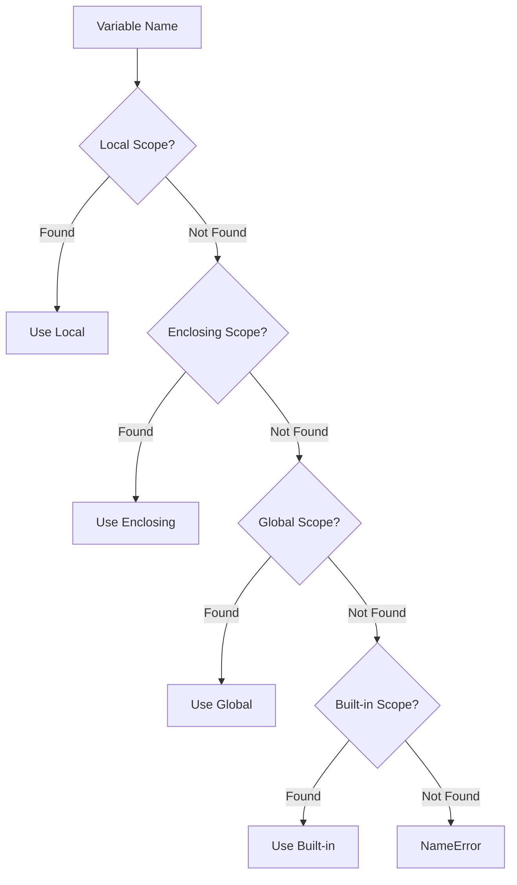

# How to Understand Python Variable Scoping Rules (LEGB)

Author: [nawazdhandala](https://www.github.com/nawazdhandala)

Tags: Python, Scope, Variables, Functions, Closures

Description: Master Python's LEGB scoping rules to understand how variable names are resolved. Learn about local, enclosing, global, and built-in scopes with practical examples.

---

Understanding how Python resolves variable names is essential for writing correct code and debugging confusing errors. Python uses the LEGB rule: Local, Enclosing, Global, Built-in. This guide explains each scope level with practical examples.

## The LEGB Rule

When Python encounters a variable name, it searches for it in this order:



Let's examine each scope level.

## Local Scope (L)

Variables defined inside a function are local to that function.

```python
def calculate():
    # x is local to this function
    x = 10
    y = 20
    return x + y

result = calculate()
print(result)  # 30

# x is not accessible outside the function
# print(x)  # NameError: name 'x' is not defined
```

### Local Variables Shadow Outer Scopes

```python
x = 'global'

def show():
    x = 'local'  # This creates a new local variable
    print(x)

show()    # local
print(x)  # global - unchanged
```

## Enclosing Scope (E)

Enclosing scope applies to nested functions. The inner function can access variables from the outer function.

```python
def outer():
    message = 'Hello from outer'  # Enclosing scope variable

    def inner():
        # inner() can access message from enclosing scope
        print(message)

    inner()

outer()  # Hello from outer
```

### Multiple Levels of Nesting

```python
def level_one():
    a = 'one'

    def level_two():
        b = 'two'

        def level_three():
            c = 'three'
            # Can access a, b, and c
            print(f"a={a}, b={b}, c={c}")

        level_three()

    level_two()

level_one()  # a=one, b=two, c=three
```

## Global Scope (G)

Variables defined at the module level are global.

```python
# Global variable
counter = 0

def increment():
    global counter  # Declare intention to modify global
    counter += 1

def get_counter():
    # Reading global is fine without declaration
    return counter

increment()
increment()
print(get_counter())  # 2
```

### The global Keyword

Without `global`, assignment creates a local variable instead of modifying the global.

```python
value = 100

def broken_modify():
    # This creates a LOCAL variable named 'value'
    # It does NOT modify the global 'value'
    value = 200
    print(f"Inside function: {value}")

def working_modify():
    global value  # Now we're talking about the global
    value = 200
    print(f"Inside function: {value}")

broken_modify()
print(f"Global still: {value}")  # 100

working_modify()
print(f"Global now: {value}")  # 200
```

### Global is Often a Code Smell

Overusing global variables makes code hard to test and debug. Prefer passing values as arguments and returning results.

```python
# BAD: Using global state
total = 0

def add_to_total(x):
    global total
    total += x

add_to_total(5)
add_to_total(3)
print(total)  # 8

# GOOD: Pure function
def add(a, b):
    return a + b

result = add(0, 5)
result = add(result, 3)
print(result)  # 8
```

## Built-in Scope (B)

Python's built-in functions and constants are in the built-in scope.

```python
# These are all built-ins
print(len([1, 2, 3]))  # len is built-in
print(max(1, 5, 3))    # max is built-in
print(True, False)     # True/False are built-in
```

### Shadowing Built-ins (Dangerous!)

You can accidentally shadow built-in names, causing confusing bugs.

```python
# BAD: Shadowing built-in 'list'
list = [1, 2, 3]  # Now 'list' is a variable, not the function

# This breaks!
# new_list = list("hello")  # TypeError: 'list' object is not callable

# Fix: Delete the shadowing variable
del list
new_list = list("hello")  # Works again: ['h', 'e', 'l', 'l', 'o']
```

Common built-ins that get accidentally shadowed:

```python
# Avoid using these as variable names:
# id, list, dict, set, str, int, float, type, input, print, len, sum, max, min
# file, open, range, filter, map, sorted, reversed, next, iter

# BAD
id = 42
input = "some value"
type = "string"

# These built-in functions are now broken until you del the variables
```

## The nonlocal Keyword

To modify a variable in an enclosing scope (not global), use `nonlocal`.

```python
def counter():
    count = 0  # Enclosing scope variable

    def increment():
        nonlocal count  # Modify enclosing, not create local
        count += 1
        return count

    return increment

# Create a counter closure
my_counter = counter()
print(my_counter())  # 1
print(my_counter())  # 2
print(my_counter())  # 3
```

### Difference Between global and nonlocal

```python
x = 'global'

def outer():
    x = 'enclosing'

    def inner_global():
        global x
        x = 'modified by global'

    def inner_nonlocal():
        nonlocal x
        x = 'modified by nonlocal'

    print(f"Before inner calls: {x}")  # enclosing

    inner_nonlocal()
    print(f"After nonlocal: {x}")  # modified by nonlocal

    inner_global()
    print(f"After global: {x}")  # modified by nonlocal (unchanged)

outer()
print(f"Global x: {x}")  # modified by global
```

## Closures and Scope

Closures capture variables from enclosing scopes. Understanding scope is key to understanding closures.

```python
def make_multiplier(factor):
    """Create a function that multiplies by factor."""
    # factor is captured in the closure

    def multiply(x):
        return x * factor

    return multiply

double = make_multiplier(2)
triple = make_multiplier(3)

print(double(5))  # 10
print(triple(5))  # 15

# Each closure has its own captured 'factor'
```

### Common Closure Pitfall

Variables are looked up when the function runs, not when it is defined.

```python
# PITFALL: Late binding in closures
functions = []
for i in range(3):
    def func():
        return i
    functions.append(func)

# All functions return 2 (the final value of i)
print([f() for f in functions])  # [2, 2, 2]

# FIX: Capture current value with default argument
functions = []
for i in range(3):
    def func(i=i):  # Default argument captures current i
        return i
    functions.append(func)

print([f() for f in functions])  # [0, 1, 2]
```

## Class Scope (Special Case)

Class bodies create their own scope, but it works differently than function scope.

```python
class MyClass:
    class_var = 'class level'

    def method(self):
        # Cannot access class_var directly
        # print(class_var)  # NameError!

        # Must use self or class name
        print(self.class_var)
        print(MyClass.class_var)

obj = MyClass()
obj.method()  # class level (twice)
```

### List Comprehension Scope

In Python 3, list comprehensions have their own scope.

```python
x = 'outer'

# The x in comprehension is local to comprehension
result = [x for x in range(3)]
print(result)  # [0, 1, 2]
print(x)       # outer - unchanged!

# In Python 2, this would have changed x to 2
```

## Examining Scope

Python provides functions to inspect current scopes.

```python
# See what's in current local scope
def example():
    a = 1
    b = 2
    print(locals())

example()  # {'a': 1, 'b': 2}

# See global scope
x = 10
y = 20
print(globals())  # Includes x, y, and much more
```

## Practical Examples

### Configuration with Global Defaults

```python
# Default configuration at module level
DEFAULT_TIMEOUT = 30
DEFAULT_RETRIES = 3

def make_request(url, timeout=None, retries=None):
    """Make a request with optional overrides."""
    # Use global defaults if not specified
    timeout = timeout if timeout is not None else DEFAULT_TIMEOUT
    retries = retries if retries is not None else DEFAULT_RETRIES

    print(f"Requesting {url} (timeout={timeout}, retries={retries})")

# Uses defaults
make_request('http://example.com')
# Requesting http://example.com (timeout=30, retries=3)

# Override one setting
make_request('http://example.com', timeout=60)
# Requesting http://example.com (timeout=60, retries=3)
```

### Counter Factory Using Closures

```python
def create_counter(start=0, step=1):
    """Create a counter with configurable start and step."""
    count = start - step  # Will become 'start' on first call

    def counter():
        nonlocal count
        count += step
        return count

    def reset():
        nonlocal count
        count = start - step

    # Return multiple functions sharing the same state
    return counter, reset

count, reset = create_counter(start=10, step=5)
print(count())  # 10
print(count())  # 15
print(count())  # 20
reset()
print(count())  # 10
```

## Summary

Python's LEGB scoping rules determine how variable names are resolved:

| Scope | Location | Access | Modify |
|-------|----------|--------|--------|
| Local | Inside current function | Direct | Direct |
| Enclosing | Outer function | Direct | `nonlocal` keyword |
| Global | Module level | Direct | `global` keyword |
| Built-in | Python internals | Direct | (Do not shadow!) |

Key takeaways:

- Assignment creates local variables unless `global` or `nonlocal` is used
- Reading from outer scopes works automatically
- Avoid shadowing built-in names
- Prefer function arguments and return values over global state
- Understand closure behavior for correct callback and factory patterns
